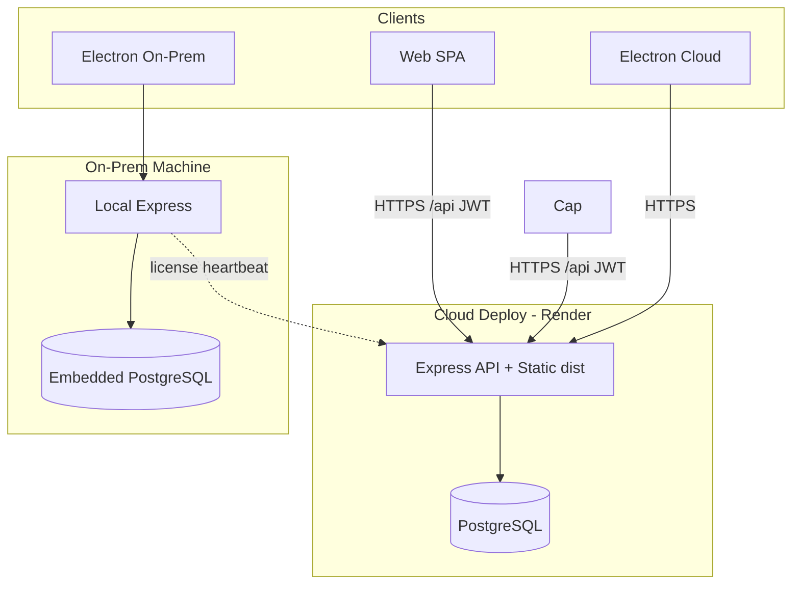

# Architecture Report — Dhandho (DG-ERP)

**Date:** 2026-07-17  
**Branch:** `prod-hardening`  
**Repo:** https://github.com/prathame/DG-ERP

---

## Executive Overview

Dhandho is a multi-tenant ERP SaaS for Indian SMEs (inventory, distribution, GST billing, finance, payroll). It ships as:

| Surface | Stack |
|---------|--------|
| **Cloud web** | React 19 SPA (Vite 6) + Express 4 API + PostgreSQL |
| **Desktop cloud** | Electron wrapper around cloud URL |
| **Desktop on-prem** | Electron + embedded PostgreSQL + local Express |

Hosting: Render (`render.yaml`). Live: [dhandho.app](https://dhandho.app).

---

## Tech Stack

| Layer | Choice |
|-------|--------|
| Frontend | React 19, Vite 6, Tailwind CSS 4, Motion, Lucide |
| Backend | Node.js, Express 4, TypeScript (tsx) |
| Database | PostgreSQL 16 (`pg` Pool), RLS policies (defense-in-depth) |
| Auth | JWT HS256 (24h), bcrypt password hashes |
| Rate limiting | `express-rate-limit` |
| Security headers | `helmet` (CSP, HSTS, frame deny) |
| Compression | `compression` (gzip) |
| Logging | Structured logger + optional Logtail |
| Tests | Vitest + supertest; Python E2E on release tags |
| Desktop | Electron + electron-builder; embedded-postgres (on-prem) |

**Not used:** Next.js, React Router, Radix UI (README mention is stale).

---

## Folder Structure

```
src/
  App.tsx                 — SPA shell, tab routing, auth gates
  api.ts                  — typed API client
  features/               — one folder per ERP module
  components/{layout,ui}/ — landing, login, shared UI
  platforms/              — mobile|desktop × online|offline
  lib/                    — session, bills, utils
  i18n/                   — en, hi, gu, mr
server/
  app.ts / index.ts       — Express factory + listen
  pg-db.ts                — pool, schema init, seed
  middleware/             — auth, permissions
  routes/                 — domain routers (~30)
  utils/                  — env, tenant, barcode, pii, …
electron/                 — cloud + onprem mains
tests/                    — Vitest API/unit + Python e2e + cases/
docs/                     — product & architecture docs
.github/workflows/        — CI (lint, build, PR, security, release)
```

---

## Architecture Diagram



---

## Routing (Frontend)

No React Router. Path-based early returns in `App.tsx`:

| Path | UI |
|------|-----|
| `/` | Landing (web) or MobileOnboarding |
| `/{slug}` | Tenant login |
| `/admin` | Super Admin portal |
| `/privacy`, `/terms`, `/download` | Static marketing pages |
| Authenticated | Tab state + `history.pushState({ tab })` |

ERP modules are `React.lazy()` code-split. Vite `manualChunks` isolate react, motion, scanner, xlsx, icons.

---

## API Structure

- Base: `/api/*`
- Global JWT gate (except `PUBLIC_PATHS`) revalidates user/tenant from DB
- Module RBAC: `enforceModulePermissions`
- Domain routers: products, sales, distribution, finance, accounts, payroll, GST, super-admin, onprem, mobile, …

Public paths include: auth login/reset, super-admin login, health, tenant-by-slug, on-prem activate/heartbeat, mobile redeem-invite.

---

## Authentication & Authorization

1. Login → bcrypt verify → JWT (`userId`, `tenantId`, `role`, …)
2. Client stores token in `localStorage` (`src/lib/session.ts`)
3. Every authenticated request: verify JWT + live user/tenant status + password-change invalidation
4. Roles: Admin, Manager, Staff, Vendor (+ Super Admin platform roles)
5. Permissions object per module: `hidden | view | print | full`
6. Vendor scope: `vendorScopeId` / `assertVendorAccess` prevent IDOR

---

## Database Layer

- ~38 tables; all tenant data keyed by `tenant_id`
- Schema bootstrapped in `initSchema()`; indexes created on boot
- RLS policies exist; pool owner typically bypasses — app-layer `WHERE tenant_id` is primary isolation
- SSL required in cloud production (`assertCriticalEnv`)

---

## State Management


---

## Environment Variables

See `.env.example`. Critical: `DATABASE_URL`, `JWT_SECRET` (≥32 prod), `SUPER_ADMIN_*`, `ALLOWED_ORIGINS` (prod), `DATABASE_SSL`. Client may only use public `VITE_*` values.

---

## Build & Deployment

| Command | Purpose |
|---------|---------|
| `npm run dev` / `server` / `dev:all` | Local Vite + API |
| `npm run build` | Vite → `dist/` |
| `npm start` | Express serves API + static |
| `npm run build:electron:*` | Desktop installers |

Render: `render.yaml` — Node web + Postgres. SPA fallback for non-API routes.

---

## Known Architectural Constraints

1. JWT in `localStorage` (XSS risk; mitigated by production CSP)
2. SPA tab routing (no deep-linkable module URLs)
3. Per-request DB auth revalidation (correctness over latency; cacheable with short TTL)
5. Dual domain history: `dhandho.app` vs `dhandho.onrender.com`

---

*Generated as part of the production hardening audit. See `docs/PRODUCTION_AUDIT_REPORT.md` for findings and scores.*
