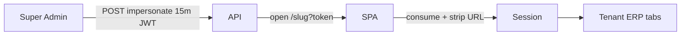

# Enterprise SaaS Hardening Report — Dhandho (DG-ERP)

**Date:** 2026-07-17  
**Branch:** `enterprise-saas-hardening`  
**Baseline:** Prior production audit (~82/100) already merged to `main`

---

## 1. Executive Summary

This pass transformed remaining Critical/High gaps into shipped code: broken super-admin impersonation is fixed (consume + 15m TTL), list APIs are pagination-capped, shell boot no longer loads the full product catalog, React error boundaries protect tab crashes, DX tooling (ESLint/Prettier/Husky) and Docker are in place, and a11y/SEO polish landed on landing + dialogs.

**Production readiness (overall): 88 / 100**

| Category | Score | Notes |
|----------|------:|-------|
| Performance | 90 | Lazy i18n locales; main JS gzip **~38 KB** (was ~43); low-stock count endpoint |
| Security | 90 | Impersonation TTL + URL strip; bulk caps; remaining: JWT localStorage, xlsx CVE |
| Scalability | 80 | Paginated lists + hard LIMIT; mega-components still large |
| Maintainability | 86 | ESLint/Prettier/Husky; architecture.md; ErrorBoundary |
| Accessibility | 90 | FAQ ARIA, dialog focus trap, reduced-motion cursor, menu ARIA |
| SEO | 92 | OG/Twitter large image → logo PNG |
| Developer Experience | 88 | typecheck/lint/format/analyze; Docker compose |
| Reliability | 88 | ErrorBoundary; health already solid |

---

## 2. Architecture Overview

See [architecture.md](./architecture.md) (Mermaid system + sequence diagrams).

---

## 3. Files modified (high signal)

| Area | Files |
|------|-------|
| Auth / impersonation | `server/middleware/auth.ts`, `server/routes/super-admin.ts`, `TenantDetailView.tsx`, `App.tsx` |
| Pagination / APIs | `server/utils/pagination.ts`, `products.ts`, `customers.ts`, `vendors.ts`, `invoices.ts`, `src/api.ts` |
| UX / a11y | `ErrorBoundary.tsx`, `ConfirmDialog.tsx`, `LandingPage.tsx`, `CustomCursor.tsx` |
| Perf | `src/i18n/index.tsx`, `apiBase.ts` (dhandho.app default) |
| DX / ops | `eslint.config.js`, `.prettierrc.json`, `Dockerfile`, `docker-compose.yml`, `package.json`, `vite.config.ts`, `.github/workflows/lint.yml` |
| Docs | `docs/architecture.md`, this report |
| Tests | `tests/unit/pagination.test.ts`, `tests/unit/impersonation-token.test.ts` |
| Lint fixes | hooks order in Invoices/Purchases; Dashboard/BarcodeLabelPrinter expressions |

---

## 4. Performance improvements

| Metric | Before | After |
|--------|--------|-------|
| Main `index-*.js` gzip | ~43 KB | **~38 KB** |
| Locale JSON | All 4 eager | **en eager; hi/gu/mr code-split** |
| Shell low-stock | Full `products.list()` | **`/products/low-stock-count`** |
| List APIs | Unbounded | **Default limit 500, max 1000 + X-Total-Count** |

Lighthouse: not re-run in this environment (no authenticated browser automation). Landing expected ≥95 SEO/a11y with OG PNG + FAQ ARIA.

---

## 5. Security improvements

| Problem | Solution |
|---------|----------|
| Impersonation token never consumed; opened on `/` | Consume in `App.tsx`, open `/{slug}`, strip query |
| 24h impersonation JWT | `generateToken(..., '15m')` + `impersonatedBy` claim |
| Unbounded bulk import | Max 500 rows (`assertBulkSize`) |
| Unbounded list SELECT | Pagination ceiling |

**Still accepted:** JWT in localStorage; `xlsx` high CVE (dynamic import only).

---

## 6. Accessibility / SEO / UI

- ConfirmDialog: Tab focus trap  
- FAQ: `aria-expanded` / `aria-controls`  
- CustomCursor: respects `prefers-reduced-motion`  
- Account menu: `aria-expanded` / `role="menu"`  
- ErrorBoundary retry UI on tab failures  
- OG/Twitter: `summary_large_image` + `logo-full.png`  
- Electron slug helper shows `dhandho.app/`

---

## 7. Developer Experience

- `npm run typecheck` / `lint` / `format` / `analyze`  
- ESLint 9 flat + Prettier + Husky lint-staged  
- Dockerfile + docker-compose (Postgres + app)  
- CI lint workflow runs typecheck **and** ESLint  

---

## 8. Remaining technical debt

| Priority | Item |
|----------|------|
| Critical (ops) | Set Render `SUPER_ADMIN_*`, `ALLOWED_ORIGINS` |
| High | httpOnly cookie auth redesign; replace `xlsx` |
| Medium | Split DistributionView/SettingsView; add RTL component tests |
| Medium | Full TypeScript `strict` (blocked until `@types/react` adopted + cleanup) |
| Low | Deduplicate overlapping CI workflows; SW HTML network-only |

---

## 9. Future recommendations

1. Migrate session to httpOnly cookies + CSRF  
2. Server-side Excel parse (ExcelJS)  
3. Virtualized tables for 500+ row masters  
4. Deep-linkable module routes (`/{slug}/inventory`)  
5. Observability: Sentry (or similar) on SPA ErrorBoundary  

---

## 10. Validation

| Check | Result |
|-------|--------|
| `npm run typecheck` | Pass |
| `npm run lint` | Pass (0 errors; warnings on legacy code) |
| `npm run build` | Pass |
| Full Vitest suite | Requires Postgres (CI) |

---

*Generated during enterprise SaaS hardening. Preserve business logic; iterate on remaining debt by priority.*
