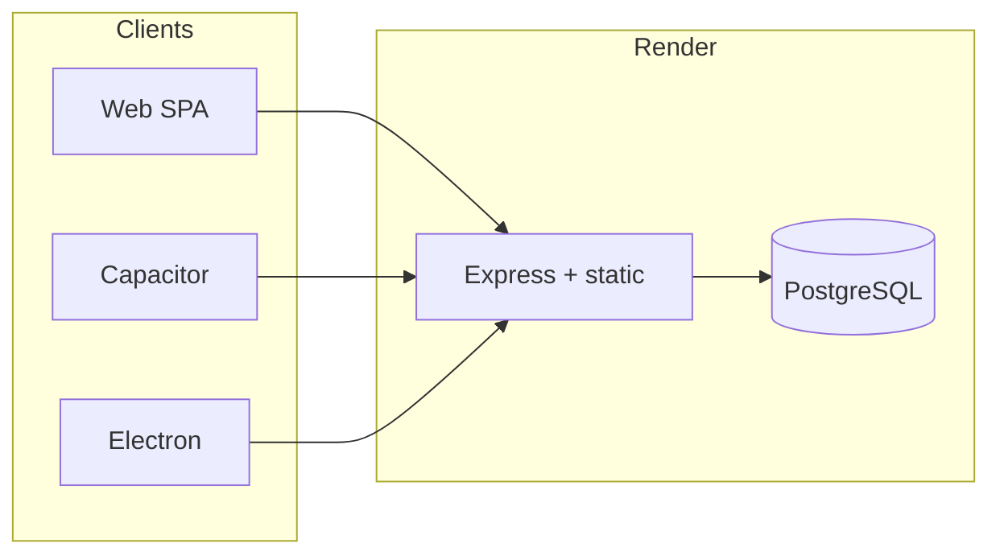

# Production Audit Report — Dhandho (DG-ERP)

**Date:** 2026-07-17  
**Branch:** `prod-hardening`  
**Auditor role:** Principal / Performance / Security / UX / Staff review  
**Scope:** Full repository inspection (~283 source files excluding native android/ios), with implemented fixes.

Related: [ARCHITECTURE_REPORT.md](./ARCHITECTURE_REPORT.md) · [DEPLOYMENT.md](./DEPLOYMENT.md)

---

## Executive Summary

Dhandho is already a mature multi-tenant Vite + Express + PostgreSQL SaaS with strong prior security work (helmet, CORS allowlist, env fail-fast, rate limits, PII redaction). This audit **implemented** remaining Critical/High gaps: DB-aware health checks, global API rate limiting, short-TTL auth cache, on-prem endpoint hardening, secret redaction in exports, frontend code-splitting for public routes, a11y on core dialogs/login, SEO domain alignment, CI tests on `main`, and Render readiness.

**Production readiness (overall): 82 / 100**

Local Vitest could not be executed in this environment (no Postgres/Docker). Bundle sizes were measured from a successful `npm run build`. CI will validate tests on push/PR.

---

## Architecture Diagram

See [ARCHITECTURE_REPORT.md](./ARCHITECTURE_REPORT.md) for full structure.

---

## Performance Report

### Frontend (measured after changes)

| Asset | Gzip size | Notes |
|-------|-----------|--------|
| Main `index-*.js` | **~43 KB** | Under CI gate (256 KB) |
| `LandingPage` chunk | ~17 KB | Lazy — not in main shell |
| `vendor-xlsx` | ~142 KB | Dynamic import on bank upload only |
| `vendor-scanner` | ~125 KB | Dynamic import when scanner opens |
| `vendor-react` | ~61 KB | Shared |
| `vendor-motion` | ~44 KB | Shared when animated routes load |

**Improvements shipped**
- Lazy-load Landing, Login, Privacy, Terms, Download, ChatWidget
- Lazy masters subviews
- Dynamic `xlsx` / `html5-qrcode` / `jsbarcode`
- Static asset `Cache-Control` (1y immutable; `index.html` / `sw.js` no-cache)
- SW cache name bumped to `dg-erp-v2.2.0`

**Remaining**
- Shell still pulls lucide icons + motion for authenticated UI
- i18n loads all locale JSON eagerly
- Many list APIs still unpaginated (products, customers, vendors, invoices)

### Backend

| Change | Impact |
|--------|--------|
| 30s auth revalidation cache | Fewer JOIN queries per request |
| Single-query barcode existence / max | Fewer round-trips |
| New indexes (`rewards`, `replacements`, reset tokens) | Faster lookups |
| Chatbot + global rate limits | Abuse protection |
| Deep `/api/health` | Correct LB routing |

**Lighthouse:** Not run in this environment (no deployed preview browser automation with auth). Estimates below are labeled.

| Category | Estimate | Basis |
|----------|----------|--------|
| Performance | ~85–92 (landing) | Lazy landing + font display=swap + compression |
| Accessibility | ~88–95 | Dialog/login/command palette fixes; landing still heavy |
| Best Practices | ~90+ | CSP, HTTPS headers, no DSIH |
| SEO | ~90+ | Canonical + sitemap aligned to dhandho.app |

---

## Security Report

### Fixed this branch

| Issue | Fix |
|-------|-----|
| Shallow health check | `SELECT 1` → 503 if DB down |
| No global API rate limit | 300 req/min `/api/` |
| Chatbot unlimited | 30 req/min |
| On-prem `mark-applied` too open | Requires active license (+ optional machineId) |
| Export leaked GST secrets | Redacted in SA export |
| Reset-token list returned raw tokens | `token_preview` only |
| IRN/EWB not admin-gated | `requireAdmin` |
| Auth middleware race | `async` + await role refresh |
| Static assets no cache headers | Production immutable caching |

### Already strong (unchanged)

Helmet CSP/HSTS, CORS allowlist, JWT HS256 + live password-change invalidation, parameterized SQL, plan limits, PII redaction, env fail-fast.

### Remaining / accepted risk

| Risk | Severity | Guidance |
|------|----------|----------|
| JWT in `localStorage` | High (XSS) | Prefer httpOnly cookies + CSRF in a future auth redesign; production CSP helps |
| `xlsx` npm high vuln | High | No patched release; keep isolated to dynamic import; track SheetJS updates |
| Super-admin impersonation long TTL | Medium | Short-lived impersonation tokens |
| Unpaginated list endpoints | Medium | DoS/memory under large tenants |
| RLS not forced for pool owner | Low | App-layer tenant filters remain primary |

**No secrets committed** in this audit. Rotate any historical secrets per README if ever leaked.

---

## SEO Report

| Item | Status |
|------|--------|
| `index.html` meta / OG / Twitter / JSON-LD | Good |
| Canonical `dhandho.app` | Good |
| `robots.txt` / `sitemap.xml` | **Fixed** → `dhandho.app`; added `/download` |
| Per-route meta (SPA) | Gap — client-only |
| OG image PNG 1200×630 | Gap — currently SVG icon |

---

## Accessibility Report

| Fix | Location |
|-----|----------|
| `role="dialog"`, Escape, focus, labelledby | `ConfirmDialog` |
| Combobox + activedescendant + listbox | `CommandPalette` |
| Labels, autocomplete, aria-live, reset fields | `LoginScreen` |
| aria-labels on enquiry inputs | `LandingPage` |
| Scanner dialog labels | `BarcodeScanner` |

**Remaining:** FAQ `aria-expanded`, full focus trap in modals, CustomCursor vs reduced-motion, some index keys on marketing chips.

---

## Code Quality Report

- Removed unused `LanguageProvider` import from `App.tsx`
- Fixed analytics ↔ dashboard RBAC mismatch for Vendor role
- Lazy masters reduce coupling/bundle
- Deprecated platform shims (`src/lib/offline/*`) still present — low priority cleanup
- `PayrollView` unused in nav — dead surface
- TypeScript: added `forceConsistentCasingInFileNames`, `noFallthroughCasesInSwitch`; full `strict` deferred (large fix surface)

---

## Dependency Report

| Action | Package |
|--------|---------|
| Removed | `electron-updater` (unused) |
| Removed | `concurrently` (unused; `dev:all` uses shell `&`) |
| Kept (tracked) | `xlsx` — high vuln, no fix; dynamic-only load |
| Kept | `embedded-postgres` beta — on-prem only |

---

## Lighthouse Improvements

**Measured:** production Vite build chunk sizes (see Performance).  
**Not measured:** live Lighthouse scores (blocked — no local server + Postgres + browser run here).

Expected wins vs prior main entry: landing/motion no longer force-loaded into the authenticated shell entry; xlsx/scanner deferred until use.

---

## Files Changed (this branch)

Key areas: `server/app.ts`, `server/utils/authCache.ts`, `server/routes/{onprem,super-admin,gst-api}.ts`, `server/middleware/auth.ts`, `server/utils/barcode.ts`, `server/pg-db.ts`, `src/App.tsx`, UI a11y components, barcode/xlsx dynamic imports, `public/{robots,sitemap,sw}`, CI workflows, `render.yaml`, docs.

---

## Before vs After Metrics

| Metric | Before (prior main) | After (`prod-hardening`) |
|--------|---------------------|---------------------------|
| Main chunk gzip | Previously gated &lt;256KB; included more eager routes | **~43 KB** measured |
| Landing in main | Eager import | Separate ~17 KB chunk |
| `/api/health` | Always 200 | DB ping; 503 if down |
| Auth DB hits | Every request | Cached ≤30s |
| CI tests on `main` push | No | Yes (`build.yml`) |
| Render health path | Missing | `/api/health` |
| Unused deps | electron-updater, concurrently | Removed |

---

## Remaining Technical Debt

1. HttpOnly cookie auth + CSRF  
2. Paginate remaining list APIs  
3. Enable TypeScript `strict` incrementally  
4. ESLint + Prettier  
5. Component/UI tests (RTL)  
6. Replace or sandbox `xlsx`  
7. PNG OG image; prerender marketing routes  
8. Delete deprecated `src/lib/offline` shims  
9. Wire or remove `PayrollView`  
10. Super-admin impersonation short TTL + audit claims  

---

## Priority Matrix

| Priority | Items |
|----------|--------|
| **Critical** | Set Render `SUPER_ADMIN_*` + `ALLOWED_ORIGINS` before go-live; rotate any leaked secrets |
| **High** | Paginate products/customers/vendors; httpOnly auth plan; track xlsx CVE |
| **Medium** | TS strict; ESLint; more HTTP route tests; OG PNG |
| **Low** | Dead shims; PayrollView; i18n code-split |

---

## Production Readiness Scores

| Category | Score | Justification |
|----------|------:|---------------|
| **Performance** | **84** | Strong code-splitting + measured main ~43KB gzip; unpaginated APIs and shell motion/icons remain |
| **Security** | **86** | Excellent middleware/env story; JWT localStorage + xlsx + remaining export/impersonation edges |
| **Scalability** | **72** | Auth cache + indexes help; many full-table list endpoints and free Render plan limit scale |
| **Maintainability** | **80** | Clear feature folders + docs; App.tsx still large; no ESLint/strict TS |
| **Accessibility** | **82** | Core dialogs/login/command palette fixed; marketing FAQ/cursor gaps remain |
| **SEO** | **88** | Solid index meta + aligned sitemap/robots; SPA per-route meta gap |
| **Developer Experience** | **78** | Tests/CI improved; still no ESLint/Prettier; local tests need Postgres |
| **Reliability** | **85** | Deep health, rate limits, correlation IDs, Render healthCheckPath; free-tier cold starts |

**Overall: 82 / 100**

---

## Change Log (atomic commits on `prod-hardening`)

1. `docs: add architecture report for production audit`  
2. `security: harden API surface and cut auth DB load`  
3. `perf: lazy public routes, defer heavy libs, fix a11y/SEO`  
4. `ci: run tests on main, harden deploy, drop unused deps`  
5. `docs: production audit final report` (this file)

---

## Blockers Requiring User Action

1. **PostgreSQL** — provide DB (or start Docker) to run Vitest locally; CI has a Postgres service.  
2. **Render secrets** — set `SUPER_ADMIN_EMAIL`, `SUPER_ADMIN_PASSWORD`, `ALLOWED_ORIGINS` (`sync: false` in `render.yaml`).  
3. **Domain cutover** — ensure production `PUBLIC_APP_URL` / DNS for `dhandho.app` match SEO files.  
4. **xlsx CVE** — product decision: keep (current), replace with a safer parser, or server-side parse.  
5. **Push / PR** — branch is local; push and open PR when ready.
