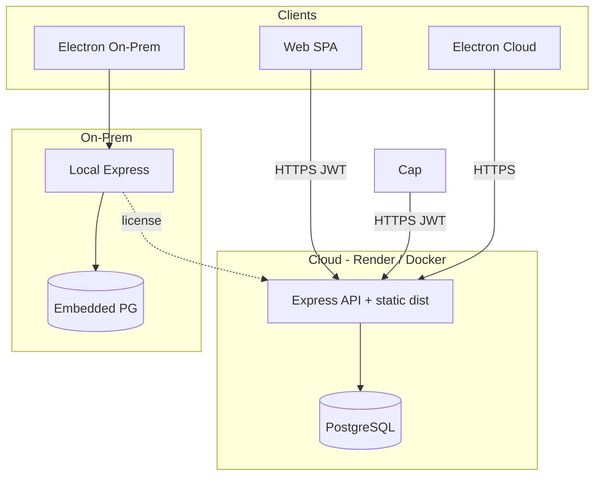
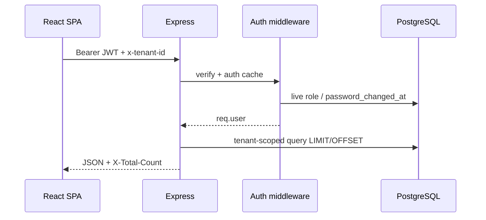

# Architecture — Dhandho (DG-ERP)

**Updated:** 2026-07-17  
**Repo:** https://github.com/prathame/DG-ERP  
**Live:** [dhandho.app](https://dhandho.app)

Related: [ARCHITECTURE_REPORT.md](./ARCHITECTURE_REPORT.md) · [PRODUCTION_AUDIT_REPORT.md](./PRODUCTION_AUDIT_REPORT.md) · [ENTERPRISE_HARDENING_REPORT.md](./ENTERPRISE_HARDENING_REPORT.md)

---

## Executive overview

Dhandho is a multi-tenant ERP SaaS for Indian SMEs (inventory, distribution, GST billing, finance, masters, analytics). Surfaces:

| Surface | Stack |
|---------|--------|
| Cloud web | React 19 SPA (Vite 6) + Express 4 + PostgreSQL |
| Desktop cloud | Electron → cloud URL |
| Desktop on-prem | Electron + embedded PostgreSQL + local Express |

Hosting: Render (`render.yaml`). Optional self-host via `Dockerfile` / `docker-compose.yml`.

---

## Tech stack

| Layer | Choice |
|-------|--------|
| Frontend | React 19, Vite 6, Tailwind 4, Motion, Lucide |
| Backend | Node 20, Express 4, TypeScript (`tsx`) |
| Database | PostgreSQL (`pg` Pool), tenant-scoped SQL |
| Auth | JWT HS256 (24h login; 15m impersonation), bcrypt |
| Security | Helmet CSP/HSTS, CORS allowlist, rate limits |
| Ops | compression, deep `/api/health`, Logtail-ready logger |
| Tests | Vitest + supertest; Python E2E on release |
| DX | ESLint 9 flat config, Prettier, Husky + lint-staged |

---

## System diagram



---

## Request path



---

## Folder structure

```
src/
  App.tsx                 SPA shell, path + tab routing, impersonation consume
  api.ts                  Typed API client
  features/               ERP modules (lazy-loaded)
  components/{layout,ui}/ Marketing + shared UI (ErrorBoundary, dialogs)
  platforms/              shared + desktop (Electron)
  lib/                    session, bills, utils
  i18n/                   en eager; hi/gu/mr lazy
server/
  app.ts / index.ts       Express factory + listen
  pg-db.ts                Pool + schema
  middleware/             auth, permissions
  routes/                 Domain routers
  utils/                  env, pagination, barcode, pii, authCache
```

---

## Frontend routing

No React Router. Path gates in `App.tsx`:

| Path | UI |
|------|-----|
| `/` | Landing / Electron slug entry / Mobile onboarding |
| `/{slug}` | Tenant login (or ERP when session present) |
| `/{slug}?impersonate_token=` | One-time SA impersonation (consumed + stripped) |
| `/admin` | Super Admin portal |
| `/privacy`, `/terms`, `/download` | Marketing pages |
| Authenticated | Tab state via `history.pushState({ tab })` |

Feature views are `React.lazy()`; Vite `manualChunks` isolate react / motion / scanner / xlsx / icons.

---

## Authentication

1. Login → bcrypt → JWT (`userId`, `tenantId`, `role`, …) stored in scoped `localStorage`
2. Global API gate revalidates user/tenant (short auth cache)
3. Roles: Admin, Manager, Staff, Vendor + platform Super Admin
4. Module permissions: `hidden | view | print | full`
5. Impersonation: SA → 15m JWT with `impersonatedBy`, opened on `/{slug}`, consumed once client-side

---

## API & data

- Base `/api/*`; public paths for auth, health, tenant-by-slug, on-prem
- List endpoints: `page` / `limit` with hard ceiling; `X-Total-Count` headers
- Bulk imports capped at 500 rows
- `/api/products/low-stock-count` for shell badge (no full catalog load)
- Deep `GET /api/health` (DB ping → 503)

---

## Build & deploy

| Command | Purpose |
|---------|---------|
| `npm run dev` / `server` / `dev:all` | Local Vite + API |
| `npm run build` / `start` | Production SPA + Express |
| `npm run typecheck` / `lint` / `test` | Quality gates |
| `npm run analyze` | Bundle visualizer → `dist/stats.html` |
| `docker compose up --build` | App + Postgres locally |

Render blueprint: `render.yaml`. CI: `.github/workflows/*` (lint, build, PR checks, security, release).

---

## Constraints (accepted)

1. JWT in `localStorage` (CSP mitigates XSS; httpOnly cookies = future redesign)
2. `xlsx` package has known high advisory — dynamic-import isolated
3. SPA tab routing (no deep module URLs)
4. TypeScript not fully `strict` yet (incremental; `resolveJsonModule` enabled)

---

*Living document — update when architecture changes.*
