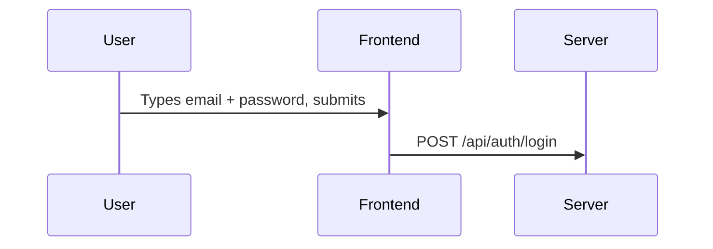
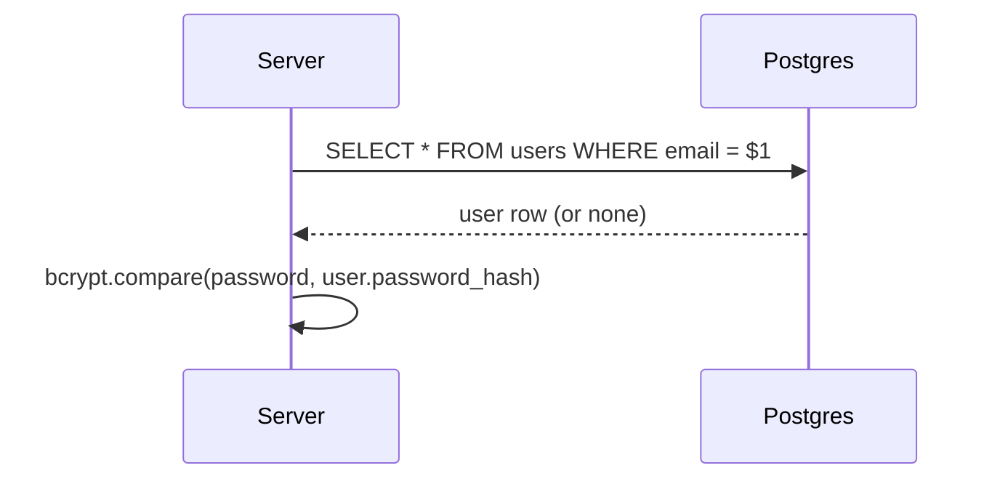
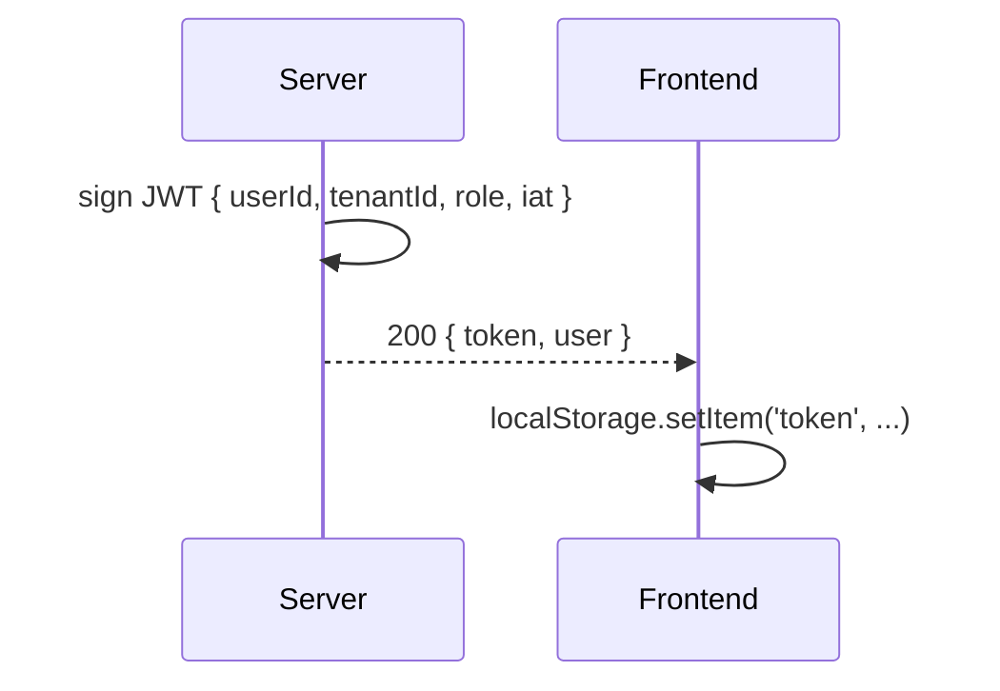
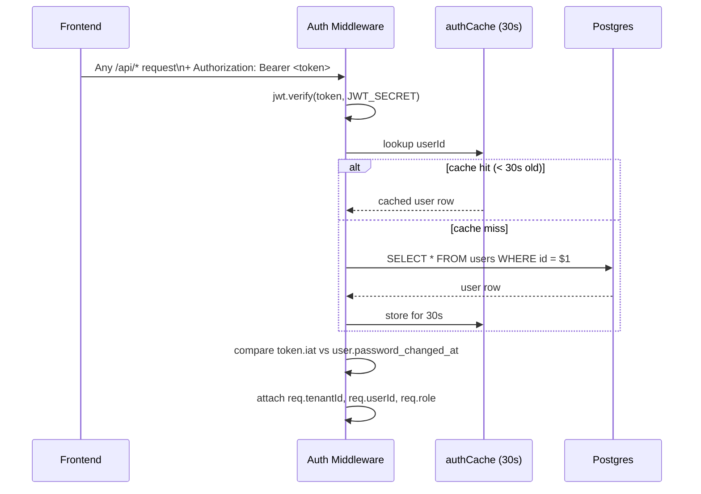
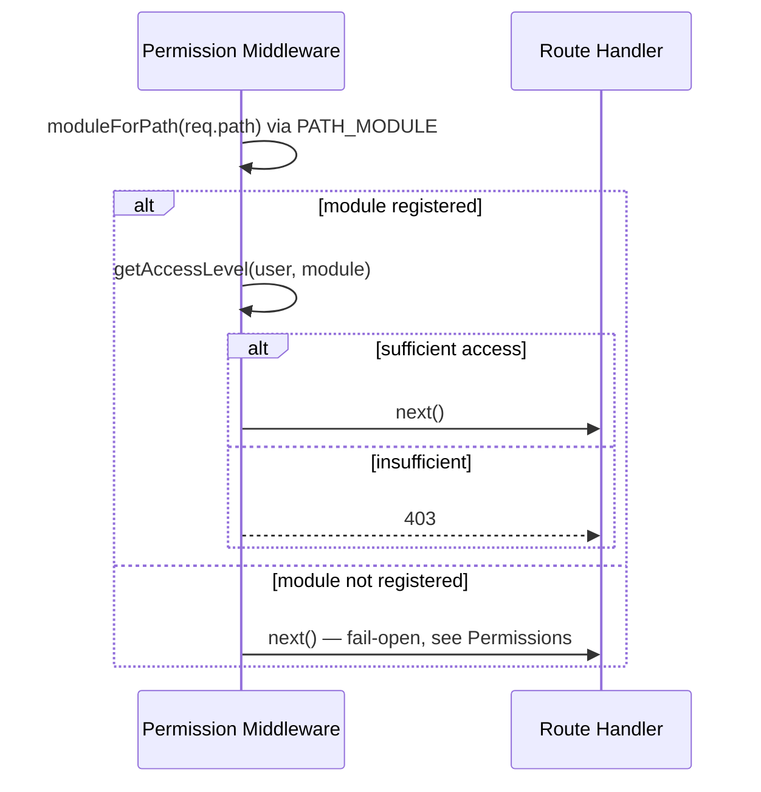
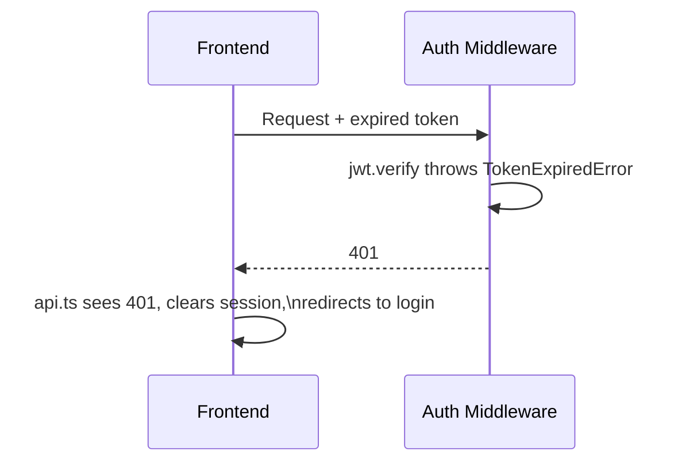

# Animation: Login → Token → Every Request

This walks the same authentication lifecycle described in [Auth API](/api/auth) and [Authorization](/security/authorization), but frame by frame, to make the *timing* of each step explicit.

## Frame 1 — Login submission

Nothing tenant-specific has happened yet — the server doesn't know who this is until it looks up the email.

## Frame 2 — Credential verification

If no user row is found, the server still runs a dummy bcrypt comparison against a fixed hash before responding — this constant-time-ish behavior avoids leaking "email doesn't exist" via response timing. See [Auth API](/api/auth).

## Frame 3 — Token issuance

The `iat` (issued-at) claim matters later — it's what gets compared against `password_changed_at` on every future request.

## Frame 4 — Every subsequent request

This is the frame worth studying closest: the JWT signature check is cheap and stateless, but the middleware *still* hits the database (or the 30-second cache) on every request, specifically so a role change, suspension, or password change takes effect almost immediately rather than waiting for token expiry. See [Caching](/performance/caching) for why 30 seconds specifically.

## Frame 5 — Permission check, then the route

## Frame 6 — A request 25 hours later (token expired)

## Self-check

1. At which exact frame does the server first learn which tenant a request belongs to?
2. Why does frame 4 still hit the database (or cache) even though the JWT signature already proves the token wasn't tampered with?
3. What would change in frame 6 if the frontend didn't centralize 401 handling in `api.ts`?

Answers

1. Frame 4 — from the verified JWT's `tenantId` claim, on every single request; frame 1-3 (login) don't establish a "current tenant" for anything beyond issuing the token itself.
2. Because a valid signature only proves the token *was* legitimately issued at some point in the past — it says nothing about whether the user's role, permissions, subscription status, or password have changed *since* then. The DB/cache lookup is what makes those changes take effect without waiting for token expiry.
3. Every feature that calls `api.ts` would need its own duplicate 401-handling logic, and any feature that forgot to add it would silently fail (or show a confusing error) instead of correctly redirecting to login.

## Related

- [API → Auth](/api/auth)
- [Security → Authorization](/security/authorization)
- [Architecture → Error Flow](/architecture/error-flow)
- [Runbooks → Auth Failures](/runbooks/auth-failures)
