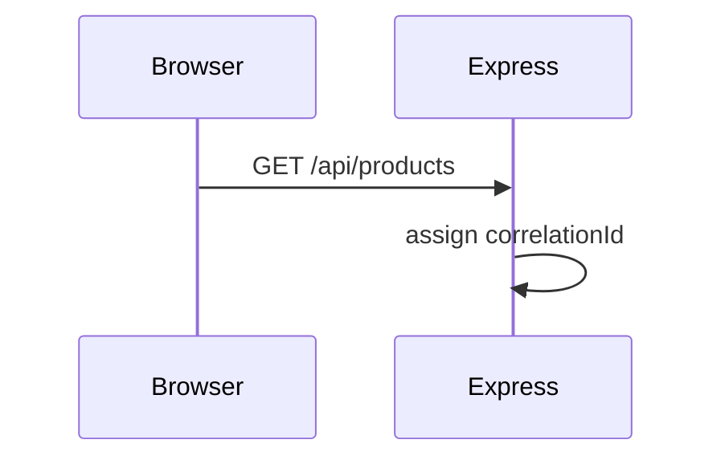
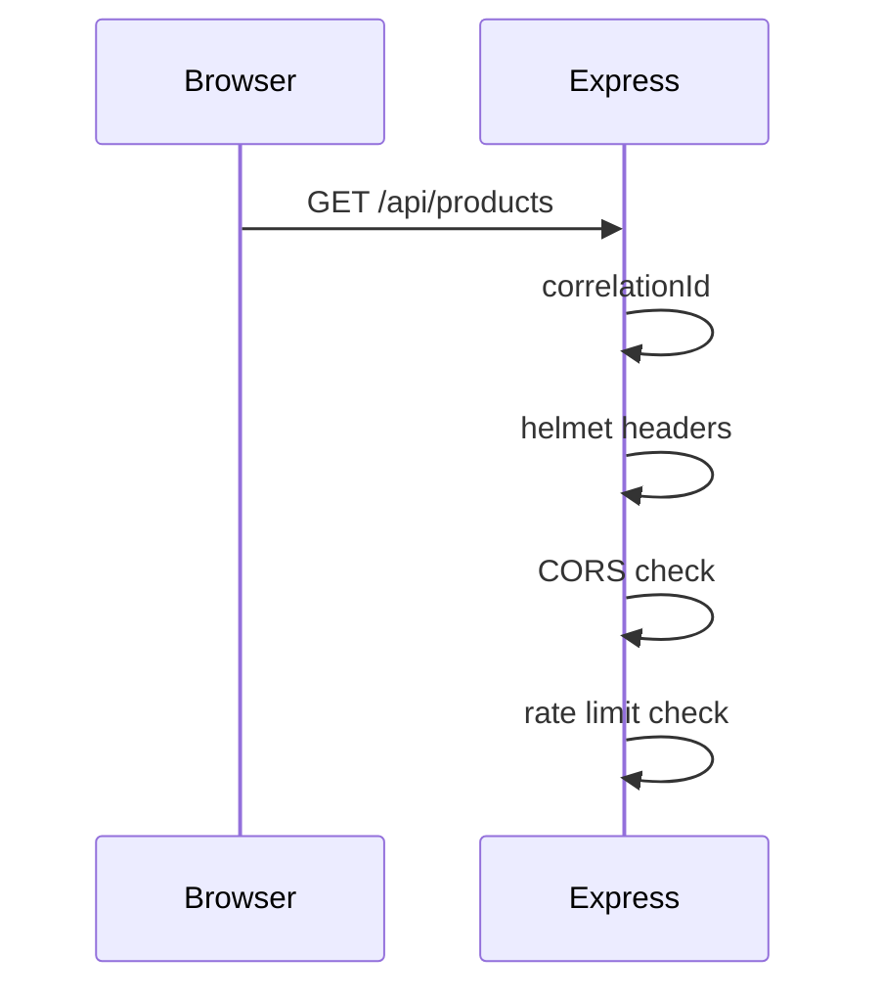
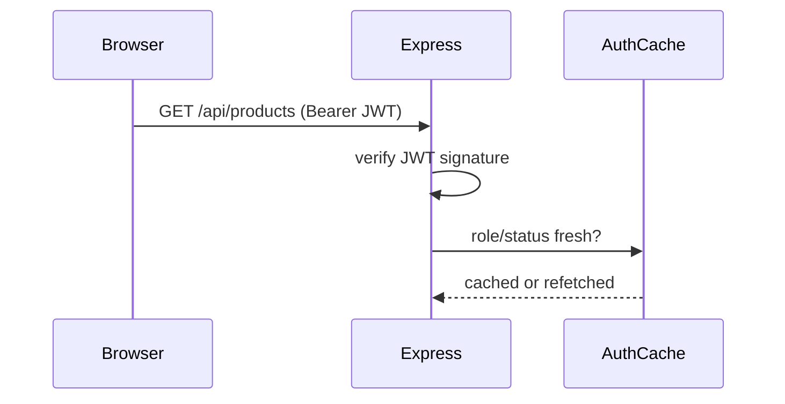
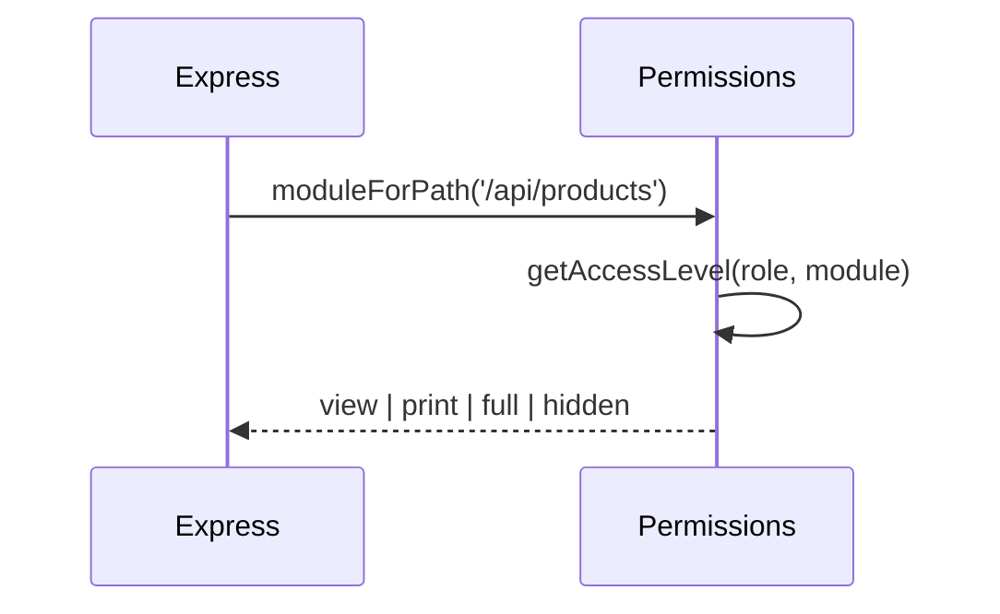
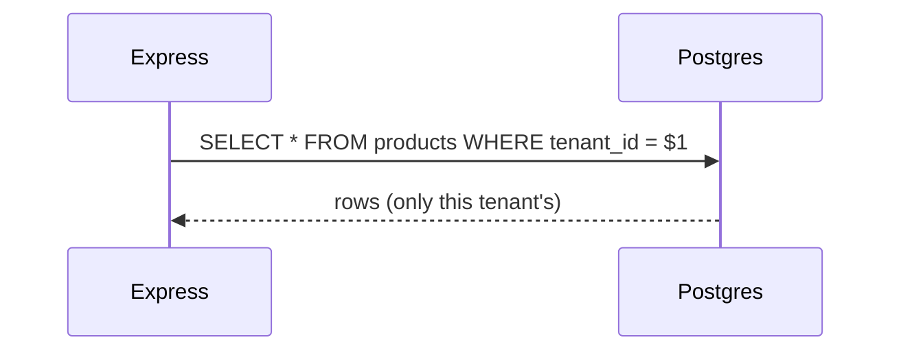
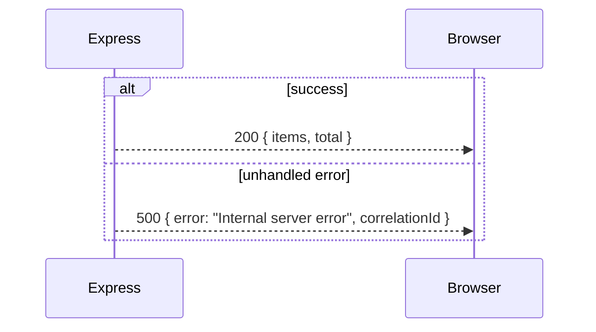

# Animated Lesson: Request Lifecycle

| Meta | Value |
|---|---|
| Duration | ~8 minutes |
| Level | Beginner → Intermediate |
| Prerequisites | Local app running (see [Local Setup](/tutorials/local-setup)) |
| Companion deep-dive | [Request Lifecycle](/architecture/request-lifecycle) |

:::tip How to run this as a live session
Present the storyboard scene by scene, pausing at each Mermaid frame to ask "what happens next, and why in this order?" before revealing the next frame. The goal is for the audience to be able to predict the middleware order themselves by the end, not just watch it happen.
:::

## Learning objectives

- Recite the Express middleware stack order from memory, and explain *why* each piece is positioned where it is
- Explain exactly where and how tenant context attaches to a request
- Know precisely what the client does on a `401` versus a `403`
- Understand what happens differently for a mutating request (`POST`/`PUT`/`DELETE`) versus a `GET`

## Storyboard

| Scene | Time | Visual | Narration cue |
|---|---|---|---|
| 1 | 0:00–0:40 | Browser, user clicks the Inventory tab | "User clicks Inventory — React calls `fetchApi('/api/products')`" |
| 2 | 0:40–1:10 | Arrow through Vite dev proxy (dev only) | "In dev, Vite proxies `/api/*` to Express on port 3001. In production, this arrow doesn't exist — the browser hits Express directly, because Express also serves the built frontend." |
| 3 | 1:10–1:50 | Correlation ID stamp appears on the request | "First middleware, before anything else — every subsequent log line and any 5xx response will carry this ID." |
| 4 | 1:50–2:30 | Helmet / CORS / rate-limit shields light up in sequence | "Hostile-internet assumptions: security headers, then an allow-list of origins, then a request budget — all before we've even looked at *who* is asking." |
| 5 | 2:30–3:10 | JWT unlocked, `authCache` gauge shown (fresh vs. stale) | "Verify the signature, then check role/status — cached for 30 seconds so we're not hitting Postgres on every single request, but never more than 30 seconds stale." |
| 6 | 3:10–4:00 | Permissions gauge: view / print / full, need-vs-have comparison | "A `GET` needs at least `view`. This route maps to the Inventory module via `PATH_MODULE` — and if it *didn't* map to anything, this middleware would wave it through unconditionally. That gap is deliberate but risky." |
| 7 | 4:00–5:00 | SQL statement highlighted, `WHERE tenant_id = $1` glowing | "This is the lock that actually matters. Everything before this scene is necessary, but this line is what prevents Tenant A from ever seeing Tenant B's inventory." |
| 8 | 5:00–5:40 | Response returns; branch to success (200 JSON) vs. failure (500 + correlationId) | "On success: plain JSON, camelCase keys. On an unhandled exception: generic `'Internal server error'` plus the correlation ID from Scene 3 — never the real exception text." |
| 9 | 5:40–6:30 | Client-side: in-memory cache write, or offline queue (mobile only) | "`fetchApi` caches successful GETs for a few seconds and, on mobile, queues failed mutations for later replay when connectivity returns." |
| 10 | 6:30–8:00 | Side-by-side: what changes for a `POST` (mutation) vs. this `GET` | "A mutation skips the in-memory GET cache path entirely, invalidates related cached keys on success, and gets only one retry (not three) on network failure — deliberately, because retrying a `POST` risks a duplicate write." |

## Mermaid "animation" frames

Present these as successive reveals (slides, or reveal.js fragments) — each frame adds exactly one layer to the previous one.

**Frame A — the request leaves the browser:**

**Frame B — security shields:**

**Frame C — identity:**

**Frame D — permissions:**

**Frame E — the database, the real lock:**

**Frame F — the two possible endings:**

## SVG / motion-graphics plan (if building an actual animated video)

1. Fade in a simplified browser chrome with the Inventory tab highlighted.
2. Draw the request line browser→server using `stroke-dashoffset` animation (a "traveling packet" effect).
3. Highlight each middleware box in sequence, left to right, using the brand accent color — pause briefly on each with its one-line label.
4. Pulse the database cylinder icon on the query moment; briefly show the `WHERE tenant_id` clause as overlaid text.
5. Reverse the request line's animation direction for the response, ending on either a green "200" badge or a red "500 + correlationId" badge depending on which branch you're demonstrating.
6. Optional second pass: repeat the whole animation for a `POST`, showing the retry-count difference and the cache-invalidation step that a `GET` doesn't have.

## Quiz

1. Which middleware runs first, before even `helmet`?
2. Does a client-supplied `X-Tenant-ID` header ever win over the JWT's tenant claim?
3. Are `4xx` responses retried automatically by `fetchApi()`?
4. What's the maximum staleness window for a role/permission check, and what mechanism enforces that ceiling?
5. Why does a `POST` get fewer automatic retries than a `GET`?

Answers

1. The correlation ID assignment middleware — it must run before anything else so every later log line and any error response can reference the same ID.
2. No — the server always derives `tenantId` from the verified JWT; a client-sent header is ignored or overwritten, never trusted.
3. No — `fetchApi()` only retries on `TypeError` (genuine network failure), never on an HTTP error status like 401/403/500.
4. 30 seconds, enforced by the `authCache` TTL — a role/permission/status change takes effect for a given user within at most 30 seconds, not up to 24 hours (the JWT's own lifetime).
5. Because retrying a mutating request risks executing it twice (e.g. creating a duplicate sale) if the original request actually succeeded but the response was lost — a `GET` is safe to retry repeatedly since re-reading data has no side effects.

## Hands-on exercise

1. Open your browser's Network tab, trigger a request in the running app, and find the correlation ID in the response (look at a deliberately-triggered 500, or add a temporary `console.log` of `req.correlationId` server-side).
2. Time how long after a permission change (edit a test user's role via the Super Admin/admin UI) it takes for that user's *next* request to reflect the new permission — confirm it's within the 30-second `authCache` window, not instant and not stuck on the old value for 24 hours.
3. Compare a `GET /api/products` and a `POST /api/products` in the Network tab's request/response timing and any retry behavior you can observe by simulating a dropped connection (e.g. toggling dev tools' offline mode mid-request).

## Related

- [Request Lifecycle (deep dive)](/architecture/request-lifecycle)
- [Middleware Stack](/backend/middleware-stack)
- [API Client](/frontend/api-client)
- [Auth Flow (animation)](/animations/auth-flow)
- [Quiz: Architecture](/quizzes/quiz-architecture)
