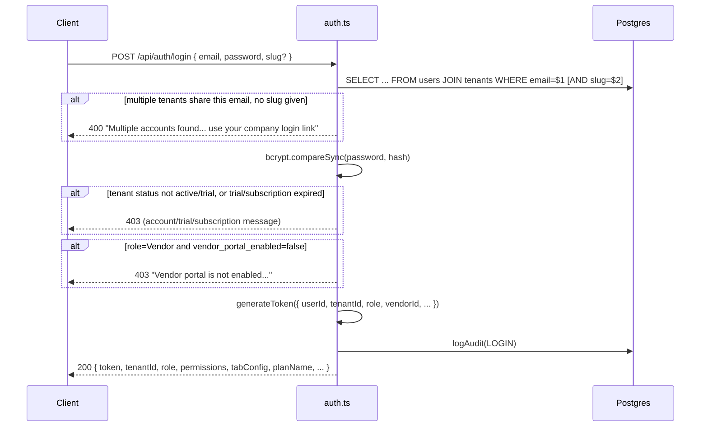
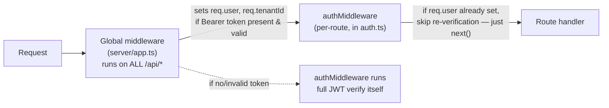

# Authentication & Authorization

**Home:** `server/routes/auth.ts` (login, profile, password lifecycle), `server/middleware/auth.ts` (JWT verify, role guards), plus a second, earlier verification pass installed globally in `server/app.ts` (see [Conventions](/api/conventions)).

Every tenant-scoped route in this codebase assumes `req.user` and `req.tenantId` are already populated correctly by the time its handler runs. This page is where that assumption becomes true.

## Signup is intentionally dead

```ts
// server/routes/auth.ts
router.post('/api/auth/signup', (_req, res) => res.status(410).json({ error: 'Signup disabled. Contact your admin.' }));
```

There is no self-service signup. `410 Gone` (not `404`, not `403`) — a deliberate signal that this endpoint *used to work* and was *intentionally* removed, not merely never built or forgotten. New tenants are provisioned exclusively by a Dhandho operator through the [Super Admin API](/api/super-admin) (`provisionTenant` in `server/utils/tenant.ts`), and new users within a tenant are created by that tenant's Admin through `POST /api/admin/users`. This is a B2B SaaS with sales-assisted onboarding, not a self-serve product — anonymous public account creation is attack surface with zero product benefit here.

## Login: `POST /api/auth/login`



### Why email lookup joins across all tenants, and what the `slug` param is for

```ts
const loginParams: string[] = [email.trim()];
const slugClause = (typeof slug === 'string' && slug)
  ? (loginParams.push(slug.toLowerCase()), `AND t.slug = $${loginParams.length}`)
  : '';
if (!slugClause) {
  const cnt = /* count of users with this email across ALL tenants */;
  if (cnt > 1) return res.status(400).json({ error: 'Multiple accounts found for this email...' });
}
```

Emails are **not** globally unique across tenants — `users.email` has no global unique index, only scoped meaning within its tenant (two different companies can both have an `admin@gmail.com` user). The login form can optionally pass the tenant's `slug` (from a company-specific login URL like `app.dhandho.com/t/acme-tools/login`) to disambiguate deterministically. Without a slug, login only proceeds if exactly one account matches that email across the whole platform; if more than one tenant happens to share that email, the user is told to use their company-specific login link instead of the API silently picking one tenant's account — silently picking one would be a data-integrity landmine (a user unknowingly logging into the wrong company's data).

:::tip This is a real historical bug fix, not a hypothetical
The inline comments in the source (`H3 fix`, `M2`) mark this as a fix for a discovered issue — early versions apparently let ambiguous logins through. Treat every `// FIX:`/`// H\d`/`// M\d`-style comment you find in this codebase as a hint that there's a war story and a regression test behind it; it's worth grepping git history or asking a teammate before "cleaning up" code like this.
:::

### Login also blocks on tenant lifecycle state, not just credentials

Four additional gates run **after** password verification succeeds, in order: tenant `status` must be `active` or `trial`; if `trial`, `trial_ends_at` must not be in the past; if `active`, `subscription_ends_at` must not be in the past; and if the user's role is `Vendor`, the tenant's `vendor_portal_enabled` flag must be true. Each has a distinct, specific error message — this is deliberate UX: "your trial expired" is a completely different next action for a user than "wrong password," and conflating them into a generic 401 would push confused users straight to a password reset when the real fix is "ask your admin to renew."

### The login response is a large, denormalized payload — and that's the point

The response includes not just `token` but `permissions` (normalized from either the legacy array format or the current per-module `AccessLevel` object — see [Backend → Permissions](/backend/permissions)), `tabConfig` (falls back to a hardcoded default object if the tenant never customized it), `planName` (resolved via a `plans` table lookup, or synthesized from `tenant_status`/`plan_id` if unset), and several tenant feature flags (`vendorPortalEnabled`, `barcodeSystemEnabled`, `multiLanguageEnabled`, `inventoryTrackingEnabled`). The frontend renders its entire shell — which tabs show, which modules are visible, whether barcode scanning UI appears at all — directly from this one response, without a second round-trip. `phone`/`address`/`gst_number` are deliberately **excluded** from the login response (a PII-minimization decision) and only returned by the separate `GET /api/settings/profile` call once the session is established.

## Password lifecycle

| Endpoint | Auth | Purpose |
|---|---|---|
| `PUT /api/settings/change-password` | JWT, self only | User changes their own password; sets `password_changed_at`, invalidating all older JWTs (see below) |
| `POST /api/auth/forgot-password` | none (public) | Generates a reset token, 5-minute expiry; **never returns the token in the response** |
| `POST /api/auth/reset-password` | none (public, token-based) | Consumes the token, sets a new password |
| `PUT /api/admin/reset-user-password` | JWT, Admin/Super Admin | Admin force-resets another user's password within the same tenant |
| `DELETE /api/auth/me` | JWT, self only | Self-service account deletion — anonymizes, doesn't hard-delete |

### Why `forgot-password` never emails or returns the token

```ts
// Token stored — retrievable by authenticated admin via GET /api/admin/reset-tokens
// or super-admin via GET /api/super-admin/reset-tokens.
// Never returned here: keeps anti-enumeration intact and prevents token
// leaking to anyone who guesses a valid email address.
res.json({ ok: true, message: 'Reset token generated. Contact your admin or support to retrieve it.' });
```

There is no transactional-email integration wired up for password resets. The token is written to `password_reset_tokens` and must be manually retrieved by a tenant Admin or a Dhandho super-admin and relayed to the user out-of-band (phone call, WhatsApp, in person). This is a genuine product gap for a self-serve SaaS, but it's a deliberate stopgap, not an oversight — see [Rejected alternatives](#rejected-alternative-emailing-the-reset-link-directly) below. Regardless of whether the email exists, the endpoint returns the same `{ ok: true }` shape — a standard anti-enumeration measure so an attacker can't use this endpoint to test which emails are registered.

### Why password change invalidates *all* existing sessions, not just rotates one token

```ts
await pool.query('UPDATE users SET password_hash = $1, password_changed_at = NOW() WHERE id = $2 AND tenant_id = $3', [...]);
```

```ts
// server/middleware/auth.ts — authMiddlewareStrict
if (changedAt && req.user.iat && changedAt.getTime() / 1000 > req.user.iat) {
  return res.status(401).json({ error: 'Session expired after password change. Please log in again.' });
}
```

JWTs are stateless — there's no server-side session table to revoke a specific token from. Instead, `password_changed_at` acts as a **watermark**: any JWT issued (`iat`) *before* that timestamp is rejected the next time it hits a route guarded by `authMiddlewareStrict`. This means changing your password logs out every device and every tab, everywhere, not just the one where you changed it — a deliberate security tradeoff (if your account was compromised, a password change should kill the attacker's session too) at the cost of some UX friction (you can't stay logged in on your phone while updating on your laptop).

:::warning Two auth middlewares exist, and most routes use the weaker one
`authMiddleware` verifies the JWT and re-fetches the *current* role/vendor_id from the database (so a demotion takes effect immediately) but does **not** check the `password_changed_at` watermark. `authMiddlewareStrict` does both. Only genuinely sensitive routes — the account-deletion and password-related routes — use the strict variant. Most business routes (`sales.ts`, `products.ts`, etc.) use plain `authMiddleware`, meaning a stolen JWT from *before* a password change remains valid on ordinary business routes until it naturally expires (24h) unless a route specifically opts into `authMiddlewareStrict`. This is a real, accepted gap — not a bug — because re-querying `password_changed_at` on every single request across every route would add a DB round-trip to the hot path (see [Backend → Middleware Stack](/backend/middleware-stack)).
:::

## Two layers of JWT verification — why



```ts
// server/middleware/auth.ts
export async function authMiddleware(req: AuthRequest, res: Response, next: NextFunction) {
  // H1: global auth in index.ts already attached live role/vendorId — do not clobber with JWT claims
  if (req.user?.userId && req.tenantId) {
    return next();
  }
  // ... otherwise verify the JWT from scratch itself
}
```

`server/app.ts` installs a JWT-verification middleware globally on `/api/` (see [Conventions](/api/conventions)) that already decodes the token and attaches `req.user`/`req.tenantId` for the vast majority of requests. Individual route files still import and apply `authMiddleware` on each protected route — this looks redundant, and the comment (`H1`) confirms it *was* a real bug: an earlier version of `authMiddleware` didn't check for already-attached `req.user` and would **re-derive stale role data**, clobbering the fresher live lookup the global middleware had already done. The fix makes `authMiddleware` a no-op passthrough when the global layer already ran, while still functioning standalone (e.g. in tests that mount a single route file without the full `app.ts` stack). Keep both layers when adding new routes; don't assume the global layer alone is sufficient, since route-level tests often bypass it.

## Role model and vendor scoping

```ts
export function requireRole(allowed: string[]) { /* 403 unless req.user.role is in the allow-list */ }
export const requireAdmin = requireRole(['Admin', 'Super Admin']);
export function blockVendors(req, res, next) {
  if (req.user?.role === 'Vendor') return res.status(403).json({ error: 'Vendors cannot perform this action.' });
  next();
}
export function vendorScopeId(req: AuthRequest): string | null {
  if (req.user?.role !== 'Vendor') return null;
  return req.user.vendorId ?? null;
}
```

Roles are plain strings (`Admin`, `Super Admin`, `Manager`, `Sales`, `Vendor`, ...) checked against allow-lists per route — there's no roles table or RBAC engine. `Vendor` is the one role with structurally different data access: a `Vendor` user is linked to a specific row in the `vendors` table via `users.vendor_id`, and `vendorScopeId(req)` returns that ID (or `null` for every non-Vendor role, meaning "no forced scope — see this tenant fully"). Route handlers that serve vendor-specific data (their own purchase history, their own outstanding balance) call `vendorScopeId(req)` and add `AND vendor_id = $n` to their query when it's non-null; see [Sales & Distribution](/api/sales-distribution) for concrete usage, and `assertVendorAccess`/`assertVendorLinked` for the companion guards that reject a `Vendor` JWT trying to touch another vendor's resource.

## Super admin auth is a separate token universe

```ts
export function superAdminMiddleware(req: AuthRequest, res: Response, next: NextFunction) {
  // ...
  if (decoded.role !== 'super_admin' && decoded.role !== 'owner' && decoded.role !== 'support') {
    return res.status(403).json({ error: 'Super admin access required' });
  }
  req.user = decoded as JwtPayload;
  next();
}
```

Super-admin JWTs carry `role: 'super_admin' | 'owner' | 'support'` — values that never appear in a tenant user's `role` column and are checked by an entirely separate middleware function, not `requireRole`. There is no `tenantId` claim expected on these tokens at all (a super admin isn't scoped to any one tenant). See [Super Admin API](/api/super-admin) for the impersonation flow, which issues a short-lived token carrying `impersonatedBy` — the one case where a super-admin-issued token *does* carry a `tenantId` and acts like a regular user token, but leaves an audit trail of who initiated it.

## Rejected alternative: emailing the reset link directly

Sending an actual "click here to reset" email was the obvious design and is explicitly not implemented yet. **Rationale for the current stopgap:** wiring up transactional email (SendGrid/SES/etc.) is nontrivial infrastructure (domain verification, deliverability, bounce handling) that the team deprioritized versus manual admin-mediated resets, which work fine at the company's current customer count where every tenant has a known point of contact. The token-in-database design was chosen specifically so that swapping in real email delivery later is a small, additive change (just email the existing token instead of requiring manual retrieval) rather than a redesign — the anti-enumeration and expiry logic doesn't change.

## Rejected alternative: refresh tokens

There is no refresh-token / access-token pair — a single JWT with a 24-hour expiry (`generateToken`'s default) is both the session and the bearer credential. **Rationale:** refresh tokens solve "let users stay logged in for weeks without re-entering credentials, while keeping the actual bearer token short-lived for security." This product's usage pattern (retail/warehouse staff logging in once per shift on a shared terminal) doesn't need multi-week persistent sessions badly enough to justify the added complexity of a token-rotation and revocation-list system. A 24h expiry re-authenticates naturally once a day, which lines up with a daily shift boundary anyway.

## Common mistakes

1. Guarding a sensitive route (password/account-deletion adjacent) with plain `authMiddleware` instead of `authMiddlewareStrict`, missing the password-changed-invalidation check.
2. Forgetting `blockVendors` on a mutating route that should be read-only for vendors, relying solely on `enforceModulePermissions` (which gates by *module*, not by the vendor/non-vendor distinction).
3. Trusting `req.user.vendorId` without first checking `req.user.role === 'Vendor'` — a non-vendor's `vendorId` claim is meaningless and should never gate a query.
4. Building a login flow assumption that email is globally unique — it isn't; always consider the multi-tenant collision case.
5. Returning the password-reset token directly in an API response "to make testing easier," defeating the anti-enumeration design.

## Interview question

> **Q: A user reports that after changing their password on their laptop, their phone app still works fine and shows their data. Is this a bug? Walk through why or why not.**
>
> Expected answer: it depends entirely on which routes the phone app calls. `password_changed_at` invalidates JWTs only on routes protected by `authMiddlewareStrict` — the phone app's JWT was issued before the password change (`iat` predates the new `password_changed_at`), so any request to a `authMiddlewareStrict`-guarded route (e.g. another password change, account deletion) would now correctly fail with 401. But ordinary business routes (viewing sales, products, etc.) use plain `authMiddleware`, which never checks the watermark — so yes, the phone stays "logged in" and functional for everything except those specific sensitive actions, until the 24h token naturally expires. This is expected behavior given the current design, not a bug — though it's a legitimate discussion point about whether more routes should adopt the strict variant.

## Hands-on exercise

1. Log in via `POST /api/auth/login` locally, decode the returned JWT (paste it into jwt.io or use `jsonwebtoken.decode`), and confirm which claims it carries (`userId`, `tenantId`, `role`, `vendorId`, `iat`).
2. Call `PUT /api/settings/change-password` with that token, then immediately retry a request to a route guarded by `authMiddlewareStrict` (e.g. `DELETE /api/auth/me`) using the *same, now-stale* token, and confirm you get "Session expired after password change."
3. Retry the same stale token against a route guarded by plain `authMiddleware` (e.g. `GET /api/products`) and confirm it still succeeds — this is the gap described above, not a bug in your test.

## Related

- [API Overview](/api/overview)
- [API Conventions](/api/conventions)
- [Super Admin API](/api/super-admin)
- [Backend → Permissions](/backend/permissions)
- [Security → Tenant Isolation](/security/tenant-isolation)
- [Security → OWASP](/security/owasp)
