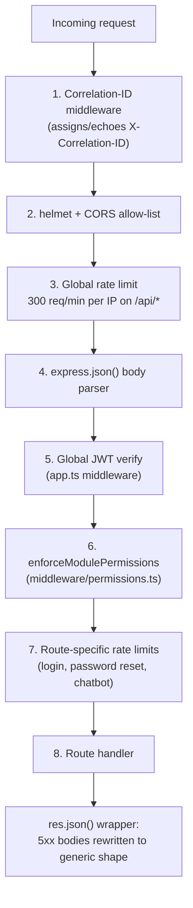

# API Conventions

Every one of DG-ERP's ~34 route files (see [Backend → Routes Catalog](/backend/routes-catalog)) implements its own handlers, but a small set of rules is enforced **globally**, once, in `server/app.ts` before any handler runs, and a second set is a strong-but-unenforced convention followed by hand across every handler. This page is the difference between the two, and exactly where each rule lives in code.



## 1. Base path and versioning — there is none

Every endpoint lives under `/api/`. There is no `/api/v1/...` versioning prefix — the API is versioned implicitly by the app's own release cadence (a single monolith deploy), not by URL. See [Rejected alternatives](#rejected-alternative-url-versioning) below for why.

## 2. Every response is JSON, camelCase, regardless of the database's snake_case

```ts
// server/routes/sales.ts — typical mapping at the boundary
res.json({
  id: row.id,
  barcode: row.barcode,
  productId: row.product_id,        // product_id → productId
  customerName: row.customer_name,   // customer_name → customerName
  purchaseDate: row.purchase_date,
  rewardPointsEarned: row.reward_points_earned,
});
```

Postgres columns are `snake_case` (see [Schema Overview](/database/schema-overview)); every JSON response is `camelCase`. This translation happens by hand, field by field, inside each route handler — there is no automatic case-conversion middleware or ORM serializer doing it centrally. See [Backend Patterns](/backend/patterns) Pattern 5 for the full rationale.

:::warning No enforcement mechanism for the camelCase boundary
Nothing stops a new handler from accidentally `res.json(row)`-ing a raw database row with `snake_case` keys straight through to the client. This has to be caught in code review — grep any new route's `res.json(...)` calls for stray `_` characters in key names as a quick smell-test.
:::

## 3. Error shapes — two tiers, deliberately different amounts of detail

**Every 4xx response** has at minimum `{ error: string }` — a human-readable message, written for a frontend developer or an end user to display directly, not a machine-parseable error-code enum:

```json
{ "error": "Batch already has an IRN. Cancel it before regenerating.", "irn": "1234..." }
```

**Every 5xx response** is rewritten, centrally, to a generic, non-leaking shape — regardless of what the underlying handler actually threw:

```ts
// server/app.ts — installed globally, before any route runs
const origJson = res.json.bind(res);
res.json = ((body: unknown) => {
  if (res.statusCode >= 500) {
    logger.error('API 500 response', { correlationId, method: req.method, path: req.path });
    return origJson({ error: 'Internal server error', correlationId });
  }
  return origJson(body as Parameters<typeof origJson>[0]);
}) as typeof res.json;
```

```json
{ "error": "Internal server error", "correlationId": "a1b2c3d4-..." }
```

:::danger This rewrite is why you'll never see a raw stack trace or SQL error in a client response
Even if a handler's `catch` block does something careless like `res.status(500).json({ error: err.message })` where `err.message` happens to contain a raw Postgres error (`relation "foo" does not exist`) — the global `res.json` override intercepts it *before it leaves the process* and replaces the body with the generic shape. The original message still reaches `logger.error()` server-side for debugging. This is a deliberate last line of defense against accidental information disclosure in error paths, not just a nice-to-have — see [Security → OWASP](/security/owasp) for the disclosure category this closes.
:::

There is **no standardized error-code taxonomy** across 4xx responses (no `{ code: 'VALIDATION_ERROR', field: 'email' }` shape) — a known, accepted limitation. Frontend code branches on HTTP status codes and, in a few places, on substring-matching the `error` message text, which is brittle but has been "good enough" given the frontend and backend are the same team shipping in lockstep.

## 4. Correlation IDs — every response, always

```ts
// server/app.ts
const incoming = req.headers['x-correlation-id'];
const correlationId = (typeof incoming === 'string' && incoming.trim())
  ? incoming.trim().slice(0, 64)
  : crypto.randomUUID();
res.setHeader('X-Correlation-ID', correlationId);
```

The client can supply its own `X-Correlation-ID` (useful for a mobile app or Electron on-prem client to link its own local logs to a specific server request), or the server generates one. Either way, it's echoed on the response header **and** embedded in every 5xx JSON body — that's the ID to ask a user for in a support conversation, and the ID to `grep` in server logs (see [SRE → Logging](/sre/logging)).

## 5. Tenant context — never a client-settable header, despite the header's name

```ts
// server/app.ts — global auth middleware
const decoded = jwt.verify(token, process.env.JWT_SECRET!, { algorithms: ['HS256'] });
if (decoded.tenantId && decoded.userId) {
  req.headers['x-tenant-id'] = decoded.tenantId; // OVERWRITES anything the client sent
  // ...
}
```

Every route handler reads `req.headers['x-tenant-id'] as string` to scope its queries. That header exists in the codebase as a **header name**, but it is never trusted from the incoming request — the global middleware always overwrites it with the value decoded from the verified JWT before any route handler executes. A malicious client sending `X-Tenant-ID: some-other-tenant` accomplishes nothing; the middleware clobbers it unconditionally. See [Auth](/api/auth) for the full JWT verification flow and [Tenant Isolation](/security/tenant-isolation) for why this specific design choice is the actual foundation of multi-tenant safety.

## 6. Module permissions — a global gate, keyed by URL prefix

```ts
// server/middleware/permissions.ts
const PATH_MODULE: [string, string][] = [
  ['/vendor-finance', 'finance'], ['/accounts', 'accounts'], ['/gst', 'accounts'],
  ['/sales', 'sales'], ['/distribution', 'distribution'], ['/products', 'inventory'],
  ['/quotations', 'quotations'], ['/orders', 'orders'], ['/warranties', 'warranty'],
  // ... full list in the source file
];

export function enforceModulePermissions(req: AuthRequest, res: Response, next: NextFunction) {
  const mod = moduleForPath(req.path);
  if (!mod) return next(); // unmapped paths are NOT gated
  const level = getAccessLevel(user.permissions, user.role, mod);
  const need: AccessLevel = req.method === 'GET' || req.method === 'HEAD' ? 'view' : 'full';
  if (RANK[level] < RANK[need]) return res.status(403).json({ error: `Access denied for module "${mod}"...` });
  next();
}
```

Every URL path is mapped to a "module" name by longest-prefix match, and every user's role (or per-user JSONB override) resolves to one of four access levels — `hidden` < `view` < `print` < `full` — per module. `GET`/`HEAD` only needs `view`; every mutating verb needs `full`. This runs globally, once, for **every** request, before any individual route file's own `blockVendors`/`requireAdmin` checks — see [Backend → Permissions](/backend/permissions) for the full role-preset table.

:::warning Unmapped paths are silently ungated at this layer
If you add a new route file with a URL prefix that isn't in `PATH_MODULE`, `enforceModulePermissions` returns `next()` immediately with no access check at all — not a deny, a **skip**. The only remaining protection on that route is whatever `blockVendors`/`requireAdmin`/`superAdminMiddleware` the route file applies itself. New route files must add their prefix to `PATH_MODULE` — this is easy to forget because the route still "works" perfectly for every role when it's missing, silently over-permissive instead of visibly broken.
:::

## 7. Rate limiting — global baseline, tighter on sensitive paths

| Scope | Limit | Why |
|---|---|---|
| All of `/api/*` | 300 req/min per IP | Baseline DoS protection |
| `/api/auth/login`, `/api/super-admin/login` | 5 req/min per IP | Brute-force credential guessing |
| `/api/auth/forgot-password` | 3 req/hour per IP | Reset-token spam / enumeration slowdown |
| `/api/auth/reset-password` | 5 req/hour per IP | Token brute-forcing |
| `/api/auth/signup` | 3 req/hour per IP | Endpoint is actually disabled (`410 Gone`) but still rate-limited defensively |
| `/api/settings/change-password` | 20 req/15min per IP | Prevents password-change abuse on a compromised session |
| `/api/chatbot` | 30 req/min per IP | Cost/abuse control on the NLQ endpoint |
| `/api/onprem/*`, `/api/mobile/*` public endpoints | 60 req/15min per IP | These are public (no JWT) — rate limiting is the *only* abuse control before license/invite-code validation |

All rate limits are disabled (`isTest` check) under Vitest so integration tests don't trip them.

## 8. Pagination — two competing implementations (know which one you're calling)

See [Database → Queries & Fragments](/database/queries-and-fragments) for the full detail: `utils/helpers.ts` exports a `parsePagination` capped at 200/page; `utils/pagination.ts` exports a newer one capped at 1000/page with configurable defaults. New endpoints should prefer the latter.

## 9. `QUERY` HTTP method shim

```ts
// server/app.ts
app.use((req, _res, next) => {
  if (req.method === 'QUERY') {
    if (req.body && typeof req.body === 'object') Object.assign(req.query, req.body);
    req.method = 'GET';
  }
  next();
});
```

A small, unusual accommodation: some HTTP clients (certain mobile/offline sync libraries) send a non-standard `QUERY` verb with a JSON body for what is semantically a `GET` with a complex filter. This middleware merges that body into `req.query` and rewrites the method to `GET` before anything else runs, so downstream route handlers never need to know this happened.

## Rejected alternative: URL versioning

`/api/v1/...`, `/api/v2/...` was considered and rejected in favor of implicit versioning by release. **Rationale:** the frontend web app, the Capacitor mobile app, and the Electron on-prem app are all built from the same monorepo and released together for the cloud deployment; on-prem installs lag behind but pull a *whole new build*, not a mix-and-match of old frontend against new API version. There has never been a requirement to serve two API versions simultaneously to different clients at the same time. Introducing `/v1/` now would be pure ceremony — a real cost (every route path gets longer, every doc reference needs a version) for a versioning problem that doesn't exist yet. If a genuine multi-version need appears (e.g. an on-prem customer refuses to update for a year while cloud API evolves incompatibly), that's the trigger to revisit this.

## Common mistakes

1. Returning a raw database row (`snake_case` keys) directly via `res.json(row)` instead of mapping to `camelCase`.
2. Adding a new route file's URL prefix without also adding it to `PATH_MODULE` in `middleware/permissions.ts` — silently ungated, not silently denied.
3. Writing a handler's own generic 500 message that accidentally includes interpolated SQL or a stack trace — technically safe today because of the global `res.json` override, but relying on that safety net instead of writing a clean error message is bad practice and fragile if that override is ever refactored.
4. Assuming `X-Tenant-ID` sent by the client has any effect — it's always overwritten server-side.
5. Forgetting a route needs its own rate limiter when it's a public (`PUBLIC_PATHS`), unauthenticated endpoint — the global 300/min limiter alone is not tight enough for license-key or invite-code guessing.

## Interview question

> **Q: A new engineer adds `router.post('/api/loyalty-tiers', ...)` to a new route file and mounts it in `app.ts`. Every role can immediately create loyalty tiers, including a `Vendor` role that should only have read access. What's the most likely missing piece, and how would you detect it in review?**
>
> Expected answer: the new URL prefix (`/loyalty-tiers`) was never added to `PATH_MODULE` in `middleware/permissions.ts`, so `enforceModulePermissions` treats it as unmapped and calls `next()` unconditionally — no access check at all. It might *also* be missing a route-level `blockVendors`/`requireAdmin` guard, but the systemic fix is adding the prefix mapping, because that's the layer meant to catch exactly this class of oversight globally. In review: check every new route file's URL prefixes against `PATH_MODULE`, and write a test that asserts a `Vendor`-role JWT gets 403 on the mutating verb.

## Hands-on exercise

1. Pick any GET endpoint you haven't looked at yet in `server/routes/*.ts`. Trace its URL prefix through `PATH_MODULE` in `middleware/permissions.ts` and identify which module it's gated by.
2. Send a request to that endpoint with an intentionally wrong `X-Tenant-ID` header (using a valid JWT for a *different* tenant) and confirm the response still reflects the JWT's real tenant, not your header.
3. Trigger a 500 error deliberately (e.g. malformed input that reaches an unguarded code path) against a local dev server and confirm the response body matches the generic `{ error, correlationId }` shape, then find the corresponding detailed log line server-side using that `correlationId`.

## Related

- [API Overview](/api/overview)
- [Auth](/api/auth)
- [Backend → Middleware Stack](/backend/middleware-stack)
- [Backend → Permissions](/backend/permissions)
- [Database → Queries & Fragments](/database/queries-and-fragments)
- [Security → OWASP](/security/owasp)
