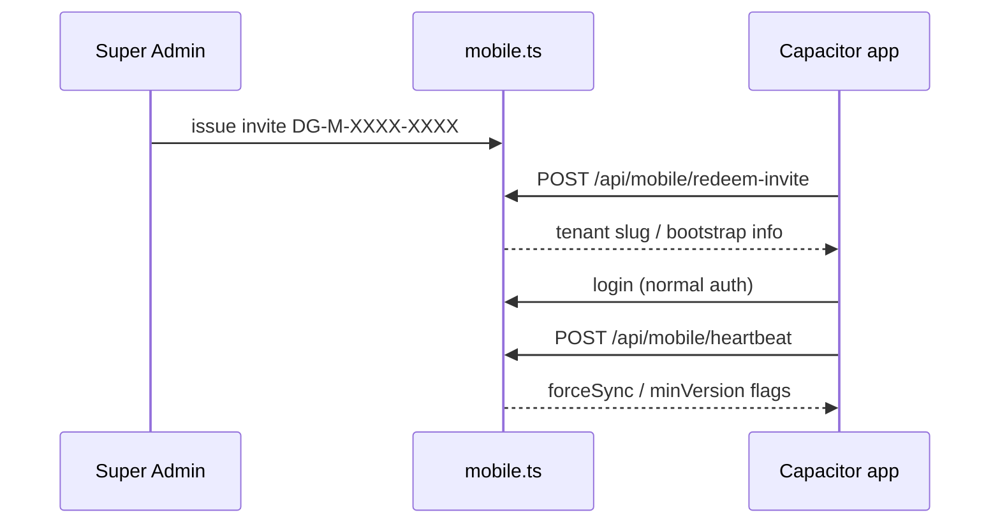

# Mobile and On-Prem API

Two edge surfaces share the cloud Express app but have **special public + restricted** routes.

## Mobile (Capacitor → cloud)

| Endpoint | Auth | Purpose |
|---|---|---|
| `POST /api/mobile/redeem-invite` | Public (rate limited) | Exchange invite for tenant onboarding context |
| `POST /api/mobile/heartbeat` | Public structure; device upsert when authed | Version policy + force sync |
| `POST /api/mobile/register-device` | Auth | Bind device id |
| `POST/GET …/super-admin/tenants/:id/mobile-invite` | SA | Issue/list invites |
| `POST …/mobile-force-sync` | SA | Flip force-sync flag |
| `PUT …/mobile-version` | SA | min/latest version policy |
| `GET …/mobile-devices` | SA | Device inventory |

Client pieces: `src/platforms/mobile/online/*`, offline queue in `platforms/mobile/offline/*`.

:::tip
Heartbeat every ~60s is how SA “reaches into” field devices without push infra.
:::

## On-prem (Electron + optional cloud license)

| Endpoint | Auth | Purpose |
|---|---|---|
| `POST /api/onprem/activate` | Public + rate limit | Bind license key ↔ machine id |
| `POST /api/onprem/heartbeat` | Public | Telemetry + `settings` + `pendingNotifications` (SA Bell queue) |
| `POST /api/onprem/deactivate` | Public | Unbind |
| `POST /api/onprem/mark-applied` | Public; `machineId` required when bound | Ack settings push |
| `POST /api/onprem/mark-notifications-delivered` | Public; `machineId` required when bound | Ack Bell messages delivered |
| `GET /api/onprem/tab-config` | **Localhost only** | Pull tab config |
| `POST /api/onprem/apply-settings` | Localhost + `DEPLOYMENT_MODE=onprem` | Deep-merge pushed settings |
| `POST /api/onprem/apply-notifications` | Localhost + `DEPLOYMENT_MODE=onprem` | Insert SA Bell rows into local `tenant_notifications` |
| `POST /api/onprem/provision` | Localhost + `DEPLOYMENT_MODE=onprem` | Create local tenant |
| `/api/super-admin/onprem` | SA | License CRUD |
| `POST /api/super-admin/onprem/:id/notify` | SA | Queue Bell message for one license |

:::danger X-Forwarded-For is ignored for localhost checks
Localhost gates use `req.socket.remoteAddress`. Do not “fix” them by trusting proxy headers — that would let the internet hit provision.
:::

## Why both live in one codebase

| Benefit | Cost |
|---|---|
| One security fix ships everywhere | Careful `PUBLIC_PATHS` maintenance |
| SA sees cloud + on-prem analytics | Dual auth mental model |

## Common mistakes

1. Putting provision on a public internet URL without localhost gate  
2. Building mobile against wrong `VITE_API_ORIGIN`  
3. Forgetting rate limits on redeem-invite (invite stuffing)  

## Interview question

*How does force-sync work without store push notifications?*

:::info Answer sketch
Device polls heartbeat; server returns a flag derived from `tenants.mobile_force_sync_at` (and version policy). Client clears caches / refetches when flagged.
:::

## Related

- [Four Surfaces](/architecture/four-surfaces)  
- [Deployment: Mobile](/deployment/mobile)  
- [Deployment: Electron](/deployment/electron)  
- [Runbook: Mobile Sync](/runbooks/mobile-sync)  
- [Runbook: On-Prem License](/runbooks/onprem-license)  
