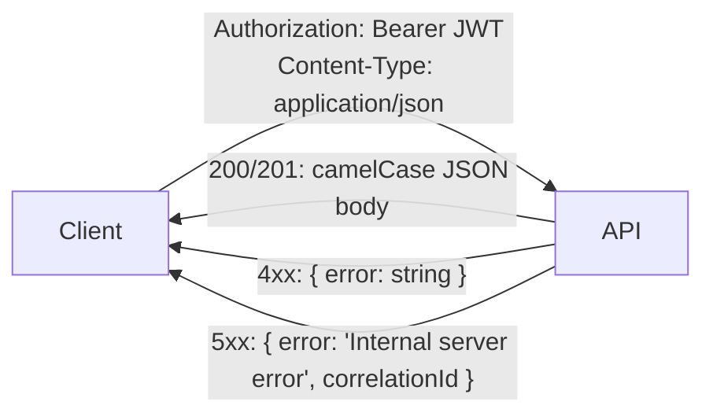

# API Overview — The Shape of Dhandho's REST Surface

:::info No OpenAPI/Swagger spec exists (yet)
The source of truth for the API is the route files themselves. This page is the map; [API Conventions](/api/conventions) is the contract; the individual domain pages (`/api/{auth,sales-distribution,products-inventory,finance-accounts,gst,super-admin,mobile-onprem}`) are the per-area reference.
:::

## 1. The API in one sentence

Every endpoint is `/api/{resource}` (or a nested variant), JSON in and out, authenticated by `Authorization: Bearer <JWT>` except a short public allow-list, and authorized by two independent layers before your handler ever runs — see [Request Lifecycle](/architecture/request-lifecycle).

## 2. Domains, base paths, and what they own

| Domain | Base path(s) | Router file(s) |
|---|---|---|
| Auth & session | `/api/auth/*`, `/api/settings/*` | `auth.ts` |
| Platform / Super Admin | `/api/super-admin/*` | `super-admin.ts` |
| On-prem licensing | `/api/onprem/*` | `onprem.ts` |
| Mobile device lifecycle | `/api/mobile/*` | `mobile.ts` |
| Catalog | `/api/products`, `/api/categories`, `/api/price-lists` | `products.ts`, `price-lists.ts` |
| Masters / config | `/api/masters/*`, `/api/mapping/*`, `/api/admin/*` | `masters.ts`, `mapping.ts`, `admin.ts` |
| Distribution | `/api/distribution/*`, `/api/vendors/*` | `distribution.ts`, `vendors.ts` |
| Sales | `/api/sales/*`, `/api/customers/*`, `/api/invoices/*` | `sales.ts`, `customers.ts`, `invoices.ts` |
| Orders & Quotations | `/api/orders/*`, `/api/quotations/*` | `orders.ts`, `quotations.ts` |
| Purchases | `/api/purchases/*`, `/api/suppliers/*` | `purchases.ts` |
| Warranty lifecycle | `/api/warranties/*`, `/api/replacements/*` | `warranties.ts`, `replacements.ts` |
| Rewards | `/api/rewards/*`, `/api/reward-rules/*` | `rewards.ts` |
| Money | `/api/vendor-finance/*`, `/api/invoice-finance/*`, `/api/accounts/*`, `/api/expenses/*`, `/api/payroll/*`, `/api/banks/*` | `finance.ts`, `invoice-finance.ts`, `accounts.ts`, `expenses.ts`, `payroll.ts`, `banks.ts` |
| Tax & compliance | `/api/gst/*`, `/api/gstr2b/*`, `/api/gstr3b/*`, `/api/reports/*` | `gst-api.ts`, `reports.ts` |
| Dashboard / search | `/api/dashboard/*`, `/api/analytics/*`, `/api/search` | `dashboard.ts`, `search.ts` |
| Audit trail | `/api/audit/*` | `audit.ts` |
| Chatbot | `/api/chatbot` | `chatbot.ts` |
| Bill branding | `/api/settings/bill/*` | `bill-settings.ts` |

See [Backend Overview](/backend/overview) for the same information organized by mount order rather than by domain, and [Permissions](/backend/permissions) for how each base path maps to one of the 13 authorization modules.

## 3. Request/response shape, in brief



- **Request bodies:** JSON, camelCase keys (e.g. `customerName`, `gstRate`) — the server maps these to snake_case SQL columns internally.
- **Success responses:** either a bare object/array, or `{ items: [...], total: n }` for paginated lists — see [API Conventions](/api/conventions) for exactly which endpoints paginate.
- **Error responses:** always `{ "error": "<human-readable message>" }` — never a structured error code enum, never a nested error object.
- **No versioning prefix** (no `/api/v1/`) — the API and the frontend that consumes it ship together from the same repo and deploy together, so there's no need to support multiple API versions simultaneously.

## 4. Authentication quick reference

```
POST /api/auth/login          { email, password, slug? }  → { token, tenantId, permissions, tabConfig, ... }
GET  /api/settings/profile    (auth required)              → current user's profile
PUT  /api/settings/change-password  (auth required)         → invalidates all other sessions
```

Full detail in [Authentication](/security/authentication) and [API: Auth](/api/auth).

## 5. A realistic example: creating a sale

```bash
curl -X POST http://localhost:3001/api/sales \
  -H "Authorization: Bearer $TOKEN" -H "Content-Type: application/json" \
  -d '{
    "barcode": "FN20394",
    "customerName": "Ramesh Kumar",
    "customerPhone": "9876543210",
    "purchaseDate": "2026-07-17",
    "salePrice": 1499
  }'
```

Behind this one call: the handler verifies the barcode belongs to *this tenant's* `product_inventory`, looks up the associated `product_distribution` row to find which vendor sold it, writes a `product_sales` row, potentially creates a `warranties` row (if the product has `warranty_applicable = true`), computes and writes `rewards` points, and calls `logAudit`. One REST call, several coordinated writes — the route handler is effectively a small saga, executed inline within a single request rather than orchestrated asynchronously. See [Sales & Distribution](/api/sales-distribution) for the full breakdown.

## 6. What's deliberately not RESTful

- **Verbs beyond CRUD show up as sub-paths, not query params or custom HTTP verbs** — e.g. `POST /api/quotations/:id/convert` to convert a quotation into an order, rather than a generic `PATCH` with an ambiguous body shape.
- **Some GETs return computed/aggregated data**, not a single resource's raw representation — `/api/dashboard`, `/api/reports/gstr2b`, etc. are closer to "read models" than REST resources in the strict sense.
- **The `QUERY` HTTP method shim** (see [Middleware Stack](/backend/middleware-stack)) is a small, forward-looking deviation from a pure REST model, accepting a body on what's semantically a read operation.

## Hands-on exercise

1. Using the domain table above, pick a base path you haven't used yet (e.g. `/api/rewards`) and, without opening the route file, predict what CRUD operations it likely supports based on the business domain. Then open `server/routes/rewards.ts` and check your prediction.
2. Find one endpoint that returns `{ items, total }` and one that returns a bare array. What's different about the two resources that might explain why one paginates and the other doesn't?
3. Trace the "creating a sale" example above through the actual `sales.ts` handler. How many separate SQL statements does it issue, and are they wrapped in a single transaction?

## Quiz

1. Why is there no `/api/v1/` version prefix?
2. What's the one consistent shape every error response follows, regardless of which of the 34 routers produced it?
3. Why does a cross-tenant resource lookup return 404 rather than 403?

<details>
<summary>Answers</summary>

1. Because the API and its only consumer (the bundled frontend) are versioned and deployed together from the same repository — there's no need to support multiple API contract versions simultaneously for external, independently-versioned clients.
2. `{ "error": "<message>" }` — a single string key, never a structured code or nested object; 5xx responses additionally include `correlationId`.
3. Because the standard query pattern `WHERE id = $1 AND tenant_id = $2` naturally returns zero rows for a cross-tenant ID, indistinguishable from a nonexistent ID — this avoids leaking whether a given ID is valid-but-not-yours versus simply not existing.

</details>

## Related pages

- [API Conventions](/api/conventions)
- [Backend Overview](/backend/overview)
- [Permissions](/backend/permissions)
- [Auth (API)](/api/auth)
- [Request Lifecycle](/architecture/request-lifecycle)
