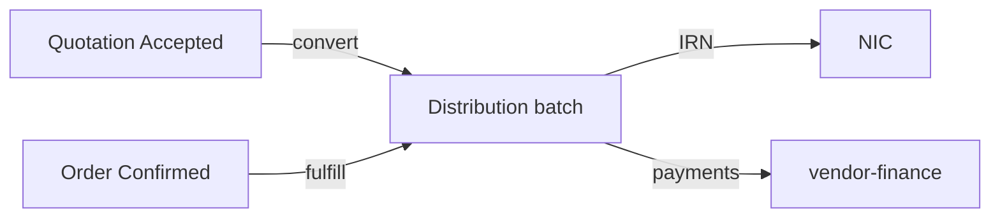

# Sales and Distribution API

The goods spine of Dhandho: **inventory barcodes → distribution to vendors and/or direct sales → money**.

## Sales (`server/routes/sales.ts`)

| Method | Path | Purpose |
|---|---|---|
| GET | `/api/sales/validate/:barcode` | Pre-check before cart commit |
| POST | `/api/sales` | Create sale; may upsert customer; warranty hooks |
| GET | `/api/sales` | List (tenant + vendor scoped) |
| GET | `/api/sales/:id/bill` | Bill payload for print/share |

**AuthZ notes:** Vendors see only their scope via `vendorScopeId` / asserts. Mutations need module `sales` = `full`.

## Distribution (`server/routes/distribution.ts`)

| Method | Path | Purpose |
|---|---|---|
| GET | `/api/distribution/summary` | Aggregates |
| GET | `/api/distribution` | Lines/list |
| GET | `/api/distribution/batches` | Batch list |
| POST | `/api/distribution/batch` | Create batch |
| POST | `/api/distribution` | Add lines |
| PUT | `/api/distribution/apply-billing` | Pricing/GST apply |
| GET | `/api/distribution/bill` | Challan/bill data |
| PUT/GET | `/api/distribution/batch/:batchId` | Edit/fetch batch |
| PUT | `/api/distribution/batch/:batchId/ewb` | Store e-way fields |
| PUT | `/api/distribution/batch/:batchId/dispatch` | Dispatch status |
| DELETE | `/api/distribution/batch/:batchId` | Delete batch |
| GET | `/api/distribution/einvoice` | E-invoice JSON helper |
| GET | `/api/distribution/ewaybill` | E-way JSON helper |

IRN/EWB **generation** (NIC call) lives under `/api/gst/*` — see [GST API](/api/gst).

## Upstream converters

| Source | Endpoint | Result |
|---|---|---|
| Quotation | `POST /api/quotations/:id/convert` | Distribution batch (locked inventory) |
| Order | `POST /api/orders/:id/fulfill` | Distribution batch |

## Business invariants

1. You cannot sell/distribute inventory you don't hold (validated under locks)  
2. Batch delete rules must not orphan payments inconsistently  
3. Vendor portal is read-mostly on distribution  

## Common mistakes

1. Updating stock in the UI only  
2. Calling apply-billing after IRN without understanding tax freeze  
3. Forgetting vendor scope on list endpoints  

## Interview question

*Why are e-invoice JSON GET helpers on distribution but IRN POST on gst-api?*

:::info Answer sketch
Read models/export shapes sit with the domain document; **credentialed NIC side effects** sit behind admin GST settings + encryption + safeError.
:::

## Related

- [Routes Catalog](/backend/routes-catalog)  
- [Business Workflows](/architecture/business-workflows)  
- [Lab: GST Math](/labs/lab-gst-math)  
