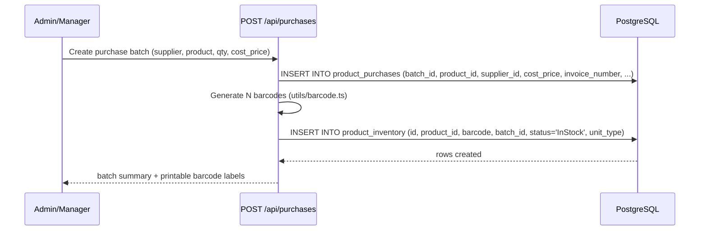
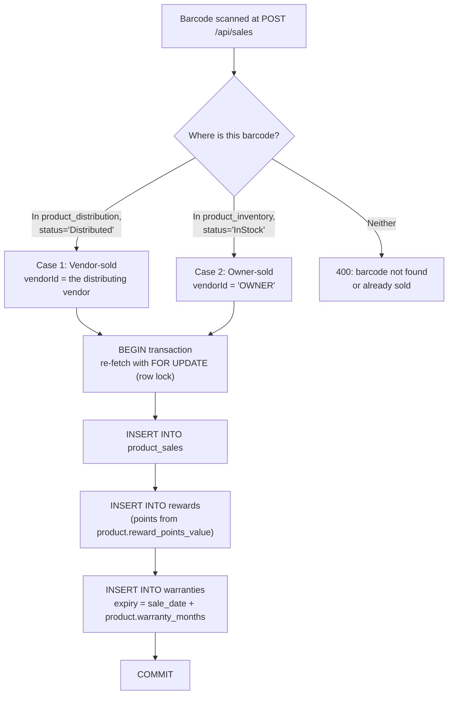
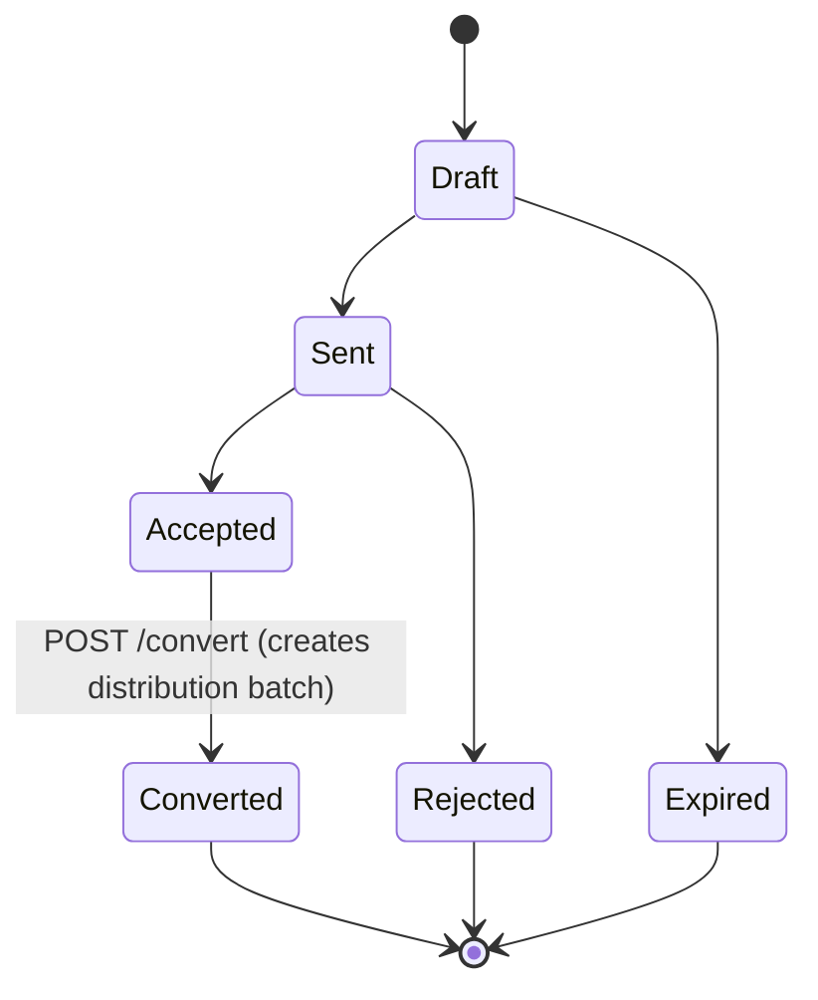
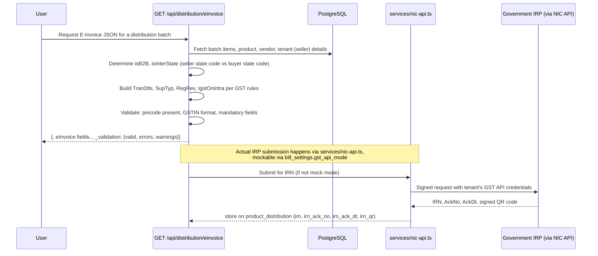
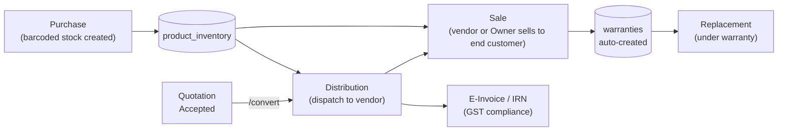

# Business Workflows

Architecture diagrams tell you the shape of the system. This page tells you what actually happens, table by table and endpoint by endpoint, for the four workflows that matter most to a physical-goods tenant (Manufacturer/Dealer/Retail). If you're going to break something in your first month, it'll be one of these — read this before you touch `sales.ts`, `distribution.ts`, `purchases.ts`, or `quotations.ts`.

:::info Ground truth
Every step below is read from the actual route handlers, not inferred. Table and column names are exact.
:::

## Workflow 1: Purchase → barcoded stock

Before anything can be sold or distributed, it has to exist as inventory with a scannable barcode. This is where physical stock enters the system.



- **`product_purchases`** records the commercial transaction: which supplier, what cost, whether GST was applied, and — critically for compliance — an `invoice_number` column used later for **GSTR-2B reconciliation** (matching the tenant's purchase register against what suppliers reported to the government).
- **`product_inventory`** is the actual stock ledger: one row per physical barcode, `status` starting at `'InStock'`, with `unit_type` distinguishing a **box** barcode from a **piece** barcode (`pack_size`/`pack_name` on `products` define the box↔piece relationship).
- Barcodes are batch-scoped (`batch_id` on both tables) so an entire purchase batch's cost, supplier, and stock can be traced or reversed together.

:::tip Analogy
Think of `product_purchases` as the **delivery receipt** and `product_inventory` as **individually tagging every box that came off the truck**. The receipt tells you what you paid and from whom; the tags are what actually gets scanned at every later step (distribution, sale, warranty, replacement).
:::

## Workflow 2: Sale → automatic warranty creation

This is the workflow with the most subtle correctness requirement in the whole codebase: a single barcode scan has to resolve *which* stock pool it's coming from, lock it against concurrent sale, and cascade three side effects atomically.



Walking the real logic in `server/routes/sales.ts`:

1. **Resolve the barcode's origin.** A barcode can be sold two ways: it was dispatched to a vendor (`product_distribution` row with `status = 'Distributed'`) — a normal vendor-tier sale — or it's still sitting in the tenant's own stock (`product_inventory` row with `status = 'InStock'`) — an "Owner" direct sale, using the synthetic vendor ID `'OWNER'` created automatically for every tenant at provisioning time (`server/utils/tenant.ts`).
2. **Re-check inside a transaction with `FOR UPDATE`.** The route does an *initial* read to validate the request cheaply, then — inside `BEGIN...COMMIT` — re-queries the same row with `FOR UPDATE`, locking it. This closes a real race condition (`#9 fix` in the code comments): without the lock, two near-simultaneous sale requests for the same barcode could both pass the initial check and both insert a sale for stock that only physically exists once.
3. **Three cascading inserts, one transaction:**
   - `product_sales` — the sale record itself (customer name/phone, price, date).
   - `rewards` — earns points equal to `products.reward_points_value`, tied to the sale ID.
   - `warranties` — computed as `activation_date + product.warranty_months`, defaulting to 12 months if unset, capped to day 28 of the target month to avoid invalid dates (e.g. Feb 30).
4. If any step fails, the whole transaction rolls back — a sale is never recorded with a missing reward or warranty row, and stock is never "half sold."

:::warning Common mistake
Adding a new side effect to the sale flow (e.g., a loyalty-tier upgrade, a notification) *after* the existing `COMMIT` instead of inside the same transaction. If that new step needs to be atomic with the sale (i.e., "never record a sale without also doing X"), it belongs inside the transaction, before `COMMIT`. If it's a best-effort, non-critical side effect (e.g., sending a WhatsApp receipt), it's correctly done *after* commit — exactly the pattern used for the reward-notification WhatsApp send elsewhere in the codebase.
:::

## Workflow 3: Quote → order → distribution conversion

Quotations are a **draft state machine** that only becomes real inventory movement at one specific, guarded transition: `POST /api/quotations/:id/convert`.



The status field itself **cannot** be set to `'Converted'` via the generic `PUT` status-update endpoint — the route explicitly rejects that:

```ts
if (status === 'Converted') {
  return res.status(400).json({
    error: 'Use POST /api/quotations/:id/convert to convert (creates distribution)',
  });
}
```

This is a deliberate guard: converting a quotation isn't a simple field update, it's a **multi-table transaction** that must not be reachable via a lighter-weight endpoint that doesn't do the actual work.

`POST /:id/convert` (guarded by `blockVendors` — a Vendor can never trigger this) then, inside one transaction:

1. Validates the quote is `status = 'Accepted'` and has a `vendor_id` (a quote with no vendor can't become a distribution, which is always vendor-scoped) — rejects with `400` otherwise, and specifically rejects re-conversion of an already-`Converted` quote.
2. For each line item in the quote's `items` JSONB array, inserts a corresponding row into **`product_distribution`** (the same table the standalone Distribution module writes to) with a freshly generated `batch_id`.
3. Updates the quotation itself: `status = 'Converted'`, `converted_batch_id = <the new batch>` — guarded with `WHERE status = 'Accepted'` in the same `UPDATE`, so a concurrent double-conversion attempt fails the row-count check (`converted.rowCount === 0` → rollback) rather than silently double-distributing stock.
4. Writes an audit log entry (`logAudit`) recording exactly what was converted.

:::tip Analogy
Converting a quotation is like a **firing pin on a mechanical device** — quotations, orders, and distributions all read/write overlapping data, but the *transition* from "just a paper quote" to "actual stock has moved" is deliberately funneled through one narrow, transactional, audit-logged path. Every other status change is reversible paperwork; conversion is the one action with real physical/inventory consequences.
:::

## Workflow 4: Distribution → E-Invoice IRN generation

For B2B distribution above the GST e-invoicing threshold, the tenant needs a government-issued **IRN** (Invoice Reference Number) before goods can legally move. `GET /api/distribution/einvoice` builds the exact JSON payload the government's IRP (Invoice Registration Portal) expects.



Key correctness details:

- **Interstate vs. intrastate detection** (`isInterState = fromStcd !== toStcd`, comparing the first two digits of seller/buyer GSTIN — the state code) determines whether IGST or CGST+SGST split applies, per the `IgstOnIntra` flag in the e-invoice schema. Getting this wrong produces a *government-rejected* or, worse, a *government-accepted-but-tax-incorrect* invoice.
- **`_validation.errors`/`.warnings`** are returned alongside the payload itself — e.g., a hardcoded fallback pincode (`360001`) triggers a warning if the tenant's actual address doesn't contain it, catching the case where a tenant never finished their address setup.
- **IRN/EWB are terminal state markers.** Once a distribution batch has an `irn` or `ewb_number` set, the batch **cannot be deleted** — `DELETE /api/distribution/batch/:id` explicitly checks for this and returns `400: 'Cannot delete batch with IRN/E-way bill. Cancel IRN first (Settings → GST), clear EWB, then delete.'` This exists because an IRN is a real government record; silently deleting the local batch would leave an orphaned, still-valid government document with no matching local data.
- **GST API mode is switchable per-tenant** (`bill_settings.gst_api_mode`, default `'mock'`) — new tenants can use every distribution/billing feature immediately with mocked IRN/EWB responses, and only need real GST API credentials (`gst_api_gstin`, `gst_api_client_id`/`_secret`, encrypted via `secret-crypto.ts`) once they're ready to go live with the government API.

:::danger Never treat GST JSON generation as "just an API response"
A bug in the e-invoice payload builder isn't a UI glitch — it's a document a tenant might submit to the Indian government under their own GSTIN. Treat changes to `distribution.ts`'s e-invoice logic, and to `gst-api.ts`/`nic-api.ts`, with the same review rigor as changes to money-moving code, because functionally, it is exactly that plus a compliance dimension.
:::

## How the four workflows connect



## Key concepts

- **Physical stock has a strict lifecycle**: purchase → barcode → (optionally distribute) → sale → warranty → (optionally replace).
- **State transitions with real consequences are funneled through narrow, transactional, guarded endpoints** — quotation conversion and IRN-bearing batch deletion are the clearest examples.
- **Row locks (`FOR UPDATE`) prevent double-selling** the same physical barcode.
- **GST compliance logic is business-critical**, not incidental — errors have real regulatory consequences for the tenant.

## Common mistakes

1. Updating a quotation's status directly to `'Converted'` instead of calling the dedicated `/convert` endpoint (the API itself blocks this, but don't try to route around it with a raw SQL update either).
2. Adding a sale-flow side effect after the transaction commits when it actually needs atomicity with the sale.
3. Deleting or modifying a distribution batch that already has an IRN/EWB without going through the documented cancel-first flow.
4. Treating "GST rate" or "interstate" logic as a simple lookup rather than checking both the product's own HSN/GST configuration and the seller/buyer state codes at the point of sale.

## Interview question

> **Q: Walk me through what happens, end to end, when a Manufacturer tenant scans a barcode at the point of sale — including what happens if two staff members scan the same barcode within the same second.**
>
> Expected answer: the request first resolves whether the barcode is currently sitting in the tenant's own `product_inventory` (Owner sale) or dispatched to a vendor via `product_distribution` (vendor sale). The route does a cheap initial validation read, then opens a transaction and **re-fetches the same row with `FOR UPDATE`**, which blocks a second concurrent request for the same barcode until the first transaction commits or rolls back. Inside that transaction it inserts the `product_sales` row, a `rewards` row (points from the product's configured value), and a `warranties` row (expiry computed from the product's `warranty_months`) — all three or none, atomically. If a second scan for the same barcode arrives while the first is still inside its transaction, it will block on the row lock and then, once the first commits, correctly see the barcode as no longer available and reject with a 400 rather than double-selling the same physical unit.

## Related

- [Multi-tenancy](./multi-tenancy.md)
- [Request Lifecycle](./request-lifecycle.md)
- [Product Domain](/overview/product-domain)
- [AI Origin Assumptions](/overview/ai-origin-assumptions)
