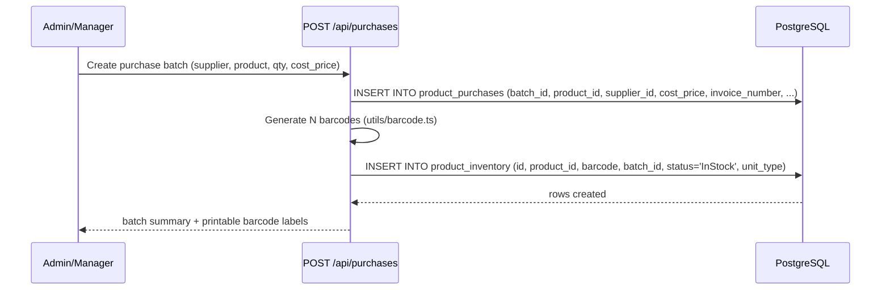
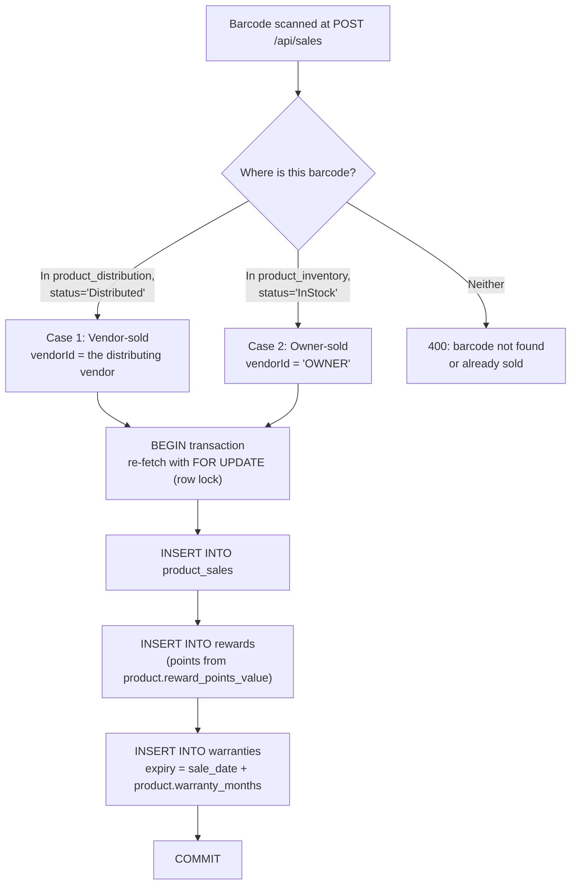
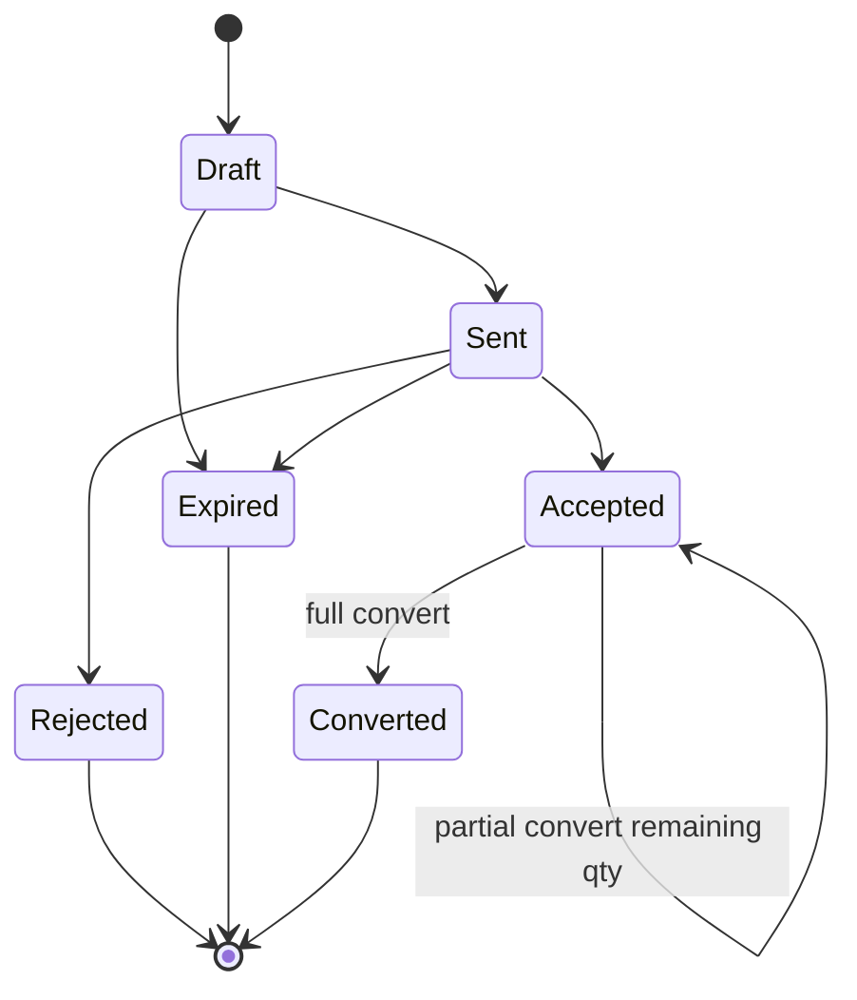
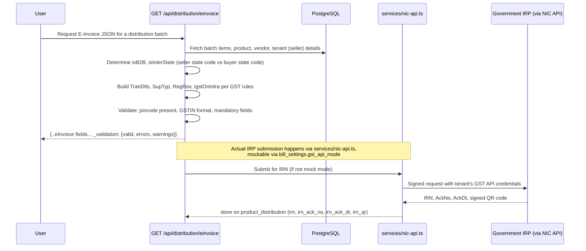
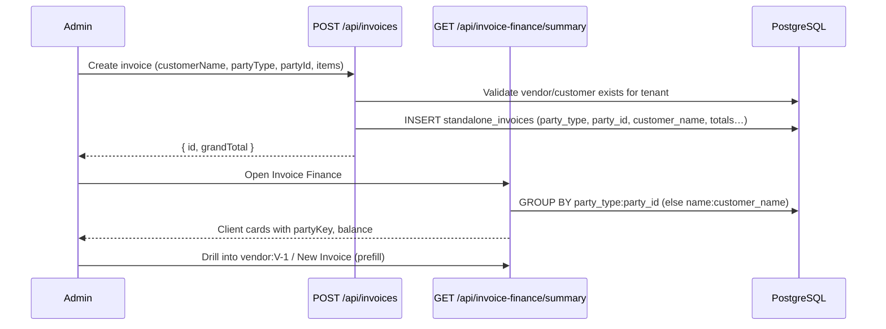
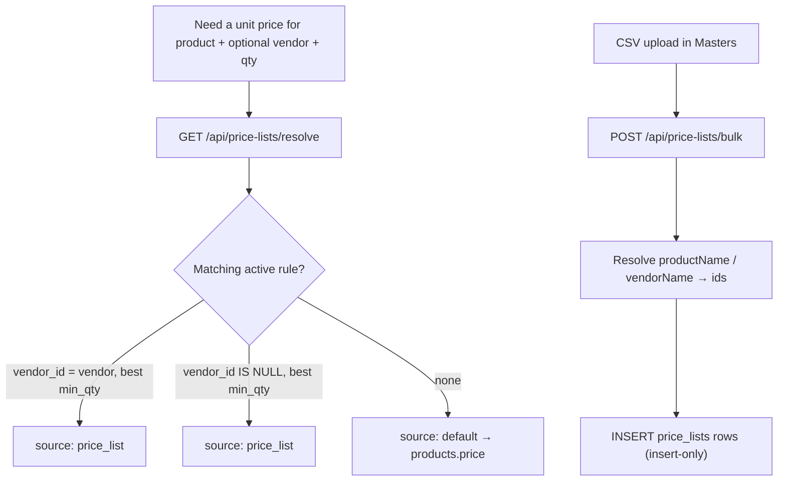
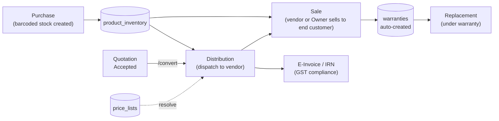

# Business Workflows

Architecture diagrams tell you the shape of the system. This page tells you what actually happens, table by table and endpoint by endpoint, for the workflows that matter most. Workflows 1–4 are the physical-goods path (Manufacturer/Dealer/Retail). Workflows 5–6 cover **standalone invoices / Invoice Finance** and **price lists** (service tenants and any type that uses those tabs).

:::info Ground truth
Every step below is read from the actual route handlers, not inferred. Table and column names are exact.
:::

## Workflow 1: Purchase → barcoded stock

Before anything can be sold or distributed, it has to exist as inventory with a scannable barcode. This is where physical stock enters the system.

- **`product_purchases`** records the commercial transaction: which supplier, what cost, whether GST was applied, and — critically for compliance — an `invoice_number` column used later for **GSTR-2B reconciliation** (matching the tenant's purchase register against what suppliers reported to the government).
- **`product_inventory`** is the actual stock ledger: one row per physical barcode, `status` starting at `'InStock'`, with `unit_type` distinguishing a **box** barcode from a **piece** barcode (`pack_size`/`pack_name` on `products` define the box↔piece relationship).
- Barcodes are batch-scoped (`batch_id` on both tables) so an entire purchase batch's cost, supplier, and stock can be traced or reversed together.

:::tip Analogy
Think of `product_purchases` as the **delivery receipt** and `product_inventory` as **individually tagging every box that came off the truck**. The receipt tells you what you paid and from whom; the tags are what actually gets scanned at every later step (distribution, sale, warranty, replacement).
:::

## Workflow 2: Sale → automatic warranty creation

This is the workflow with the most subtle correctness requirement in the whole codebase: a single barcode scan has to resolve *which* stock pool it's coming from, lock it against concurrent sale, and cascade three side effects atomically.

Walking the real logic in `server/routes/sales.ts`:

1. **Resolve the barcode's origin.** A barcode can be sold two ways: it was dispatched to a vendor (`product_distribution` row with `status = 'Distributed'`) — a normal vendor-tier sale — or it's still sitting in the tenant's own stock (`product_inventory` row with `status = 'InStock'`) — an "Owner" direct sale, using the synthetic vendor ID `'OWNER'` created automatically for every tenant at provisioning time (`server/utils/tenant.ts`).
2. **Re-check inside a transaction with `FOR UPDATE`.** The route does an *initial* read to validate the request cheaply, then — inside `BEGIN...COMMIT` — re-queries the same row with `FOR UPDATE`, locking it. This closes a real race condition (`#9 fix` in the code comments): without the lock, two near-simultaneous sale requests for the same barcode could both pass the initial check and both insert a sale for stock that only physically exists once.
3. **Three cascading inserts, one transaction:**
   - `product_sales` — the sale record itself (customer name/phone, price, date).
   - `rewards` — earns points equal to `products.reward_points_value`, tied to the sale ID.
   - `warranties` — computed as `activation_date + product.warranty_months`, defaulting to 12 months if unset, capped to day 28 of the target month to avoid invalid dates (e.g. Feb 30).
4. If any step fails, the whole transaction rolls back — a sale is never recorded with a missing reward or warranty row, and stock is never "half sold."

:::warning Common mistake
Adding a new side effect to the sale flow (e.g., a loyalty-tier upgrade, a notification) *after* the existing `COMMIT` instead of inside the same transaction. If that new step needs to be atomic with the sale (i.e., "never record a sale without also doing X"), it belongs inside the transaction, before `COMMIT`. If it's a best-effort, non-critical side effect (e.g., sending a WhatsApp receipt), it's correctly done *after* commit — exactly the pattern used for the reward-notification WhatsApp send elsewhere in the codebase.
:::

## Workflow 3: Quote → convert (distribution or invoice)

Quotations are a **draft state machine**. Real fulfillment happens only at `POST /api/quotations/:id/convert`.

- **`PUT /api/quotations/:id`** — edit header + lines while status is `Draft` only (reuses create resolve + GST math).
- **Auto-expire** — on list/detail/status/convert, `Draft`/`Sent` with `valid_until < today` become `Expired`.
- **Status `Converted`** is never set via the status PUT — only via `/convert`.
- **Partial convert** — optional body `{ items: [{ productId, quantity }] }`. Each line tracks `convertedQty` in JSONB; status stays `Accepted` until remaining qty is 0, then `Converted`.
- **Convert target by `tenants.business_type`:**
  - **service** → creates `standalone_invoices` (frozen prices), sets `converted_invoice_id`
  - **goods** → creates `product_distribution` batch (needs `vendor_id`), sets `converted_batch_id`
- Convert freezes quote `items[].price` (no re-resolve). GST uses `unitPricesAfterDiscount` / `price_includes_gst`.

:::tip Analogy
Converting a quotation is like a **firing pin** — the transition from paperwork to stock movement or a billed invoice is deliberately funneled through one narrow, transactional, audit-logged path.
:::

## Workflow 4: Distribution → E-Invoice IRN generation

For B2B distribution above the GST e-invoicing threshold, the tenant needs a government-issued **IRN** (Invoice Reference Number) before goods can legally move. `GET /api/distribution/einvoice` builds the exact JSON payload the government's IRP (Invoice Registration Portal) expects.

Key correctness details:

- **Interstate vs. intrastate detection** (`isInterState = fromStcd !== toStcd`, comparing the first two digits of seller/buyer GSTIN — the state code) determines whether IGST or CGST+SGST split applies, per the `IgstOnIntra` flag in the e-invoice schema. Getting this wrong produces a *government-rejected* or, worse, a *government-accepted-but-tax-incorrect* invoice.
- **`_validation.errors`/`.warnings`** are returned alongside the payload itself — e.g., a hardcoded fallback pincode (`360001`) triggers a warning if the tenant's actual address doesn't contain it, catching the case where a tenant never finished their address setup.
- **IRN/EWB are terminal state markers.** Once a distribution batch has an `irn` or `ewb_number` set, the batch **cannot be deleted** — `DELETE /api/distribution/batch/:id` explicitly checks for this and returns `400: 'Cannot delete batch with IRN/E-way bill. Cancel IRN first (Settings → GST), clear EWB, then delete.'` This exists because an IRN is a real government record; silently deleting the local batch would leave an orphaned, still-valid government document with no matching local data.
- **GST API mode is switchable per-tenant** (`bill_settings.gst_api_mode`, default `'mock'`) — new tenants can use every distribution/billing feature immediately with mocked IRN/EWB responses, and only need real GST API credentials (`gst_api_gstin`, `gst_api_client_id`/`_secret`, encrypted via `secret-crypto.ts`) once they're ready to go live with the government API.

:::danger Never treat GST JSON generation as "just an API response"
A bug in the e-invoice payload builder isn't a UI glitch — it's a document a tenant might submit to the Indian government under their own GSTIN. Treat changes to `distribution.ts`'s e-invoice logic, and to `gst-api.ts`/`nic-api.ts`, with the same review rigor as changes to money-moving code, because functionally, it is exactly that plus a compliance dimension.
:::

## Workflow 5: Service invoice → party-linked ledger

Service (and other) tenants bill via `standalone_invoices` instead of barcode sales. The critical correctness rule: **group collections by a stable party id, not by the typed display name**.

- **Create** (`invoices.ts`): optional `partyType` + `partyId` validated; status only `draft` or `sent` on create. Lines support `discountPercent` and optional `productId` (server `resolvePrice` when rate omitted). Tax split: `tax_cgst`/`tax_sgst`/`tax_igst` + `is_interstate` via seller vs buyer GSTIN state codes (`server/utils/gst-place.ts`).
- **Summary** (`invoice-finance.ts`): `partyKey` = `vendor:ID` \| `customer:ID` \| `name:…`. Renaming `customer_name` on a later invoice **does not** split the card when `party_id` matches.
- **Payments** still attach to individual invoice ids; deleting an invoice with payments is blocked by `ON DELETE RESTRICT`.
- **UI (service):** `InvoiceFinanceView` mirrors Distribution’s vendor cards; **New Invoice** reuses `CreateInvoiceModal` with party prefills.
- **Credit/debit notes** (`accounts.ts`): free-text `reference_invoice` plus optional `reference_type` (`invoice`|`distribution`|`quotation`) + `reference_id` (link only — no stock reverse).

:::tip Quotations vs price lists
Quotations are one-off commercial documents. On create, line defaults use the same resolve chain as distribution (vendor slab → generic → inventory); the user may negotiate. Convert freezes the quote line price onto distribution — it does not re-resolve live price lists.
:::

## Workflow 6: Price list resolve & bulk import

- **Shared helper:** `server/utils/price-resolve.ts` — `resolvePrice`, `hasExplicitUnitPrice`, `unitPricesAfterDiscount`. Used by `/api/price-lists/resolve`, distribution createBatch, quotation create/convert, and invoice create when `productId` is set. Keep call sites on this helper; do not re-copy the SQL.
- **Resolve priority** (SQL `ORDER BY` vendor match first, then `min_qty DESC`): vendor slab → general slab → product default price. Active date window: `valid_from`/`valid_to` (null = open-ended).
- **Bulk** accepts up to 500 rules; **upserts** on `(tenant, product, vendor null-safe, min_qty)` — re-import updates price/max/dates instead of duplicating.
- **UI tabs:** Price List Masters view splits **Generic** vs **Vendor/Client-specific** rules; create/export/print are scoped to the active tab.

## Workflow 7: Quiet notification center

The header Bell loads `GET /api/notifications` — a **merged feed**, not a toast flood:

1. **Super Admin / control panel pushes** from `tenant_notifications` (written by `POST /api/super-admin/tenants/:id/notify` or broadcast). Optional body `userId` targets one user (`tenant_notifications.user_id`); omit/`NULL` = whole tenant. Service Cloud seats panel uses targeted notify. Shown individually at the top; feed + read/read-all only include rows where `user_id IS NULL OR user_id = current user`.
2. **Computed digests** (one card per category): price lists expiring (7d), quotes expiring (3d), low stock, warranties (14d), overdue collections/invoices, subscription/trial ≤15d.

**Who sees what**

- **Vendor role**: SA/control-panel messages only (tenant-wide + their targeted rows) — never tenant-wide digests (even if the user has no linked `vendorId`). The notifications router is mounted *before* reports/accounts so those routers’ global `blockVendors` middleware cannot block the Bell feed.
- **Other roles**: digests are filtered by module permission (`getAccessLevel` ≠ `hidden`). Example: Warehouse may see inventory digests but not finance overdue. Targeted SA messages for another user never appear.
- **Service overdue**: only `standalone_invoices` with `status = 'sent'` past due with unpaid balance — drafts never count.
- **Manufacturer overdue**: count of vendors with positive balance whose *oldest* dispatch is &gt; 30 days (not a lifetime payment vs old billed mismatch).
- **On-prem desktop**: SA messages are queued in cloud `onprem_notifications` (30-day expiry; `POST /api/super-admin/onprem/:id/notify`, and broadcast). Heartbeat returns `pendingNotifications` only when license+machine match. Electron applies them into local `tenant_notifications` via localhost + `DEPLOYMENT_MODE=onprem` `POST /api/onprem/apply-notifications`, then acks with `POST /api/onprem/mark-notifications-delivered` (**requires `machineId` when the license is bound**). Hard sync / Sync Now pulls the same payload. Digests still compute locally — only SA pushes need this bridge.

Anti-noise: digests capped (≤6); client dismisses digests in `localStorage`; soft chime only when a *new* high-priority unread id appears and sound is unmuted. Poll every 5 minutes while focused.

## Workflow 8: Multi-page bill PDF / print

All bill HTML (sales invoice, distribution challan, quotation, price list, standalone invoice, payment history, accounts reports) goes through `printBillInWindow` / `writePrintHtml` / `downloadHtmlAsPdf` / `saveBillAsPdf` in `src/lib/utils.ts`, which injects `withPrintPagination()` CSS:

- `@page` A4 + table `thead` repeats on each page
- Row / `.avoid-break` / `.print-end` keep line items and totals/bank/signature from splitting awkwardly
- Templates in `src/lib/billTemplates.ts` wrap footers in `.print-end` and use a slim repeating banner in `thead` where needed
- Standalone invoices use `generateStandaloneInvoiceHtml` — **bordered `.outer` sections** (title, seller/meta, Bill To, items with fill space, Sub Total/Received/Balance, HSN-wise GST table at end, bank + signatory), matching classic Tax Invoice layout
- After create (including from Client/Vendor hub), modal shows **Print** before Done (system print / Save as PDF — **not** html2pdf Download, which collapses Tax Invoice borders). Client detail + Invoice Finance rows use the same Print action (`printStandaloneInvoice` / `GET /api/invoices/:id`)
- Offline Mobile / Cap: Print uses system print / overlay (Save as PDF) with full Tax Invoice HTML. WhatsApp share tries **light jsPDF** (no html2pdf/html2canvas) with a ~7s timeout → Dhandho/invoices + Cache FileProvider **file-only** Share; on timeout/fail falls back to text summary. Steps are logged to `clientLogger` + sessionStorage breadcrumbs for bug reports. Web still shares/downloads a PDF via html2pdf.

Do not open a raw `window.print()` on bill HTML without that inject — long item lists will paginate incorrectly.

## How the goods workflows connect

Service path (parallel, no barcodes): `vendors/customers` → `standalone_invoices` (+ optional price list on lines) → `invoice_payments`, summarized by `partyKey`.

## Key concepts

- **Physical stock has a strict lifecycle**: purchase → barcode → (optionally distribute) → sale → warranty → (optionally replace).
- **State transitions with real consequences are funneled through narrow, transactional, guarded endpoints** — quotation conversion and IRN-bearing batch deletion are the clearest examples.
- **Row locks (`FOR UPDATE`) prevent double-selling** the same physical barcode.
- **GST compliance logic is business-critical**, not incidental — errors have real regulatory consequences for the tenant.
- **Service ledgers key on party id** — never rely on display name alone for Invoice Finance grouping.

## Common mistakes

1. Updating a quotation's status directly to `'Converted'` instead of calling the dedicated `/convert` endpoint (the API itself blocks this, but don't try to route around it with a raw SQL update either).
2. Adding a sale-flow side effect after the transaction commits when it actually needs atomicity with the sale.
3. Deleting or modifying a distribution batch that already has an IRN/EWB without going through the documented cancel-first flow.
4. Treating "GST rate" or "interstate" logic as a simple lookup rather than checking both the product's own HSN/GST configuration and the seller/buyer state codes at the point of sale.
5. Creating standalone invoices without `partyType`/`partyId` when a master record exists — Finance will fall back to `name:` grouping and rename-splits return.
6. Changing price-list resolve priority only in the invoice modal (or only in SQL) — keep `GET /api/price-lists/resolve`, `server/utils/price-resolve.ts`, and any client mirror in sync.
7. Ignoring date windows on price rules — resolve filters `valid_from`/`valid_to` against `CURRENT_DATE`.
8. Re-resolving price lists on quotation convert — convert must freeze `items[].price` from the accepted quote.
9. Printing bill HTML without `withPrintPagination` / `printBillInWindow` — multi-page item tables will break poorly.
10. Showing Convert on Draft quotations — API requires `Accepted`; UI must match.
11. Assuming credit-note `reference_id` reverses inventory — it is an audit link only.

## Interview question

> **Q: Walk me through what happens, end to end, when a Manufacturer tenant scans a barcode at the point of sale — including what happens if two staff members scan the same barcode within the same second.**
>
> Expected answer: the request first resolves whether the barcode is currently sitting in the tenant's own `product_inventory` (Owner sale) or dispatched to a vendor via `product_distribution` (vendor sale). The route does a cheap initial validation read, then opens a transaction and **re-fetches the same row with `FOR UPDATE`**, which blocks a second concurrent request for the same barcode until the first transaction commits or rolls back. Inside that transaction it inserts the `product_sales` row, a `rewards` row (points from the product's configured value), and a `warranties` row (expiry computed from the product's `warranty_months`) — all three or none, atomically. If a second scan for the same barcode arrives while the first is still inside its transaction, it will block on the row lock and then, once the first commits, correctly see the barcode as no longer available and reject with a 400 rather than double-selling the same physical unit.

## Related

- [Multi-tenancy](./multi-tenancy.md)
- [Request Lifecycle](./request-lifecycle.md)
- [Product Domain](/overview/product-domain)
- [AI Origin Assumptions](/overview/ai-origin-assumptions)
