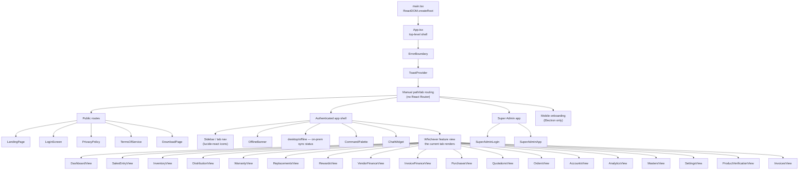
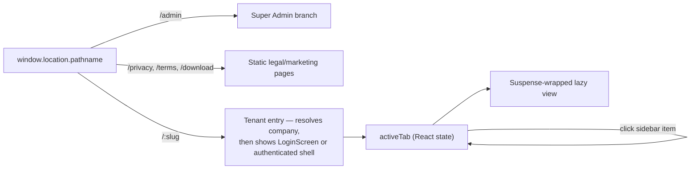
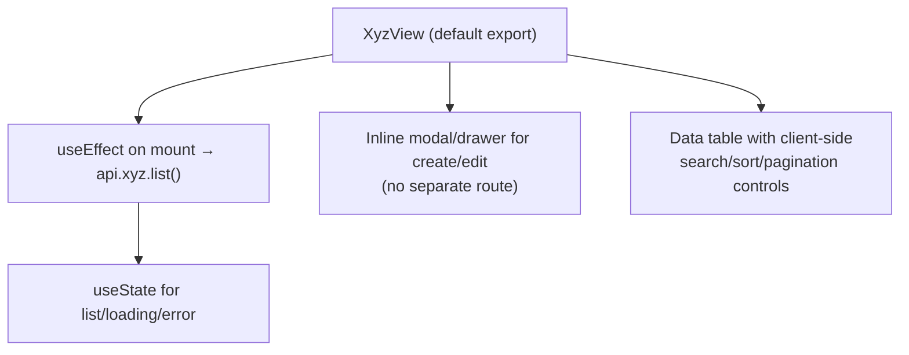

# Component Tree

Where does rendering actually start, and how does a click in the sidebar end up mounting `DistributionView`? This page walks the real component tree, grounded in `src/main.tsx` and `src/App.tsx`.

## The tree, top to bottom



## Everything below `App.tsx` is lazy-loaded

Every feature view and every "page" component (`LandingPage`, `LoginScreen`, `DownloadPage`, `PrivacyPolicy`, `TermsOfService`, `ChatWidget`, all 18 feature views, both Super Admin screens) is wrapped in `React.lazy()`:

```tsx
const InventoryView = lazy(() =>
  import('./features/inventory/InventoryView').then(m => ({ default: m.InventoryView })),
);
```

`App.tsx` wraps the active view in a single `<Suspense fallback={<LoadingSpinner/>}>` boundary. This means:

- **Only the code for the tab you're currently viewing is downloaded** — a Manufacturer tenant's browser never fetches `PayrollView`'s JS until (if ever) they click into Payroll.
- **`vite.config.ts`'s `manualChunks`** groups heavy shared dependencies (React itself, `motion`, the barcode/scanner libs, `xlsx`) into their own vendor chunks *in addition to* this per-feature code splitting — see [Performance → Bundle](/performance/bundle).

:::tip Analogy
Think of `App.tsx` as an **airport gate display**, not a hallway you walk down. It shows you which gate (feature view) is currently boarding, and only loads that gate's jet bridge (JS bundle) when you're actually sent there — it doesn't pre-build every jet bridge in the airport on your first step through security.
:::

## Where "routing" actually happens without React Router

`App.tsx` inspects `window.location.pathname` directly for a small set of top-level destinations (`/admin` → Super Admin, `/privacy`, `/terms`, `/download`, `/:slug` → tenant entry) and otherwise manages an in-memory `activeTab` state for the authenticated app shell — clicking a sidebar item sets `activeTab`, which the `<Suspense>`-wrapped switch renders. See [Design Decisions](./design-decisions.md) for why this was chosen over React Router.



## Shared UI kit (`src/components/ui/`)

| Component | Role |
|---|---|
| `ToastProvider` | App-wide toast notifications, consumed via a hook from any feature |
| `LoadingSpinner` | The universal `Suspense` fallback and inline loading indicator |
| `ErrorBoundary` | Catches render-time exceptions in the tree below it — see [Error Flow](./error-flow.md) |
| `CommandPalette` | Keyboard-driven quick navigation/search across the app |

`src/components/layout/` holds full-page compositions that aren't "features" in the business-module sense: `LandingPage`, `LoginScreen`, `DownloadPage`, `PrivacyPolicy`, `TermsOfService`, `ChatWidget`, `AppShutterIntro` (the branded loading/splash transition).

## How a feature view is internally structured

There's no single mandated internal structure for a `FeatureView` component, but the dominant pattern (seen across `DistributionView`, `InventoryView`, etc.) is:



There is **no global state library** — each view fetches its own data on mount via `api.ts`. If two open tabs need the same data, they each fetch it independently; there's no shared cache invalidation system beyond the mobile offline layer's `cacheInvalidateForApiPath`. See [Design Decisions](./design-decisions.md) for why.

## Platform-aware composition at the root

Two `platforms/` components are mounted at the very top of the tree, wrapping everything else, precisely because connectivity/environment awareness needs to be global rather than per-feature:

- **`OfflineBanner`** (`platforms/desktop/offline`) — shown when the Electron app detects no connectivity.
- **`OnlineStatus`** (`platforms/desktop/offline`) — shown on the on-prem Electron build, reflecting license/heartbeat sync state.

Both are no-ops (render `null`) on surfaces where they don't apply (e.g., `OnlineStatus` has nothing to show on a plain web browser tab) — the same component tree renders correctly on every surface without `if (surface === ...)` branches scattered through feature code.

## Key concepts

- **Two-level splitting**: per-feature lazy `import()` plus vendor-level `manualChunks` in `vite.config.ts`.
- **No route tree** — `App.tsx` does a small amount of `pathname` inspection plus in-memory tab state.
- **No global state library** — each view is responsible for its own data fetching.
- **Platform-awareness lives at the root**, as thin, surface-conditional wrapper components, not scattered conditionals.

## Common mistakes

1. Importing a feature view eagerly (top-level `import`) instead of via `React.lazy()` — silently grows the initial bundle for every tenant regardless of which tabs they use.
2. Reaching for a new context provider or global store to share state across two feature views, when the established pattern is independent per-view fetching.
3. Adding a `isMobileClient()` check inside a feature view's JSX instead of composing a platform-aware wrapper component at a higher level.

## Interview question

> **Q: A new "Reports" tab you're adding needs data that `AnalyticsView` also fetches. Do you share the fetch between them?**
>
> Expected answer: given the established pattern (no global state library, independent per-view fetching), the default answer is *no* — each view calls the relevant `api.ts` method independently on mount. This keeps views decoupled and avoids introducing a shared-cache-invalidation problem that doesn't otherwise exist in this codebase. If the duplicate fetch is provably expensive and frequent, that's a legitimate case to *propose* a lightweight shared cache (analogous to the mobile offline GET cache), but it should be raised as a deliberate, scoped change — not organically grown via ad-hoc prop drilling or a new context provider.

## Related

- [Dependency Graph](./dependency-graph.md)
- [Folder Structure](/overview/folder-structure)
- [Design Decisions](./design-decisions.md)
- [Error Flow](./error-flow.md)
