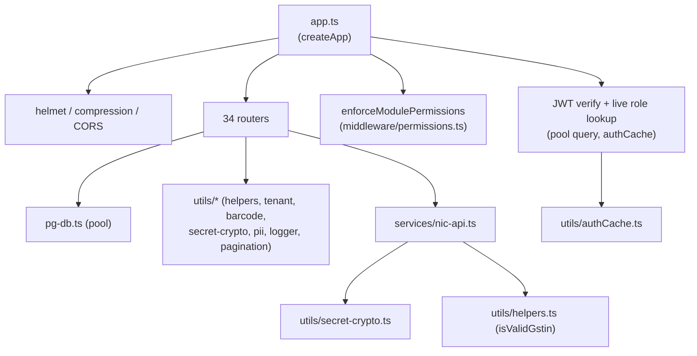
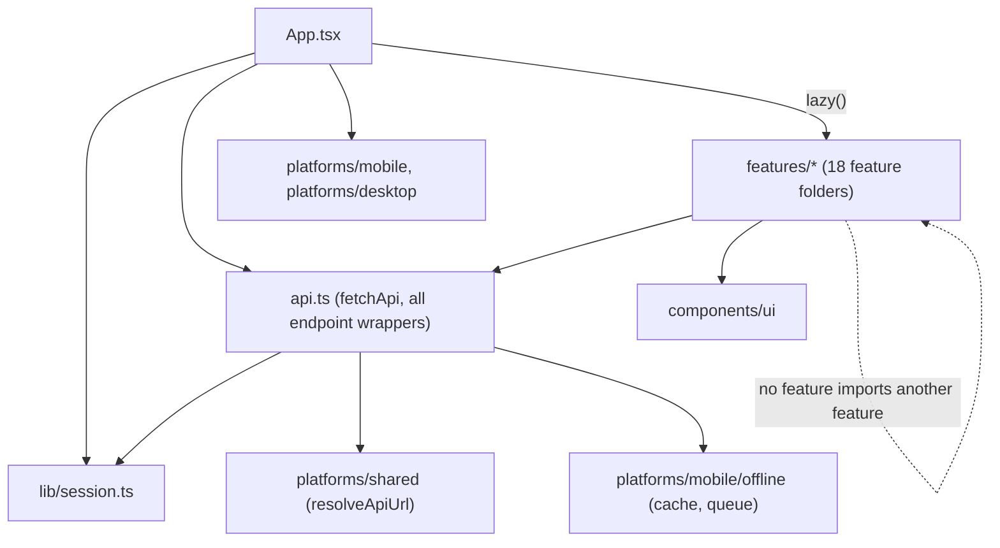
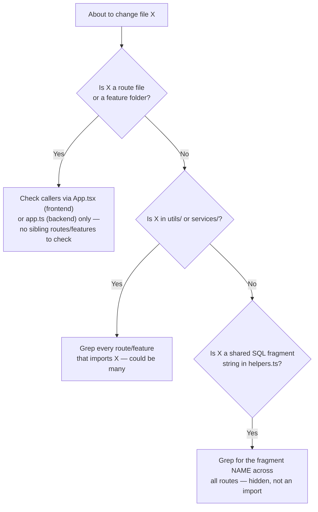

# Module Dependency Graph

The single most useful question when you're about to change a file is: **who imports this, and what do they assume about it?** This page answers that at the module level for both halves of the codebase.

## Backend: `server/app.ts` is the hub, `server/routes/*` are the spokes

No route file imports another route file. This is a deliberate, load-bearing constraint: `server/routes/*` are **siblings**, not a dependency tree among themselves. Every route that needs shared logic pulls it from `utils/*` or `services/*` — never from another route module. This is what keeps 34 files independently reasonable: you can open `sales.ts` and understand its full dependency surface without also having `distribution.ts`, `finance.ts`, and `reports.ts` open in your head.

| Layer | Depends on | Depended on by |
|---|---|---|
| `pg-db.ts` | `pg`, `bcrypt`, `dotenv` only | Everything (the pool is a true foundation) |
| `middleware/auth.ts` | `pg-db.ts` (pool) | `app.ts`, individual routes needing `authMiddleware`/`requireRole` |
| `middleware/permissions.ts` | `middleware/auth.ts` (types only) | `app.ts` |
| `utils/authCache.ts` | Nothing (pure in-memory cache) | `app.ts`'s JWT middleware |
| `utils/tenant.ts` | `pg-db.ts`, `bcrypt` | `routes/super-admin.ts` |
| `services/nic-api.ts` | `utils/secret-crypto.ts`, `utils/helpers.ts` | `routes/distribution.ts`, `routes/gst-api.ts` |
| `routes/*.ts` (34 files) | `pg-db.ts`, `middleware/*`, `utils/*`, `services/*` | `app.ts` only |

:::warning The one exception worth knowing: shared SQL fragments
`utils/helpers.ts` exports SQL fragment **strings** (`DISTRIBUTION_BILL_UNIT_SQL`, `PURCHASE_TAX_SQL`, etc.) that get interpolated directly into query text across `distribution.ts`, `purchases.ts`, `reports.ts`, and `accounts.ts`. This isn't a route-to-route dependency, but it *is* a hidden coupling: changing the shape of one of these fragments changes GST math in every route that imports it, silently, all at once. Grep for the fragment name before touching it — see [Utils Catalog](/backend/utils-catalog).
:::

## Frontend: `App.tsx` is the hub, `features/*` are lazy-loaded spokes

Just like the backend's routes, **`src/features/*` folders do not import each other.** Every feature view (`SalesEntryView`, `DistributionView`, `InventoryView`, ...) is `lazy()`-loaded independently from `App.tsx` (see the top of `src/App.tsx` — every feature is a `const XView = lazy(() => import(...))`), and each one talks to the backend exclusively through `api.ts`. This is what makes the [bundle-splitting strategy](/performance/bundle) work: a user who never opens Payroll never downloads the Payroll chunk, and that's only possible because Payroll's code has no static import edge from anywhere except `App.tsx`'s lazy route table.

| Layer | Depends on | Depended on by |
|---|---|---|
| `lib/session.ts` | `localStorage` only | `api.ts`, every feature that reads the current user |
| `api.ts` | `lib/session.ts`, `platforms/shared`, `platforms/mobile/offline` | Every `features/*` folder |
| `platforms/mobile/offline/*` | `localStorage`, `@capacitor/network` | `api.ts` only |
| `platforms/desktop/*` | Electron IPC (`window.electronAPI`, if present) | `App.tsx`, a handful of settings screens |
| `components/ui/*` | React, `motion`, `lucide-react` | Every feature |
| `features/*` (18 folders) | `api.ts`, `components/ui`, `lib/*` | `App.tsx` only |

## Cross-cutting dependency: shared types have no shared file

Unlike a full-stack framework with generated types, DG-ERP's frontend and backend types are **hand-written independently** on each side — `src/api.ts` defines its own `DistributionRecord`/`SaleRecord`/etc. interfaces, and `server/routes/*.ts` map raw Postgres rows to camelCase objects inline (`mapProduct()` in `utils/helpers.ts` is the one shared mapper that got extracted). There is no `shared/types.ts` imported by both `tsconfig.json` and `tsconfig.electron.json` builds.

:::danger This is the single biggest silent-drift risk in the codebase
If a backend route changes a response field's name or shape, nothing on the frontend fails to compile — TypeScript has no visibility across the network boundary. The only signals are a runtime `undefined` in the UI, or (if you're lucky) a test that specifically asserts the field. See [Design Decisions](/architecture/design-decisions) for why a shared-types package hasn't been introduced yet, and [Tech Debt Register](/scaling/tech-debt-register) for it as a tracked item.
:::

## How to use this page when making a change

## Related

- [System Overview](./system-overview.md)
- [Component Tree](/architecture/component-tree)
- [Backend → Utils Catalog](/backend/utils-catalog)
- [Frontend → Features Catalog](/frontend/features-catalog)
- [Tech Debt Register](/scaling/tech-debt-register)
