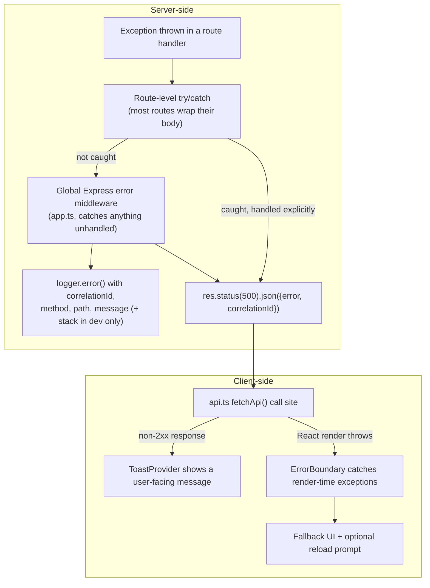
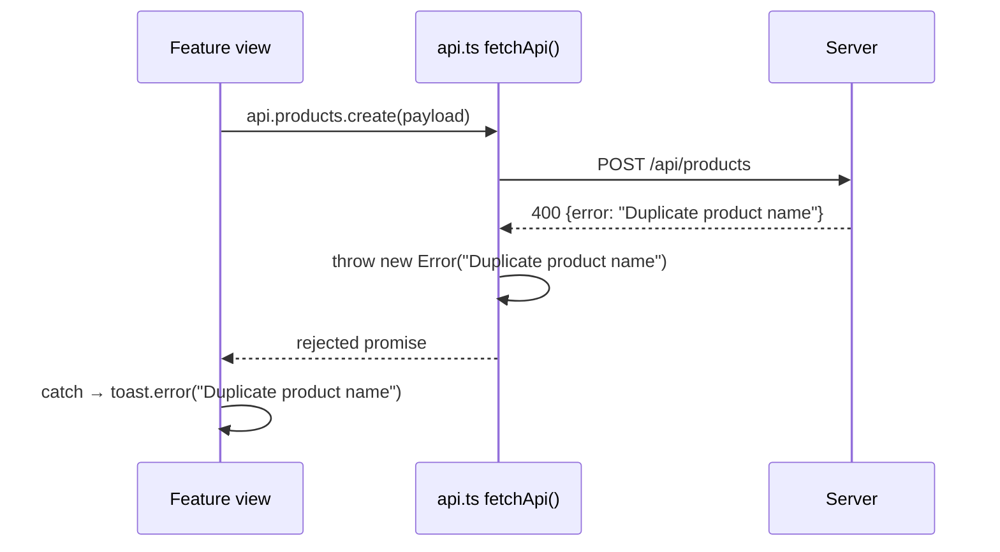

# Error Flow

Errors are where security and UX collide the hardest: say too little and support can't help anyone; say too much and you've handed an attacker a stack trace. This page traces exactly what happens when something goes wrong, at every layer, grounded in the real `app.ts` error handling and `ErrorBoundary` component.

## The full picture



## Server-side: two independent safety nets

### 1. Route-level `try/catch` (the common case)

Nearly every route handler in `server/routes/` wraps its body in a `try { ... } catch (err) { ... }` block that logs a short message and returns a specific, safe error response:

```ts
} catch (err) {
  console.error(`💥 ${req.method} ${req.originalUrl} failed:`, (err as Error).message);
  res.status(500).json({ error: 'Internal server error' });
}
```

This lets a handler return a more specific, still-safe error where it makes sense (`400` for "barcode not found or already sold," `403` for "Access denied for this vendor") while still falling back to a generic `500` for anything truly unexpected — never a raw error message or stack trace.

### 2. The global error-handling middleware (the safety net for the safety net)

Registered last in `app.ts`, this catches anything that somehow escapes every route-level `try/catch` (a thrown error in a middleware, a truly unhandled rejection reaching Express's error path):

```ts
app.use((err: Error, req, res, _next) => {
  const correlationId = req.correlationId || res.getHeader('X-Correlation-ID');
  logger.error('Unhandled error', {
    correlationId, method: req.method, path: req.path,
    error: err.message,
    stack: isProduction ? undefined : err.stack,
  });
  res.status(500).json({ error: 'Internal server error', correlationId });
});
```

Notice: **the stack trace is only logged server-side, and only in non-production.** The client — regardless of environment — only ever receives `{ error: 'Internal server error', correlationId }`.

### 3. The correlation ID trick: even `res.json()` itself is guarded

The very first middleware in `app.ts` wraps `res.json` so that **any** response with status ≥ 500, from *any* code path, is automatically rewritten to strip detail before it leaves the server:

```ts
const origJson = res.json.bind(res);
res.json = ((body: unknown) => {
  if (res.statusCode >= 500) {
    logger.error('API 500 response', { correlationId, method: req.method, path: req.path });
    return origJson({ error: 'Internal server error', correlationId });
  }
  return origJson(body);
}) as typeof res.json;
```

This is a **defense-in-depth** measure: even if a future route handler accidentally does `res.status(500).json({ error: err.message, stack: err.stack })`, this wrapper intercepts it before it reaches the network and replaces the body with the safe, generic version — logging the original attempt server-side. This is the kind of belt-and-suspenders pattern typical of an audited codebase; see [AI Origin Assumptions](/overview/ai-origin-assumptions).

:::danger Never bypass this by constructing your own response
If you find yourself writing `res.send(rawErrorString)` or manually setting `res.statusCode = 500` and writing to the stream directly (bypassing `res.json`), you've defeated this protection. Always route errors through `res.status(...).json({ error: ... })`.
:::

## Client-side: `fetchApi` and toasts

`src/api.ts`'s central `fetchApi<T>()` helper is where every API call surfaces a non-2xx response. The typical pattern propagates a thrown `Error` (carrying the server's safe `error` message and, where present, the `correlationId`) up to the calling feature view, which is expected to catch it and surface a `ToastProvider` notification — never a raw `alert()` or a silently swallowed failure.



## Client-side: `ErrorBoundary` for render-time exceptions

Network errors are one category; a **React render throwing** (a `TypeError` from unexpected data shape, a bug in a component) is a different one, and `fetchApi` rejections can't catch those — that's what `src/components/ui/ErrorBoundary.tsx` is for. It wraps the app shell and shows a fallback UI (rather than a blank white screen) if any descendant component throws during render.

:::tip Analogy
Toasts and `ErrorBoundary` are like a **car's dashboard warning light vs. the airbag**. A toast (dashboard light) tells you something went wrong with a specific action ("payment declined") while the app keeps running normally. `ErrorBoundary` (the airbag) only deploys when something has gone wrong badly enough that continuing to render the current tree isn't safe — it isolates the blast radius to a fallback screen instead of a fully broken, blank page.
:::

## What never gets exposed to the browser

| Never sent to client | Where it's stopped |
|---|---|
| Raw error `message` from an unexpected exception | Global error middleware + `res.json` wrapper replace it with `'Internal server error'` |
| Stack traces | `isProduction ? undefined : err.stack` — only ever logged, and even then only in non-production |
| SQL error detail (constraint names, query text) | Route-level `catch` blocks return a generic or intentionally-crafted user-safe message, never `err.message` from a `pg` error directly |
| Correlation ID → internal detail mapping | Only resolvable server-side, by searching logs for the `correlationId` |

:::warning Common mistake
Passing a raw caught error's `.message` straight into a client-facing JSON response (`res.status(500).json({ error: (err as Error).message })`) instead of a fixed string. Postgres error messages can include column/constraint names or even fragments of query structure — information that shouldn't reach an unauthenticated or lower-privileged client. Always ask "would I be comfortable pasting this exact string into a support Slack channel visible to the customer?" before sending an error message to a browser.
:::

## Debugging a real 500 in production

1. Get the `X-Correlation-ID` from the failed response (or the `correlationId` field in the JSON body).
2. Search structured logs (Logtail in production, via `server/utils/logger.ts`) for that exact ID.
3. The matching log entry has `method`, `path`, and the real `error.message` — enough to reproduce locally without ever needing the stack trace to have reached the browser.

## Key concepts

- **Two server-side nets**: route-level `try/catch` for expected failure modes, global middleware for anything unhandled.
- **The `res.json` wrapper is defense-in-depth** — it protects against a *future* mistake, not just current code.
- **Correlation IDs decouple "safe for the user" from "useful for debugging."**
- **Toasts (action failures) and `ErrorBoundary` (render failures) are different failure categories** with different UX responses.

## Common mistakes

1. Returning `err.message` directly to the client instead of a fixed, safe string.
2. Bypassing `res.json()` in favor of `res.send()`/direct stream writes, which skips the 500-body-sanitizing wrapper.
3. Swallowing a client-side fetch error silently instead of surfacing a toast — leaves the user staring at a UI that looks like nothing happened.
4. Assuming `ErrorBoundary` will catch a rejected Promise from an API call — it only catches render-time exceptions, not async errors, which must be caught explicitly in the calling code.

## Interview question

> **Q: A customer says "the app just went blank" after clicking Save on a form. What are the two most likely root-cause categories, and how do you tell them apart?**
>
> Expected answer: category one is an API error that wasn't caught/toasted properly in the view's submit handler (a missing `.catch()` on the `fetchApi` call, or an unhandled rejection) — check the Network tab for the actual response status/body. Category two is a render-time exception, likely because the response shape didn't match what the component expected and something downstream threw — this is what `ErrorBoundary` should have caught and shown a fallback for; if the screen is truly blank rather than showing the boundary's fallback UI, check whether the throwing component is rendered *outside* the boundary's coverage, or whether the exception happened in an event handler (which `ErrorBoundary` cannot catch at all — only render-phase errors).

## Related

- [Request Lifecycle](./request-lifecycle.md)
- [Component Tree](./component-tree.md)
- [SRE → Logging](/sre/logging)
- [Runbooks](/runbooks/index)
