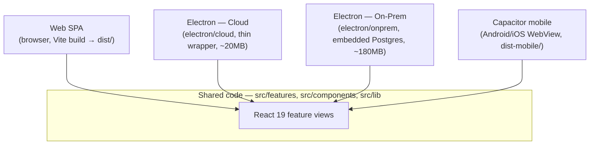
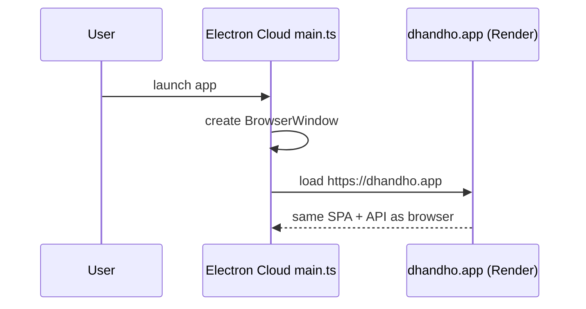
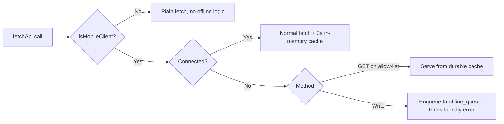

# Four Surfaces, One Codebase

Dhandho ships to end users through four distinct shells, and all four load the **same** `src/features/*` React components. There is no separate "mobile app repo" or "desktop app repo" — one Vite build, wrapped differently per surface.

## The four surfaces at a glance

| Surface | Runtime | Network | Data source | Distinct code |
|---|---|---|---|---|
| **Web SPA** | Any modern browser | Online only | Cloud Postgres via `/api` | None — pure `dist/` served by Express |
| **Electron Cloud** | Chromium + Node (Electron 43) | Online only, thin client | Same cloud Postgres as web | `electron/cloud/main.ts`, `preload.ts` — window chrome, auto-update |
| **Electron On-Prem** | Chromium + Node + embedded Postgres | Fully offline-capable, air-gappable | Local `embedded-postgres` instance on the customer's machine | `electron/onprem/*` — `pg-manager.ts` boots a local Postgres, `license-store.ts` validates license keys |
| **Capacitor mobile** | Android/iOS native WebView | Online-first with an offline mutation queue | Same cloud Postgres via `/api`, through a network layer that tolerates drops | `src/platforms/mobile/*` — offline queue, cache, connection detection |

:::info Why this matters on day one
If you're debugging "it works on web but not on mobile," the bug is almost never in `src/features/*` — it's almost always in one of the platform adapter layers (`src/platforms/mobile/offline`, `src/platforms/desktop`) or in an assumption the feature code makes that only holds when network is always available. See [Platforms](/frontend/platforms) for the adapter pattern that makes this split possible.
:::

## Web SPA — the baseline

Built by `vite build` → `dist/`, served as static files by the same Express process that serves the API (`server/app.ts`, `express.static(distPath, ...)`). This is the reference implementation every other surface builds on top of. No platform-specific code path — `isMobileClient()` and Capacitor/Electron detection all resolve to "false, this is plain web" here.

## Electron Cloud — a window around the web app

`electron/cloud/main.ts` creates a `BrowserWindow` that loads the *same* production URL a browser would (`https://dhandho.app` or similar), not a locally bundled copy. It's a thin native wrapper whose entire value-add is: a dock/taskbar icon, native window chrome, and (via `electron-builder`) an installer for users who want a "real app" rather than a browser tab. Because it just points at the live cloud URL, there is no build-time coupling between Electron Cloud releases and backend deploys — ship a backend change and every Electron Cloud user gets it on next launch, no app update required.

## Electron On-Prem — the whole stack in a box

This is the most structurally different surface. `electron-onprem.config.cjs` builds an installer that bundles: the compiled frontend (`dist/`), the Express server (`tsx server/index.ts`, or a compiled equivalent), and `embedded-postgres` — a real Postgres binary that `electron/onprem/pg-manager.ts` starts on `localhost` inside the same machine, with no network hop at all.

- `assertCriticalEnv()` skips TLS/CORS/super-admin checks when `DEPLOYMENT_MODE === 'onprem'` (see [App Bootstrap](/backend/app-bootstrap)) — there's no browser-origin boundary to defend because Electron serves the built SPA from the same process that runs the API.
- `electron/onprem/license-store.ts` validates a license key issued by Super Admin against `onprem_licenses` on the *platform* side (a periodic heartbeat call, not a permanent connection) — see [Super Admin API](/api/super-admin).
- Runs the exact same `initSchema()` on every launch, so a new on-prem release with new columns self-heals the customer's local database the moment they update — see [Migrations Strategy](/database/migrations-strategy).

:::tip Why on-prem exists at all
Some SME customers (particularly ones under Indian data-residency or connectivity constraints) refuse or can't rely on a cloud SaaS. On-prem lets Dhandho sell to them without forking the product — same features, same UI, same GST math, just pointed at a local database instead of a shared cloud one. See [Design Decisions](/architecture/design-decisions) ADR-006 for the trade-off analysis (~180MB installer vs. a full native rewrite).
:::

## Capacitor mobile — WebView plus an offline-tolerant network layer

`capacitor.config.ts` wraps the `dist-mobile/` build (built with `vite build --mode mobile`, relative asset paths for `file://`/`capacitor://` loading) in a native WebView on Android/iOS. Unlike Electron On-Prem, mobile has **no local database** — it's a thin client against the same cloud API as web, but on a much less reliable network (cellular data, elevators, basements). That reliability gap is why mobile is the only surface with:

- A **connection detector** (`src/platforms/mobile/offline/network.ts`, via `@capacitor/network`) that flags "offline" proactively instead of only discovering it on a failed fetch.
- A **durable read cache** (`cache.ts`) for a short allow-list of `GET` endpoints (products, vendors, tenant-by-slug) so the app can still render something useful with no connection.
- An **offline mutation queue** (`queue.ts`) that persists failed writes to `localStorage` and replays them (`flushOfflineQueue()`) once connectivity returns — see [Session & State](/frontend/session-state) for the queue's dedupe and auth-header-stripping rules.

## What's genuinely shared vs. genuinely different

| Layer | Shared across all four? | Notes |
|---|---|---|
| `src/features/*` (business UI) | ✅ Yes, 100% | This is the whole point of the architecture |
| `src/api.ts` (API client) | ✅ Yes, with platform-aware branching inside | `resolveApiUrl()`, offline queue hooks are conditional on `isMobileClient()` |
| Auth/session (`src/lib/session.ts`) | ✅ Yes | Same `localStorage` scheme everywhere — see [Session & State](/frontend/session-state) |
| Backend (`server/*`) | ✅ Yes for Web/Electron Cloud/Mobile (same cloud DB); On-Prem runs its **own copy** of the identical server code against a local DB | Not a different backend — the same `server/` folder, different database target |
| Native chrome / offline queue / license activation | ❌ No — this is exactly the platform-adapter code | `electron/*`, `src/platforms/*` |

## Common mistakes

1. Writing a feature that assumes `navigator.onLine` or a successful `fetch` is always available — breaks first on mobile, where connectivity drops are the normal case, not the exception.
2. Adding Electron-specific IPC calls directly inside `src/features/*` instead of behind a `src/platforms/desktop` adapter — couples business UI to a shell that three of the four surfaces don't have.
3. Assuming On-Prem and Cloud share a database "logically" — they don't; they share **code**, not data. A bug fixed in on-prem's local Postgres schema has zero effect on cloud tenants until the cloud backend is separately deployed.
4. Forgetting that Electron Cloud has no build-time frontend bundling of its own — a broken cloud deploy breaks Electron Cloud users identically to web users, instantly, with no app-store review buffer.

## Exercise

Trace `isMobileClient()` from `src/platforms/mobile/online/isMobileClient.ts` through to `src/api.ts`'s `fetchApi()`. Identify the exact branch that decides whether a failed `GET /products` call returns cached data or throws. Then answer: what happens on **web** (not mobile) when the network drops mid-request? (Hint: compare the retry loop's `MAX_RETRIES`/`RETRY_DELAY_MS` behavior, which is *not* gated by `isMobileClient()`, against the offline-queue branch, which is.)

## Related

- [System Overview](./system-overview.md)
- [Platforms](/frontend/platforms)
- [Session & State](/frontend/session-state)
- [Design Decisions](/architecture/design-decisions)
- [Deployment → Electron](/deployment/electron)
- [Deployment → Mobile](/deployment/mobile)
