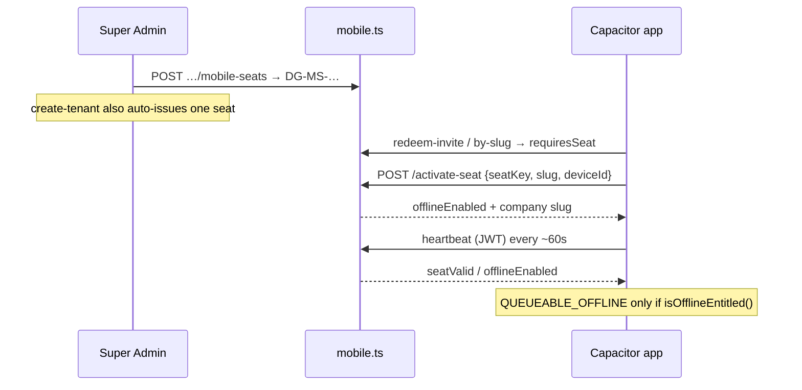

# Service Mobile Offline Seats

Service field techs need stronger offline invoice/payment behavior than manufacturer/dealer phones. Entitlement is modeled as **seats on the cloud service tenant** (not a separate fleet, not phone SQLite, not `onprem_licenses`).

## Decision (locked)

| Option | Why |
|---|---|
| **Seats on cloud service tenant** (chosen) | Same Postgres + SA UI; device binding mirrors on-prem license feel without a second product |
| Separate fleet / license product | Extra SA surface, billing, and sync story for little gain |
| Phone-local SQLite offline ERP | Different product (true on-prem mobile); out of scope |

Non-service tenants: invite + light cache only — **no seats UI**, heartbeat returns `seatValid: false` / `offlineEnabled: false`.

## Data model

Table `mobile_seats` (schema in `server/pg-db.ts`):

| Column | Role |
|---|---|
| `seat_key` | Unique `DG-MS-…` (not invite `DG-M-…`) |
| `tenant_id` | Service tenant only |
| `status` | `active` \| `suspended` \| `revoked` |
| `device_id` | Bound phone; `NULL` until activate / after transfer |
| `valid_until` | Optional calendar expiry |
| `activated_at` / `last_seen` | Binding + heartbeat telemetry |

## Invariants (do not regress)

1. **Slug must match** — `activate-seat` accepts optional `slug`; if present it must equal the seat’s tenant. Client also rejects mismatch. Prevents activating Tenant A’s key while onboarding Tenant B.
2. **Conditional bind** — activation `UPDATE`s only when `status = 'active'`, `(device_id IS NULL OR device_id = $device)`, and not expired; `RETURNING` empty → **409** (closes concurrent double-bind).
3. **One active seat per device** — reject if `device_id` already bound to another `active` seat.
4. **Server is source of truth** — `localStorage` (`seatStorage.ts` / `dg_mobile_offline_enabled`) is a cache. Onboarding clears entitlement when reusing a stored seat; skip clears the store; heartbeat sets `setOfflineEntitled(offlineEnabled)`.
5. **Queue gate** — offline invoice create / payments enqueue only when `isOfflineEntitled()` is true (`src/api.ts`).
6. **Rotate uniqueness** — `rotateKey` uses the same collision-retry allocator as `issueSeat`.

## Logging & audit

| Event | Mechanism |
|---|---|
| SA issue / update seat | `logAudit` + `logger.info` |
| Successful activate | `logger.info` (seatId, tenantId, deviceId prefix) |
| Reject wrong company / device already bound | `logger.warn` |
| Authed service heartbeat without valid seat | `logger.info` |

Keep PII out of logs — never log full seat keys or full device ids in info/warn payloads beyond a short prefix.

## Client map

| File | Role |
|---|---|
| `MobileOnboarding.tsx` | Service → seat step; stale entitlement cleared until heartbeat |
| `MobileSeatActivation.tsx` | Activate with `slug`; skip → `clearStoredSeat()` |
| `seatStorage.ts` | Seat record + `isOfflineEntitled()` |
| `mobileSync.ts` | Applies heartbeat `offlineEnabled` / `seatValid` |
| `MobileTenantPanel.tsx` | SA seats CRUD (service only) |

## Tests

`tests/api/http-mobile-seats.test.ts` covers:

- Non-service issue rejected; manufacturer heartbeat not entitled
- Happy path issue → activate → heartbeat `offlineEnabled`
- Wrong slug, revoked, expired activate rejected
- One device cannot bind two active seats
- Suspend clears entitlement; transfer + `rotateKey`

## Common mistakes

1. Trusting `localStorage.offlineEnabled` after suspend/revoke without a heartbeat  
2. Treating `DG-MS-…` as an invite (`DG-M-…`) in the invite parser  
3. Expanding `QUEUEABLE_OFFLINE` for manufacturer without seats  
4. Reusing `onprem_licenses` for phones  
5. Unconditional `UPDATE device_id` (race: two phones both “succeed”)

## Interview question

*Why not store offline entitlement only on the phone after one successful activate?*

:::info Answer sketch
Activate can be spoofed or stale. Suspend/revoke/transfer must take effect on the next online heartbeat. Local flag is UX/cache; `seatValid` from the server is the gate for durable entitlement.
:::

## Related

- [Mobile & On-Prem API](/api/mobile-onprem)
- [Four Surfaces](/architecture/four-surfaces)
- [Design Decisions](/architecture/design-decisions)
- [Runbook: Mobile Sync](/runbooks/mobile-sync)
- Product doc: [`docs/MOBILE.md`](https://github.com/prathame/DG-ERP/blob/main/docs/MOBILE.md)
