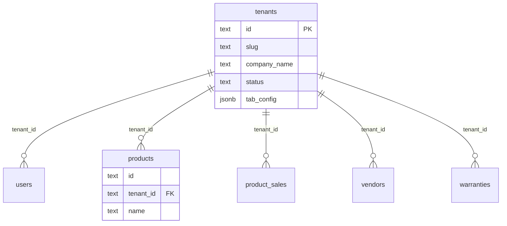
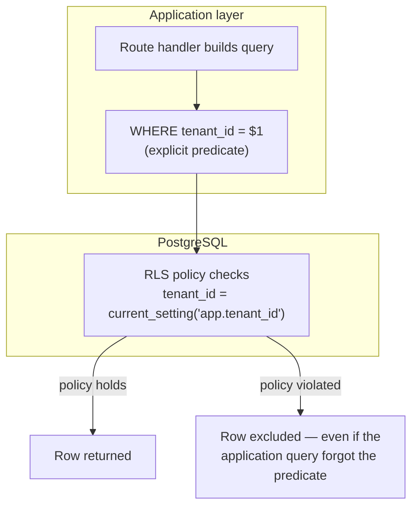
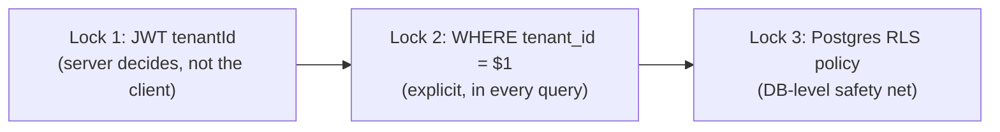

# Multi-tenancy

If you internalize nothing else from this academy, internalize this page. A cross-tenant data leak in a multi-tenant SaaS ERP means one business owner sees another business owner's sales, customers, and financials. It is the single worst class of bug this codebase can produce, and this page is about the three overlapping mechanisms that exist specifically to make it structurally hard to write that bug by accident.

:::danger This is the most important page in the academy
Every other architecture decision is negotiable and revisitable. This one is not. If a code review comment says "does this need to be tenant-scoped?", the answer for any table with a `tenant_id` column is always **yes**.
:::

## The shared-schema model

Dhandho uses **one PostgreSQL database, one schema, shared by every tenant** — not database-per-tenant, not schema-per-tenant. Every business-data table carries a `tenant_id TEXT NOT NULL REFERENCES tenants(id) ON DELETE CASCADE` column, and most tables use a **composite primary key** `(id, tenant_id)` rather than a globally unique `id` alone — meaning the same `id` value can legitimately exist for two different tenants without colliding.



:::tip Analogy
A shared-schema multi-tenant database is like a **shared warehouse with individually locked cages**, not separate warehouses per customer. It's cheaper to operate (one building, one security guard, one fire alarm system) than giving every customer their own warehouse — but it only works if every single cage door is actually locked, every time, with no exceptions. The rest of this page is about how Dhandho makes sure no cage is ever left unlocked.
:::

## Layer 1: the JWT carries `tenantId`, and the server — never the client — decides it

When a user logs in (`POST /api/auth/login`), the server issues a JWT whose payload includes `tenantId` (alongside `userId`, `role`, `email`, `name`, optional `vendorId`):

```ts
// server/middleware/auth.ts
export interface JwtPayload {
  userId: string;
  tenantId: string;
  role: string;
  email: string;
  name: string;
  vendorId?: string | null;
  permissions?: Record<string, string>;
  impersonatedBy?: string;
  iat?: number;
}
```

On every subsequent request, the global auth middleware (`server/app.ts`) verifies this JWT and — critically — **overwrites** `req.headers['x-tenant-id']` with the value decoded from the token, regardless of any `X-Tenant-ID` header the client happened to send:

```ts
const decoded = jwt.verify(token, process.env.JWT_SECRET!, { algorithms: ['HS256'] });
if (decoded.tenantId && decoded.userId) {
  req.headers['x-tenant-id'] = decoded.tenantId;   // ← server-authoritative, always
  // ...
}
```

Route handlers then read `tenantId` from `req.headers['x-tenant-id']` — which, for an authenticated request, is now guaranteed to be the value the server itself derived from a cryptographically verified token, not anything the browser sent.

:::warning Why the `X-Tenant-ID` header exists at all, then
The header name `X-Tenant-ID` appears in `Access-Control-Allow-Headers` and is genuinely readable client-side for *unauthenticated* flows (e.g. resolving a tenant by slug before login, `/api/tenant/by-slug/:slug`). For any **authenticated** request, though, the value the client might send in that header is silently discarded and replaced by the JWT-derived value the instant the auth middleware runs. A client cannot pick which tenant it operates as merely by setting a header — this is the whole point.
:::

## Layer 2: explicit `WHERE tenant_id = $1` in every query

This is the workhorse layer — the one enforced by human (or AI-agent) discipline in every route handler, not by a database feature:

```ts
// The canonical pattern, everywhere in server/routes/
const rows = await pool.query(
  'SELECT * FROM products WHERE tenant_id = $1 AND id = $2',
  [tenantId, productId]
);
```

Because `tenantId` here comes from the JWT-derived, server-set `req.headers['x-tenant-id']` (Layer 1), and because the predicate is on **every** query against a tenant-scoped table, no row from Tenant A's `products` table can ever appear in a response to Tenant B — provided the predicate is never forgotten.

:::danger Common mistake — the one that matters most
The single most dangerous class of bug in this codebase is a query against a tenant-scoped table **missing** the `WHERE tenant_id = $1` predicate. It will work perfectly in every manual test with one tenant in the database, pass code review from someone in a hurry, and then leak data silently the moment a second tenant exists. There is no compiler error for this. The only defenses are review discipline, tests that seed *multiple* tenants and assert isolation (see [Lab: Tenant Isolation](/labs/lab-tenant-isolation)), and Layer 3 below.
:::

## Layer 3: PostgreSQL Row Level Security — the safety net

This is the layer that exists specifically to catch the mistake described above. `server/pg-db.ts` enables RLS on every tenant-scoped table and creates a matching policy:

```sql
ALTER TABLE products ENABLE ROW LEVEL SECURITY;

CREATE POLICY products_tenant_isolation ON products
  USING (tenant_id = current_setting('app.tenant_id', true))
  WITH CHECK (tenant_id = current_setting('app.tenant_id', true));
```

This is applied identically across all ~30 tenant-scoped tables (`users`, `vendors`, `customers`, `products`, `product_inventory`, `product_distribution`, `product_sales`, `warranties`, `quotations`, `orders`, `standalone_invoices`, and more).

`withTenantClient()` (`server/pg-db.ts`) is the helper that actually sets the session variable RLS checks against, scoped to a single transaction:

```ts
export async function withTenantClient<T>(
  tenantId: string,
  fn: (client: PoolClient) => Promise<T>
): Promise<T> {
  const client = await pool.connect();
  try {
    await client.query('BEGIN');
    await client.query("SELECT set_config('app.tenant_id', $1, true)", [tenantId]);
    const result = await fn(client);
    await client.query('COMMIT');
    return result;
  } catch (err) {
    await client.query('ROLLBACK');
    throw err;
  } finally {
    client.release();
  }
}
```



:::info Why RLS is *enabled*, not *forced*
`server/pg-db.ts` deliberately does **not** run `ALTER TABLE ... FORCE ROW LEVEL SECURITY`. The connection pool's owner role bypasses RLS by default in Postgres — `FORCE` would make RLS apply even to the table owner. This was tried and reverted, because most of this application's queries use `pool.query()` directly (not `withTenantClient()`), meaning they run on a pooled connection where `app.tenant_id` is very often **unset**. Under `FORCE RLS`, an unset session variable means the policy's `USING` clause evaluates to false for every row — silently returning **zero rows** instead of erroring. That is a worse failure mode than the vulnerability RLS is meant to catch: a query that used to (correctly) return data would start silently returning nothing, which can look like "the feature works, there's just no data" rather than an obvious crash.
:::

This is exactly why RLS here is described as a **safety net**, not the primary defense: it protects against direct database access, SQL injection that manages to inject a query without a hardcoded tenant filter, and reviewer-missed omissions in code that *does* use `withTenantClient()` — but it is not a substitute for Layer 2's explicit predicates in the common `pool.query()` path.

## The three locks, together



:::tip Analogy, extended
Think of the three locks like a **bank vault door, a teller's ID check, and a silent alarm**. The JWT is the ID check at the counter — you can't just claim to be a different account holder. The `WHERE tenant_id` predicate is the vault door itself — the mechanism that actually prevents access. RLS is the silent alarm that still trips even if someone found a way to prop the vault door open, but it doesn't replace the door.
:::

## Slug-based routing and the frontend side of tenancy

Tenants are addressed by a human-readable `slug` (`/:slug/*` in the URL, e.g. `dhandho.app/acme-traders`), resolved server-side. `src/lib/session.ts` scopes every `localStorage` key to the current slug (`getSessionSlug()` parses `window.location.pathname`), so that opening two different tenant slugs in two browser tabs on the same machine doesn't cross-contaminate session state — each tenant's token, user object, and tenant ID are stored under slug-prefixed keys (`auth_token_acme-traders`, etc.). This is a **client-side UX convenience**, not a security boundary — the real isolation is still the three server-side locks above; a malicious script running in the page could still read any of these localStorage keys (see [Design Decisions](./design-decisions.md) for the accepted-risk discussion of JWT-in-localStorage).

## Key concepts

- **Shared schema, not database-per-tenant** — cheaper to operate, safe only because of the three-lock model.
- **Composite primary keys `(id, tenant_id)`** — the same entity ID can exist per-tenant without collision.
- **Server-authoritative tenant ID** — the JWT decides `tenantId`; a client-supplied header is never trusted for authenticated requests.
- **RLS is enabled, not forced** — a deliberate choice to avoid silent zero-row failures on connections without `app.tenant_id` set.
- **Slug-scoped `localStorage`** is a UX nicety, not a security control.

## Common mistakes

1. Writing a new query against a tenant-scoped table without `WHERE tenant_id = $1` — the most severe and most common mistake class in this codebase's history (see the `P0`-class fixes referenced in [AI Origin Assumptions](/overview/ai-origin-assumptions)).
2. Trusting a client-supplied `tenant_id` in a request body or query string for anything other than input to a query that will *still* be filtered by the JWT-derived tenant ID.
3. Assuming RLS alone is sufficient protection and skipping the explicit SQL predicate "because the database will catch it" — it won't, reliably, for the reasons above.
4. Forgetting the composite primary key means `id` alone is not unique — a lookup by `id` without `tenant_id` can silently match the wrong tenant's row if IDs ever collide (they're generated with time-based prefixes like `T${Date.now()}`, which reduces but does not eliminate this risk).

## Interview question

> **Q: Why does this codebase enable Row Level Security but explicitly avoid `FORCE ROW LEVEL SECURITY`? Isn't forcing it "more secure"?**
>
> Expected answer: `FORCE RLS` would apply the tenant-isolation policy even to the database pool's owner role, which normally bypasses RLS. Since most route handlers query via a shared `pool.query()` connection (not the transaction-scoped `withTenantClient()` helper that sets `app.tenant_id`), a `FORCE`d policy would evaluate against an *unset* session variable on most queries — and an unset variable means the `USING` clause is false for every row, so the query would silently return **zero rows** instead of erroring or (correctly) filtering by tenant. That's a worse outcome than the omission RLS is meant to catch, because it looks like "no data" instead of a bug. The team judged the explicit `WHERE tenant_id` predicate plus non-forced RLS as a safety net to be the safer combination, and documented that reasoning directly in the schema code.

## Related

- [System Overview](./system-overview.md)
- [Request Lifecycle](./request-lifecycle.md)
- [Personas & Roles](/overview/personas-and-roles)
- [Design Decisions](./design-decisions.md)
- [Lab: Tenant Isolation](/labs/lab-tenant-isolation)
