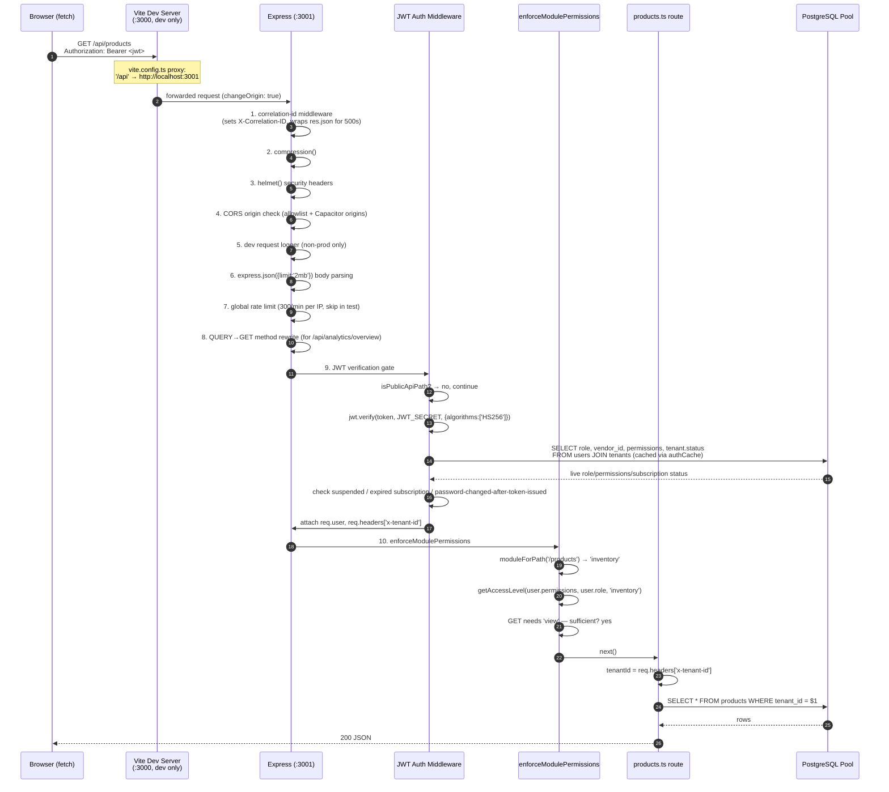

# Request Lifecycle

This page traces **one concrete request** — `GET /api/products` from a logged-in tenant user — through every layer it actually passes through, in the exact order they're registered in `server/app.ts`. If you only read one architecture page before your first pull request, read this one; it explains why a bug can be "stuck" at five different possible layers, and how to find out which one.

:::info Ground truth
Middleware order below is read directly from `createApp()` in `server/app.ts`. Express middleware order is significant — a check registered later can never protect a route handled earlier. If you add new global middleware, its position in this list is a design decision, not an implementation detail.
:::

## The full path, end to end



## Step-by-step, with the "why" at each layer

### 1. Vite dev proxy (development only)

```ts
// vite.config.ts
server: {
  port: 3000,
  proxy: {
    '/api': { target: 'http://localhost:3001', changeOrigin: true },
    '/manifest.json': { target: 'http://localhost:3001', changeOrigin: true },
  },
}
```

In development, the React dev server runs on `:3000` and Express runs separately on `:3001` (`npm run dev:all` starts both). The Vite proxy makes `/api/*` calls from the browser look same-origin, avoiding CORS friction during local development. **In production**, there is no proxy at all — Express serves the built React `dist/` directly and also handles `/api/*` in the same process (see `app.ts`'s static file serving + catch-all route).

:::tip Analogy
The Vite proxy is a **temporary bridge** built only for the construction site (dev). Once the building is finished (production build), the bridge is torn down because the two sides are now literally the same building (one Express process serving both the SPA and the API).
:::

### 2. Correlation ID + response wrapping

The very first middleware assigns (or trusts a caller-supplied, sanitized) `X-Correlation-ID` header and monkey-patches `res.json` so that **any 500 response strips its error detail** and replaces it with a generic message plus the correlation ID, logging the real error server-side only. This exists so a stack trace never leaks to a browser tab, while still giving support a searchable ID to hand to an engineer.

### 3–4. compression + helmet

Standard hardening: gzip responses, and a strict Content-Security-Policy (`default-src 'self'`, no inline scripts in production, `frameAncestors: 'none'`, HSTS with `preload: true`). Getting CSP wrong here is a common source of "why won't my new third-party widget load" bugs — check `helmet()`'s `contentSecurityPolicy.directives` in `app.ts` before assuming a bug is elsewhere.

### 4b. CORS allowlist

Origins are read from `ALLOWED_ORIGINS` (required in production — enforced by `assertCriticalEnv()`) **plus** a fixed set of Capacitor/Ionic WebView origins (`capacitor://localhost`, `ionic://localhost`, etc.) needed for the mobile app to be allowed to call the API at all. Unlisted origins get **no** `Access-Control-Allow-Origin` header — the code deliberately never reflects `*`.

### 6. Body parsing with a size cap

`express.json({ limit: '2mb' })` — deliberately small, to blunt request-body-based DoS. One route (`/api/backup/restore`) gets a dedicated `50mb` limit registered *before* the general one, because Express applies the first matching body parser.

### 7. Rate limiting

A global limiter (300 requests/minute/IP) applies to all of `/api/`, layered with **much** tighter, route-specific limiters registered later: login (5/min/IP), password-reset request (3/hour/IP), password-reset confirm (5/hour/IP), signup (3/hour/IP), chatbot (30/min/IP). This tiered approach means a brute-force attempt against `/api/auth/login` gets throttled far more aggressively than a normal browsing session hitting `/api/products` repeatedly.

### 8. The `QUERY` method rewrite

An unusual but deliberate piece of code:

```ts
app.use((req, _res, next) => {
  if (req.method === 'QUERY') {
    if (req.body && typeof req.body === 'object') Object.assign(req.query, req.body);
    req.method = 'GET';
  }
  next();
});
```

This supports the experimental HTTP `QUERY` method (a GET-with-a-body, useful when a "read" needs a complex filter payload too large/awkward for query-string encoding) used by `/api/analytics/overview`. It's rewritten to a plain `GET` internally so the rest of the stack (rate limiting, permission checks keyed on method) never needs to know `QUERY` exists.

### 9. JWT authentication gate

This is the security-critical center of the whole pipeline, and it's worth reading in full in `app.ts` at least once. Key behaviors:

- **Public paths bypass entirely** (`isPublicApiPath`) — login, password reset, health check, on-prem activation/heartbeat, mobile invite redemption/heartbeat. Everything else requires a valid Bearer token.
- The token is verified with a **fixed algorithm allowlist** (`algorithms: ['HS256']`) — this specific choice prevents a classic JWT vulnerability where an attacker sends a token signed (or unsigned, `alg: none`) with an algorithm the server didn't expect.
- **Live data, not just JWT claims**: role, `vendor_id`, and `permissions` are read fresh from the `users`/`tenants` tables (cached briefly via `authCache` keyed by `userId + tenantId + iat`) rather than trusted from the token payload alone. This means a role demotion, permission change, or tenant suspension takes effect on the **next request**, not only after the JWT naturally expires up to 24 hours later.
- **Password-changed-after-token-issued check**: if `users.password_changed_at` is newer than the token's `iat`, the request is rejected with "Session expired after password change" — this invalidates all *other* sessions the moment a password is changed, without needing a token blocklist.
- **Subscription/trial expiry and suspension checks** happen here too, before the request ever reaches a route handler.

### 10. `enforceModulePermissions`

Covered in depth in [Personas & Roles](/overview/personas-and-roles) — maps the request path to a module, checks the caller's access level against the HTTP method, 403s if insufficient.

### 11. Route handler → PostgreSQL

Only now does the actual `server/routes/products.ts` handler run. It reads `tenantId` from `req.headers['x-tenant-id']` (set by the auth middleware from the verified JWT, **never** trusted from an incoming client-supplied header directly — see [Multi-tenancy](./multi-tenancy.md)) and issues a parameterized query: `SELECT * FROM products WHERE tenant_id = $1`.

### 12. Error handling

If anything throws past this point, Express's error-handling middleware (registered near the end of `app.ts`) logs the error with the correlation ID and returns a generic `500` — never a raw stack trace. See [Error Flow](./error-flow.md) for the complete picture, including client-side handling.

## What differs for the on-prem surface

On the on-prem Electron build, there is no Vite proxy step and no separate frontend process at all — the exact same `createApp()` serves both the built React assets and `/api/*` from one local process, over `http://localhost:<port>` with **no TLS** (acceptable because the traffic never leaves the machine — see `useSsl` logic in `pg-db.ts` and [Four Surfaces](./four-surfaces.md)).

## Key concepts

- **Middleware order is a security property**, not an implementation detail — a check registered after a route can't protect that route.
- **JWT claims are a starting point, not the final word** — live role/permission/subscription state is checked on (almost) every request via a short-lived cache.
- **Correlation IDs decouple "what the user sees" from "what gets logged"** — 500s are always generic to the client, detailed to the server logs.
- **Tiered rate limiting** — one broad limiter plus several narrow, aggressive limiters on sensitive endpoints.

## Common mistakes

1. Adding a new global middleware *after* the JWT auth gate when it actually needs to run before it (e.g., a new correlation/logging concern).
2. Trusting `req.headers['x-tenant-id']` as if a client could set it directly — it's overwritten by the auth middleware from the verified JWT payload; a client-supplied value is never honored for authenticated requests.
3. Forgetting that `enforceModulePermissions` runs globally — adding a new route under an existing path prefix (e.g., a new endpoint under `/reports`) inherits that prefix's module mapping (`accounts`) automatically, which may not be what you intended.
4. Assuming a `403` is a permissions bug when it might be a subscription-expiry or suspension check firing inside the auth middleware itself — check the response body's exact message before assuming which layer failed.

## Interview question

> **Q: A tenant reports that after you demoted their `Manager` account to `Staff`, they could still perform Manager-level actions for up to a minute. Why, and is this a bug?**
>
> Expected answer: it's the `authCache` — role/permission rows fetched from Postgres during JWT verification are cached briefly (keyed by `userId + tenantId + iat`) to avoid a database round-trip on every single request. This is a deliberate latency/consistency trade-off, not a bug, as long as the cache TTL is short and documented. If the requirement is truly zero-lag permission changes, the fix is either shortening the cache TTL or explicitly invalidating the cache entry on role change — not removing the cache and taking a DB hit on every authenticated request.

## Related

- [System Overview](./system-overview.md)
- [Multi-tenancy](./multi-tenancy.md)
- [Personas & Roles](/overview/personas-and-roles)
- [Error Flow](./error-flow.md)
