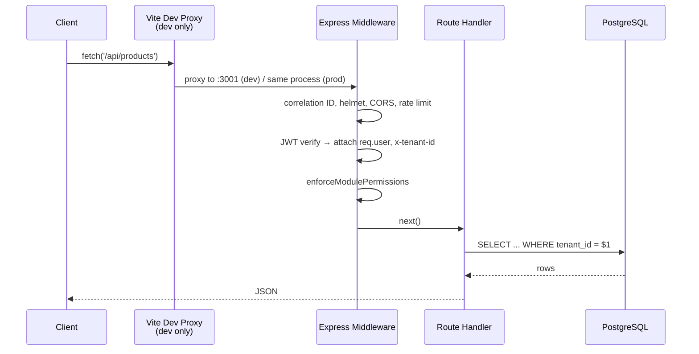

# System Overview

If you remember one diagram from this entire academy, make it this one. Everything else — multi-tenancy, the request lifecycle, business workflows — is a zoom-in on one part of this picture.

## The one-sentence architecture

> **One Express API, one PostgreSQL schema, four client shells.**

There is no microservices mesh, no separate BFF layer, no GraphQL gateway. `server/` is a single Node.js process (or, on-prem, a single process per customer machine) that every client — browser, Electron ×2, 
```mermaid
flowchart TB
    subgraph Clients["4 Client Surfaces (same React SPA in src/)"]
        Web["Web Browser<br/>dhandho.app"]
        ElCloud["Electron Cloud<br/>thin wrapper, no local DB"]
        ElOnprem["Electron On-Prem<br/>embedded Postgres"]
        Mobile["    end

    subgraph API["server/ — one Express 4 application"]
        MW["Middleware stack<br/>(helmet, CORS, rate-limit,<br/>JWT auth, permissions)"]
        Routes["~30 route files<br/>(one per domain)"]
    end

    subgraph DB["PostgreSQL 16"]
        Tables["38 tables<br/>tenant_id on every tenant-scoped row"]
        RLS["Row Level Security policies<br/>(safety net)"]
    end

    Web -->|HTTPS| MW
    ElCloud -->|HTTPS| MW
    Mobile -->|HTTPS| MW
    ElOnprem -->|"localhost (no TLS)"| MW2["Same server code,<br/>bundled locally"]

    MW --> Routes --> Tables
    MW2 --> Tables
    Tables -.enforced by.-> RLS
```

:::tip Analogy
Picture a **bank with one vault (PostgreSQL) and one teller counter (Express API)**, but four different lobby entrances (web, two Electron variants, mobile) that all funnel to the same counter. Each entrance has its own decor and quirks (a :::

## The three surfaces, one sentence each

| Surface | What it is | Talks to |
|---|---|---|
| **Web** | The React SPA served directly by Express at `/` in production | Hosted API, same origin |
| **Electron Cloud** | A ~20 MB native wrapper that just opens the hosted `dhandho.app` URL in a `BrowserWindow` | Hosted API, over the internet |
| **Electron On-Prem** | A ~180 MB self-contained install: embedded PostgreSQL + the same Express server + the same React build, all running locally | `localhost`, no internet required after activation |
| **
Full detail in [Four Surfaces](./four-surfaces.md).

## Why this shape, and not something else

The alternative architectures worth naming — and why they weren't chosen — are covered in depth in [Design Decisions](./design-decisions.md), but the headline reasoning:

- **A single Express monolith** (not microservices) because the team size and deployment story (including an *offline, single-machine* on-prem deployment) make service-to-service network calls a liability, not a benefit. You cannot run a service mesh on a shop-floor laptop with no internet.
- **Server-rendered nothing; pure API + SPA** because four very different shells (browser, two Electron flavors, - **One PostgreSQL schema for all tenants** (not database-per-tenant) because the tenant count and per-tenant data volume for Indian SMEs don't justify the operational overhead of thousands of separate databases — see [Multi-tenancy](./multi-tenancy.md) for the isolation strategy that makes shared-schema safe.

## Request path at a glance

Every mutating or reading request — regardless of which of the three surfaces it came from — follows the identical path once it reaches the server:



Full breakdown in [Request Lifecycle](./request-lifecycle.md).

## The non-negotiable invariant: tenant isolation

Every table except a handful of explicitly platform-level tables (`tenants`, `plans`, `super_admins`, `onprem_licenses`, `platform_config`) carries a `tenant_id` column, and every query against those tables is expected to filter on it. This single invariant is defended in three independent layers (explicit SQL predicate, JWT-derived tenant ID, Postgres RLS as a safety net) — see [Multi-tenancy](./multi-tenancy.md), and treat any code that appears to skip it as a P0-severity bug, full stop.

## Key concepts

- **One API, four shells** — surfaces differ only in how they reach the API and whether they trust the network, never in business logic.
- **Monolith by design, not by neglect** — the single-process shape is a deliberate fit for the on-prem/offline deployment requirement.
- **Shared schema, defense-in-depth isolation** — one PostgreSQL database serves every tenant, protected by three overlapping layers.

## Common mistakes

1. Assuming a new feature needs its own microservice or serverless function "for scalability" — this pattern doesn't fit the on-prem deployment model at all.
2. Building a feature that behaves differently based on which of the three surfaces it's running on, when the difference should live in `src/platforms/`, not the feature itself (see [Folder Structure](/overview/folder-structure)).
3. Forgetting that the on-prem surface has no internet by default — any feature that assumes an always-reachable third-party API needs a documented offline fallback.

## Interview question

> **Q: Sketch the system architecture of Dhandho in under 60 seconds, out loud, without looking at a diagram.**
>
> Expected answer, verbally: "One Express API and one PostgreSQL database serve four client surfaces — a web SPA, two Electron variants (a thin cloud wrapper and a full on-prem build with an embedded database), and a 
## Related

- [Four Surfaces](./four-surfaces.md)
- [Multi-tenancy](./multi-tenancy.md)
- [Request Lifecycle](./request-lifecycle.md)
- [Design Decisions](./design-decisions.md)
- [Business Workflows](./business-workflows.md)
