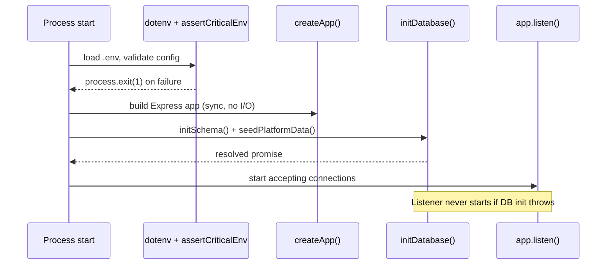

# App Bootstrap

:::info Files covered
`server/index.ts`, `server/utils/env.ts` (`assertCriticalEnv`), `server/pg-db.ts` (`initDatabase`), `server/app.ts` (`createApp`)
:::

## Why a separate `index.ts` and `app.ts`?

`server/app.ts` exports one function, `createApp(): express.Application`, that **builds** the Express app but never calls `.listen()`. `server/index.ts` is the only file that calls `.listen()`. This split exists for one reason: **testability**. Integration tests (via `supertest`) can `import { createApp } from '../server/app'` and hit the app in-memory, with no open TCP port, no port collisions between parallel test files, and no leaked listeners between test runs.

:::tip Why this matters
If `createApp()` ever grows a side effect that only makes sense once (opening a socket, starting a cron timer), test isolation breaks silently — tests that "should" be independent start sharing state. Keep `app.ts` pure: build and return, never start.
:::

## `server/index.ts` — the entry point, in order

```typescript
import dotenv from 'dotenv';
dotenv.config();

import { assertCriticalEnv } from './utils/env';
assertCriticalEnv();

import { initDatabase } from './pg-db';
import { createApp } from './app';

const app = createApp();
const PORT = process.env.PORT || 3001;

initDatabase().then(() => {
  app.listen(PORT, () => { /* banner */ });
}).catch((err) => {
  console.error('❌ Failed to start server:', String(err));
  process.exit(1);
});
```

Four steps, and the order is load-bearing:

1. **`dotenv.config()` first.** Nothing downstream can read `process.env.DATABASE_URL` or `JWT_SECRET` correctly unless the `.env` file has already been parsed into `process.env`. This line has to be the very first executable statement in the module graph — which is why it's not inside a function, it's top-level in the entry file.
2. **`assertCriticalEnv()` before touching the database.** This call can call `process.exit(1)`. If it runs *after* `initDatabase()` starts, a partially-initialized pool or an in-flight schema migration could be left dangling when the process dies. Fail fast, fail before any I/O.
3. **`initDatabase()` before `app.listen()`.** The Express app is built synchronously (`createApp()` just wires middleware and routers — no I/O), but the server does not start accepting traffic until the schema exists and platform data is seeded. This avoids the classic "container starts, health check passes, first request 500s because the `users` table doesn't exist yet" race.
4. **`.catch()` around the whole boot chain.** Any thrown error anywhere in bootstrap — a bad connection string, a Postgres permission error, a broken migration statement — exits the process with a non-zero code instead of limping along with an app that can't serve real traffic. This matters a lot for container orchestrators (Docker/Render): a non-zero exit code triggers a restart-with-backoff instead of a "successfully started but broken" container that never gets restarted.



## `assertCriticalEnv()` — fail fast, fail loud

Location: `server/utils/env.ts`. Signature:

```typescript
export function assertCriticalEnv(env: NodeJS.ProcessEnv = process.env): void
```

Notice the default parameter takes `process.env` but accepts an override — that's what makes this function unit-testable without mutating global state (tests pass a fake env object).

### What it checks, and why each check exists

| Check | Applies when | Why it exists |
|---|---|---|
| `DATABASE_URL` set | Always | Nothing works without a DB connection string. |
| `JWT_SECRET` set | Always | Nothing works without a signing key. |
| `JWT_SECRET.length >= 32` | Warn in dev/test, **fatal** in production | A short secret is brute-forceable. Dev gets a warning so local `.env.example` files with placeholder secrets don't block iteration. |
| `ALLOWED_ORIGINS` set | Production, non-on-prem only | On-prem Electron builds serve the frontend from the same origin (no CORS needed); cloud production must explicitly allow-list frontend origins or CORS defaults to wide-open in `app.ts`. |
| `DATABASE_URL` isn't a weak/default password | Production, non-on-prem | Regex `WEAK_DB_PASSWORD` catches `postgres:postgres@`, `admin:admin@`, etc. — a copy-pasted local connection string accidentally deployed to prod. |
| `DATABASE_SSL !== 'false'` | Production, non-on-prem | TLS to Postgres is mandatory in the cloud; refusing to start rather than silently connecting in plaintext. |
| `DATABASE_SSL_REJECT_UNAUTHORIZED !== 'false'` | Production, non-on-prem | Disabling certificate validation defeats TLS (MITM-able); refuse to start rather than accept a weakened posture. |
| `SUPER_ADMIN_EMAIL` / `SUPER_ADMIN_PASSWORD` set, password ≥ 12 chars | Production, non-on-prem | The platform owner account must exist and be strong before go-live; this is also what `seedPlatformData()` uses to create/upsert the super admin row. |

:::danger Why "fail fast" beats "warn and continue"
Every one of the production-only checks above is a security control. A logging framework that "warns but continues" on a missing `ALLOWED_ORIGINS` would mean the first person to notice is whoever discovers the CORS hole in production. `assertCriticalEnv()` makes misconfiguration a **deploy-time** failure, not a **runtime** vulnerability. The cost is a slightly less forgiving local dev experience — mitigated by making all of these checks skip in `NODE_ENV !== 'production'` or `DEPLOYMENT_MODE === 'onprem'`.
:::

### Why on-prem is exempted from most checks

`DEPLOYMENT_MODE === 'onprem'` skips the `ALLOWED_ORIGINS`, TLS, and super-admin checks. On-prem installs run an **embedded Postgres** (`embedded-postgres` npm package) bound to `localhost` inside the same Electron process boundary — there is no network hop to secure with TLS, and no separate frontend origin to CORS-allow because Electron serves the built SPA from the same process. Applying cloud-production rules there would simply make on-prem installs impossible to start.

### What breaks if `assertCriticalEnv()` is removed

- A production deploy with a copy-pasted local `DATABASE_URL` (weak password) starts successfully and serves traffic against a database anyone can guess into.
- A production deploy with no `ALLOWED_ORIGINS` falls back to the *development* origin allow-list in `app.ts` (`localhost:3000/3001/3002`) — meaning **no legitimate frontend origin is allowed**, so the real app is CORS-blocked in production, while the failure mode is "confusing 200s with no Access-Control-Allow-Origin header" rather than a clear boot-time error.
- `JWT_SECRET` could be short enough to brute-force, and nothing would flag it until a security review or an incident.

## `initDatabase()` — schema + seed, in that order

Location: `server/pg-db.ts`.

```typescript
export async function initDatabase() {
  await initSchema();
  await seedPlatformData();
  console.log('  ✓ Database ready');
}
```

- **`initSchema()`** runs ~120 idempotent DDL statements: `CREATE TABLE IF NOT EXISTS`, `ALTER TABLE ... ADD COLUMN IF NOT EXISTS`, `CREATE INDEX IF NOT EXISTS`, plus enabling Row Level Security and creating tenant-isolation policies on ~30 tables. See [`pg-db.md`](/backend/pg-db) and [`migrations-strategy.md`](/database/migrations-strategy) for the full reasoning.
- **`seedPlatformData()`** creates the super admin (from `SUPER_ADMIN_EMAIL`/`SUPER_ADMIN_PASSWORD` if unset) and upserts the four subscription plans (`TRIAL`, `BASIC`, `STANDARD`, `PROFESSIONAL`) with their feature flags and limits.

Running schema before seed matters: seeding does `INSERT ... ON CONFLICT` against `plans` and `super_admins`, both of which must already exist.

:::note Idempotency is the whole point
Both functions are safe to run on **every process start**, including the *n*-th restart of an already-running production database and every on-prem Electron launch after an app update ships new columns. That's what makes an on-prem app update a schema migration "for free" — see [`migrations-strategy.md`](/database/migrations-strategy) for the trade-offs this idempotent-DDL approach makes versus a real migration framework.
:::

## `createApp()` — building the Express app

Location: `server/app.ts`. This function is covered end-to-end in [`middleware-stack.md`](/backend/middleware-stack); the summary here is what it returns and why it's structured as a factory rather than a module-level singleton:

```typescript
export function createApp(): express.Application {
  const app = express();
  // ... 30+ app.use() calls wiring middleware and 30 routers ...
  return app;
}
```

Because it's a factory (not `export const app = express(); /* mutate at module scope */`), every test file gets a **fresh app instance** with no shared middleware state (e.g. no shared rate-limiter counters bleeding between test suites that each call `createApp()`).

## Complexity & performance notes

- Boot-time cost is dominated by the ~120 sequential `await client.query(...)` DDL statements in `initSchema()` — each is a round trip on the *same* connection (a single `client` checked out from the pool, not the pool itself), so they run serially, not concurrently. On a healthy database this is milliseconds each; the entire boot sequence is well under a second even on a cold on-prem embedded Postgres. This is O(number of DDL statements), and the number only grows as the schema grows — there is no cleanup step that removes old idempotent statements, so boot time monotonically increases in a very small, bounded way over the app's lifetime (see [`migrations-strategy.md`](/database/migrations-strategy) for why this is an accepted trade-off, not an oversight).
- `assertCriticalEnv()` is O(1) — a handful of string/regex checks, no I/O.

## What breaks if each piece is removed

| Removed | Symptom |
|---|---|
| `assertCriticalEnv()` call | Production silently accepts unsafe config (see security note above); nothing else changes structurally. |
| `initDatabase()` before `listen()` | First requests after a fresh deploy 500 or hang, racing against DDL that hasn't finished; on-prem first-run experience breaks (no tables yet). |
| The `.catch()` on the boot promise chain | A DB connection failure at boot produces an unhandled promise rejection — Node logs a warning but (depending on Node version/flags) may or may not exit, leaving a zombie process that accepts connections but 500s on every DB-touching route. |
| `createApp()` factory pattern (replaced with a module singleton) | Test suites that spin up the app multiple times start sharing rate-limiter state and in-memory caches (see `utils/authCache.ts`), causing flaky, order-dependent test failures. |

## Related pages

- [`middleware-stack.md`](/backend/middleware-stack) — everything `createApp()` wires up, in order.
- [`pg-db.md`](/backend/pg-db) — `initSchema`, `seedPlatformData`, pool configuration, RLS.
- [`migrations-strategy.md`](/database/migrations-strategy) — why idempotent DDL instead of a migration framework.
- [`utils-catalog.md`](/backend/utils-catalog) — `env.ts` in full.
