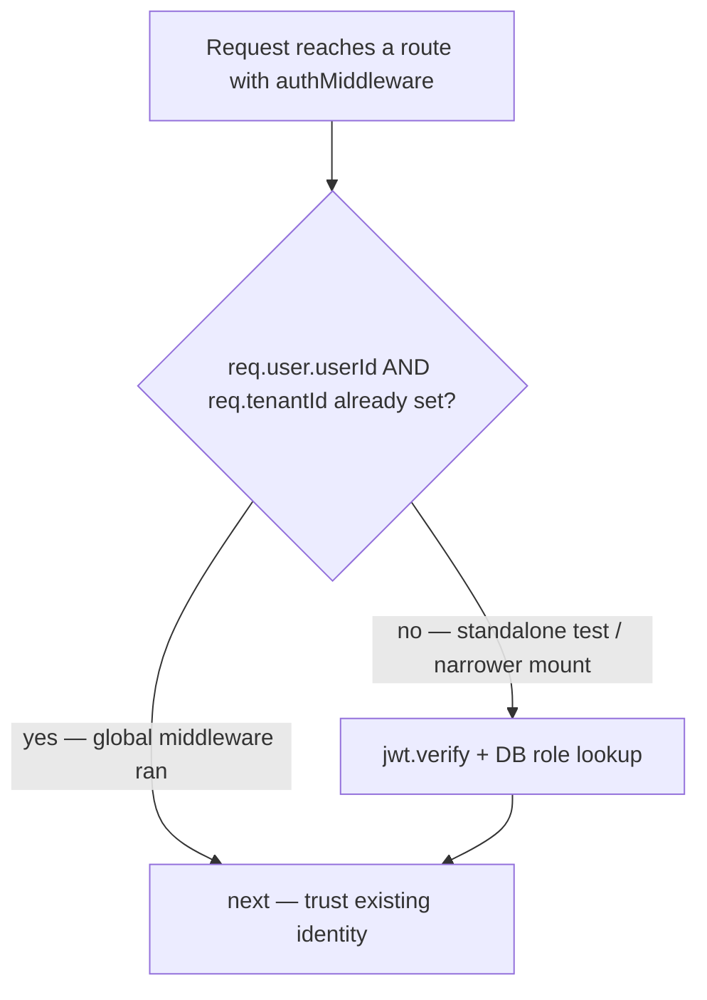
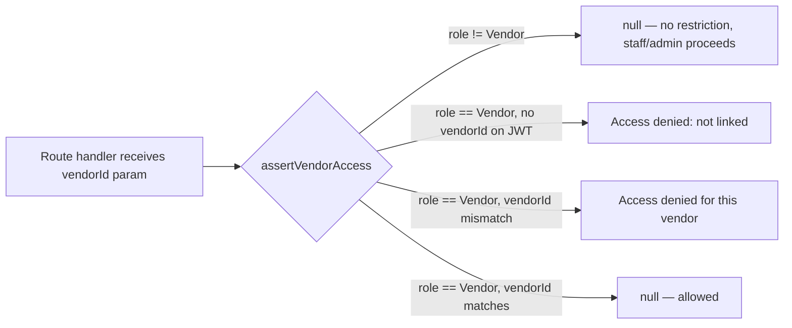

# `server/middleware/auth.ts` — Line by Line

:::tip The contract this file guarantees
By the time a route handler runs, `req.user` and `req.tenantId` are either **populated with a live, DB-verified identity**, or the request never reached the handler at all.
:::

## 1. Two independent auth paths — and why

There are actually **two** places JWT verification happens: the **global** middleware in `server/app.ts` (runs on every `/api/*` request) and **`authMiddleware`** exported from this file (used explicitly on some routes, e.g. `/api/settings/profile`). This looks redundant — it isn't:

```ts
export async function authMiddleware(req: AuthRequest, res: Response, next: NextFunction) {
  // H1: global auth in index.ts already attached live role/vendorId — do not clobber with JWT claims
  if (req.user?.userId && req.tenantId) {
    return next();
  }
  // ...falls back to independently verifying the token if the global middleware hasn't run
  // (e.g. in a unit test that mounts a single router without the full app.ts pipeline)
}
```

The comment `H1` is the whole story: `authMiddleware` **detects** whether the global middleware already ran (by checking `req.user?.userId && req.tenantId`) and, if so, does nothing — it does **not** re-verify and potentially overwrite the already-hydrated live role with the JWT's (possibly stale) claims. If the global middleware *hasn't* run — which happens in narrower test setups that mount a single router directly — `authMiddleware` becomes the sole gate and does full verification itself.



## 2. The `JwtPayload` shape

```ts
export interface JwtPayload {
  userId: string;
  tenantId: string;
  role: string;
  email: string;
  name: string;
  vendorId?: string | null;
  permissions?: Record<string, string>;
  impersonatedBy?: string;  // present on short-lived super-admin impersonation tokens
  iat?: number;
}
```

Notice `role` and `permissions` are present in the payload but are **treated as untrustworthy hints, not ground truth**, on every sensitive path — both `authMiddleware` and the global middleware re-fetch the live `role`/`vendor_id` from the `users` table (via cache or direct query) and overwrite whatever the token claimed. This defends against a scenario where a user's role changed *after* their token was issued but *before* it expires (24h window).

## 3. `generateToken` — HS256, explicit, with an expiry

```ts
export function generateToken(payload: object, expiresIn: string | number = '24h'): string {
  return jwt.sign(payload, JWT_SECRET!, { expiresIn, algorithm: 'HS256' } as jwt.SignOptions);
}
export const generateSuperAdminToken = generateToken;
```

`JWT_SECRET` is validated at module load time — if it's missing, the process logs a fatal error and calls `process.exit(1)` **immediately**, before the server can even start accepting connections. This is the same fail-fast philosophy as `assertCriticalEnv`.

## 4. `authMiddlewareStrict` — for the routes that can't wait 30 seconds

```ts
export async function authMiddlewareStrict(req: AuthRequest, res: Response, next: NextFunction) {
  // Always re-checks password_changed_at synchronously, even if req.user is already set
  ...
}
```

The regular global-middleware path uses `authCache` (30s TTL) for performance. `authMiddlewareStrict` exists for routes where a 30-second revocation lag is unacceptable — it unconditionally re-queries `password_changed_at`, `role`, and `vendor_id` fresh, every time, even if the global middleware already ran. Look for it on the most sensitive mutation endpoints (password/account management).

## 5. Role-based helpers

| Function | What it checks | Typical usage |
|---|---|---|
| `requireRole(allowed: string[])` | `req.user.role` is in the allowed list | `router.delete('/api/products/all', authMiddleware, requireRole(['Admin']), handler)` |
| `requireAdmin` | Convenience alias for `requireRole(['Admin', 'Super Admin'])` | Mounted on destructive/admin-only endpoints |
| `blockVendors` | Rejects if `role === 'Vendor'` | Mounted on write-heavy finance/accounts routes vendors should never touch |
| `vendorScopeId(req)` | Returns the caller's own `vendorId` **only if** they are a Vendor, else `null` | Used to force-filter a query's `vendor_id` predicate for vendor callers |
| `assertVendorLinked(req)` | Errors if a Vendor-role user has no `vendorId` at all (orphaned account) | Guard before any vendor-scoped read |
| `assertVendorAccess(req, vendorId)` | Errors if a Vendor tries to access a **different** vendor's resource | The core IDOR guard for `/api/vendors/:id/...`-style routes |



## 6. `superAdminMiddleware` — an entirely separate identity universe

```ts
export function superAdminMiddleware(req: AuthRequest, res: Response, next: NextFunction) {
  const decoded = jwt.verify(token, JWT_SECRET!, { algorithms: ['HS256'] });
  if (decoded.role !== 'super_admin' && decoded.role !== 'owner' && decoded.role !== 'support') {
    return res.status(403).json({ error: 'Super admin access required' });
  }
  req.user = decoded; next();
}
```

Same `JWT_SECRET`, same HS256 algorithm, but a **completely different role vocabulary** (`super_admin`/`owner`/`support` vs. tenant roles `Admin`/`Manager`/`Staff`/`Warehouse`/`Vendor`) and no tenant lookup at all — a super-admin token has no `tenantId` and isn't scoped to any single tenant's data by design (it's the platform operator's own identity). This is why [Multi-tenancy](/architecture/multi-tenancy) calls out "Super Admin ≠ Tenant Admin" as a trust-boundary rule, not a naming coincidence.

## 7. What happens on password change — the revocation story

1. `PUT /api/settings/change-password` verifies the current password, hashes the new one, and — critically — sets `password_changed_at = NOW()`.
2. Every *existing* JWT for that user has an `iat` (issued-at) earlier than this new timestamp.
3. On the next request with the old token, both the global middleware and `authMiddlewareStrict` compare `password_changed_at.getTime()/1000 > decoded.iat` — if true, they return `401 { error: 'Session expired after password change. Please log in again.' }`.
4. This is Dhandho's entire "logout everywhere" mechanism — there is no token blocklist/revocation list; expiry-by-comparison against a DB timestamp achieves the same effect without storing individual token IDs.

## Hands-on exercise

1. Log in as a tenant Admin, copy the JWT, then have another session change that user's role to `Staff` directly in the database. Make a request with the *old* token within 30 seconds, then again after 30 seconds. What's different, and why?
2. Find every call site of `assertVendorAccess` in `server/routes/*.ts`. Are there any vendor-scoped routes that are missing this check? If you find one, is it actually exploitable, or is there a compensating control elsewhere (e.g. the SQL query itself already filters by the caller's own `vendorId`)?
3. Trace what happens if a request arrives with a syntactically valid but **expired** JWT. Which exact line throws, and what does the caller see?

## Debugging exercise

A user reports being logged out immediately after an admin resets their password via `PUT /api/admin/reset-user-password` (not their own self-service change). Confirm: does that admin-triggered reset path also set `password_changed_at`? If yes, explain why immediate logout is actually the *correct*, intended behavior here rather than a bug.

## Optimization challenge

`authMiddlewareStrict` bypasses the cache entirely for every request it guards. Propose a middle-ground caching strategy with a much shorter TTL (e.g. 2 seconds) that would cut redundant DB load during rapid successive calls to the same strict-guarded endpoint (e.g. a UI that polls `/api/settings/profile` on every keystroke) without meaningfully weakening the "fast revocation" guarantee.

## Quiz

1. Why does `authMiddleware` check `req.user?.userId && req.tenantId` before doing any JWT work of its own?
2. What is Dhandho's mechanism for "log out everywhere" given there's no token blocklist?
3. Why does a super-admin JWT have no `tenantId`?
4. What's the practical difference between `authMiddleware` and `authMiddlewareStrict`?

<details>
<summary>Answers</summary>

1. To avoid clobbering the already-hydrated, DB-verified live role/vendorId (set by the global middleware in `app.ts`) with potentially stale claims from the raw JWT payload — the global middleware, when it ran, is the source of truth.
2. Comparing `password_changed_at` against the token's `iat` on every sensitive request — any token issued before the most recent password change is treated as expired, with no need to track individual token IDs.
3. Because a super admin is a platform operator, not scoped to any single tenant's data — their identity and role vocabulary live in a separate `super_admins` table entirely disjoint from tenant `users`.
4. `authMiddleware` trusts the cached/hydrated identity if the global middleware already set it and uses a 30-second TTL cache otherwise; `authMiddlewareStrict` always re-queries `password_changed_at` synchronously regardless, for routes where a 30-second revocation lag is unacceptable.

</details>

## Related pages

- [Middleware Stack](/backend/middleware-stack)
- [Permissions](/backend/permissions)
- [Authentication (Security)](/security/authentication)
- [Multi-tenancy](/architecture/multi-tenancy)
- [Lab: Debug a 403](/labs/lab-debug-403)
