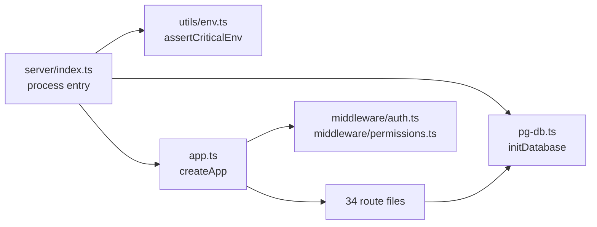
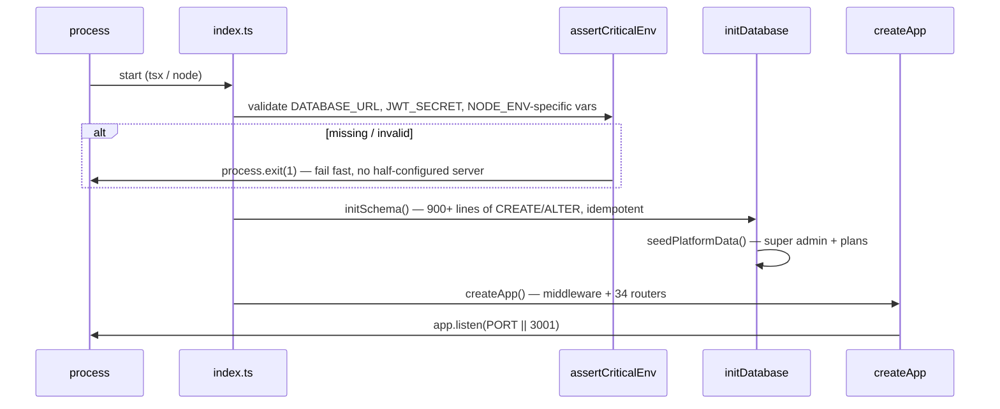

# Backend Overview — `server/` From 30,000 Feet

:::tip One sentence
`server/index.ts` boots; `server/app.ts` wires; `server/pg-db.ts` persists; `server/routes/*.ts` decide.
:::

## 1. The four files that matter most



| File | Responsibility | Line-count feel |
|---|---|---|
| `server/index.ts` | Validate env → init DB → build app → `listen()` | Small, boring on purpose |
| `server/app.ts` | The entire middleware pipeline + all 34 router mounts + error handler + SPA fallback | ~430 lines — the busiest file in the backend |
| `server/pg-db.ts` | Connection pool, `initSchema()` (the whole DB schema as idempotent DDL), RLS setup, `seedPlatformData()` | ~930 lines — the whole schema's source of truth |
| `server/middleware/{auth,permissions}.ts` | WHO you are, WHAT you can touch | ~190 + ~130 lines |

## 2. Boot sequence in detail



Why fail-fast on env? A misconfigured production box that starts anyway and serves traffic with, say, no `JWT_SECRET` fallback would be a silent catastrophe (every token verification would either crash or — worse — behave unpredictably). Crashing on boot is the safer failure mode; Render's health check and restart policy handle the rest.

## 3. The route catalog, at a glance

34 files, mounted in `app.ts` in this order (not alphabetical — mount order can matter for path-prefix overlaps):

```
superAdmin → products → sales → distribution → warranties → replacements → rewards →
customers → vendors → banks → finance → invoiceFinance → onprem → mobile → auth →
admin → dashboard → search → masters → mapping → audit → payroll → expenses →
gstApi → invoices → chatbot → billSettings → reports → purchases → quotations →
orders → priceLists → accounts
```

Grouped by what they actually do (see [Folder Structure](/overview/folder-structure) for the same table with file paths):

| Layer | Routers | What they own |
|---|---|---|
| Platform / identity | `super-admin`, `auth`, `admin`, `onprem`, `mobile` | Tenant provisioning, login, on-prem license lifecycle, mobile device registry |
| Catalog | `products`, `masters`, `mapping`, `price-lists` | Product master data, category/HSN mapping, customer/vendor-tier pricing |
| Trade flow | `distribution`, `sales`, `orders`, `quotations`, `purchases` | The physical-goods pipeline: factory → dealer → customer, and its paper trail |
| Post-sale | `warranties`, `replacements`, `rewards` | Warranty lifecycle, unit swaps, loyalty points |
| Money | `finance`, `invoice-finance`, `accounts`, `invoices`, `expenses`, `payroll`, `banks` | Vendor/supplier ledgers, standalone billing, payroll, bank reconciliation |
| Parties | `customers`, `vendors` | CRM-lite for end customers and the dealer network |
| Tax & compliance | `gst-api`, `reports` | NIC e-invoice/e-way-bill integration, GSTR-2B/3B style reports |
| Cross-cutting | `dashboard`, `search`, `audit`, `chatbot`, `bill-settings` | Aggregation views, global search, the audit trail, AI chat widget, invoice branding |

## 4. Every route file follows the same shape

```ts
import { Router } from 'express';
import { pool } from '../pg-db';
import { authMiddleware, AuthRequest } from '../middleware/auth';
import { logAudit } from '../utils/helpers';
import { safeErrorMessage } from '../utils/pii';

const router = Router();

router.get('/api/products', authMiddleware, async (req: AuthRequest, res) => {
  try {
    const tenantId = req.tenantId;
    const rows = await pool.query('SELECT * FROM products WHERE tenant_id = $1', [tenantId]);
    res.json(rows.rows);
  } catch (err) {
    console.error(`💥 ${req.method} ${req.originalUrl} failed:`, safeErrorMessage(err));
    res.status(500).json({ error: 'Internal server error' });
  }
});

export default router;
```

Recognize this shape and every one of the 34 files becomes readable in minutes: `authMiddleware` (or the double-hydration-safe global auth already did the work), a `tenantId`-scoped query, a `try/catch` that never leaks raw errors, and `logAudit` for anything that mutates.

## 5. What's deliberately absent

- **No dependency injection framework.** Routes import `pool` directly from `pg-db.ts` as a module-level singleton.
- **No service layer between routes and SQL.** Business logic lives directly in route handlers (or small shared helpers in `utils/`), not in a separate domain/service layer — see [Design Decisions](/architecture/design-decisions) for the trade-off.
- **No GraphQL.** Every endpoint is REST-ish JSON over Express — see [API Overview](/api/overview) for conventions.
- **No background job queue.** Everything (including GST NIC calls) happens synchronously within the request/response cycle. There is no BullMQ/Sidekiq-equivalent.

## 6. Cross-cutting utilities every route can reach for

| Utility | File | What it does |
|---|---|---|
| `logAudit(pool, tenantId, action, entityType, entityId, details, userId, userName)` | `utils/helpers.ts` | Writes one row to `audit_log` — called on nearly every mutation |
| `safeErrorMessage(err)` | `utils/pii.ts` | Strips PII/secrets from an error before it's console-logged or (never) sent to a client |
| `checkPlanLimit(tenantId, resource)` | `utils/planLimits.ts` | Enforces subscription tier caps before a create |
| `getCachedAuth` / `setCachedAuth` | `utils/authCache.ts` | 30s TTL cache used by the global auth middleware |
| `encryptSecret` / `decryptSecret` | `utils/secret-crypto.ts` | AES-256-GCM for NIC GST credentials at rest |
| `withTenantClient(tenantId, fn)` | `pg-db.ts` | Transaction-scoped client with `SET LOCAL app.tenant_id` for RLS-sensitive operations |

## Hands-on exercise

1. Open `server/app.ts` and list the 34 router mount lines in the order they appear. Cross-reference against the grouped table above — did any router surprise you by being in an unexpected group?
2. Pick a route file you haven't read yet (e.g. `payroll.ts` or `mapping.ts`). Identify: (a) which HTTP methods it exposes, (b) whether it calls `logAudit`, (c) whether it calls `checkPlanLimit`.
3. Find one route that does **not** follow the standard `try/catch` + `safeErrorMessage` shape. Is the deviation justified (e.g. a public unauthenticated route with a different error contract) or a bug waiting to happen?

## Debugging exercise

A new engineer adds a 35th route file but forgets to mount it in `app.ts`. What HTTP status code will every request to that route return, and why does that status code specifically mislead someone debugging without knowledge of the mount list (hint: think about the SPA fallback at the bottom of `app.ts`)?

## Quiz

1. Why is mount *order* in `app.ts` potentially significant even though Express matches routes by path, not by router registration order alone?
2. Name the one thing every route handler in this codebase does with errors, and why.
3. What replaces a traditional "service layer" in this codebase?

<details>
<summary>Answers</summary>

1. If two routers define overlapping path prefixes (e.g. a router mounted at `/api/finance` and another with a route at `/api/finance/summary`), Express resolves them in registration order — an earlier, broader match can shadow a later, more specific one.
2. Every handler wraps its logic in `try/catch`, logs via `safeErrorMessage` (never raw), and returns a generic `{ error: 'Internal server error' }` — protecting against leaking SQL/stack traces to clients.
3. Business logic lives directly in route handlers plus small shared `utils/` helpers — there is no separate domain/service abstraction layer.

</details>

## Related pages

- [Middleware Stack](/backend/middleware-stack)
- [Auth Middleware](/backend/auth-middleware)
- [Permissions](/backend/permissions)
- [Database Schema Overview](/database/schema-overview)
- [API Overview](/api/overview)
- [Routes Catalog](/backend/routes-catalog)
