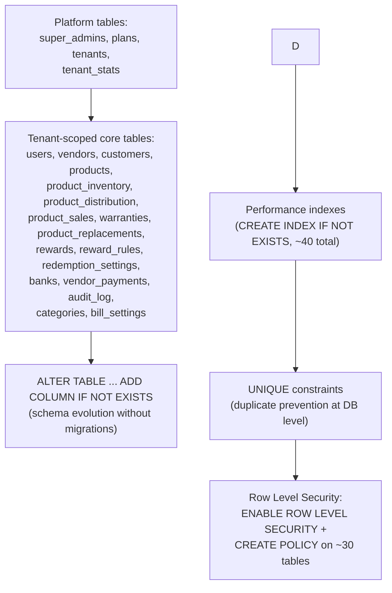
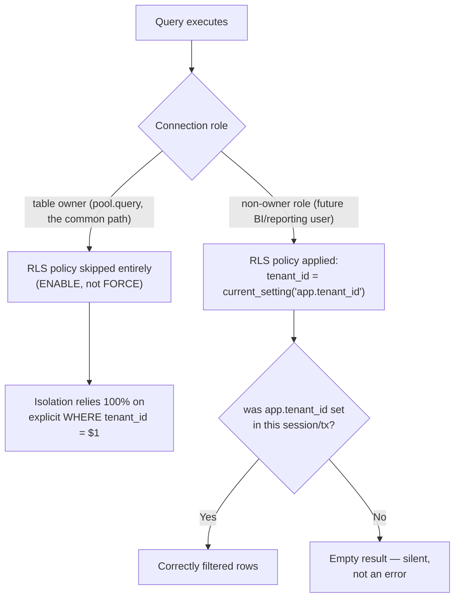

# `pg-db.ts` Deep Dive

:::info File covered
`server/pg-db.ts` (932 lines) — the largest single file that isn't a route.
:::

This file is simultaneously: the connection pool configuration, the *entire* database schema (as a sequence of idempotent DDL statements — there is no separate SQL migration folder), the RLS policy setup, and the platform data seeder. Treat it as the single source of truth for "what tables/columns exist."

## The connection pool

```typescript
const useSsl =
  (process.env.NODE_ENV === 'production' && process.env.DEPLOYMENT_MODE !== 'onprem')
  || process.env.DATABASE_SSL === 'true'
  || !!process.env.DATABASE_URL?.includes('render.com')
  || !!process.env.DATABASE_URL?.includes('neon.tech');

export const pool = new Pool({
  connectionString: process.env.DATABASE_URL,
  max: process.env.DATABASE_POOL_SIZE ? parseInt(process.env.DATABASE_POOL_SIZE, 10) : (process.env.NODE_ENV === 'production' ? 10 : 20),
  idleTimeoutMillis: 30000,
  connectionTimeoutMillis: 10000,
  ...(useSsl ? { ssl: { rejectUnauthorized: process.env.DATABASE_SSL_REJECT_UNAUTHORIZED !== 'false' } } : {}),
});
```

**Why TLS is inferred from more than just `NODE_ENV`:** `useSsl` combines four independent signals — explicit `DEPLOYMENT_MODE`, an explicit override flag, and *heuristic detection of the two managed Postgres providers this app is actually deployed against* (Render, Neon), both of which require TLS on their connection strings regardless of what `NODE_ENV` a developer happens to have set locally while pointing at a real cloud database for a quick debugging session. This heuristic prevents a very real failure mode: a developer with `NODE_ENV=development` running locally but connecting to a *staging* Render/Neon database would otherwise get a plaintext-attempted connection that the provider rejects outright.

**Why pool size differs between prod (10) and dev (20):** counter-intuitive at first glance — production gets a *smaller* pool. This reflects Postgres connection-count economics: managed Postgres tiers (Render's default plans, Neon's free/starter tiers) cap total concurrent connections in the tens, and if the app is horizontally scaled to multiple instances, each instance's pool eats into that shared ceiling — 10 is conservative headroom for multiple production replicas. Locally, there's only ever one instance and often a beefier local/free-tier Postgres, so 20 gives more headroom for concurrent requests during dev (e.g. several browser tabs, hot-reload double-mounts).

```typescript
pool.on('error', (err) => {
  if (process.env.DEPLOYMENT_MODE === 'onprem') return; // expected on app close
  console.error('Unexpected pool error:', err.message);
});
```

**Why swallow pool errors specifically on-prem:** when an Electron on-prem app closes, its embedded Postgres process shuts down while the `pg` pool may still have open/idle connections — those connections error out as the socket closes. That's an *expected* shutdown sequence, not an operational incident; logging it as an "unexpected pool error" on every app close would be noise that trains support/on-call to ignore this log line, which is worse than not logging it at all.

## `setTenantContext` and `withTenantClient` — the RLS session variable, done right

```typescript
export async function setTenantContext(client: PoolClient, tenantId: string) {
  await client.query("SELECT set_config('app.tenant_id', $1, true)", [tenantId]);
}

export async function withTenantClient<T>(tenantId: string, fn: (client: PoolClient) => Promise<T>): Promise<T> {
  const client = await pool.connect();
  try {
    await client.query('BEGIN');
    await client.query("SELECT set_config('app.tenant_id', $1, true)", [tenantId]);
    const result = await fn(client);
    await client.query('COMMIT');
    return result;
  } catch (err) {
    await client.query('ROLLBACK');
    throw err;
  } finally {
    client.release();
  }
}
```

`set_config('app.tenant_id', tenantId, true)` sets a Postgres session/transaction-local GUC variable that the RLS policies (see below and [`rls.md`](/database/rls)) read via `current_setting('app.tenant_id', true)`. The third argument, `true`, means **transaction-local** — the value resets automatically at `COMMIT`/`ROLLBACK`, which matters enormously for a pooled connection: without transaction scoping, a tenant ID set on a connection could leak into the *next* unrelated request that happens to reuse that same pooled connection after this one releases it.

`withTenantClient` wraps the whole pattern — checkout, `BEGIN`, set the GUC, run the callback, `COMMIT`/`ROLLBACK`, `release()` — so call sites can't forget any step. This is used for **destructive operations and sensitive reads** where RLS-as-a-second-layer is worth the overhead of a dedicated client checkout instead of using the shared `pool.query()` helper.

:::danger Why `pool.query()` (used almost everywhere else) does *not* get RLS protection
`pool.query()` grabs an arbitrary connection from the pool, runs one query, and returns it — there is no `BEGIN`, so there is no transaction to scope `app.tenant_id` to, and the GUC is never set at all on that call. This means: **for the vast majority of queries in this codebase, RLS provides zero protection** — the explicit `WHERE tenant_id = $1` in each handler is the *only* thing preventing cross-tenant data leakage on those calls. `withTenantClient` exists precisely because doing this correctly on every single `pool.query()` call (checkout a dedicated client, `SET LOCAL`, use it, release it) for *every* query in a codebase with thousands of query call-sites was judged not worth the connection-pool pressure and code churn versus disciplined `WHERE tenant_id` filtering plus RLS as a narrower safety net on the highest-risk operations.
:::

## `initSchema()` — the schema, as code

The function is one giant sequence of `await client.query(...)` calls, roughly in this shape:



Every single statement uses an idempotent form: `CREATE TABLE IF NOT EXISTS`, `ALTER TABLE ... ADD COLUMN IF NOT EXISTS`, `CREATE INDEX IF NOT EXISTS`, `CREATE UNIQUE INDEX IF NOT EXISTS`, or a guarded `DO $$ BEGIN ... EXCEPTION WHEN duplicate_object THEN NULL; END $$` block for constraints that don't have a native `IF NOT EXISTS` form (like `ADD CONSTRAINT`). See [`migrations-strategy.md`](/database/migrations-strategy) for the full trade-off analysis of this approach versus a migration framework — this page focuses on what's actually in the schema.

### Primary keys are composite: `(id, tenant_id)`

Nearly every tenant-scoped table uses `PRIMARY KEY (id, tenant_id)` rather than a bare `id` primary key. This is a deliberate tenant-isolation design choice, not an accident:

- It means an `id` value is **not required to be globally unique** — two different tenants can independently generate an item with `id = 'P123'` (IDs are app-generated via `uid()`, see [`utils-catalog.md`](/backend/utils-catalog), not DB sequences) with zero collision risk, because uniqueness is only enforced *within* a tenant.
- It makes `tenant_id` a mandatory part of any FK relationship that references these tables, which is a structural nudge (not a guarantee) toward remembering tenant scoping in every join.
- The trade-off: every foreign key that would naturally reference `products(id)` needs to either not be a real DB-level FK (many aren't, deliberately — see below) or reference the composite key, which most tables here don't bother with for anything below the direct tenant reference.

### Not everything is foreign-keyed

Look closely and you'll notice `product_inventory.product_id`, `product_distribution.product_id`, `product_sales.product_id`, etc. are **not** declared as `REFERENCES products(id)` — only the `tenant_id` column carries a hard FK (`REFERENCES tenants(id) ON DELETE CASCADE`). This is intentional: enforcing `ON DELETE CASCADE` semantics transitively across the full object graph (products → inventory → distribution → sales → warranties → replacements) would make deleting a single product a multi-table cascading deletion nobody explicitly asked for, and would make the composite-key FK definitions unwieldy given IDs aren't globally unique. Referential integrity across those relationships is enforced **in application code**, not the database — a known, accepted trade-off for velocity, at the cost of the DB not catching an orphaned reference if application logic has a bug.

### `ON DELETE CASCADE` is used exactly once, deliberately: `tenant_id → tenants(id)`

Every tenant-scoped table cascades on tenant deletion. This is what makes `deleteTenant()` in `utils/tenant.ts` almost redundant in theory — but in practice, `deleteTenant()` still explicitly `DELETE`s from every table in dependency order (see [`utils-catalog.md`](/backend/utils-catalog)) rather than relying purely on the cascade, because relying solely on `DELETE FROM tenants WHERE id = $1` and the cascade to clean up ~30 tables in one implicit operation is harder to reason about, audit-log, and partially retry than an explicit, ordered, application-level deletion.

## Row Level Security — enabled, not forced

```typescript
const rlsTables = ['users', 'vendors', 'customers', 'products', /* ~30 tables */];
for (const table of rlsTables) {
  await client.query(`ALTER TABLE ${table} ENABLE ROW LEVEL SECURITY`);
  await client.query(`
    DO $$ BEGIN
      IF NOT EXISTS (SELECT 1 FROM pg_policies WHERE tablename = '${table}' AND policyname = '${table}_tenant_isolation') THEN
        CREATE POLICY ${table}_tenant_isolation ON ${table}
          USING (tenant_id = current_setting('app.tenant_id', true))
          WITH CHECK (tenant_id = current_setting('app.tenant_id', true));
      END IF;
    END $$
  `);
}
```

The code comment right after this loop is worth quoting verbatim, because it documents a decision that was *tried, reverted, and explained* — exactly the kind of tribal knowledge that's easy to lose:

> RLS policies are enabled (not forced) — the pool owner bypasses them, but the explicit `WHERE tenant_id = $1` in every handler is the primary isolation. `FORCE ROW LEVEL SECURITY` was removed: without per-request `SET LOCAL` inside the same transaction, handlers use `pool.query()` on different connections where `app.tenant_id` is unset → `FORCE RLS` returns empty rows (silent data loss).

Unpacked:
- **`ENABLE ROW LEVEL SECURITY`** applies RLS policies to all roles *except* the table owner (the role the app's `pool` connects as). Since the app always connects as the table owner, RLS as configured here provides **zero protection against the app's own bugs** on the common `pool.query()` path — its actual protective value is against a *different* threat: direct database access by a different, non-owner role (e.g. a read-only reporting user, a support engineer's psql session using a restricted credential, or a future BI tool connection) that could otherwise see every tenant's data with one unscoped `SELECT`.
- **`FORCE ROW LEVEL SECURITY`** would apply the policy even to the table owner — which sounds strictly safer, until you remember `app.tenant_id` is only ever set inside a `withTenantClient`-style transaction. The vast majority of queries use plain `pool.query()`, which never sets that GUC. Under `FORCE RLS`, `current_setting('app.tenant_id', true)` on those connections evaluates to `NULL`, `tenant_id = NULL` is never true, and **every unscoped query would silently return zero rows** — not an error, not a 403, just empty result sets that look like "no data" instead of "misconfigured security." This was judged far worse than the current setup, because it fails in a way indistinguishable from legitimate empty data, actively hiding the misconfiguration it would be protecting against.



See [`rls.md`](/database/rls) for the full policy list and threat model this defends against.

## `seedPlatformData()`

Creates the super admin (idempotently — checks for an existing row by email before inserting) from `SUPER_ADMIN_EMAIL`/`SUPER_ADMIN_PASSWORD`, hashing the password with `bcrypt` at cost factor 12. Upserts the four plans (`TRIAL`, `BASIC`, `STANDARD`, `PROFESSIONAL`) with their `max_products`/`max_vendors`/`max_users`/`max_barcodes` limits and `features` JSONB flags, via `INSERT ... ON CONFLICT (id) DO UPDATE` — meaning **plan definitions in code are the source of truth**, and any manual DB edit to a plan's limits gets overwritten on the next process restart. This is intentional: plan pricing/limits should be a code review, not a production console edit.

:::tip Why bcrypt cost factor 12
Cost factor 12 means 2^12 = 4096 rounds of the underlying Blowfish-based hashing — a deliberate, tunable slow-down that makes offline brute-forcing of a stolen password hash computationally expensive (each guess costs real CPU time) while still completing in well under 100ms server-side for a single login attempt. This value is used consistently across every password-hashing site in the codebase (`utils/helpers.ts`'s `hashPassword`, `utils/tenant.ts`'s provisioning flow, this seeder) — consistency matters because a lower cost factor anywhere would be the weakest link.
:::

## Complexity & performance notes

- `initSchema()` cost is O(number of DDL statements) — see [`app-bootstrap.md`](/backend/app-bootstrap) for the boot-sequencing implications.
- `setTenantContext`/`withTenantClient`: O(1) plus one extra round trip (`SET_CONFIG`) per transaction versus a bare `pool.query()` — the accepted overhead for RLS-backed operations.
- Every index in this file (`idx_products_tenant`, `idx_ps_date`, `uq_users_tenant_email`, etc.) exists to keep the *actual* query patterns used by the 34 routers — filtering and sorting by `tenant_id` plus a second column — off of full table scans. See [`performance.md`](/database/performance) for the index catalog and the reasoning behind specific composite indexes.

## What breaks if pieces of this file are removed

| Removed | Symptom |
|---|---|
| `useSsl` heuristic (hardcoded to `NODE_ENV === 'production'` only) | Local dev pointed at a Render/Neon staging DB for debugging fails to connect (provider rejects plaintext), or a misconfigured on-prem deployment with `NODE_ENV=production` incorrectly tries TLS against its local embedded Postgres and fails to connect at all. |
| `pool.on('error', ...)` handler entirely | Unhandled pool errors can crash the Node process on connection drops — turns a transient network blip into full downtime. |
| Transaction-local scoping (`true` param) in `set_config` | `app.tenant_id` persists on a pooled connection across unrelated requests — the next tenant to reuse that connection inherits a stale, wrong tenant context for any RLS-protected query on that connection. |
| Composite `(id, tenant_id)` primary keys (replaced with bare `id`) | App-generated IDs must become globally unique across all tenants — either changing ID generation entirely or reintroducing exactly the cross-tenant collision risk this design avoids. |
| RLS policies (all `CREATE POLICY` statements) | The only remaining tenant-isolation guarantee is the application's own `WHERE tenant_id = $1` discipline — no DB-level backstop against a future non-owner connection or an RLS-unaware ad hoc query tool. |

## Related pages

- [`rls.md`](/database/rls) — full RLS threat model and policy catalog.
- [`schema-overview.md`](/database/schema-overview) — the schema from the database's point of view.
- [`migrations-strategy.md`](/database/migrations-strategy) — why idempotent DDL instead of a migration tool.
- [`performance.md`](/database/performance) — indexes, pool sizing, and bulk-insert chunking in context.
- [`patterns.md`](/backend/patterns) — how route handlers actually use transactions and locking against this schema.
