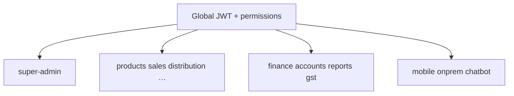
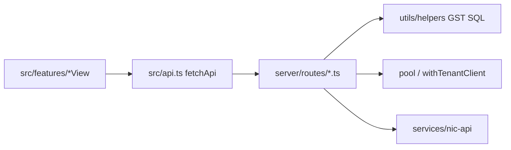

# Routes Catalog — All 34 Routers

:::tip Mental model
One file ≈ one business domain. Mounted in `createApp()` after global JWT + `enforceModulePermissions`. If you add a route file, you must also update `PATH_MODULE` in `permissions.ts` or authz silently skips it.
:::

## Mount order (from `server/app.ts`)

Routers are mounted as bare `app.use(router)` — each file defines full paths like `/api/products`.

## Full catalog

| Router file | Primary prefixes | Permission module(s) | Notes |
|---|---|---|---|
| `super-admin.ts` | `/api/super-admin/*`, `/api/tenant/by-slug/:slug` | *(platform — SA middleware)* | Tenant CRUD, plans, billing, impersonate, analytics |
| `products.ts` | `/api/products`, `/api/categories` | `inventory` | Barcodes, batch CSV, stock add |
| `sales.ts` | `/api/sales` | `sales` | Barcode POS, bill fetch |
| `distribution.ts` | `/api/distribution` | `distribution` | Batches, dispatch, EWB fields, billing |
| `warranties.ts` | `/api/warranties` | `warranty` | Serial warranty lifecycle |
| `replacements.ts` | `/api/replacements` | `replacements` | Old/new barcode validation |
| `rewards.ts` | `/api/rewards`, `/api/reward-rules`, `/api/redemption-settings` | `rewards` | Points + rules |
| `customers.ts` | `/api/customers` | `sales` | CRM + purchase history |
| `vendors.ts` | `/api/vendors` | `distribution` | Dealers; bulk import |
| `banks.ts` | `/api/banks` | `accounts` | Admin bank master |
| `finance.ts` | `/api/vendor-finance` | `finance` | Receivables, reminders, bank statement |
| `invoice-finance.ts` | `/api/invoice-finance` | `finance` | Party-keyed collections (`partyKey`); payments against standalone invoices |
| `onprem.ts` | `/api/onprem/*`, `/api/super-admin/onprem` | public + SA | License activate/heartbeat; settings + Bell sync; localhost provision |
| `notifications.ts` | `/api/notifications` | auth (ungated module) | Quiet Bell feed: SA messages + digests |
| `auth.ts` | `/api/auth/*`, `/api/settings/profile` | public / self | Login, reset, profile, self-delete |
| `admin.ts` | `/api/admin/users` | `settings` | Tenant user CRUD |
| `dashboard.ts` | `/api/dashboard/*`, `/api/analytics/*` | `dashboard` | Stats + overview |
| `search.ts` | `/api/search` | `dashboard` | Cross-entity search (products/customers/vendors/barcodes/challans/staff). Used by Search / Verify tab and the header ⌘K `CommandPalette` (search-only; verify stays on the verification tab). Offline Mobile mirrors this via local `GET /search`. |
| `masters.ts` | `/api/masters/counts` | `settings` | Hub counts |
| `mapping.ts` | `/api/mapping/*` | `sales` | Vendor↔customer |
| `audit.ts` | `/api/audit-log`, `/api/backup/*` | `settings` | Audit + backup/restore |
| `payroll.ts` | `/api/staff`, `/api/payroll` | `accounts` | Staff + salary (creates expense) |
| `expenses.ts` | `/api/expenses` | `accounts` | P&L feed |
| `gst-api.ts` | `/api/gst/*` | `accounts` | NIC IRN/EWB settings + generate |
| `invoices.ts` | `/api/invoices` | `sales` | Standalone invoices; optional `partyType`/`partyId` on create |
| `chatbot.ts` | `/api/chatbot` | `dashboard` | Rule-based NLQ; 30/min limiter |
| `bill-settings.ts` | `/api/settings/bill` | `settings` | Bill branding |
| `reports.ts` | `/api/reports/*` | `accounts` | Registers + GSTR-1; `blockVendors` |
| `purchases.ts` | `/api/purchases`, `/api/suppliers`, `/api/supplier-finance` | `purchases` | Stock-creating purchase batches |
| `quotations.ts` | `/api/quotations` | `quotations` | Status machine + convert |
| `orders.ts` | `/api/orders` | `orders` | Fulfill → distribution |
| `price-lists.ts` | `/api/price-lists` | `inventory` | Slabs + `/resolve` + `/bulk` name import |
| `accounts.ts` | `/api/accounts/*`, `/api/gstr3b`, `/api/gstr2b` | `accounts` | P&L, BS, CF, ledger; `blockVendors` |

**Count:** 34 routers imported in `app.ts` (matches the table).

## Public paths (bypass global JWT)

Defined in `PUBLIC_PATHS` inside `app.ts`:

- Auth: login, forgot/reset password  
- SA login, tenant-by-slug, health, manifest  
- On-prem: activate, heartbeat, deactivate, provision, apply-settings, apply-notifications, mark-applied, mark-notifications-delivered  

Everything else → Bearer JWT required.

## How to add a 35th router (checklist)

1. Create `server/routes/foo.ts` exporting `default router`  
2. `import` + `app.use(fooRouter)` in `app.ts`  
3. Add `[ '/foo', 'moduleName' ]` to `PATH_MODULE` in `permissions.ts`  
4. Decide: `blockVendors`? `requireAdmin`? vendor scope?  
5. Add `tests/api/foo.test.ts` with real Postgres  
6. Optionally wrap in `src/api.ts` namespace  
7. Document here + in `/api/overview`

:::danger Unmapped paths
`moduleForPath` comment says unmapped paths are **not gated**. A new money endpoint without a `PATH_MODULE` entry is an authz hole.
:::

## Call hierarchy (who calls what)

## Common mistakes

1. Defining `/api/foo` in a router but forgetting `PATH_MODULE`  
2. Putting business logic only in the UI — vendors can still hit the API  
3. Mounting a router *before* the global JWT middleware (don't — keep mounts at the bottom of `createApp`)  
4. Assuming mount order among routers matters for path conflicts — prefer unique prefixes  

## Interview question

*Why are reports and accounts behind `blockVendors` even if a Vendor has `accounts: view` in a custom permission JSON?*

:::info Answer sketch
Defense in depth. Vendor portal must not see company-wide P&L/registers. `blockVendors` is a hard role gate; module permissions alone are insufficient if someone mis-edits JSON.
:::

## Hands-on

1. `rg "router\\.(get|post|put|delete)" server/routes/distribution.ts | wc -l`  
2. Pick one handler; list its auth helpers (`requireAdmin`, `assertVendorAccess`, …)  
3. Curl it as Staff vs Admin; document status codes  

## Related

- [Backend Overview](/backend/overview)  
- [Permissions](/backend/permissions)  
- [API Overview](/api/overview)  
- [Patterns](/backend/patterns)  
