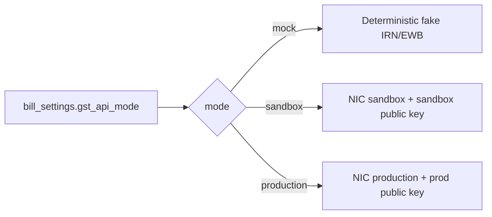
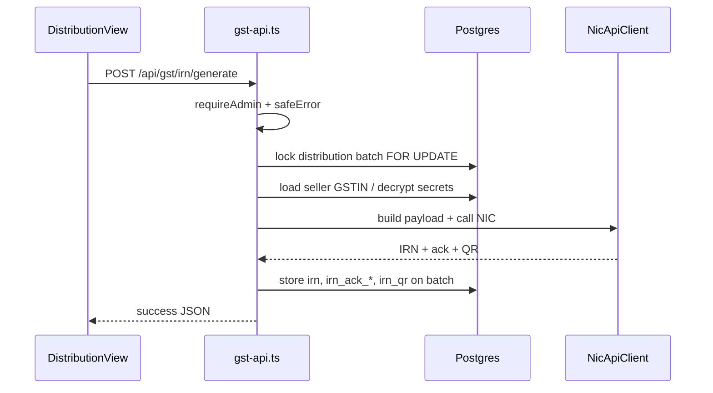

# NIC GST API Service

**File:** `server/services/nic-api.ts`  
**Called from:** `server/routes/gst-api.ts`  
**Credentials stored in:** `bill_settings` (password/client secret encrypted via `secret-crypto`)

## Why this exists

Indian B2B invoices above thresholds need **IRN** (Invoice Registration Number) from the NIC e-Invoice system, and goods movement often needs an **e-Way Bill**. Dhandho generates payloads server-side so GST secrets never enter the browser.

## Modes

| Mode | When to use |
|---|---|
| `mock` | Local/dev demos without NIC credentials |
| `sandbox` | Integration testing with GSTN sandbox |
| `production` | Live taxpayers |

Public keys come from env: `GSTN_SANDBOX_PUBLIC_KEY`, `GSTN_PRODUCTION_PUBLIC_KEY`, or `GSTN_PUBLIC_KEY`.

## Request lifecycle (IRN)

E-Way Bill flow is similar but requires `vehicleNo` + `distance`.

## What the route layer adds

- Admin-only mutations  
- Row locks so two clerks cannot double-IRN one batch  
- `safeError()` allow-list — NIC/library errors must not leak SQL/stack  
- Settings GET redacts secrets; PUT encrypts before store  

## Failure modes

| Symptom | Likely cause |
|---|---|
| 403 | Not Admin / module accounts insufficient |
| Generic 500 | NIC down; check server logs + correlationId |
| Validation error | Missing GSTIN, pin, or line HSN |
| Decrypt error | `JWT`/crypto key changed after secrets encrypted |

See [Runbook: GST API Failures](/runbooks/gst-api-failures).

## Alternatives rejected

| Alternative | Why not |
|---|---|
| Call NIC from browser | Secret exfiltration |
| Always-mock in prod | Illegal/useless filings |
| Sync blocking without lock | Duplicate IRNs / race |

## Security

- Treat NIC credentials like bank passwords  
- Never log decrypted password  
- Rotate by re-entering in Settings → GST API after key rotation  

## Interview question

*Why lock the distribution batch before calling NIC?*

:::info Answer sketch
IRN generation is not idempotent from a business perspective — two parallel clicks could register two invoices or leave inconsistent local state. `FOR UPDATE` serializes writers on that batch row.
:::

## Hands-on

1. Set mode to `mock` in bill settings  
2. Create a distribution batch with GSTIN vendor  
3. Generate IRN; confirm `irn` columns populated  
4. Read `gst-api.ts` `safeError` patterns  

## Related

- [API: GST](/api/gst)  
- [Business Workflows](/architecture/business-workflows)  
- [Secrets](/security/secrets)  
