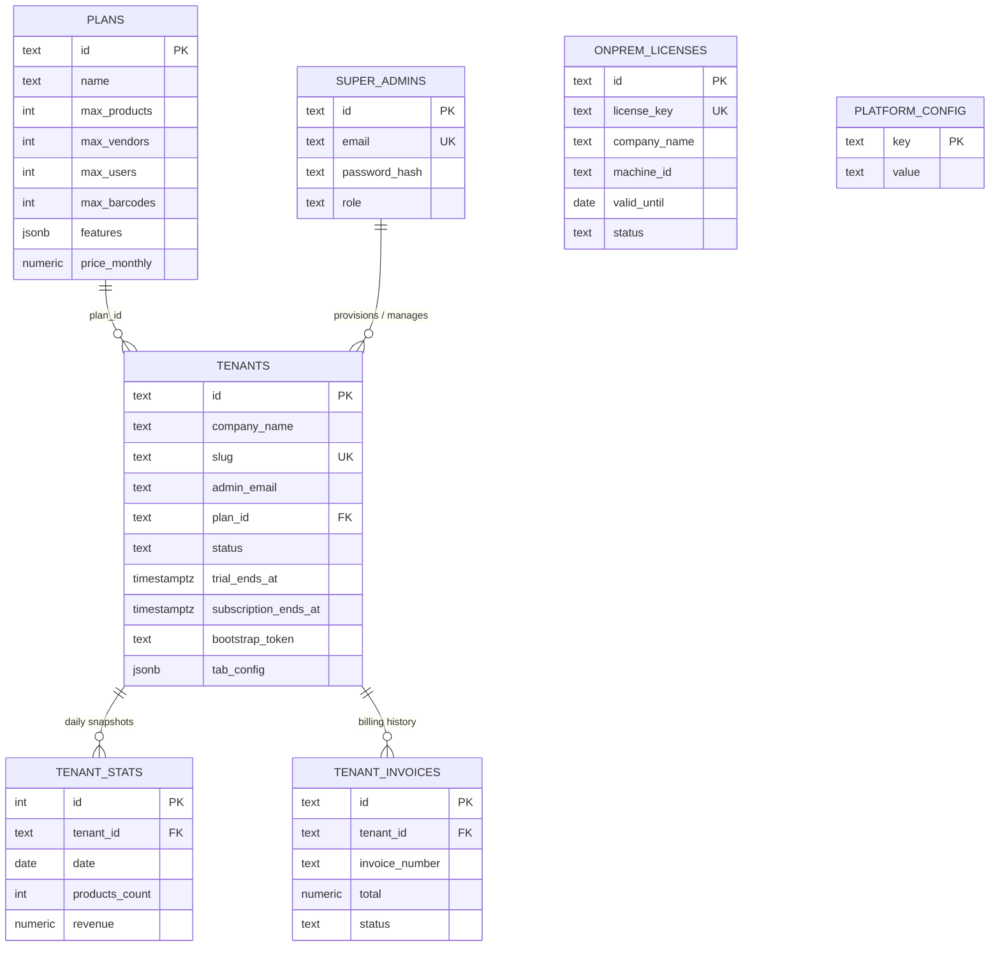

# Entity-Relationship Diagram

:::info Reading this diagram
This is a curated ERD — it includes the tables that matter for understanding the *business model*, not every column of every table (there are ~45 tables total; see [`platform-tables.md`](/database/platform-tables) and [`tenant-tables.md`](/database/tenant-tables) for the complete column-level catalog). Attribute lists below show the columns most relevant to understanding each entity's role, not the full `CREATE TABLE` statement.
:::

## Platform plane



`ONPREM_LICENSES` and `PLATFORM_CONFIG` have no FK to `TENANTS` — an on-prem license binds to a `machine_id`, not a cloud tenant row, because on-prem deployments run their *own* embedded Postgres with their *own* local `tenants` row; the cloud `onprem_licenses` table only tracks the license/entitlement, not the on-prem tenant's actual data.

## Tenant identity & access

```mermaid
erDiagram
    TENANTS ||--o{ USERS : "tenant_id"
    TENANTS ||--o{ VENDORS : "tenant_id"
    TENANTS ||--o{ CUSTOMERS : "tenant_id"
    VENDORS ||--o| USERS : "vendor_id (Vendor-role users)"
    VENDORS ||--o{ CUSTOMERS : "vendor_id (which vendor onboarded them)"
    VENDORS ||--o{ VENDOR_REMINDER_SETTINGS : "vendor_id"

    USERS {
        text id PK
        text tenant_id PK_FK
        text email
        text role
        jsonb permissions
        text vendor_id
        timestamptz password_changed_at
    }
    VENDORS {
        text id PK
        text tenant_id PK_FK
        text name
        text gst_number
        int total_reward_points
    }
    CUSTOMERS {
        text id PK
        text tenant_id PK_FK
        text name
        text phone
        text vendor_id
    }
```

The special `id = 'OWNER'` row in `VENDORS` (created at tenant provisioning — see [`backend/utils-catalog.md`](/backend/utils-catalog)) represents direct sales, not an external distributor — every tenant has exactly one.

## Product catalog & inventory lifecycle

```mermaid
erDiagram
    TENANTS ||--o{ PRODUCTS : "tenant_id"
    TENANTS ||--o{ CATEGORIES : "tenant_id"
    PRODUCTS ||--o{ PRODUCT_INVENTORY : "product_id (app-level, not FK)"
    PRODUCT_INVENTORY ||--o| PRODUCT_DISTRIBUTION : "barcode lifecycle transition"
    PRODUCT_DISTRIBUTION ||--o| PRODUCT_SALES : "barcode lifecycle transition"
    PRODUCT_SALES ||--o| WARRANTIES : "barcode lifecycle transition"
    WARRANTIES ||--o| PRODUCT_REPLACEMENTS : "old_barcode → new_barcode"
    VENDORS ||--o{ PRODUCT_DISTRIBUTION : "vendor_id"
    CUSTOMERS ||--o{ PRODUCT_SALES : "customer_id"
    PRODUCTS ||--o{ PRICE_LISTS : "product_id"

    PRODUCTS {
        text id PK
        text tenant_id PK_FK
        text name
        text barcode
        numeric price
        numeric gst_rate
        int pack_size
        text pack_name
        boolean price_includes_gst
    }
    PRODUCT_INVENTORY {
        text id PK
        text tenant_id PK_FK
        text product_id
        text barcode UK_per_tenant
        text status "InStock | Distributed | Sold"
        text batch_id
        text unit_type "piece | box"
    }
    PRODUCT_DISTRIBUTION {
        text id PK
        text tenant_id PK_FK
        text barcode
        text vendor_id
        numeric net_price
        numeric billed_price
        boolean gst_applied
        text irn
        text ewb_number
        text dispatch_status
    }
    PRODUCT_SALES {
        text id PK
        text tenant_id PK_FK
        text barcode
        text vendor_id
        text customer_id
        numeric sale_price
        int reward_points_earned
    }
    WARRANTIES {
        text id PK
        text tenant_id PK_FK
        text barcode
        date activation_date
        date expiry_date
        text status
        text replaced_barcode
    }
    PRODUCT_REPLACEMENTS {
        text id PK
        text tenant_id PK_FK
        text old_barcode
        text new_barcode
        text warranty_id
    }
```

:::note Why the arrows in the code block above say "app-level, not FK"
As explained in [`pg-db.md`](/backend/pg-db), `product_id`/`barcode`/`vendor_id`/`customer_id` cross-references between these lifecycle tables are **not** declared as SQL foreign keys — only `tenant_id → tenants(id)` is a real FK on every one of these tables. The relationships shown here are enforced by application logic (route handlers explicitly check existence before inserting a reference), not by the database schema itself.
:::

## Procurement

```mermaid
erDiagram
    TENANTS ||--o{ SUPPLIERS : "tenant_id"
    SUPPLIERS ||--o{ PRODUCT_PURCHASES : "supplier_id"
    SUPPLIERS ||--o{ SUPPLIER_PAYMENTS : "supplier_id"
    PRODUCTS ||--o{ PRODUCT_PURCHASES : "product_id"
    PRODUCT_PURCHASES ||--o| PRODUCT_INVENTORY : "receipt creates InStock rows"

    SUPPLIERS {
        text id PK
        text tenant_id PK_FK
        text name
        text gst_number
    }
    PRODUCT_PURCHASES {
        text id PK
        text tenant_id PK_FK
        text product_id
        text supplier_id
        numeric cost_price
        numeric billed_price
        text invoice_number
        text batch_id
    }
    SUPPLIER_PAYMENTS {
        text id PK
        text tenant_id PK_FK
        text supplier_id
        numeric amount
        text batch_id
    }
```

## Sales documents & finance

```mermaid
erDiagram
    VENDORS ||--o{ QUOTATIONS : "vendor_id"
    VENDORS ||--o{ ORDERS : "vendor_id"
    QUOTATIONS ||--o| ORDERS : "converted_batch_id"
    ORDERS ||--o| PRODUCT_DISTRIBUTION : "fulfilled_batch_id"
    VENDORS ||--o{ VENDOR_PAYMENTS : "vendor_id"
    TENANTS ||--o{ STANDALONE_INVOICES : "tenant_id"
    STANDALONE_INVOICES ||--o{ INVOICE_PAYMENTS : "invoice_id (real FK, ON DELETE RESTRICT)"
    TENANTS ||--o{ CREDIT_DEBIT_NOTES : "tenant_id"
    TENANTS ||--o{ BANKS : "tenant_id"
    TENANTS ||--o{ EXPENSES : "tenant_id"
    TENANTS ||--o{ STAFF_MEMBERS : "tenant_id"
    STAFF_MEMBERS ||--o{ STAFF_PAYMENTS : "staff_name (denormalized, not FK)"

    QUOTATIONS {
        text id PK
        text tenant_id PK_FK
        text quotation_number
        jsonb items
        numeric total
        text status
    }
    ORDERS {
        text id PK
        text tenant_id PK_FK
        text order_number
        jsonb items
        text status
        text fulfilled_batch_id
    }
    STANDALONE_INVOICES {
        text id PK
        text tenant_id FK
        text invoice_number
        text customer_name
        text party_type
        text party_id
        jsonb items
        numeric grand_total
        text status
    }
    INVOICE_PAYMENTS {
        text id PK
        text tenant_id PK_FK
        text invoice_id FK
        numeric amount
    }
```

:::tip The one real, enforced foreign key among the business tables
`invoice_payments.invoice_id → standalone_invoices(id) ON DELETE RESTRICT` is the single exception to the "app-level references only" rule (see [`pg-db.md`](/backend/pg-db) for the migration that added it, including the `DELETE FROM invoice_payments ip WHERE NOT EXISTS (...)` cleanup that ran once before the constraint could be added). `ON DELETE RESTRICT` (not `CASCADE`) means: **you cannot delete a standalone invoice that still has payment records** — the database actively prevents that data-integrity mistake, unlike everywhere else in the schema.
:::

## Rewards & configuration

```mermaid
erDiagram
    TENANTS ||--o{ REWARDS : "tenant_id"
    TENANTS ||--o{ REWARD_RULES : "tenant_id"
    TENANTS ||--|| REDEMPTION_SETTINGS : "tenant_id (one row per tenant)"
    TENANTS ||--|| BILL_SETTINGS : "tenant_id PK (one row per tenant)"
    USERS ||--o{ REWARDS : "user_id"

    REWARDS {
        text id PK
        text tenant_id PK_FK
        text user_id
        int points
        text type
        text sale_id
    }
    BILL_SETTINGS {
        text tenant_id PK
        text logo_base64
        text gst_api_mode
        text gst_api_password "encrypted at rest"
    }
```

## What this ERD deliberately omits

- `audit_log`, `mobile_devices`, `password_reset_tokens`, `vendor_reminder_settings` — simple, largely-standalone tables not central to the business-domain narrative (fully documented in [`tenant-tables.md`](/database/tenant-tables) and [`platform-tables.md`](/database/platform-tables)).
- Every index and constraint — see [`performance.md`](/database/performance) for indexes and [`rls.md`](/database/rls) for row-level security policies layered on top of every table shown here.

## Related pages

- [`schema-overview.md`](/database/schema-overview) — the narrative version of this diagram.
- [`tenant-tables.md`](/database/tenant-tables) / [`platform-tables.md`](/database/platform-tables) — full column listings.
- [`queries-and-fragments.md`](/database/queries-and-fragments) — how these tables are actually joined and aggregated in real queries.
