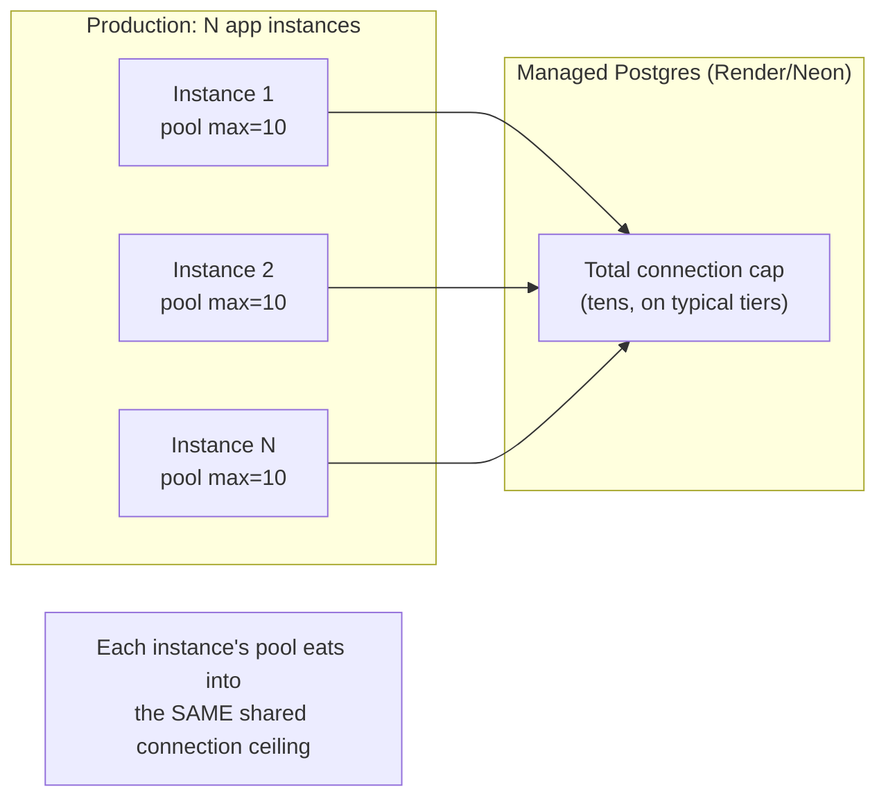
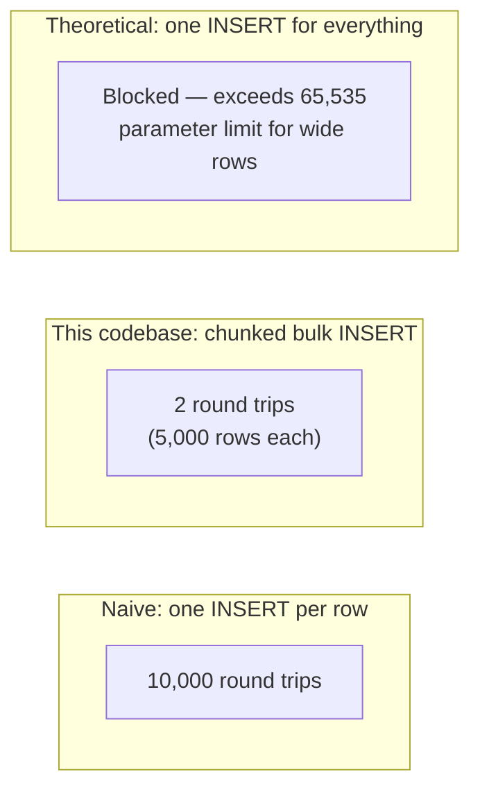

# Database Performance

:::info Scope of this page
This covers database-layer performance specifically. For application-layer performance (N+1 query patterns in route handlers, caching, etc.), see [`performance/backend`](/performance/backend) and [`performance/database`](/performance/database).
:::

## Index catalog, by purpose

DG-ERP's indexing strategy is entirely **workload-driven** — every index in `initSchema()` exists because a specific, real query pattern from a specific route needed it, not from a general "index every foreign key" policy (recall from [`tenant-tables.md`](/database/tenant-tables) that most cross-references *aren't* real foreign keys anyway).

### Tenant-scoping indexes (the baseline, on every table)

```sql
CREATE INDEX idx_products_tenant ON products(tenant_id);
CREATE INDEX idx_vendors_tenant ON vendors(tenant_id);
-- ... one per tenant-scoped table
```

Every tenant-scoped table has at minimum an index with `tenant_id` as the leading column — this is the floor, because **every single query in the codebase filters by `tenant_id`** (see [`rls.md`](/database/rls) for why this is the primary isolation mechanism, not just a performance concern). Without this, every query would be a full table scan filtered post-hoc — fine at a few hundred rows, ruinous once any single tenant accumulates tens of thousands.

### Composite indexes matching real query shapes

| Index | Table | Query pattern it serves |
|---|---|---|
| `idx_pi_product_status` | `product_inventory` | `WHERE tenant_id=$1 AND product_id=$2 AND status='InStock' ... FOR UPDATE SKIP LOCKED` — the stock-allocation hot path (see [`backend/patterns.md`](/backend/patterns) Pattern 2) |
| `idx_pi_barcode` | `product_inventory` | Barcode lookups/verification — `WHERE tenant_id=$1 AND barcode=$2` |
| `idx_pd_vendor` | `product_distribution` | Vendor-scoped distribution lists (`vendorScopeId` filtering — see [`backend/auth-middleware.md`](/backend/auth-middleware)) |
| `idx_pd_date` | `product_distribution` | Date-range reports (`distribution_date BETWEEN $1 AND $2`) |
| `idx_pd_batch` | `product_distribution` | Fetching all units in one distribution batch |
| `idx_ps_vendor`, `idx_ps_date`, `idx_ps_customer` | `product_sales` | Sales register reports, customer purchase history |
| `idx_customers_name`, `idx_customers_phone` | `customers` | Point-of-sale/search-by-name-or-phone lookups |
| `idx_audit_tenant` (`tenant_id, created_at`), `idx_audit_action` (`action, created_at`) | `audit_log` | Per-tenant audit trail (chronological) vs. platform-wide activity by action type — two genuinely different access patterns on the same table, each needing its own leading column |
| `idx_prt_active` (partial: `WHERE used = false`) | `password_reset_tokens` | Looking up *active* reset tokens specifically — a partial index keeps the index small by excluding the (eventually much larger) set of already-used/expired tokens that are never looked up by this query |

**Why composite indexes lead with `tenant_id` even when a narrower index (e.g. just `barcode`) might seem sufficient:** a bare `barcode` index would work correctly (barcodes are unique per tenant, enforced by `uq_pi_tenant_barcode`), but every real query also filters by `tenant_id` — leading the composite index with `tenant_id` means the query planner can satisfy the *entire* `WHERE tenant_id=$1 AND barcode=$2` predicate from one index traversal, rather than filtering by barcode across all tenants and then checking tenant_id row-by-row. At this schema's row-count scale this difference is not yet dramatic, but it's the correct indexing discipline for a multi-tenant table regardless of current scale, and it costs nothing extra to get right from the start.

### Uniqueness constraints (also indexes, doing double duty)

```sql
CREATE UNIQUE INDEX uq_users_tenant_email ON users(tenant_id, LOWER(email));
CREATE UNIQUE INDEX uq_products_tenant_name ON products(tenant_id, LOWER(name));
CREATE UNIQUE INDEX uq_pi_tenant_barcode ON product_inventory(tenant_id, barcode);
CREATE UNIQUE INDEX uq_quotations_tenant_num ON quotations(tenant_id, quotation_number);
```

Every one of these enforces a real business uniqueness rule **at the database level** (not just in application code) — case-insensitive email/name uniqueness per tenant, barcode uniqueness per tenant — while simultaneously serving as a fast lookup path for exactly those columns. This is "free" performance: the constraint you need for correctness *is* the index you'd have wanted for speed anyway.

## Connection pool sizing

From [`backend/pg-db.md`](/backend/pg-db):

```typescript
max: process.env.DATABASE_POOL_SIZE
  ? parseInt(process.env.DATABASE_POOL_SIZE, 10)
  : (process.env.NODE_ENV === 'production' ? 10 : 20)
```

**Why production gets a *smaller* pool than development — the counter-intuitive part explained:**



A single local developer's machine, running one instance against a local (or generously-provisioned free-tier) Postgres, can afford pool `max=20` — there's no other instance competing for connections. In production, if the app is scaled to multiple replicas (common on Render), *each* replica opens its own pool up to `max` — so the real ceiling to watch is `replicas × max`, which must stay under whatever the managed Postgres tier allows. A conservative `max=10` per instance leaves headroom for horizontal scaling without every deploy risking a `too many connections` error from the database itself. `DATABASE_POOL_SIZE` is exposed as an override specifically so this can be tuned per-deployment without a code change, as actual tenant count and traffic patterns become clearer over time.

**`idleTimeoutMillis: 30000` / `connectionTimeoutMillis: 10000`:** idle connections are released back after 30s of inactivity (avoids holding connections open "just in case" during quiet periods — freeing them for other instances/processes sharing the same database), and a connection *attempt* that can't complete within 10s fails fast rather than queueing requests indefinitely behind a possibly-unreachable database.

## Bulk insert chunking at 5,000 rows

Full reasoning in [`backend/patterns.md`](/backend/patterns) Pattern 6 — the short performance-specific summary: PostgreSQL's wire protocol caps a prepared statement at 65,535 bind parameters. Chunking at 5,000 rows keeps every call site (regardless of whether a row needs 7 params or 12) safely under that ceiling while inserting in as few round trips as possible — turning what would be thousands of individual `INSERT` round trips (for, say, a 10,000-unit barcode generation request) into just 2 multi-row `INSERT` statements.



The performance gain isn't primarily about database CPU time (Postgres processes a 5,000-row multi-value `INSERT` efficiently either way) — it's about **eliminating network round-trip latency**, which dominates total wall-clock time for high-row-count operations far more than the per-row insert cost itself does.

## The denormalized counters, and their performance rationale

Several tables carry denormalized summary columns instead of relying purely on live aggregate queries:

- `products.stock` — avoids a `COUNT(*) FROM product_inventory WHERE status='InStock'` on every product list render.
- `vendors.total_sales`, `vendors.total_reward_points` — avoids aggregating `product_sales`/`rewards` on every vendor list render.

**Why this is an acceptable trade-off at this scale, but would need revisiting at a much larger one:** for a tenant with a few thousand products and a few hundred vendors, the "just aggregate live" alternative would likely still perform fine — these denormalized columns are more about **reducing query complexity in list views** (a simple `SELECT * FROM products` instead of a `LEFT JOIN` aggregate subquery) than about surviving genuinely large data volumes. The cost: these columns are correct only as long as every write path that should update them actually does — a missed update site is a silent, slow-to-notice data-drift bug, not a crash. If this system ever needed to scale to dramatically larger per-tenant data volumes, the next step would likely be replacing these with materialized views or a scheduled recomputation job, rather than trusting write-path discipline indefinitely.

## Query patterns that are intentionally *not* optimized further

- **JSONB line items on `quotations`/`orders`/`standalone_invoices`/`credit_debit_notes`** have no GIN index — querying "all quotations containing product X" would require a full-table JSONB scan. This is accepted because that query pattern doesn't occur in the actual product (see [`tenant-tables.md`](/database/tenant-tables)'s reasoning on why these are JSONB in the first place).
- **No read replicas, no query result caching layer** (beyond the 30-second in-memory `authCache` — see [`backend/utils-catalog.md`](/backend/utils-catalog)) — a single primary Postgres instance serves all reads and writes. Appropriate for the target scale (SME back-office ERP, not a high-traffic consumer app); would be the first thing to revisit under significantly higher read load.

## Complexity summary table

| Operation | Complexity | Bounded by |
|---|---|---|
| Tenant-scoped list query (indexed column) | O(log n + k) — index seek + k matching rows | B-tree index depth + result set size |
| Stock allocation (`FOR UPDATE SKIP LOCKED`) | O(k) where k = quantity requested | `LIMIT $3`, backed by `idx_pi_product_status` |
| Barcode existence check across 5 lifecycle tables | O(1) round trip, O(matching rows across tables) work | Per-table barcode indexes; `LIMIT 1` short-circuits as soon as any match is found |
| Bulk insert of n rows | O(n) params, O(n / 5000) round trips | The 65,535 parameter ceiling |
| `moduleForPath` permission check | O(m) where m ≈ 35 route prefixes | Linear scan, not indexed (in-memory, not DB) — see [`backend/permissions.md`](/backend/permissions) |

## What breaks if these optimizations are removed

| Removed | Symptom |
|---|---|
| Any `idx_*_tenant` index | Every query against that table becomes a full scan filtered by tenant — fine for a brand-new tenant, degrades linearly (then worse, under concurrent load) as any tenant's row count grows. |
| `idx_pi_product_status` specifically | The `FOR UPDATE SKIP LOCKED` stock-allocation query (run on every sale/distribution/order) scans the entire tenant's inventory table instead of seeking directly to matching rows — the exact hot path where latency matters most for a good point-of-sale experience. |
| 5,000-row chunking (replaced with unchunked bulk insert) | Any bulk operation above roughly 9,000 rows (7 params/row) or ~5,400 rows (12 params/row) throws a hard PostgreSQL parameter-limit error, failing the entire request with no partial success — see [`backend/patterns.md`](/backend/patterns)'s warning about recalculating chunk size per row-width. |
| Conservative production pool size (raised to match dev's 20) | Multiple production replicas collectively risk exceeding the managed Postgres provider's total connection cap, causing connection failures across the whole fleet during traffic spikes — the worst possible time for this kind of failure. |

## Related pages

- [`backend/pg-db.md`](/backend/pg-db) — pool configuration in code.
- [`backend/patterns.md`](/backend/patterns) — the chunking and locking patterns in application-code context.
- [`tenant-tables.md`](/database/tenant-tables) — the tables these indexes protect.
- [`performance/database`](/performance/database) — broader database performance topics (query plans, `EXPLAIN`, monitoring).
