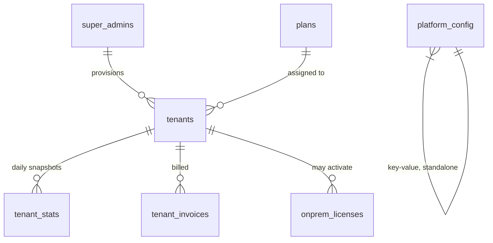

# Platform Tables

Seven tables in `initSchema()` carry **no** `tenant_id` column at all. They live in a separate authority universe from everything in [Tenant Tables](/database/tenant-tables) — this is the schema-level expression of the platform/tenant split covered conceptually in [Personas & Roles](/overview/personas-and-roles).



## `tenants` — the root of everything

```sql
CREATE TABLE tenants (
  id TEXT PRIMARY KEY,
  company_name TEXT NOT NULL,
  slug TEXT NOT NULL UNIQUE,
  admin_email TEXT NOT NULL,
  plan_id TEXT REFERENCES plans(id),
  status TEXT DEFAULT 'active',
  trial_ends_at TIMESTAMPTZ,
  subscription_ends_at TIMESTAMPTZ,
  tab_config JSONB,
  business_type TEXT DEFAULT 'manufacturer',
  bootstrap_token TEXT,
  -- + mobile invite/version columns, backup settings, feature toggles
);
```

Every tenant-scoped table's `tenant_id` foreign key points here. `slug` is the public, human-facing identifier (`/{slug}` in the URL — see [Multi-tenancy](/architecture/multi-tenancy) tenant resolution flow); `id` is the internal identifier used in every join. `status` (`active`/`trial`/`suspended`) and the two expiry timestamps (`trial_ends_at`, `subscription_ends_at`) are checked on **every authenticated request** by the global auth middleware in `app.ts` — an expired or suspended tenant gets a 403 before any route handler runs, regardless of what that handler would otherwise allow.

## `plans` — subscription tiers and their limits

```sql
CREATE TABLE plans (
  id TEXT PRIMARY KEY, name TEXT NOT NULL,
  max_products INTEGER DEFAULT -1, max_vendors INTEGER DEFAULT -1,
  max_users INTEGER DEFAULT -1, max_barcodes INTEGER DEFAULT -1,
  features JSONB DEFAULT '{}',
  price_monthly NUMERIC(10,2), price_yearly NUMERIC(10,2)
);
```

Seeded by `seedPlatformData()` on every boot with four fixed plans (`TRIAL`, `BASIC`, `STANDARD`, `PROFESSIONAL`) via `INSERT ... ON CONFLICT (id) DO UPDATE` — meaning plan definitions are **code, not admin-editable data** in the current design; changing a plan's limits means editing the array in `pg-db.ts` and redeploying, not clicking a button in a Super Admin screen. `-1` means unlimited, checked by `checkPlanLimit()` (`utils/planLimits.ts`) before create operations on products/vendors/users/barcodes.

## `super_admins` — a completely separate account table from `users`

```sql
CREATE TABLE super_admins (
  id TEXT PRIMARY KEY, email TEXT NOT NULL UNIQUE,
  password_hash TEXT NOT NULL, role TEXT DEFAULT 'owner'
);
```

No `tenant_id`, no foreign key to `tenants`. Authenticated via a completely separate login endpoint (`POST /api/super-admin/login`) and a separate JWT-verification path (`superAdminMiddleware`, checking `role` is one of `owner`/`support`/`super_admin`). A super admin is never "a user who happens to also be an admin of a tenant" — see [Personas & Roles](/overview/personas-and-roles) for why this separation is deliberate and security-load-bearing.

## `tenant_stats` — daily analytics snapshots

```sql
CREATE TABLE tenant_stats (
  id SERIAL PRIMARY KEY, tenant_id TEXT REFERENCES tenants(id) ON DELETE CASCADE,
  date DATE, products_count INT, vendors_count INT, sales_count INT, revenue NUMERIC(12,2)
);
```

Note the irony: this table *does* carry `tenant_id`, but it's still a "platform table" in spirit — it exists purely so Super Admin's cross-tenant analytics dashboard can aggregate growth/usage across every tenant without running expensive live `COUNT(*)` queries against every tenant-scoped table on every dashboard load. It's a materialized rollup, written by a periodic job (not by tenant-facing routes), read only by `super-admin.ts`.

## `tenant_invoices` — Dhandho's own billing of its customers

```sql
CREATE TABLE tenant_invoices (
  id TEXT PRIMARY KEY, tenant_id TEXT REFERENCES tenants(id) ON DELETE CASCADE,
  invoice_number TEXT, period_start DATE, period_end DATE, plan_name TEXT,
  amount NUMERIC(12,2), total NUMERIC(12,2), status TEXT DEFAULT 'unpaid'
);
```

Don't confuse this with `standalone_invoices` (a **tenant-scoped** table — a tenant's own customer billing, covered in [Tenant Tables](/database/tenant-tables)). `tenant_invoices` is Dhandho-the-company invoicing its own customers (the tenants) for their subscription — same word, opposite direction, easy to mix up when scanning table names quickly.

## `onprem_licenses` — the on-prem product's activation system

```sql
CREATE TABLE onprem_licenses (
  id TEXT PRIMARY KEY, license_key TEXT UNIQUE NOT NULL,
  company_name TEXT, max_users INT DEFAULT 5, valid_until DATE, status TEXT DEFAULT 'active',
  machine_id TEXT, last_seen TIMESTAMPTZ, settings JSONB DEFAULT '{}'
);
```

An on-prem installation is **not** a row in `tenants` at all — it's a self-contained deployment running its own local `initSchema()` against its own embedded Postgres (see [Four Surfaces](/architecture/four-surfaces)). This table lives on the *cloud* platform side and only tracks license validity + periodic heartbeats (`machine_id`, `last_seen`) from installed on-prem clients — it's a licensing ledger, not a tenant record.

## `platform_config` — a generic key/value escape hatch

```sql
CREATE TABLE platform_config (key TEXT PRIMARY KEY, value TEXT, updated_at TIMESTAMPTZ);
```

The one genuinely schema-less table — a catch-all for platform-wide settings that don't yet justify a dedicated typed column (feature flags for the platform itself, global announcement banners, etc.). Read/write only through `super-admin.ts`.

## Common mistakes

1. Confusing `tenant_invoices` (Dhandho billing a tenant) with `standalone_invoices` (a tenant billing their own customer) — different tables, different direction, same English word.
2. Assuming Super Admin analytics (`tenant_stats`) is always live/real-time — it's a snapshot, refreshed periodically, not computed on read.
3. Trying to add `tenant_id` to `super_admins` "for consistency" — this would be a category error; super admins are not scoped to any tenant by definition.

## Related

- [Tenant Tables](/database/tenant-tables)
- [Schema Overview](/database/schema-overview)
- [API → Super Admin](/api/super-admin)
- [Personas & Roles](/overview/personas-and-roles)
