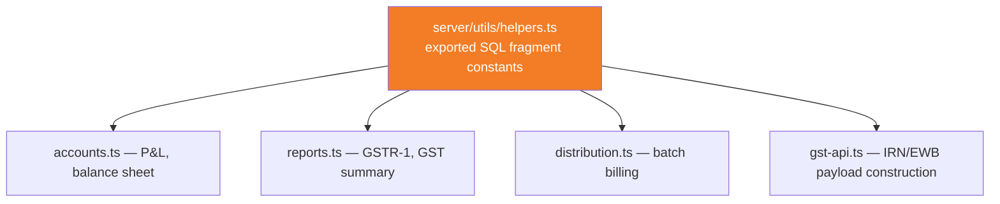

# Shared SQL Fragments and Query Patterns

**Home:** `server/utils/helpers.ts` (the fragments), `server/utils/pagination.ts` (list-endpoint helpers), plus inline SQL scattered across `server/routes/*.ts` that imports and reuses them.

There is no query builder, no ORM, and no `.sql` file per query — every query in this codebase is a raw parameterized string passed to `pool.query()`. That makes **consistency of the tricky calculations** (GST math, distribution pricing) an active problem to solve, not something a framework enforces automatically. This page is about the specific fragments that solve it.

## Why fragments exist: GST math must never drift between call sites

`GET /api/reports/gst-summary`, `GET /api/accounts/profit-loss`, `POST /api/gst/irn/generate`, and the distribution bill PDF all need to answer the *same* questions about the *same* row: is this unit's price GST-inclusive or exclusive? What's the taxable value? What's the tax amount? If each of those four call sites independently wrote its own `CASE WHEN gst_applied THEN ... END`, the moment one of them got updated (a bug fix, a new edge case) and the others didn't, GSTR filings and customer-facing invoices would **disagree with each other** — a trust-destroying bug class for an accounting-adjacent product. Centralizing the fragment in one exported constant makes "fix it once, fixed everywhere" actually true.



## The fragment families (real names from `helpers.ts`)

```ts
// server/utils/helpers.ts
export const DISTRIBUTION_BILL_UNIT_SQL = 'COALESCE(pd.billed_price, pd.net_price, p.price)';
export const DISTRIBUTION_TAXABLE_SQL = 'COALESCE(pd.net_price, p.price)';
export const DISTRIBUTION_TAX_SQL = `CASE WHEN COALESCE(pd.gst_applied, false)
  THEN GREATEST(0, COALESCE(pd.billed_price, pd.net_price, p.price) - COALESCE(pd.net_price, p.price))
  ELSE 0 END`;

export const PURCHASE_TAXABLE_SQL = 'COALESCE(pp.cost_price, 0)';
export const PURCHASE_TAX_SQL = `CASE WHEN COALESCE(pp.gst_applied, false)
  THEN GREATEST(0, COALESCE(pp.billed_price, pp.cost_price, 0) - COALESCE(pp.cost_price, 0))
  ELSE 0 END`;
```

| Fragment | Answers | Used by |
|---|---|---|
| `DISTRIBUTION_BILL_UNIT_SQL` | "What does the vendor owe for this unit?" — the billable amount, GST-inclusive when set | `finance.ts` vendor balances, `distribution.ts` batch totals, `reports.ts` outstanding register |
| `DISTRIBUTION_TAXABLE_SQL` | "What's this unit's taxable value, excluding GST?" | `accounts.ts` P&L revenue (tax-exclusive by CA convention), `reports.ts` GSTR-1 |
| `DISTRIBUTION_TAX_SQL` | "How much GST is on this unit?" (zero if `gst_applied` is false) | `accounts.ts` balance sheet GST payable, `reports.ts` gst-summary |
| `PURCHASE_TAXABLE_SQL` / `PURCHASE_TAX_SQL` | The purchase-side mirror of the two above — cost price instead of sale price | `accounts.ts` ITC (input tax credit) calculation, purchase registers |

Plus a TypeScript (not SQL) helper for the CGST/SGST vs IGST split, used when building actual e-invoice/e-way-bill payloads rather than aggregate reports:

```ts
export function splitGst(taxAmt: number, sellerGstin?: string | null, buyerGstin?: string | null) {
  const sState = String(sellerGstin || '').trim().toUpperCase().slice(0, 2);
  const bState = String(buyerGstin || '').trim().toUpperCase().slice(0, 2);
  const interstate = sState !== bState && /^\d{2}$/.test(sState) && /^\d{2}$/.test(bState);
  if (interstate) return { cgst: 0, sgst: 0, igst: tax, interstate: true };
  const cgst = Math.round((tax / 2) * 100) / 100;
  return { cgst, sgst: Math.round((tax - cgst) * 100) / 100, igst: 0, interstate: false };
}
```

:::tip Why some GST logic is SQL and some is TypeScript
`DISTRIBUTION_TAX_SQL` etc. are SQL fragments because reports and dashboards need to **aggregate across thousands of rows** — `SUM(${DISTRIBUTION_TAX_SQL})` inside a `GROUP BY` is a set-based operation Postgres does far more efficiently than pulling every row into Node and summing in JavaScript. `splitGst()` is TypeScript because CGST/SGST/IGST splitting only needs to run **once per document** (one invoice, one e-way bill) at generation time — a single-row calculation with no aggregation benefit from living in SQL, and easier to unit-test as a pure function. The dividing line is: does this run over many rows at once (SQL fragment) or one document at a time (TS helper)?
:::

## Pattern: fragments are snippets, not full queries

```ts
// server/routes/accounts.ts (real usage)
const distRevenue = Number((await pool.query(`
  SELECT COALESCE(SUM(${DISTRIBUTION_TAXABLE_SQL}), 0) as t
  FROM product_distribution pd JOIN products p ON pd.product_id = p.id AND p.tenant_id = $1
  WHERE pd.tenant_id = $1 AND pd.distribution_date >= $2 AND pd.distribution_date <= $3
`, [tenantId, from, to])).rows[0]?.t ?? 0) || 0;
```

The fragment interpolates as a plain string into the SQL template — it never carries its own bind parameters, and it's always used *inside* a query that has its own `tenant_id = $1` parameterization. This is a deliberate boundary: fragments describe a **calculation**, never a **filter** — mixing the two would risk a fragment accidentally omitting the tenant scope on some call site. Always grep for `DISTRIBUTION_|PURCHASE_|splitGst` across `server/` before writing new tax-adjacent SQL, to check whether the calculation you're about to hand-roll already exists.

## Pattern: pagination

Two competing pagination helpers exist side by side, which is itself worth knowing about:

```ts
// server/utils/helpers.ts — legacy, still used by some older list endpoints
export function parsePagination(query: Record<string, unknown>): { limit: number; offset: number; page: number } {
  const page = Math.max(1, parseInt(String(query.page ?? '1'), 10) || 1);
  const limit = Math.min(200, Math.max(1, parseInt(String(query.limit ?? '50'), 10) || 50));
  return { limit, offset: (page - 1) * limit, page };
}

// server/utils/pagination.ts — newer, higher default/max limits, used by newer endpoints
export function parsePagination(
  query: Record<string, unknown>,
  opts: { defaultLimit?: number; maxLimit?: number } = {},
): PageParams {
  const defaultLimit = opts.defaultLimit ?? 500;
  const maxLimit = opts.maxLimit ?? 1000;
  // ...
}
```

:::warning Two functions, same name, different files, different caps
`utils/helpers.ts` exports a `parsePagination` capped at 200 rows/page; `utils/pagination.ts` exports a *different* `parsePagination` capped at 1000 rows/page with configurable defaults. Which one a given route file imports depends entirely on which module path it wrote in its `import` statement — there's no compiler error if a new route accidentally imports the wrong one, since both have an identical exported name and a compatible-enough shape. When adding a new list endpoint, check `utils/pagination.ts` first (it's the newer, preferred one) and confirm which one nearby sibling endpoints in the same route file already use, for consistency within that file.
:::

New list endpoints should default to `utils/pagination.ts`'s version and always cap `limit` — an unbounded `LIMIT` driven by client-supplied query params is a straightforward DoS vector against a shared Postgres instance serving every tenant.

## Pattern: date-range filtering

```ts
// server/utils/helpers.ts
export function applyDateFilter(query: Record<string, unknown>, dateColumn: string, params: unknown[], paramOffset?: number): string {
  const { dateFrom, dateTo, dateRange } = query;
  if (dateRange === 'today') { /* ... */ }
  else if (dateRange === 'week') { /* d.setDate(d.getDate() - 7) */ }
  else if (dateRange === 'month') { /* d.setMonth(d.getMonth() - 1) */ }
  else {
    if (dateFrom) { /* AND col >= $N */ }
    if (dateTo) { /* AND col <= $N */ }
  }
  return sql; // appended directly into the caller's WHERE clause string
}
```

Used across `sales.ts`, `warranties.ts`, and reporting endpoints so that "last 7 days" / "last month" / explicit date range all mean the exact same thing everywhere a list can be filtered by date, instead of each screen inventing its own relative-date arithmetic.

## Pattern: bulk insert chunking

Postgres has a hard limit around 65,535 bind parameters per statement. `POST /api/products/batch` (CSV product import) and `POST /api/purchases/batch` (purchase batch creation) both validate the *entire* input array up front — reject the whole request if any row fails validation, before any `INSERT` runs — then insert in chunks safely under that parameter ceiling rather than building one giant multi-row `INSERT` statement per request.

```ts
// server/routes/products.ts (pattern, abridged)
const bulkErr = assertBulkSize(items, 500); // utils/pagination.ts — hard cap before touching the DB
if (bulkErr) return res.status(400).json({ error: bulkErr });
// validate every row first...
// then insert, chunked
```

:::tip Why validate everything before inserting anything
`POST /api/products/batch` is explicitly all-or-nothing — a CSV import with 400 valid rows and 1 malformed row should not silently create 400 products and skip the bad one, because the importing admin has no easy way to know afterward which row failed without re-diffing their spreadsheet against what landed. Failing the whole batch with a specific error message ("row 217: price must be a number") before any `INSERT` runs keeps the operation atomic from the user's point of view, even without wrapping the whole thing in a single database transaction.
:::

## EXPLAIN mindset for a slow screen

```sql
EXPLAIN (ANALYZE, BUFFERS)
SELECT ps.*, p.name as product_name
FROM product_sales ps JOIN products p ON ps.product_id = p.id AND p.tenant_id = $1
WHERE ps.tenant_id = $1 AND ps.purchase_date >= $2
ORDER BY ps.purchase_date DESC LIMIT 50;
```

Given the indexing philosophy in [Schema Overview](/database/schema-overview) (every tenant-scoped table indexed on `tenant_id` first), the first thing to check in a slow-query investigation is whether the actual `WHERE`/`ORDER BY` combination lines up with an existing composite index (`idx_ps_date ON product_sales(tenant_id, purchase_date)`, in this example) or is forcing a sequential scan filtered in-memory. See [Database Performance](/database/performance) for the specific indexes this schema has accumulated and why.

## Common mistakes

1. Filtering by tenant "in application memory" after a `SELECT *` with no `WHERE tenant_id` — defeats the entire point of parameterized tenant scoping and is a straightforward cross-tenant data leak if the post-filter step is ever skipped or buggy.
2. `ILIKE '%term%'` search filters with no `LIMIT` on a tenant that's accumulated tens of thousands of rows — always pair free-text search with pagination.
3. Recomputing GST in JavaScript with slightly different rounding than the SQL fragments use — `Math.round(x * 100) / 100` in TS vs whatever Postgres's `NUMERIC` arithmetic produces can disagree at the paisa level on edge cases; prefer letting the SQL fragment be the single source of truth for anything that's also computed in a report.
4. Importing the wrong `parsePagination` (see the warning above) and getting an unexpectedly low or high row cap compared to a sibling endpoint.
5. Writing a new tax calculation inline instead of checking whether `DISTRIBUTION_TAX_SQL`/`PURCHASE_TAX_SQL` already covers it.

## Interview question

> **Q: Why centralize `DISTRIBUTION_TAX_SQL` as a SQL string fragment instead of computing GST once in TypeScript and storing the result in a column?**
>
> Expected answer: storing a computed `tax_amount` column would need to be kept in sync every time `gst_applied`, `net_price`, or `billed_price` changes on that row — an update-anomaly risk. Computing it on read via a shared fragment means it's always derived fresh from the authoritative source columns, and a single fragment update instantly corrects every report and endpoint that uses it, with no backfill migration needed. The trade-off is a small amount of repeated computation on every read instead of a write-time computation — acceptable because these aggregates run over report-sized row counts, not hot-path single-row lookups.

## Hands-on exercise

1. Open `server/utils/helpers.ts`, copy `DISTRIBUTION_TAX_SQL` into a scratch note, and manually trace through it for a row where `gst_applied = false` — confirm it evaluates to `0`, not `NULL`.
2. Run `rg "DISTRIBUTION_TAX_SQL" server` and find all three-plus call sites. For each, note whether it's summed in a `GROUP BY` (a report) or evaluated per-row (a bill/receipt).
3. Propose a fourth call site — pick an existing route in `server/routes/*.ts` that currently computes distribution tax with its own inline `CASE WHEN` (if any exist) instead of importing the fragment, and describe the one-line change to fix it.

## Related

- [Schema Overview](/database/schema-overview)
- [Database Performance](/database/performance)
- [API → GST](/api/gst)
- [API → Finance & Accounts](/api/finance-accounts)
- [Backend → Utils Catalog](/backend/utils-catalog)
