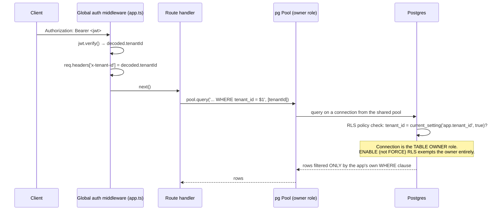
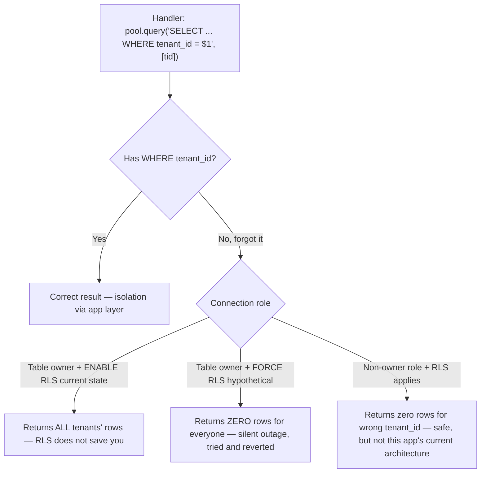

# Row-Level Security — Enabled, Not Forced, and Why That's Deliberate

:::danger RLS is not the primary tenant lock in this codebase
The primary lock is **`WHERE tenant_id = $N` written into every SQL query by hand**, sourced from the verified JWT via `req.headers['x-tenant-id']`. Row-Level Security is a second, DB-level layer that exists as defense-in-depth — not as the thing that actually stops Tenant A from reading Tenant B's data on a day-to-day basis. If you're reviewing a PR and your instinct is "RLS will catch it if they forgot the WHERE clause," that instinct is **wrong** for the connection pattern this app uses, and this page explains exactly why.
:::

## Where this lives in the codebase

Two functions in `server/pg-db.ts`, plus a 31-table loop at the bottom of `initSchema()`:

```ts
// server/pg-db.ts
export async function setTenantContext(client: import('pg').PoolClient, tenantId: string) {
  await client.query("SELECT set_config('app.tenant_id', $1, true)", [tenantId]);
}

export async function withTenantClient<T>(
  tenantId: string,
  fn: (client: import('pg').PoolClient) => Promise<T>,
): Promise<T> {
  const client = await pool.connect();
  try {
    await client.query('BEGIN');
    await client.query("SELECT set_config('app.tenant_id', $1, true)", [tenantId]);
    const result = await fn(client);
    await client.query('COMMIT');
    return result;
  } catch (err) {
    await client.query('ROLLBACK');
    throw err;
  } finally {
    client.release();
  }
}
```

```sql
-- Applied identically to all 31 tenant-scoped tables in a loop
ALTER TABLE products ENABLE ROW LEVEL SECURITY;
CREATE POLICY products_tenant_isolation ON products
  USING (tenant_id = current_setting('app.tenant_id', true))
  WITH CHECK (tenant_id = current_setting('app.tenant_id', true));
```

## The request path, end to end



The critical fact in that diagram: the Node process connects to Postgres as the **table owner** (the same role that ran `initSchema()`'s DDL) — a common, simple setup for a small-to-medium SaaS app that hasn't stood up a separate, lower-privileged runtime database role. `ENABLE ROW LEVEL SECURITY` (as opposed to `FORCE`) exempts the table owner from the policy check entirely. So for the overwhelming majority of requests in this app, **the RLS policy above never actually runs** — the query returns whatever the application's own `WHERE tenant_id = $1` asked for, correct or not.

## The decision that matters: `ENABLE`, not `FORCE`

This is spelled out directly in `pg-db.ts`'s own comments, and it's worth quoting because it's the single most important trade-off documented in this codebase's security posture:

```ts
// server/pg-db.ts
// RLS policies are enabled (not forced) — the pool owner bypasses them,
// but the explicit WHERE tenant_id = $1 in every handler is the primary isolation.
// FORCE ROW LEVEL SECURITY was removed: without per-request SET LOCAL inside the
// same transaction, handlers use pool.query() on different connections where
// app.tenant_id is unset → FORCE RLS returns empty rows (silent data loss).
```

Unpacked, mechanically:

1. Postgres RLS has two enforcement modes: `ENABLE ROW LEVEL SECURITY` (policies apply to everyone *except* the table owner) and `FORCE ROW LEVEL SECURITY` (policies apply to *everyone*, including the owner).
2. Most route handlers call `pool.query(...)` directly — a connection pulled from the shared pool, used once for that query, and returned to the pool. There is no `BEGIN`/transaction wrapper, and therefore no call to `setTenantContext()`.
3. `app.tenant_id` (set via `set_config(..., true)`) is scoped to the **current transaction** — it resets automatically at `COMMIT`/`ROLLBACK` specifically so it can never leak across pooled-connection reuse between unrelated requests. A bare, transaction-less `pool.query()` call never sets it.
4. **If `FORCE RLS` were applied**, every one of those un-scoped `pool.query()` calls would suddenly become subject to the policy — and since `app.tenant_id` was never set on that connection, `current_setting('app.tenant_id', true)` evaluates to `NULL`. `tenant_id = NULL` matches **zero rows**, for every tenant, on every table, on every request. The query would not error; it would silently return an empty result set — indistinguishable, from the outside, from "this tenant genuinely has no data."
5. That failure mode — every request in production suddenly seeing empty lists — is **worse** than the vulnerability RLS is meant to prevent. The team tried `FORCE`, hit exactly this, and reverted it. The comment in the source is the fossil record of that incident.



:::warning The practical consequence for anyone writing a new route
If you write a new handler and forget `WHERE tenant_id = $N`, the current configuration means it returns (or modifies) **every tenant's rows**, not zero rows and not an error. RLS, as configured today, will not catch this for you. This is the single fact worth internalizing before touching `server/routes/*.ts`.
:::

## So what does RLS actually protect against, today?

Not nothing — but a narrower slice than "the app's own bugs." `ENABLE` (non-forced) RLS protects against access paths that bypass the application's route-handler code entirely while still connecting as a **non-owner** Postgres role:

- A future read-only analytics/reporting connection provisioned with a lower-privileged role.
- A future admin tool that connects directly to Postgres rather than going through the API.
- A SQL-injection payload that (hypothetically, since parameterized queries are used everywhere — see [Conventions](/api/conventions)) manages to execute under a non-owner role.
- A developer running ad-hoc queries from a psql session using a role other than the app's owner role, who forgets to filter by tenant.

It does **not** protect against the actual, current, most-likely failure mode: the application's own `pool.query()` forgetting its own `WHERE` clause while running as the owner role.

## `setTenantContext` / `withTenantClient` — where RLS *does* apply today

A handful of code paths that need extra defense-in-depth — most notably sensitive per-barcode inventory transactions and other multi-step, transaction-wrapped operations — use `withTenantClient(tenantId, fn)` instead of a bare `pool.query()`. Inside that helper, `setTenantContext` runs `set_config('app.tenant_id', $1, true)` at the start of the transaction, so for the duration of that transaction, RLS policies *would* additionally filter results if the owner-bypass didn't exist. Practically, on the current owner-role connection, this call is a no-op for correctness (the WHERE clause is still doing the real work) — but it keeps the transaction "RLS-clean," which matters if the connection role is ever downgraded from owner to a restricted role in the future without an app-wide rewrite.

**Super-admin tenant provisioning** (`provisionTenant` / `deleteTenant` in `server/utils/tenant.ts`) also calls `setTenantContext` inside its transaction. Without it, inserts into `users` / `vendors` / `redemption_settings` fail with Postgres `42501` when policies are actually enforced (leftover `FORCE`, or a non-owner role). That is SA-only; normal tenant request handlers are unchanged.

## What would it take to safely `FORCE` RLS?

The source comment implies the fix directly: every single request would need its own transaction with `SET LOCAL app.tenant_id` set immediately on connection checkout — moving from "connection pool + occasional transactions" to "every request always wraps its queries in a transaction with tenant context set first." That's a much larger architectural change than it sounds: dozens of route handlers across `server/routes/*.ts` currently call `pool.query()` directly, multiple times per handler in many cases, with no shared "request-scoped client" abstraction. Retrofitting that would touch nearly every file in the routes directory, and any handler missed in the retrofit would silently start returning empty results (see the failure mode above) rather than failing loudly. This was judged not worth the engineering cost and behavioral risk for the isolation improvement it would buy, given that the primary application-layer control (explicit `WHERE tenant_id`, code-reviewed on every PR) is already comprehensive.

## Rejected alternatives

| Approach | Why not chosen |
|---|---|
| `FORCE ROW LEVEL SECURITY` with the current pool architecture | Tried, reverted — silent empty-result data loss on every un-transactioned query |
| `FORCE RLS` + mandatory `withTenantClient` everywhere | The "correct" version of the above; rejected for now due to the scope of retrofitting every route handler and the risk of a missed spot failing silently instead of loudly |
| Separate low-privilege runtime DB role (not the table owner) | Would make `ENABLE` RLS actually bite on every query without the transaction-per-request rework — a smaller, more promising incremental step than full `FORCE`, not yet implemented |
| Schema-per-tenant | Strong isolation, but operationally painful at this SaaS's scale — hundreds of schemas to migrate in lockstep on every deploy |
| Database-per-tenant | Strongest isolation, but cost and operational overhead scale linearly with tenant count — infeasible for an SME-focused SaaS with thin per-tenant margins |

## Platform tables have no RLS at all

`super_admins`, `plans`, `tenants`, `tenant_stats`, `tenant_invoices`, `onprem_licenses`, and `platform_config` are never added to the `rlsTables` loop — they have no `tenant_id` column to police in the first place. Their protection is `superAdminMiddleware` (a completely separate JWT-verification path checking `role` is `owner`/`support`/`super_admin`) at the application layer, not anything at the database layer. See [Platform Tables](/database/platform-tables).

## Common mistakes

1. Removing a `WHERE tenant_id` clause "because RLS will catch it" — it will not, for the reasons above.
2. Setting `app.tenant_id` on one checked-out client via `setTenantContext`, then querying via a *different* `pool.query()` call that grabs a different connection — the setting doesn't travel with the tenant, only with that specific connection/transaction.
3. Forgetting `WITH CHECK` on a new policy — without it, an `INSERT`/`UPDATE` could write a row with the wrong `tenant_id` even under a role RLS actually applies to; `USING` alone only governs reads.
4. Assuming a new tenant-scoped table automatically gets an RLS policy — it must be manually added to the `rlsTables` array in `pg-db.ts`.

## Interview question

> **Q: If you were hardening this system tomorrow, would you flip to `FORCE ROW LEVEL SECURITY`? What would have to be true first?**
>
> Expected answer: not in isolation — only paired with a guarantee that *every* data-access path sets `app.tenant_id` before querying, which today means either (a) migrating every `pool.query()` call to run inside a `withTenantClient`-style wrapper, or (b) moving the app's runtime connection off the table-owner role onto a role RLS actually restricts, combined with per-request `SET LOCAL`. Flipping the switch without one of those in place reproduces the exact silent-empty-results outage the codebase comment describes having already hit and reverted.

## Hands-on exercise

1. In a local dev database, connect as the table owner and run a query against `products` with no `WHERE` clause at all. Confirm you see rows from every tenant you've created locally — this demonstrates the owner-bypass directly.
2. Now (if you have a non-owner role available) connect as that role, run `SELECT set_config('app.tenant_id', '<some tenant id>', false)`, and repeat the same unfiltered query — observe that only that tenant's rows come back.
3. Read `withTenantClient` in `pg-db.ts` and find one real call site in `server/routes/*.ts` that uses it. Explain, in your own words, why that specific operation was judged sensitive enough to warrant the extra transaction wrapper.

## Related

- [Tenant Isolation (Security)](/security/tenant-isolation)
- [Multi-tenancy](/architecture/multi-tenancy)
- [Schema Overview](/database/schema-overview)
- [Tenant Tables](/database/tenant-tables)
- [Backend → pg-db.ts](/backend/pg-db)
- [Lab: Tenant Isolation](/labs)
