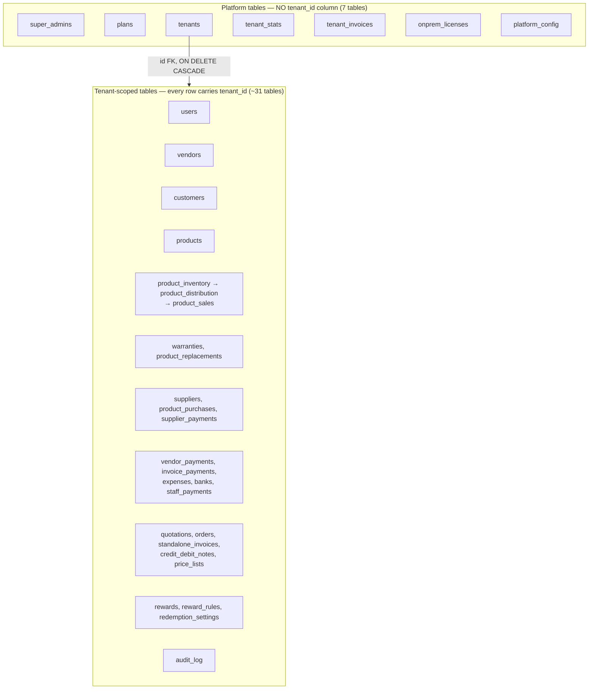
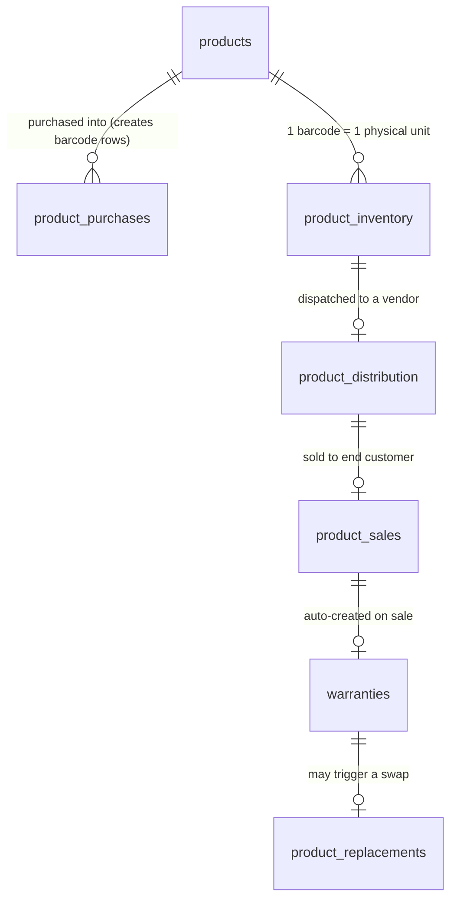

# Database Schema Overview

There is no `schema.sql`, no ORM model layer, and no migration history table. `server/pg-db.ts`'s `initSchema()` function **is** the schema — roughly 40 `CREATE TABLE IF NOT EXISTS` statements plus ~80 `ALTER TABLE ... ADD COLUMN IF NOT EXISTS` / `CREATE INDEX IF NOT EXISTS` statements, all executed sequentially on every process boot, in both cloud and on-prem deployments. If you want to know what a column is called, its type, or its default — you read `pg-db.ts`, not a docs page (this page is a curated map on top of it, not a replacement for it). [Migrations Strategy](/database/migrations-strategy) covers *how* this schema evolves safely without Flyway/Knex/Prisma; this page covers *what currently exists*.

:::tip Mental model
Think of `initSchema()` as a **self-healing installer**, not a migration tool. It runs unconditionally on every boot — cloud API restart, Render redeploy, or an on-prem Electron app launching against its bundled Postgres. Every statement must be safe to run a thousand times in a row. That constraint (idempotency) shapes almost every design decision described below.
:::

## The two universes: platform vs tenant



Roughly 31 tables carry a `tenant_id` column; 7 do not (`super_admins`, `plans`, `tenants`, `tenant_stats`, `tenant_invoices`, `onprem_licenses`, `platform_config`). This split is *the* single most important fact about the schema — it is the physical expression of the entire multi-tenancy model described in [Multi-tenancy](/architecture/multi-tenancy) and [Tenant Isolation](/security/tenant-isolation). See [Tenant Tables](/database/tenant-tables) and the platform-tables page for the two halves individually; this page is about structure and conventions that cut across both.

:::warning `tenant_invoices` vs `standalone_invoices` — same word, opposite direction
`tenant_invoices` (platform, no `tenant_id` FK target confusion aside — it *has* a `tenant_id` column pointing at the tenant being billed) is **Dhandho billing a tenant** for their subscription. `standalone_invoices` (tenant-scoped) is **a tenant billing their own customer**. Same English word, completely different business relationship. This is a real, recurring source of confusion when scanning table names quickly — see [Finance & Accounts](/api/finance-accounts).
:::

## Composite primary keys — `(id, tenant_id)`

```sql
CREATE TABLE IF NOT EXISTS products (
  id TEXT NOT NULL,
  tenant_id TEXT NOT NULL REFERENCES tenants(id) ON DELETE CASCADE,
  name TEXT NOT NULL,
  barcode TEXT,
  price NUMERIC(12,2) DEFAULT 0,
  hsn_code TEXT,
  gst_rate NUMERIC(5,2) DEFAULT 18,
  PRIMARY KEY (id, tenant_id)
);
```

Nearly every tenant-scoped table uses a **composite primary key** `(id, tenant_id)`, not a bare `id`. IDs are application-generated strings from `uid(prefix)` in `utils/helpers.ts` — a prefix (`P`, `S`, `D`, `W`, `REP`, `VP`...) plus `Date.now()` plus 3 random hex bytes — not a UUID and not a Postgres `SERIAL`. They are guaranteed unique **within a tenant**, not globally.

```ts
// server/utils/helpers.ts
export function uid(prefix: string): string {
  return `${prefix}${Date.now()}-${crypto.randomBytes(3).toString('hex')}`;
}
```

:::danger Every JOIN across these tables needs tenant_id on both sides
`FROM product_sales ps JOIN products p ON ps.product_id = p.id` is a live bug, not a hypothetical one — `product_id` alone is only unique *within* a tenant, so this join can silently match a **different tenant's** product row that happens to share a generated ID collision window (unlikely but not impossible with timestamp+3-byte IDs at scale) or, more realistically, will simply produce wrong rows the moment two tenants' IDs from different eras collide. The correct join is always `ON ps.product_id = p.id AND ps.tenant_id = p.tenant_id`. Grep the codebase for any `JOIN products p ON` that doesn't also constrain `p.tenant_id` — that's a code-review red flag every time. See [Multi-tenancy](/architecture/multi-tenancy) for the full checklist.
:::

**Why not a bare `id` (UUID or serial) plus a separate `UNIQUE(tenant_id, id)` index?** Functionally the two are close to equivalent for correctness. The deliberate choice here is that a **composite primary key** forces `tenant_id` into every foreign key that references the table — Postgres requires composite foreign keys to reference the *full* key, so any child table pointing at `products(id, tenant_id)` is structurally required to carry both columns. This pushes "always include tenant_id" from a convention enforced by code review into a constraint enforced by the database schema itself. It doesn't eliminate the need for discipline in `WHERE` clauses (see [RLS](/database/rls)), but it does eliminate an entire class of "I forgot to add tenant_id to the new child table" mistakes at table-creation time.

## The physical-goods table chain



This is the backbone of the entire product-tracking system. A physical, barcoded unit moves through this chain left to right, and — this is the detail worth memorizing — **every table in the chain also stores the `barcode` column directly**, not just a foreign key back to `product_inventory`. `product_distribution.barcode`, `product_sales.barcode`, and `warranties.barcode` are all denormalized copies of the same physical barcode string.

:::tip Why the barcode redundancy is intentional
The barcode is the *real-world identifier* — it's printed on a physical sticker and scanned by a phone camera at every stage (sale, warranty claim, replacement). Every lookup in the app starts from "customer scans this barcode, what state is it in?" (see `GET /api/products/verify/:barcode` in [Products & Inventory](/api/products-inventory)). Storing the barcode directly on `product_distribution`, `product_sales`, and `warranties` means each of those lookups is a single indexed `WHERE barcode = $1 AND tenant_id = $2` against the relevant table, instead of a multi-hop join back through `product_inventory` every single time. The cost is standard denormalization risk (the barcode string could theoretically drift out of sync across tables) — accepted because barcodes are write-once at inventory-creation time and never edited afterward.
:::

## Status-as-state-machine, not a `status` enum table

Rather than a normalized `statuses` lookup table, status transitions are plain `TEXT` columns with values enforced entirely in application code:

| Table | Status values | Who transitions it |
|---|---|---|
| `product_inventory.status` | `InStock` → `Sold` | Sale creation, replacement |
| `product_distribution.status` | `Distributed` → `Sold` / `Damaged` / `Replaced` | Sale, warranty replacement flow |
| `product_distribution.dispatch_status` | `pending` → dispatched | Dispatch action (see [Sales & Distribution](/api/sales-distribution)) |
| `warranties.status` | `Active` → `Expired` / `Replaced` | Nightly-on-read expiry sweep + replacement flow |
| `quotations.status` | `Draft` → ... → converted | Quotation workflow |
| `standalone_invoices.status` | `draft` → `paid` / `cancelled` | Invoice payments |

There is no `CHECK` constraint pinning these to an enum at the database level — a typo'd status string would insert successfully. This is a real, accepted trade-off: Postgres `ENUM` types are painful to extend (`ALTER TYPE ... ADD VALUE` has transaction restrictions), and a `CHECK (status IN (...))` constraint would need to be updated in lockstep with every new status value across ~6 tables. The current design trades a small amount of DB-level safety for schema-change simplicity, and leans on TypeScript route-handler code being the single source of truth for valid transitions.

## `ON DELETE CASCADE` — deleting a tenant is total, permanent, and (mostly) explicit

Every tenant-scoped table's `tenant_id` foreign key is declared `REFERENCES tenants(id) ON DELETE CASCADE`. In practice, `deleteTenant()` in `server/utils/tenant.ts` does **not** actually lean on the cascade at runtime — it explicitly issues `DELETE FROM <table> WHERE tenant_id = $1` across a fixed, ordered list of ~29 tables inside one transaction, then deletes the `tenants` row last:

```ts
// server/utils/tenant.ts (abridged)
const tables = [
  'expenses', 'staff_payments', 'staff_members', 'bill_settings', 'audit_log',
  'credit_debit_notes', 'price_lists', 'orders', 'quotations',
  'reward_rules', 'rewards', 'product_replacements', 'warranties',
  'password_reset_tokens', 'tenant_invoices', 'tenant_stats',
  'supplier_payments', 'product_purchases', 'vendor_payments',
  'invoice_payments', 'standalone_invoices',
  'product_sales', 'product_distribution', 'product_inventory',
  'customers', 'banks', 'suppliers', 'vendors', 'categories', 'products',
  'redemption_settings', 'vendor_reminder_settings', 'users',
];
for (const table of tables) {
  await client.query(`DELETE FROM ${table} WHERE tenant_id = $1`, [tenantId]);
}
await client.query('DELETE FROM tenants WHERE id = $1', [tenantId]);
```

**Why bother with an explicit list when the cascade would do the same thing?** Visibility and control. An explicit list is auditable in a code review — you can see exactly what's being wiped, in what order, and add per-table audit logging or safety checks (e.g. a dry-run count) around any step. A bare `DELETE FROM tenants WHERE id = $1` relying purely on cascade would perform the identical end-state deletion but would be invisible in the diff of `tenant.ts` and impossible to instrument. The `ON DELETE CASCADE` on the FK still matters as a safety net — if a future table is added and someone forgets to add it to this explicit list, the cascade still cleans it up rather than leaving an orphaned row.

## JSONB columns — schema flexibility where a fixed column would be premature

| Table.column | Contents | Why JSONB here |
|---|---|---|
| `tenants.tab_config` | Per-tab visibility/labels (`{ dashboard: { label, visible }, ... }`) | Varies per business-type preset (`manufacturer`/`dealer`/`retail`/`service`/`custom`) and per-tenant customization pushed from Super Admin |
| `users.permissions` | Per-user module access overrides (`view`/`print`/`full`/`hidden` per module) | Optional override layered on top of role presets — see [Backend → Permissions](/backend/permissions) |
| `plans.features` | Feature flags per subscription plan | New feature flags ship without a schema migration |
| `quotations.items`, `orders.items`, `standalone_invoices.items`, `credit_debit_notes.items` | Line-item arrays (`[{ productId, qty, price, gstRate, ... }]`) | Document-shaped, read/displayed as a whole |
| `onprem_licenses.settings` | On-prem license feature/config push payload | Cloud→on-prem settings channel, evolves independently of schema |

:::tip Why line items are JSONB, not a normalized `quotation_items` child table
A separate `quotation_items` table is the textbook-normalized answer. The actual trade-off: quotations/orders/invoices are **documents** — created once, then read and rendered together as a whole (a PDF, a print view), essentially never queried or aggregated line-by-line across documents the way `product_sales` genuinely is (real per-row analytics, real reporting). JSONB avoids an N+1 query pattern to reconstruct a document for every render, and avoids a schema migration every time a new per-line field is needed — adding a discount-per-line field is a frontend/backend contract change only. The cost, paid deliberately: you cannot `SUM(quotation_items.total)` in raw SQL across all quotations without unpacking JSONB (`jsonb_array_elements`) in every query that needs it — see [Queries & Fragments](/database/queries-and-fragments) for how reporting code works around this.
:::

## Unique constraints — the DB-level backstop behind app-level checks

```sql
CREATE UNIQUE INDEX IF NOT EXISTS uq_users_tenant_email ON users(tenant_id, LOWER(email));
CREATE UNIQUE INDEX IF NOT EXISTS uq_products_tenant_name ON products(tenant_id, LOWER(name));
CREATE UNIQUE INDEX IF NOT EXISTS uq_vendors_tenant_name ON vendors(tenant_id, LOWER(name));
CREATE UNIQUE INDEX IF NOT EXISTS uq_pi_tenant_barcode ON product_inventory(tenant_id, barcode);
CREATE UNIQUE INDEX IF NOT EXISTS uq_quotations_tenant_num ON quotations(tenant_id, quotation_number);
```

Every unique constraint in this schema is **scoped by `tenant_id`** — two different tenants can have a product named "Widget," and a bare `UNIQUE(name)` would break multi-tenancy outright the moment two tenants both sold something with the same name. These indexes exist as a backstop *behind* the application-level "check then insert" pattern used across route handlers (see [Backend Patterns](/backend/patterns)), catching the race-condition window a plain application check can't close on its own — two concurrent requests can both pass a `SELECT` check before either `INSERT`s, and the unique index is what turns the second `INSERT` into a clean, catchable `23505` error instead of a silent duplicate row.

## Indexing philosophy: convention first, incremental after

Every tenant-scoped table gets, at minimum, `CREATE INDEX IF NOT EXISTS idx_<table>_tenant ON <table>(tenant_id)` because every query filters by it — this is non-negotiable and present from the table's first `CREATE TABLE` statement. Beyond that baseline, indexes were added incrementally over the file's history, visible as named sections in `pg-db.ts` ("Performance indexes", "Missing performance indexes") that map directly to real slow-query fixes rather than a comprehensive up-front indexing plan:

```sql
CREATE INDEX IF NOT EXISTS idx_ps_date ON product_sales(tenant_id, purchase_date);
CREATE INDEX IF NOT EXISTS idx_pd_vendor ON product_distribution(tenant_id, vendor_id);
CREATE INDEX IF NOT EXISTS idx_pi_product_status ON product_inventory(tenant_id, product_id, status);
```

The pattern is always **`tenant_id` first**, then the column(s) that show up in a `WHERE` or `ORDER BY` on a page that got slow. See [Database Performance](/database/performance) for the actual query patterns these were added to serve, and [Queries & Fragments](/database/queries-and-fragments) for the shared SQL fragments that reduce the number of ad-hoc query shapes needing their own index in the first place.

## Common mistakes

1. **Joining without `tenant_id` on both sides.** The classic, most dangerous version of this: `product_id` and other foreign-key-shaped IDs are only unique per-tenant.
2. **Confusing `tenant_invoices` (platform billing a tenant) with `standalone_invoices` (a tenant billing their customer).**
3. **Adding a new tenant-scoped table without a composite `(id, tenant_id)` PK**, without an RLS policy entry (see [RLS](/database/rls)), and without a leading `tenant_id` index — all three should be added together, every time.
4. **Assuming a `status` column is constrained by the database.** It is not; only application code enforces valid transitions.
5. **Trying to `SUM()` JSONB line items directly in SQL** without `jsonb_array_elements` — this silently returns wrong totals rather than erroring.

## Interview question

> **Q: Why is `PRIMARY KEY (id, tenant_id)` a better default here than a bare `PRIMARY KEY (id)` plus a separate `UNIQUE(tenant_id, id)`?**
>
> Expected answer: the two are nearly equivalent for query correctness, but the composite primary key makes `tenant_id` a *mandatory, visible* part of every foreign key that references the table, because Postgres composite foreign keys must reference the full key. That structurally forces any new child table to also carry `tenant_id` — turning "always scope by tenant" from a code-review convention into a schema-level constraint that fails loudly (a missing-column error) instead of silently (a forgotten `WHERE` clause).

## Hands-on exercise

1. Open `server/pg-db.ts` and find the `CREATE TABLE IF NOT EXISTS credit_debit_notes` statement.
2. Identify: is it tenant-scoped? What's its primary key shape? Is there a unique index on it?
3. Write the `CREATE INDEX` statement you'd add if reports started filtering `credit_debit_notes` by `note_type` frequently — follow the "tenant_id first" convention above.
4. Check `rlsTables` in the same file — is `credit_debit_notes` in the RLS policy list? Should it be, given the rule "every tenant-scoped table gets an RLS policy"?

## Related

- [Tenant Tables](/database/tenant-tables)
- [RLS](/database/rls)
- [Migrations Strategy](/database/migrations-strategy)
- [Queries & Fragments](/database/queries-and-fragments)
- [Backend → pg-db.ts](/backend/pg-db)
- [Multi-tenancy](/architecture/multi-tenancy)
- [Tenant Isolation](/security/tenant-isolation)
