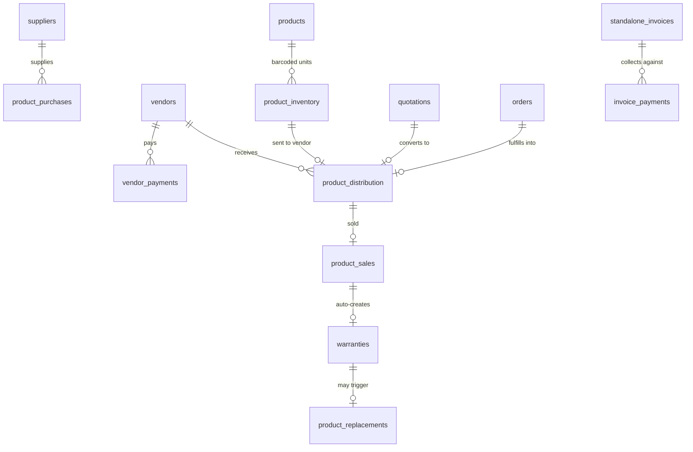

# Tenant-Scoped Tables

Every table on this page has a `tenant_id TEXT NOT NULL REFERENCES tenants(id) ON DELETE CASCADE`, almost always a composite primary key `PRIMARY KEY (id, tenant_id)`, an RLS policy entry (see [RLS](/database/rls)), and at minimum an index on `tenant_id`. These are the *contents* of a tenant's business — everything a shop owner, warehouse manager, or vendor logs into DG-ERP to see. Compare with the seven [Platform Tables](/database/platform-tables) that manage tenants rather than belong to one.

## Identity & directory

| Table | Purpose | Notable columns |
|---|---|---|
| `users` | Login identities | `email`, `password_hash`, `role`, `permissions` (JSONB), `vendor_id`, `default_gst_rate`, `password_changed_at` |
| `vendors` | Dealers/distributors, plus the synthetic `OWNER` row every tenant gets at provisioning | `total_sales`, `total_reward_points`, `gst_number` |
| `customers` | End customers | `vendor_id` (which dealer originated them), matched by `(phone, name)` on repeat sales |
| `categories` | Product categories | Simple lookup, `(id, tenant_id)` |
| `staff_members` | Internal staff directory | `salary`, `joining_date`, `status` |

Every tenant is provisioned with exactly one hardcoded vendor row, `id = 'OWNER'`, inserted by `provisionTenant()` in `utils/tenant.ts`. This represents warehouse-direct sales (no dealer in between) and shows up throughout the sales/finance code as a special case — `vendor_id = 'OWNER'` sales don't generate a distribution batch or a vendor-finance receivable. See [Sales & Distribution](/api/sales-distribution) for how this branches route logic.

:::warning `OWNER` is not optional and not just data
Several queries filter it out explicitly (`WHERE id != 'OWNER'` in vendor lists — see `finance.ts`, `vendors.ts`) and several queries depend on its presence (`vendor_id = 'OWNER'` branches in `accounts.ts` P&L calculations, `sales.ts` sale creation). Deleting or renaming this row on a live tenant would silently break revenue reporting, not throw an error.
:::

## Product & inventory

| Table | Purpose | Notable columns |
|---|---|---|
| `products` | SKU master | `hsn_code`, `gst_rate`, `price`, `pack_size`, `pack_name`, `price_includes_gst`, `warranty_months`, `warranty_applicable` |
| `product_inventory` | One row per **physical barcoded unit** | `barcode` (unique per tenant), `batch_id`, `status` (`InStock`/`Sold`), `unit_type` (`piece`/`box`) |
| `price_lists` | Customer/vendor/quantity-slab pricing overrides | `min_qty`, `max_qty`, `vendor_id` nullable (null = applies to all vendors) |

`products` is the catalog-level definition (name, default price, GST rate); `product_inventory` is one row *per barcode* — if you stock 500 units of a product, you have 500 `product_inventory` rows, not one row with a `quantity` counter. This is deliberate: barcodes are individually scannable and individually traceable through the [physical-goods chain](/database/schema-overview#the-physical-goods-table-chain), so counting stock is `COUNT(*) WHERE status = 'InStock'`, not reading a mutable counter that could drift from reality.

## Goods movement (the transactional core)

| Table | Purpose | Notable columns |
|---|---|---|
| `product_distribution` | Stock dispatched to a vendor | `batch_id`, `discount_percent`, `net_price`, `billed_price`, `gst_applied`, `dispatch_status`, `irn`/`irn_ack_no`/`ewb_number` (GST e-invoicing) |
| `product_sales` | A barcode sold to an end customer | `sale_price`, `reward_points_earned`, links `product_id` + `vendor_id` + `customer_id` |
| `product_purchases` | Stock bought in from a `supplier` | `batch_id`, `cost_price`, `billed_price`, `invoice_number` (for GSTR-2B reconciliation) |
| `suppliers` | Purchase-side counterparties (distinct table from `vendors`, which are sales-side) | `gst_number` |
| `quotations` | Draft quotes, `items` JSONB, status machine | `converted_batch_id` — links a quotation to the distribution batch it became |
| `orders` | Purchase orders from customers, fulfilled into distribution | `fulfilled_batch_id` |

:::tip Why `suppliers` and `vendors` are two separate tables, not one with a `type` column
They participate in opposite directions of the same physical-goods chain — `suppliers` sell *to* the tenant (purchases), `vendors` (dealers) receive *from* the tenant (distribution) and then sell onward to `customers`. A single `parties` table with a `type` enum was considered and rejected: purchase-side and sales-side finance, GST treatment, and portal access (vendors get a login role; suppliers never do) diverge enough that a shared table would need most columns nullable depending on type, and every finance query would need an extra `WHERE type = ...` guard. Two tables keep each domain's queries and constraints simpler at the cost of a small amount of duplicated shape (`name`, `phone`, `email`, `address`, `gst_number` appear on both).
:::

## Money & books

| Table | Purpose | Notable columns |
|---|---|---|
| `banks` | Tenant's own bank accounts | `account_number`, `ifsc_code` |
| `vendor_payments` | Money collected **from** vendors against distribution batches | `batch_id` (nullable — legacy rows predate batch-level tracking) |
| `supplier_payments` | Money paid **to** suppliers against purchase batches | mirrors `vendor_payments` |
| `vendor_reminder_settings` | Per-vendor WhatsApp payment-reminder config | `enabled`, `reminder_days`, `last_reminder_date` |
| `standalone_invoices` | Non-inventory billing (services, one-off invoices) | `items` JSONB, `status` (`draft`/`paid`/`cancelled`), `tax_total`, `grand_total` |
| `invoice_payments` | Partial/batch payments against a `standalone_invoices` row | `FOREIGN KEY (invoice_id) REFERENCES standalone_invoices(id) ON DELETE RESTRICT` |
| `expenses` | General business expenses feeding P&L | `category`, `expense_date` |
| `staff_payments` | Payroll — salary, bonus, advance | `payment_type` (`salary`/`bonus`/`advance`/`advance_repay`), `month`, `year` |
| `credit_debit_notes` | Accounting adjustments against invoices/purchases | `note_type` (`credit`/`debit`), `reference_invoice` |
| `bill_settings` | Per-tenant invoice branding **and encrypted GST API credentials** | `gst_api_password`, `gst_api_client_secret` (encrypted via `secret-crypto.ts`, see [Secrets](/security/secrets)) |

:::danger invoice_payments uses ON DELETE RESTRICT, not CASCADE
This is the one meaningful exception to the "everything cascades from `tenants`" pattern within a tenant's own tables. `invoice_payments.invoice_id → standalone_invoices.id` is `ON DELETE RESTRICT`: you cannot delete a `standalone_invoices` row that still has payment records against it. The schema-migration code in `pg-db.ts` even runs a one-time cleanup (`DELETE FROM invoice_payments ip WHERE NOT EXISTS (SELECT 1 FROM standalone_invoices si WHERE si.id = ip.invoice_id)`) before adding this constraint, because orphaned rows already existed when the constraint was introduced — a real, visible trace of a production data-integrity fix. See [Migrations Strategy](/database/migrations-strategy) for the general pattern this exemplifies.
:::

## After-sales

| Table | Purpose | Notable columns |
|---|---|---|
| `warranties` | One row per barcode's active warranty | `activation_date`, `expiry_date`, `status`, `replaced_barcode` |
| `product_replacements` | Records of an old barcode swapped for a new one | `old_barcode`, `new_barcode`, `reason`, `vendor_id` |
| `rewards` | Loyalty point ledger entries | `points`, `type` (`Earned`/`Redeemed`), `sale_id` |
| `reward_rules` | Threshold-based bonus point rules | `products_sold_threshold`, `reward_points` |
| `redemption_settings` | Per-tenant minimum balance/points to redeem | Singleton row, `id = 'default'` |

Warranty expiry is **not** enforced by a scheduled job — it's checked lazily on read. Every call to `GET /api/warranties` runs `UPDATE warranties SET status = 'Expired' WHERE tenant_id = $1 AND expiry_date < $2 AND status != 'Expired'` before returning results. This means a warranty that expired yesterday still shows as `Active` in the database until the next time *anyone* views the warranties list for that tenant — a subtle but intentional trade-off (no cron infrastructure needed) covered further in [Warranty flows](/api/sales-distribution).

## Ops & devices

| Table | Purpose | Notable columns |
|---|---|---|
| `audit_log` | Append-only-in-practice action trail | `SERIAL id` (only non-composite-PK tenant table, since it's never joined as a FK target), `action`, `entity_type`, `details` (PII-redacted before insert) |
| `mobile_devices` | Capacitor app device registry | `UNIQUE(tenant_id, device_id)`, `last_seen` |
| `password_reset_tokens` | Short-lived reset tokens | `expires_at`, `used`, cleaned up opportunistically on each use |

## Uniqueness worth memorizing

| Constraint | Table |
|---|---|
| `(tenant_id, LOWER(email))` | `users` |
| `(tenant_id, LOWER(name))` | `products`, `vendors`, `suppliers` |
| `(tenant_id, barcode)` | `product_inventory` |
| `(tenant_id, quotation_number)` | `quotations` |
| `(tenant_id, account_number) WHERE account_number IS NOT NULL` | `banks` |
| `(tenant_id, device_id)` | `mobile_devices` |

## Rejected alternative: one giant `documents` table for quotations/orders/invoices

Quotations, orders, and standalone invoices share an obvious shape — header fields plus a JSONB `items` array, plus a status machine. A single polymorphic `documents` table with a `doc_type` discriminator column was a real design option. It was rejected because each document type has genuinely different lifecycle columns (`quotations.converted_batch_id`, `orders.fulfilled_batch_id`, `standalone_invoices.due_date`/`invoice_payments` relationship) that would otherwise sit unused (NULL) on every row of the wrong type, and because each type has its own status vocabulary and its own conversion target. Three focused tables with duplicated *shape* but distinct *lifecycle columns* were judged easier to reason about than one wide table with type-conditional columns — a similar trade-off to the `suppliers`/`vendors` split above.

## What breaks if you drop `tenant_id` from a new table

Every JOIN against that table from another tenant-scoped table becomes a potential cross-tenant merge — silent, high severity, and hard to detect in testing with only one tenant's data loaded. The new-table checklist should always be: composite `(id, tenant_id)` primary key → leading `tenant_id` index → RLS policy entry in `pg-db.ts`'s `rlsTables` array → every FK to it carries `tenant_id` alongside the ID.

## Common mistakes

1. Adding a global `UNIQUE(email)` instead of `UNIQUE(tenant_id, LOWER(email))` — breaks the moment two tenants' admins happen to share an email domain pattern.
2. Forgetting `vendor_id = 'OWNER'` exists as a real row and needs to be excluded from "real vendor" counts and lists.
3. Assuming `warranties.status = 'Expired'` is always accurate in the database — it's lazily updated on read, not on a schedule.
4. Deleting a `standalone_invoices` row that has `invoice_payments` against it and being surprised by the `RESTRICT` error instead of a silent cascade.
5. Storing a new secret (API key, password) on a tenant table in plaintext instead of routing it through `secret-crypto.ts` like `bill_settings.gst_api_password` does.

## Interview question

> **Q: `product_inventory` stores one row per physical barcode instead of one row per product with a `quantity` column. What does this cost, and what does it buy?**
>
> Expected answer: it costs storage and insert volume — stocking 1,000 units means 1,000 `INSERT`s, not one `UPDATE quantity`. It buys individual traceability: every barcode can be independently distributed, sold, warrantied, and replaced without any risk of "which units are these?" ambiguity, and stock counts become a `COUNT(*)` query that can never drift from reality the way a manually incremented/decremented counter column can.

## Hands-on exercise

1. Trace one barcode through the chain: pick any row in `product_inventory`, then find its corresponding row (if any) in `product_distribution`, `product_sales`, and `warranties` using `WHERE barcode = '<value>' AND tenant_id = '<value>'` on each.
2. Identify which of those four tables would need to change if you added a "quarantine" status for products recalled by the manufacturer — which status enum grows, and which route handlers (see [Products & Inventory](/api/products-inventory)) would need new branches?
3. Explain why `reward_rules.products_sold_threshold` lives on a per-tenant table rather than being a platform-wide constant in `plans.features`.

## Related

- [Platform Tables](/database/platform-tables)
- [Schema Overview](/database/schema-overview)
- [RLS](/database/rls)
- [Queries & Fragments](/database/queries-and-fragments)
- [API → Sales & Distribution](/api/sales-distribution)
- [API → Finance & Accounts](/api/finance-accounts)
