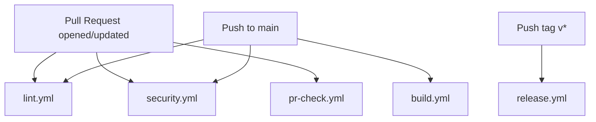
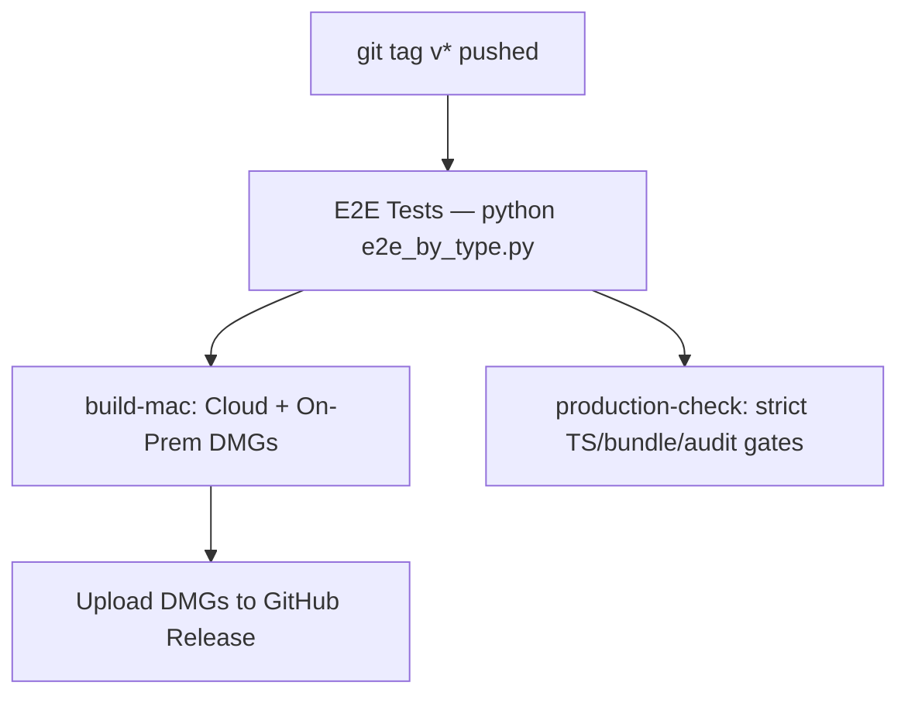

# CI/CD

Five GitHub Actions workflows live in `.github/workflows/`. Each has a distinct trigger and a distinct job — there's intentional overlap between them (multiple workflows run `tsc --noEmit`, for instance) because different triggers need different guarantees at different points in the lifecycle.



## `lint.yml` — TypeScript & Lint

**Trigger:** every PR to `main`, every push to `main`.

```yaml
- run: npm ci
- run: npm run typecheck     # tsc --noEmit
- run: npm run lint          # eslint on src/, server/, tests/
- name: Check for console.log in production code (warning only)
  run: grep -rn 'console.log' src/ ... || echo "Clean"
```

**What it catches:** type errors, ESLint rule violations across `src/**/*.{ts,tsx}`, `server/**/*.ts`, `tests/**/*.ts`.

**What it does NOT catch:** the `console.log` check is explicitly "warning only" — it never fails the build (`|| echo "Clean"` always exits 0). This is a deliberate choice: a stray debug `console.log` shouldn't block a PR, but making it visible in CI output nudges reviewers to notice and ask for a cleanup before merge, rather than silently letting logging discipline erode.

## `security.yml` — Security Scan

**Trigger:** every PR to `main`, every push to `main`. Three parallel jobs.

### `audit` — Dependency Audit

```bash
OUT=$(npm audit --json 2>/dev/null)
CRIT=$(echo "$OUT" | node -e "...extract metadata.vulnerabilities.critical...")
if [ "$CRIT" != "0" ]; then npm audit --audit-level=critical; exit 1; fi
```

Fails only on **critical** severity — deliberately more permissive than it could be, because a known **high**-severity issue in `xlsx` (used for bank statement import, `xlsx` package) has no patched release available at all; failing the build on every PR for an unfixable known issue would just train everyone to ignore CI red, which is worse than not gating it. This is a documented, accepted risk — see [Security → Accepted Risks](/security/accepted-risks) and [Tech Debt Register](/scaling/tech-debt-register).

### `secrets` — Secret Detection

Greps `server/` and `src/` for patterns like `password.*=.*["']`, `api_key`, `secret_key`, `private_key` — with an explicit exclusion list (`process.env`, `.test.` files, `label`, `Password` type strings, `bcrypt`, etc.) tuned to avoid false-positiving on this codebase's own legitimate patterns (`currentPassword`, `password_hash`, form field labels). Also fails outright if a literal `.env` file is tracked in git.

**Honest limitation:** this is a regex-based heuristic scan, not a real secret-scanning tool (like `gitleaks` or `trufflehog`, which understand entropy and known token formats). It catches obvious, sloppy mistakes; it will not catch a well-obfuscated hardcoded secret. Treat it as a floor, not a guarantee.

### `xss` — XSS Check

```bash
grep -rn 'dangerouslySetInnerHTML' src/ ... && exit 1
grep -q 'function esc' src/lib/billTemplates.ts || exit 1
```

Two checks: **zero tolerance** for `dangerouslySetInnerHTML` anywhere in the frontend (this codebase renders all user content through normal React JSX escaping, never raw HTML injection), and a positive check that `src/lib/billTemplates.ts` (which generates PDF bill HTML server-side, including customer names, addresses, and other user-supplied text) actually defines an `esc()` escaping function — protecting specifically against a regression where someone builds bill HTML with raw string interpolation instead of the escape helper.

## `pr-check.yml` — PR Quality Gate

**Trigger:** pull requests to `main` only (not pushes) — this is the "can this PR actually merge" gate.

### `test` job

Spins up a real `postgres:16` service container (`POSTGRES_DB: dhandho_test`), then:

```yaml
- run: npx vitest run --coverage
```

Coverage thresholds are enforced by `vitest.config.ts`, **not** by a separate CI assertion — the `vitest run --coverage` command itself fails the process if any threshold isn't met, per the config's `coverage.thresholds` block (statements 90%, branches 75%, functions 90%, lines 90%, scoped to `server/utils/**`, `server/services/**`, `server/routes/mobile.ts`, and three specific `src/platforms/mobile/*` files — see [Coverage Gates](/testing/coverage-gates) for exactly why this scope and not "everything").

### `quality` job

Runs in parallel with `test` (separate job, same workflow): `tsc --noEmit`, `npm run build`, the same `dangerouslySetInnerHTML` and `.env`-not-committed checks as `security.yml` (deliberately duplicated — a PR-blocking gate shouldn't depend on a *different* workflow having also passed), `npm audit --audit-level=critical`, and a bundle size check:

```bash
SIZE=$(du -sk dist/assets/*.js | awk '{sum+=$1} END {print sum}')
if [ "$SIZE" -gt 2000 ]; then echo "WARNING: Bundle exceeds 2MB ($SIZE KB)"; fi
```

Note this one is a **warning**, not a hard failure (no `exit 1`) — it's the *total* of all JS chunks, a softer signal than the stricter per-chunk gzip check in `build.yml`/`release.yml` below.

## `build.yml` — Build & Check

**Trigger:** PRs to `main` **and** pushes to `main` (unlike `pr-check.yml`, which is PR-only).

Two sequential jobs: `test` (same coverage-gated Vitest run) must pass before `build` (`needs: test`) runs at all — no point spending build minutes on a build whose tests already failed.

The `build` job's bundle check is the **strict, failing** one:

```bash
MAIN=$(ls dist/assets/index-*.js 2>/dev/null | head -1)
SIZE=$(gzip -c "$MAIN" | wc -c)
echo "Main chunk gzip: ${SIZE} bytes (limit: 262144)"
[ "$SIZE" -gt 262144 ] && echo "Main chunk too large" && exit 1
```

262144 bytes = 256 KiB, gzipped, for the **main** entry chunk only (not the whole bundle — `vite.config.ts`'s `manualChunks` splits `vendor-react`, `vendor-motion`, `vendor-scanner`, `vendor-xlsx`, `vendor-icons` into separate chunks specifically so the main chunk stays lean and this gate stays meaningful; see [Performance → Bundle](/performance/bundle)).

## `release.yml` — Release

**Trigger:** pushing a git tag matching `v*` (e.g. `v2.3.0`) — this is the only workflow that produces distributable artifacts.



### `test` job — the real E2E suite

```yaml
- run: npm ci
- run: npm run build
- run: |
    npm run server &
    sleep 8
    python3 tests/e2e_by_type.py --base http://localhost:3001
```

This is the **only** CI workflow that runs the full 453-test Python E2E suite (see [E2E Testing](/testing/e2e)) — it's reserved for release time specifically because it's slower and more expensive than the Vitest unit/integration suites that gate every PR; releases are infrequent enough to afford it, and it's the last line of defense before artifacts ship to real users.

### `build-mac` job — macOS DMG builds

Runs on `macos-latest` (required — you cannot cross-compile signed-adjacent macOS `.dmg` artifacts from a Linux runner with `electron-builder` reliably), `needs: test`. Builds **both** Cloud and On-Prem DMGs (`npm run build:electron:cloud:mac`, `npm run build:electron:onprem:mac`), then uploads them to the GitHub Release via `softprops/action-gh-release@v3`, split into separate upload steps for arm64 vs. x64 Cloud DMGs and a combined On-Prem upload glob.

Notice the release body template explicitly warns: *"Apps are unsigned. On first open, right-click → Open to bypass Gatekeeper."* — see [Electron](./electron) for why signing isn't set up yet.

**Gap worth naming:** there's no `build-windows` job in this workflow — only Mac DMGs are built and uploaded automatically on tag push. Windows `.exe` builds (`build:electron:cloud:win`, `build:electron:onprem:win`) exist as `package.json` scripts but aren't wired into `release.yml`'s automation; producing them today requires a manual local/CI run on a Windows runner. This is a real gap, not a deliberate omission documented anywhere else — flag it if you're planning a release that needs Windows artifacts.

### `production-check` job — the strictest gate in the repo

Runs in parallel with `build-mac` (`needs: test`), on `ubuntu-latest`:

```bash
npx tsc --noEmit 2>&1 | grep -v "canvas.tsx" | grep "error TS" | tee /tmp/ts-errors.txt; [ ! -s /tmp/ts-errors.txt ]
```

Notably excludes `canvas.tsx` from the zero-TypeScript-errors requirement — a documented, narrow carve-out (likely a generated/experimental file with known type issues) rather than a blanket exception.

```bash
npm audit --audit-level=high --json | python3 -c "...fail if any high/critical severity EXCEPT xlsx..."
```

This is **stricter** than `security.yml`'s critical-only gate — `production-check` fails on **high** severity too, with the same single named exception (`xlsx`) as everywhere else this trade-off appears. Consistency of that one exception across three different CI files (`security.yml`, `release.yml`) is itself worth noticing: if you ever *do* patch or replace `xlsx`, you must update all of these gates, not just one.

## The full picture — what gates what

| Workflow | Trigger | Blocks merge to main? | Produces artifacts? |
|---|---|---|---|
| `lint.yml` | PR + push to main | Effectively yes (required check, typically) | No |
| `security.yml` | PR + push to main | Yes, on critical vulns / secrets / dangerouslySetInnerHTML | No |
| `pr-check.yml` | PR only | Yes — the dedicated quality gate | No |
| `build.yml` | PR + push to main | Yes | No (build verification only, no upload) |
| `release.yml` | Tag `v*` only | N/A (not a merge gate) | Yes — GitHub Release + DMGs |

## Related pages

- [Testing Overview](/testing/overview)
- [Coverage Gates](/testing/coverage-gates)
- [E2E Testing](/testing/e2e)
- [Runbooks → Deploy Rollback](/runbooks/deploy-rollback)
- [File Walkthrough: infra/ci](/files/infra/ci)
