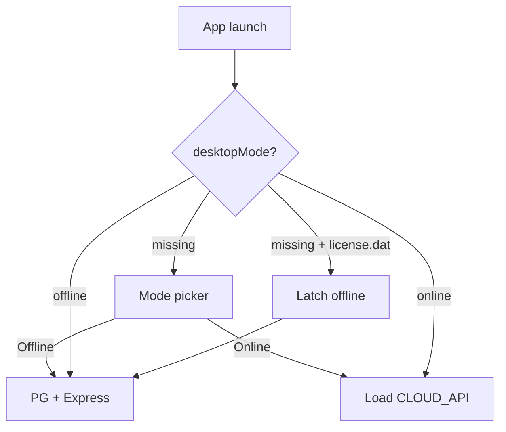

# Electron — One Desktop App, Online or Offline

DG-ERP ships **one** Electron desktop application (`electron-desktop.config.cjs`, app id `in.dhandho.desktop`). At first launch the user chooses **Online** or **Offline** once (same idea as the unified Cap phone). Mode is stored in `userData/desktop-mode.json` and cannot be changed without reinstalling.



| | Online | Offline |
|---|---|---|
| **Boot** | `electron/cloud/boot.ts` — window on hosted ERP | `electron/onprem/boot.ts` — embedded Postgres + Express |
| **Data** | Cloud Postgres | Local disk (`userData/postgres-data`) |
| **License** | Company cloud login / seats | On-prem `DG-…` key + wizard |
| **Network** | Always needs internet | Activation + heartbeat only |

Installer size is always **~180MB** because Offline needs PostgreSQL binaries. Online mode simply does not start that stack.

## Entry points

| Path | Role |
|---|---|
| `electron/desktop/main.ts` | Unified shell — latch, picker, branch |
| `electron/desktop/mode-store.ts` | One-time `desktop-mode.json` |
| `electron/desktop/picker/` | HTML Online/Offline chooser |
| `electron/cloud/boot.ts` | Online window |
| `electron/onprem/boot.ts` | Offline stack + wizard + heartbeat |
| `electron/shared/` | `CLOUD_API`, ports, heartbeat interval |

Legacy `electron/cloud/main.ts` and `electron/onprem/main.ts` still call the boot helpers for local debugging; production builds use `electron/desktop`.

## Building

```bash
npm run electron:desktop:dev           # compile + run unified shell
npm run electron:desktop:dev:local     # DG_CLOUD_URL=http://localhost:3001
npm run build:electron:desktop:win     # → dist-electron/desktop/dhandho-desktop-win-x64.exe
npm run build:electron:desktop:mac     # → dist-electron/desktop/dhandho-desktop-mac-*.dmg
```

CI:

- `.github/workflows/desktop-build.yml` — Mac + Windows evergreen on tag `dhandho-desktop`
- `.github/workflows/release.yml` — version tags `v*` upload the same unified artifacts

Apps are **unsigned** (Gatekeeper / SmartScreen warnings expected). See [Tech Debt Register](/scaling/tech-debt-register).

## Related pages

- [Deployment Overview](./overview.md)
- [Service Mobile](./service-mobile.md)
- [Runbooks → On-Prem License](/runbooks/onprem-license)
- [Product Surfaces](/architecture/four-surfaces)
