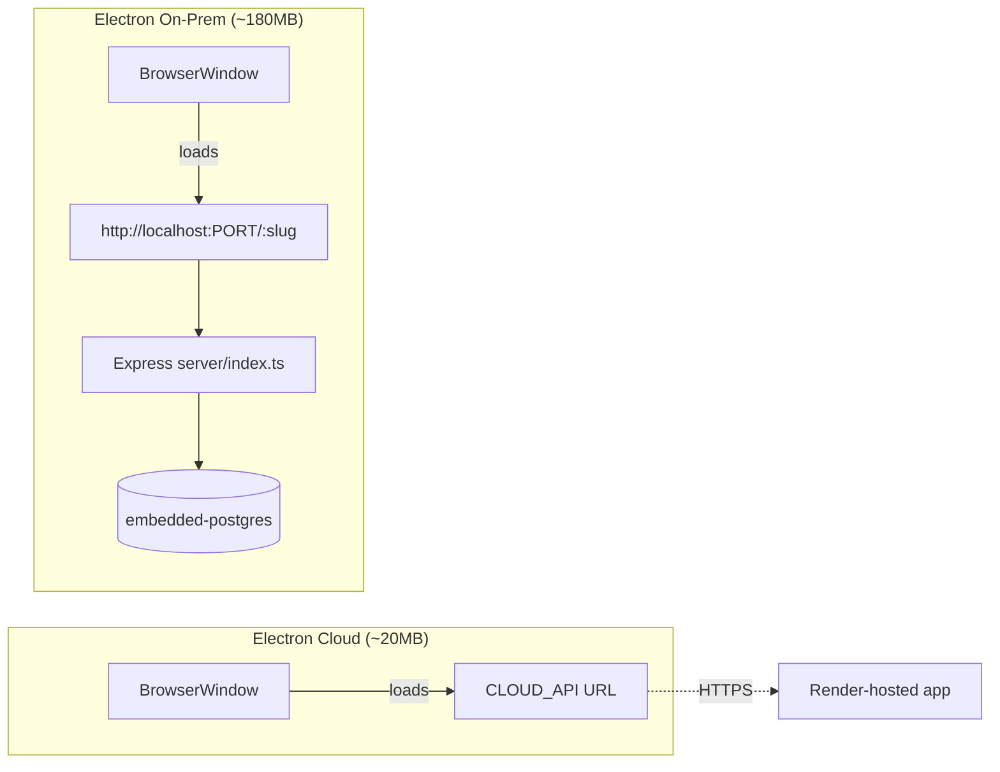
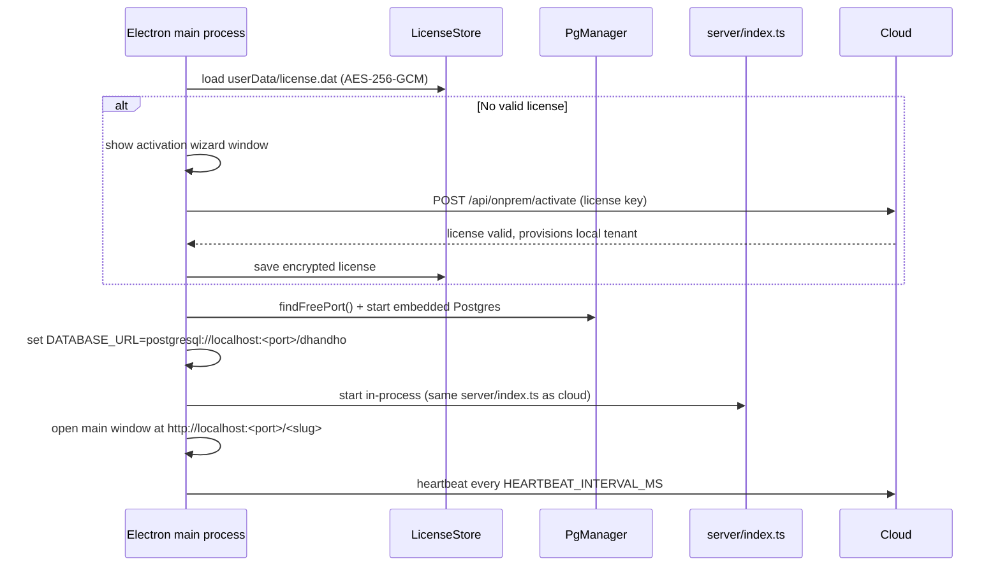

# Electron — Two Apps, One Codebase, Very Different Sizes

DG-ERP ships **two** distinct Electron applications from the same repository, built with two separate `electron-builder` configs (`electron-cloud.config.cjs`, `electron-onprem.config.cjs`). They share a product name family ("Dhandho") but are architecturally almost opposite.



## Why the 9x size difference

| | Electron Cloud | Electron On-Prem |
|---|---|---|
| **Installer size** | ~20 MB | ~180 MB |
| **What's bundled** | Just Electron's own runtime (Chromium + Node) + a tiny `main.ts`/`preload.ts` | Electron runtime + the **entire built React app** (`dist/`) + the **entire Express server** (`server/`) + **PostgreSQL binaries** (`embedded-postgres`) |
| **`electron-builder` `files` list** | `electron/cloud/**`, `node_modules/electron/**` | `dist/**`, `server/**`, `electron/onprem/**`, `electron/shared/**`, `node_modules/**` (minus caches) |
| **Network dependency** | Always online — it's a window onto a URL | Only needs internet for initial license activation; fully offline afterward |
| **Data location** | None locally — 100% in the cloud | Local disk, inside the embedded Postgres data directory |

The cloud wrapper is deliberately as close to "a browser bookmark with a native icon" as Electron allows — no local server, no local database, no `dist/` even. The on-prem build is, by contrast, a genuinely complete standalone application: it needs `node_modules/**` bundled because it runs `server/index.ts` for real, inside the packaged app, and PostgreSQL's actual binaries (via `embedded-postgres`) because there's no assumption the customer's machine has Postgres installed.

Note the `asarUnpack` entries in `electron-onprem.config.cjs`:

```js
asarUnpack: [
  'node_modules/embedded-postgres/**',
  'node_modules/@embedded-postgres/**',
],
```

Electron normally packs everything into a single `.asar` archive for faster reads — but native binaries (Postgres's actual executable) can't be executed directly from inside an `.asar` archive, so these two packages are explicitly excluded from packing and shipped as real files on disk instead.

## Electron Cloud — boot sequence

`electron/cloud/main.ts` + `electron/cloud/preload.ts`:

1. Create a `BrowserWindow`.
2. Load `CLOUD_API` (`electron/shared/constants.ts`: `process.env.DG_CLOUD_URL || 'https://dg-erp.onrender.com'`) — set at **build time** via `DG_CLOUD_URL`, not runtime-configurable by the end user.
3. `preload.ts` exposes a minimal `openExternal` bridge so `mailto:`/`tel:` links (and anything else that shouldn't open *inside* the app window) open in the user's actual default browser/mail client instead.
4. That's it. Every feature, every route, every bit of business logic is running server-side on Render, exactly as it would in a browser tab — this app contributes zero application logic of its own.

**Why build this at all, instead of just telling users to bookmark the site?** A native app icon in the Start Menu/Dock, a dedicated window (no browser chrome/tabs competing for attention), and OS-level "recent apps" integration — pure UX polish for a subset of users who prefer app-like experiences, at near-zero engineering cost given how thin the wrapper is.

## Electron On-Prem — boot sequence

`electron/onprem/main.ts`, using `electron/onprem/pg-manager.ts`, `license-store.ts`, and `electron/shared/find-port.ts`:



1. **License check** — `license-store.ts` looks for `app.getPath('userData')/license.dat`, an AES-256-GCM-encrypted file. The encryption key is derived via `scrypt(machineId, salt, 32)` — `getMachineId()` hashes the machine's MAC addresses (SHA-256), so the key is stable across reboots but tied to that specific machine (a license file copied to another PC won't decrypt).
2. **No valid license → wizard.** The user enters a key shaped like `DG-XXXX-YYYY-ZZZZ`, which is POSTed to the **cloud** server's `/api/onprem/activate` (this one HTTP call to the cloud is the only network dependency in the entire on-prem lifecycle, aside from heartbeats).
3. **Embedded Postgres starts** on a free local port (`findFreePort()` from `electron/shared/find-port.ts`, avoiding the hardcoded `LOCAL_PG_PORT = 5433` default if it's already taken — e.g. by another local Postgres instance a developer might have running).
4. **`DATABASE_URL` is set to point at that local, dynamically-chosen port** before the shared `server/index.ts` boots — from `server/pg-db.ts`'s perspective, this is indistinguishable from any other Postgres connection string; it has no idea it's talking to an embedded, single-machine database instead of Render's managed cluster.
5. **The exact same Express server used in the cloud starts in-process** inside the Electron main process (not a separate spawned process) — this is the crux of "one codebase, zero forked logic": `initSchema()`, every route handler, every middleware, runs unmodified.
6. **Main window opens** at `http://localhost:<port>/<slug>` — the on-prem tenant's slug, established during provisioning.
7. **Heartbeat starts** — `POST /api/onprem/heartbeat` fires to the cloud every `HEARTBEAT_INTERVAL_MS` (`electron/shared/constants.ts`, currently **15 minutes** — note this is more frequent than the 60-minute figure quoted in some higher-level docs; when in doubt, trust the constant in code over a prose description, and flag/fix the doc if you spot the mismatch). A `licenseValid: false` response triggers a blocking "suspended" modal; an `updateAvailable` response triggers a non-blocking in-app notification.

**Why in-process instead of spawning a child process for the server?** Simpler lifecycle management — one process to start, monitor, and shut down cleanly, versus coordinating two. The trade-off is that a crash in server code and a crash in the Electron UI code share a failure domain more tightly than they would with separate processes — worth knowing if you're debugging a mysterious on-prem crash and trying to determine which half was actually at fault.

## Deployment-mode-aware code branches

A handful of places in the shared codebase explicitly check `process.env.DEPLOYMENT_MODE === 'onprem'`:

| File | What changes for on-prem |
|---|---|
| `server/pg-db.ts` | TLS (`useSsl`) is skipped for on-prem's local embedded Postgres — there's no network hop to secure, and self-signed/no-cert local Postgres doesn't support it anyway |
| `server/pg-db.ts` (`pool.on('error', ...)`) | Pool-level connection errors are silently swallowed for on-prem — expected noise when the app (and its embedded DB) shuts down together |
| `server/app.ts` (`assertCriticalEnv` callers, indirectly via `env.ts`) | Production-only checks like `ALLOWED_ORIGINS` requirement are skipped for on-prem — there's no cross-origin browser context to secure; it's `localhost` talking to `localhost` |
| `server/app.ts` (`REQUIRE_ELECTRON` gate) | If `REQUIRE_ELECTRON=true`, the "download the desktop app" splash page is bypassed automatically when `DEPLOYMENT_MODE=onprem`, since the on-prem app *is* the Electron client by construction |

## Building each variant

```bash
# Cloud wrapper
npm run electron:cloud:dev                # dev, points at CLOUD_API or DG_CLOUD_URL
npm run build:electron:cloud:win           # → dist-electron/cloud/*.exe (nsis)
npm run build:electron:cloud:mac           # → dist-electron/cloud/*.dmg

# On-Prem
npm run tsc:electron                       # compile electron/onprem TS → JS (required before dev/build)
npm run electron:onprem:dev                # dev — needs npm run server running separately, or use:
npm run electron:onprem:dev:local          # sets DG_CLOUD_URL=http://localhost:3001 for local cloud testing
npm run build:electron:onprem:win          # → dist-electron/onprem/*.exe (full installer, ~180MB)
npm run build:electron:onprem:mac          # → dist-electron/onprem/*.dmg
```

Both `.exe` targets are unsigned (no code-signing certificate configured in either `electron-builder` config) — the release notes template in `.github/workflows/release.yml` explicitly warns users to "right-click → Open to bypass Gatekeeper" on first launch on Mac, and Windows SmartScreen will show an "unknown publisher" warning. This is a known, accepted trade-off (see [Tech Debt Register](/scaling/tech-debt-register)) rather than an oversight — code signing certificates cost money and require an established publisher identity.

## Related pages

- [Deployment Overview](./overview.md)
- [Mobile](./mobile.md)
- [Runbooks → On-Prem License](/runbooks/onprem-license)
- [File Walkthrough: infra/electron](/files/infra/electron)
