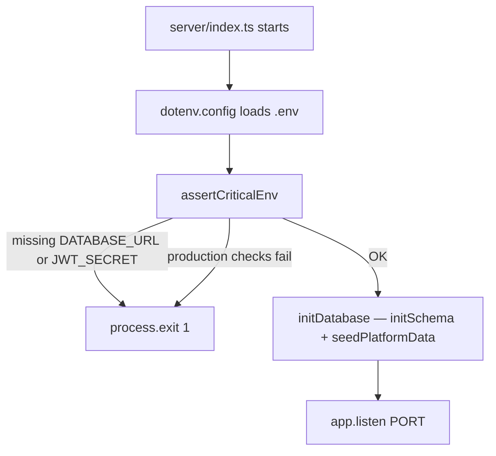

# Environment Variables Reference

This page documents every environment variable that appears in `.env.example`, `.env.mobile.example`, `render.yaml`, `docker-compose.yml`, or is read directly in `server/` code. Organized by where it's consumed.

:::danger The one rule that matters most
Any variable prefixed `VITE_` is **compiled directly into the client-side JavaScript bundle** and is readable by anyone who opens DevTools or downloads the app. Never put secrets — `JWT_SECRET`, database credentials, GST API passwords, Logtail tokens — behind a `VITE_` prefix. See [Security → Secrets](/security/secrets).
:::

## Server — required

| Variable | Required when | Read by | What breaks without it |
|---|---|---|---|
| `DATABASE_URL` | Always | `server/pg-db.ts` (`new Pool({ connectionString: ... })`), validated by `assertCriticalEnv()` in `server/utils/env.ts` | `assertCriticalEnv()` calls `process.exit(1)` before the server even attempts to listen |
| `JWT_SECRET` | Always | `server/middleware/auth.ts`, `server/app.ts` (global auth middleware), validated by `assertCriticalEnv()` | Server exits immediately (`server/middleware/auth.ts` itself also has a standalone `process.exit(1)` guard, redundant with `assertCriticalEnv` but present as defense-in-depth). Must be **≥32 characters in production** — enforced, not just recommended |
| `SUPER_ADMIN_EMAIL` | Always in production; recommended in dev | `server/pg-db.ts` (`seedPlatformData()`) | Without it, no super admin account is seeded — `/super-admin` login is unusable until you manually insert a row |
| `SUPER_ADMIN_PASSWORD` | Same as above, **≥12 characters in production** (enforced) | Same | Same, plus `assertCriticalEnv()` will `fatal()` in production if it's set but too short |

## Server — required only in production (cloud)

| Variable | Enforced by | What it does |
|---|---|---|
| `NODE_ENV=production` | N/A — this is the flag that *triggers* the other production-only checks | Switches `helmet` CSP strictness, disables the dev-only verbose request logger, enables TLS defaults in `pg-db.ts`, activates every check below |
| `ALLOWED_ORIGINS` | `assertCriticalEnv()` — `fatal()` if unset in production and not on-prem | Comma-separated list of origins allowed by the manual CORS middleware in `server/app.ts`. Without it in prod, the server refuses to start rather than silently allowing no origins (or worse, all of them) |
| `DATABASE_SSL` | `assertCriticalEnv()` — `fatal()` if explicitly set to `"false"` in production | Forces TLS to Postgres. In `pg-db.ts`, TLS is actually auto-enabled in production regardless (`useSsl` computation), so this variable is mostly a defense against someone explicitly trying to *disable* it |
| `DATABASE_SSL_REJECT_UNAUTHORIZED` | `assertCriticalEnv()` — `fatal()` if explicitly `"false"` in production | Prevents accepting self-signed/invalid TLS certs to the database in production — a classic MITM-adjacent footgun this variable exists to block |

**The weak-password guard**, also inside `assertCriticalEnv()`:

```ts
const WEAK_DB_PASSWORD = /:(postgres|password|admin|root|123456|secret|changeme|pass)@/i;
if (isProduction && WEAK_DB_PASSWORD.test(env.DATABASE_URL!)) {
  fatal('DATABASE_URL appears to use a default/weak password — refuse to start');
}
```

This scans the connection string itself for obviously-default passwords and **refuses to boot in production** if one matches — a specific, deliberate defense against copy-pasting a tutorial/default connection string into a real deployment.

## Server — optional

| Variable | Default | Read by | Effect |
|---|---|---|---|
| `PORT` | `3001` | `server/index.ts` | Express listen port |
| `JWT_EXPIRES_IN` | `24h` (hardcoded default in `generateToken`) | `server/middleware/auth.ts` | Token lifetime |
| `DATABASE_POOL_SIZE` | `10` (prod) / `20` (dev) | `server/pg-db.ts` | Max concurrent Postgres connections — see [SRE → Golden Signals](/sre/golden-signals) saturation discussion |
| `TRUST_PROXY` | unset | `server/app.ts` | Set to `1` to trust `X-Forwarded-For` outside of auto-detected production (Render sets this automatically via the `isProduction` check) |
| `PUBLIC_APP_URL` | unset | Used wherever an absolute URL must be constructed server-side (invite links, PDF footers) | Falls back to relative/best-guess URLs if unset |
| `REQUIRE_ELECTRON` | `false` | `server/app.ts` | When `true`, browser requests (non-API, non-Electron, non-on-prem) are shown a "download the desktop app" splash instead of the SPA |
| `DEPLOYMENT_MODE` | unset (cloud behavior) | `server/pg-db.ts`, `server/app.ts` | Set to `onprem` to activate on-prem-specific branches (skip TLS, skip `ALLOWED_ORIGINS` requirement, silence pool errors on shutdown) |
| `LOGTAIL_TOKEN` | unset | `server/utils/logger.ts` | Enables centralized logging via Logtail; logging works fine (console-only) without it |
| `CLOUD_VERSION` | unset | Version-reporting contexts (e.g. mobile/on-prem update-check comparisons) | — |
| `GSTN_SANDBOX_PUBLIC_KEY` / `GSTN_PRODUCTION_PUBLIC_KEY` / `GSTN_PUBLIC_KEY` | unset | `server/services/nic-api.ts` | Public keys for GST NIC API payload signing/encryption — **server-side only, never `VITE_`** — mock mode works without any of these set |

## Electron — build-time only

| Variable | Read by | Effect |
|---|---|---|
| `DG_CLOUD_URL` | `electron/shared/constants.ts` (`CLOUD_API`) | Overrides the cloud URL the Electron Cloud wrapper points at. Default is the live Render host (`https://dg-erp.onrender.com`). Set at build time for the packaged app, or at dev time for `npm run electron:onprem:dev:local` (local cloud). After the `dhandho` Render service exists, flip the default (see [Service Cloud](./service-cloud.md)). |

## Mobile (`.env.mobile`) — client-embedded, public-safe only

| Variable | Prefix requirement | Effect |
|---|---|---|
| `VITE_MOBILE` | Must be `VITE_` (it's a build flag consumed by `vite.config.ts` and `isMobileClient()`) | Set to `1` to force mobile build mode |
| `VITE_API_ORIGIN` | `VITE_` | The cloud API's public hostname Cap/WebView calls (same host anyone can visit). Default examples use live `https://dg-erp.onrender.com`; `apiBase.ts` remaps premature `dhandho.onrender.com` / broken `dhandho.app` to that fallback until cutover |
| `VITE_APP_VERSION` | `VITE_` | Compared against `mobile_min_version`/`mobile_latest_version` for update prompts |
| `VITE_ANDROID_STORE_URL` / `VITE_IOS_STORE_URL` | `VITE_` | Store links shown in update prompts / `/download` page |

**Why these are safe as `VITE_` and `JWT_SECRET` never would be:** every one of these values is either already public (a store listing URL, an API hostname you can `curl` directly) or a version string with no security implication if known. The test to apply to any new `VITE_` variable: *"if a competitor extracted this from the compiled app bundle tomorrow, would it matter?"* If yes, it does not belong behind `VITE_`.

## Full startup validation flow



## Quick checklist when setting up a new environment

1. `DATABASE_URL`, `JWT_SECRET` (≥32 chars) — always.
2. `SUPER_ADMIN_EMAIL`/`SUPER_ADMIN_PASSWORD` — unless you're fine manually seeding a super admin.
3. If production: `NODE_ENV=production`, `ALLOWED_ORIGINS`, confirm `DATABASE_URL` password isn't a default/weak one.
4. If on-prem: `DEPLOYMENT_MODE=onprem`, and expect TLS/CORS-production checks to be skipped intentionally.
5. If mobile build: a separate `.env.mobile` with only `VITE_`-prefixed, public-safe values.
6. Never let any of the above land in a committed file other than the `.example` templates.

## Related pages

- [Local Setup](/tutorials/local-setup)
- [Render](./render.md)
- [Docker](./docker.md)
- [Security → Secrets](/security/secrets)
