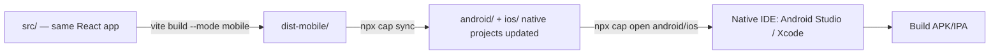
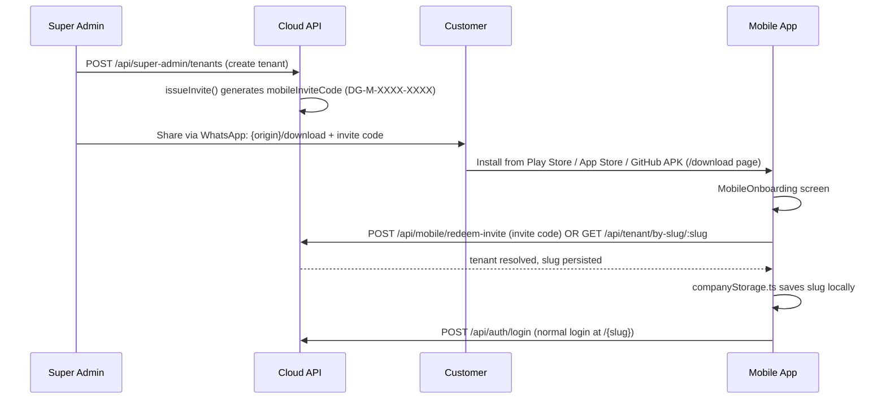

# Mobile — Capacitor Build & Invite Flow

The mobile app is **not** a separate codebase or a native rewrite — it's the same React app, built with a mobile-specific Vite mode, wrapped natively by Capacitor. It always talks to the **cloud** API; there is no offline-first, no-internet mode for mobile the way there is for Electron on-prem — only a light offline mutation queue for brief connectivity gaps (see [Lab: Offline Queue](/labs/lab-offline-queue)).

## Build pipeline



```bash
cp .env.mobile.example .env.mobile   # set VITE_API_ORIGIN to your cloud API's public URL
npm run build:mobile                 # vite build --mode mobile
npm run cap:sync                     # build:mobile + npx cap sync
npm run cap:android                  # cap:sync + npx cap open android
npm run cap:ios                      # cap:sync + npx cap open ios
```

### What `--mode mobile` changes, concretely (`vite.config.ts`)

```ts
const isMobile = mode === 'mobile' || env.VITE_MOBILE === '1';
// ...
base: isMobile ? './' : '/',        // relative asset paths — required for capacitor://
build: { outDir: isMobile ? 'dist-mobile' : 'dist', ... }
```

**Why relative asset paths matter:** a normal web build assumes the app is served from the domain root (`/assets/index.js`), which is exactly true for the cloud web deployment. But inside a Capacitor WebView, assets are loaded from `file://` or `capacitor://localhost/`, where an absolute `/assets/index.js` path can resolve incorrectly depending on platform. `base: './'` makes every asset reference relative to `index.html`'s own location, which works correctly regardless of the WebView's URL scheme.

### `.env.mobile` — what's safe to put here

```bash
VITE_MOBILE=1
VITE_API_ORIGIN=https://your-cloud-api.example.com
# VITE_APP_VERSION=2.2.0
# VITE_ANDROID_STORE_URL=https://play.google.com/store/apps/details?id=app.dhandho.mobile
# VITE_IOS_STORE_URL=https://apps.apple.com/app/idXXXXXXXX
```

Every variable here is prefixed `VITE_`, which means Vite **embeds it directly into the client JS bundle** — anyone can extract it by inspecting the built app. This is fine for `VITE_API_ORIGIN` (a public API hostname) and store URLs, but is exactly why secrets like `JWT_SECRET` or database credentials must never carry a `VITE_` prefix — see [Environment Variables](./env-vars) and [Security → Secrets](/security/secrets).

### `capacitor.config.ts`

```ts
const config: CapacitorConfig = {
  appId: 'app.dhandho.mobile',
  appName: 'Dhandho',
  webDir: 'dist-mobile',
  server: { androidScheme: 'https', iosScheme: 'capacitor' },
  plugins: {
    SplashScreen: { launchAutoHide: true, backgroundColor: '#F27D26', showSpinner: false },
    StatusBar: { style: 'LIGHT', backgroundColor: '#F27D26' },
  },
};
```

`androidScheme: 'https'` vs `iosScheme: 'capacitor'` reflects platform-specific WebView quirks — Android's WebView handles a synthetic `https://` origin more predictably for things like secure cookies and CORS-adjacent behavior, while iOS's WKWebView is conventionally addressed via the `capacitor://` scheme in the Capacitor ecosystem. You don't need to memorize why; just know changing these is a "know what you're doing" edit, not a cosmetic one.

## Detecting "am I the mobile client" at runtime

`src/platforms/mobile/online/isMobileClient.ts`:

```ts
export function isMobileClient(): boolean {
  // Capacitor native (real app) OR a browser explicitly loaded with ?mode=mobile / VITE_MOBILE=1
}
```

This function is the single source of truth consumed across the app (`App.tsx` uses it to decide whether to render `MobileOnboarding` at all) — it's true both for the actual compiled native app *and* for a browser tab deliberately impersonating mobile mode (useful for testing the mobile UI without a device/emulator).

## The invite onboarding flow, end to end



1. **Tenant creation auto-generates an invite.** `POST /api/super-admin/tenants` internally calls `issueInvite()`, populating `tenants.mobile_invite_code` and `mobile_invite_expires_at` (both added via `ALTER TABLE` in `initSchema()`). The code format is `DG-M-XXXX-XXXX`.
2. **Distribution is manual, by design.** The Super Admin shares the invite via WhatsApp (a link to `/download` plus the code) — there's no automated SMS/email delivery system; this matches the low-tech, high-trust distribution channel many Indian SME customers actually use.
3. **`/download`** (`src/components/layout/DownloadPage.tsx`) is a public page listing Play Store / App Store / GitHub-hosted APK links, plus the desktop Electron installers — a single landing page for every artifact type this product ships.
4. **`MobileOnboarding`** (`src/platforms/mobile/online/MobileOnboarding.tsx`) accepts either the invite code (`POST /api/mobile/redeem-invite`) **or** a company slug directly (`GET /api/tenant/by-slug/:slug`) — the invite path is for brand-new users who don't know their company's slug yet; the slug path is for returning users or people told their company's URL directly.
5. **The resolved slug is persisted** via `companyStorage.ts` (`src/platforms/mobile/online/companyStorage.ts`), so the app remembers "which company" across restarts without re-onboarding every time — "Change company" in the app explicitly clears this.
6. **From here it's a normal login** — `POST /api/auth/login` at the resolved `/{slug}`, same JWT-based auth as web.

## Why both `/api/mobile/redeem-invite` and `/api/mobile/heartbeat` are public paths

```ts
// server/app.ts
const PUBLIC_PATHS = [
  // ...
  '/api/mobile/redeem-invite', '/api/mobile/heartbeat',
];
```

**Redeem-invite** must be public because, by definition, the caller doesn't have a JWT yet — they're *trying to obtain* tenant access. The invite code itself (random, time-limited via `mobile_invite_expires_at`) is the credential, not a Bearer token.

**Heartbeat** is public so the device can report liveness even in edge cases where its stored session might be stale/expired — but note the code comment: "Heartbeat still accepts optional Bearer to attach `user_id`" — if a valid token *is* present, it's used to enrich the heartbeat record; if not, the heartbeat still succeeds, just without a `user_id` attached to that ping.

## Sync, push, and version policy

| Mechanism | API | Client-side |
|---|---|---|
| Device liveness | `POST /api/mobile/heartbeat`, every 60s | `src/platforms/mobile/online/mobileSync.ts` |
| Super-Admin-forced sync | `PUT .../mobile-force-sync` | Client detects the flag, clears its offline cache (`cache.ts`) and calls `location.reload()` |
| Minimum/latest version policy | `PUT .../mobile-version` | Client compares its own `VITE_APP_VERSION` against `mobile_min_version`/`mobile_latest_version`, surfacing `forceUpdate` (blocking) or `updateAvailable` (dismissible) UI events |
| Device registry | `GET .../mobile-devices` | Rendered in Super Admin's `MobileTenantPanel.tsx` |

All four are Super-Admin-operated levers for managing a fleet of mobile installs you can't directly SSH into or push updates to outside app-store review cycles — force-sync and version gating are the two blunt instruments available when something's gone wrong on a specific tenant's devices.

## Related pages

- [Deployment Overview](./overview.md)
- [Lab: Offline Queue](/labs/lab-offline-queue)
- [Runbooks → Mobile Sync](/runbooks/mobile-sync)
- [Animations → Mobile Offline](/animations/mobile-offline)
