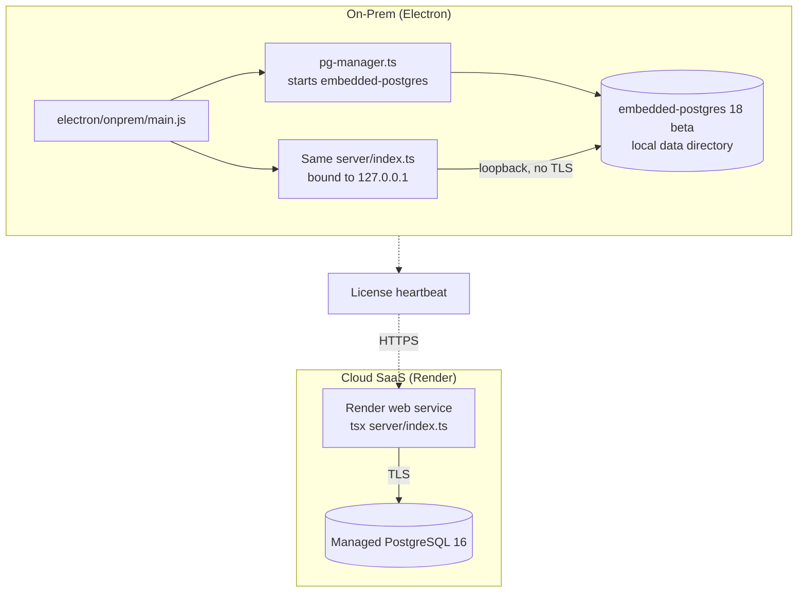
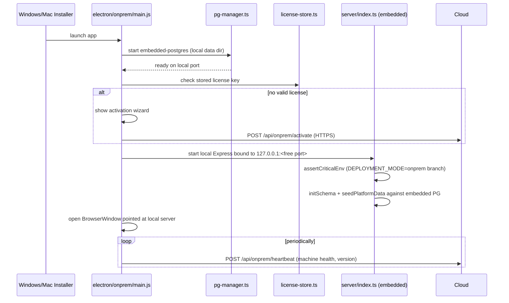

# Deployment Overview — Two Products, One Codebase

:::tip The one-sentence version
Cloud deploys `server/` + `dist/` to Render against managed Postgres; on-prem bundles the *exact same* `server/` + `dist/` inside an Electron app with an embedded Postgres binary. Same code, different host for the database.
:::

## 1. The two deployment targets, side by side



## 2. Cloud: `render.yaml`, annotated

```yaml
# Postgres is external (Neon). Do not provision Render Postgres here.
services:
  - type: web
    name: dhandho-2kdx   # → https://dhandho-2kdx.onrender.com (live; not renamable)
    plan: free
    buildCommand: npm ci --include=dev && npm run build:prod
    startCommand: npm start
    healthCheckPath: /api/health
    envVars:
      - key: DATABASE_URL
        sync: false   # paste Neon URI in Dashboard
      - key: JWT_SECRET
        generateValue: true
      - key: HUSKY
        value: "0"       # skip git hooks install on the build server
      - key: DATABASE_SSL
        value: "true"
      - key: PUBLIC_APP_URL
        value: https://dhandho-2kdx.onrender.com
```

Two details worth knowing cold:

1. **`--include=dev` in the build command.** Because `NODE_ENV=production` during `npm ci` would otherwise omit dev dependencies — but Vite's build needs `@tailwindcss/vite`, `typescript`, and friends, which are (correctly) `devDependencies`. Without this flag, the production build would simply fail.
2. **`healthCheckPath: /api/health`.** Render polls this to decide if a deploy is healthy before routing traffic to it and to detect a crashed process for auto-restart. The handler itself does a real `SELECT 1` against Postgres — a genuinely meaningful health check, not just "the process is alive."

Live production is **`https://dhandho-2kdx.onrender.com`** (Render assigned `-2kdx` because plain `dhandho` was taken / not the created name). See [Hostname cutover](./render.md#hostname-cutover-dg-erp--dhandho).

## 3. Environment variables — the fail-fast gate

`server/utils/env.ts`'s `assertCriticalEnv()` runs before the DB pool even opens. In production (and not on-prem), it **refuses to boot** unless:

| Requirement | Why |
|---|---|
| `DATABASE_URL` set, and password isn't a default like `postgres`/`password`/`123456` | Regex check against a weak-password pattern — catches an embarrassingly common misconfiguration class |
| `JWT_SECRET` set and ≥ 32 characters | Short secrets are brute-forceable against HS256; production hard-fails below 32 chars, dev only warns |
| `ALLOWED_ORIGINS` set (comma-separated) | CORS defaults to an **empty** allow-list in production if unset — this check exists so that "empty allow-list" is a loud boot failure, not a silent "nothing works and no one knows why" |
| `DATABASE_SSL` not explicitly `"false"` | TLS to Postgres is mandatory in cloud production |
| `DATABASE_SSL_REJECT_UNAUTHORIZED=false` only allowed on Render/Neon-detected hosts | Managed hosts sometimes need this for their cert chain; anywhere else it's a red flag for a misconfigured or MITM'd connection |
| `SUPER_ADMIN_EMAIL` + `SUPER_ADMIN_PASSWORD` (≥12 chars) set | The platform operator account needs to exist and be strong from day one |

This entire check is **skipped** when `DEPLOYMENT_MODE=onprem` — an on-prem install has no `ALLOWED_ORIGINS`/CORS concern (loopback only) and manages TLS differently (there isn't any, by design — see [Threat Model](/security/threat-model)).

## 4. On-prem: the Electron path



`electron/shared/find-port.ts` picks a free local port so the embedded server doesn't collide with anything else running on the customer's machine — the customer never needs to know or care what port it lands on.

## 5. What's identical, and what genuinely differs

| Aspect | Cloud | On-Prem |
|---|---|---|
| `server/` code | Same | Same — literally the same files, same `tsx` runtime |
| `dist/` frontend bundle | Same | Same |
| Database engine | Managed PostgreSQL 16 (Render/Neon) | `embedded-postgres` (Postgres 18 beta binary) |
| TLS to DB | Required (`useSsl` true) | Disabled (`useSsl` false) — loopback only |
| CORS | Enforced allow-list | Irrelevant — no cross-origin requests exist |
| Licensing | N/A (subscription is account-based) | License key + heartbeat to cloud |
| Update mechanism | Render redeploys automatically on push | `electron-builder` produces installers; customer manually updates (or auto-update, if configured) |
| Multi-tenancy | Thousands of tenants share one DB | Exactly **one** tenant per install (the customer's own business) |

That last row is worth dwelling on: **on-prem installs still run the full multi-tenant schema** (`tenant_id` columns, RLS policies, the works) even though there's realistically only ever one tenant in that embedded database. This is a direct consequence of "same code, same schema, different host" — the alternative (a stripped-down single-tenant schema variant) was rejected precisely because it would mean maintaining two schemas. See [Design Decisions](/architecture/design-decisions).

## 6. Deploy-time checklist (cloud)

1. `npm ci --include=dev && npm run build:prod` — builds `dist/`.
2. `assertCriticalEnv()` runs on process start — any missing/weak config crashes the boot immediately (visible in Render logs, and the health check will keep failing until fixed).
3. `initSchema()` runs — safe to run against a database that already has the schema (idempotent), including a fresh empty Render Postgres on first deploy.
4. `seedPlatformData()` creates the Super Admin account (from env) and the four subscription plans when missing — idempotent (`ON CONFLICT` / skip-if-exists) so a Neon DB that already has `SA1` from a prior deploy does not crash boot.
5. Render's health check polls `/api/health` until it returns 200, then cuts traffic over.

## Hands-on exercise

1. Locally, unset `JWT_SECRET` and try to start the server (`npm run server`). Confirm the exact fatal message and that the process exits with a non-zero code rather than starting in a half-broken state.
2. Set `NODE_ENV=production` locally (without `DEPLOYMENT_MODE=onprem`) and leave `ALLOWED_ORIGINS` unset. Confirm the specific fatal error this triggers, and explain in your own words why an empty CORS allow-list failing loudly is safer than failing silently.
3. Read `render.yaml` again and identify every env var marked `sync: false`. What do they have in common, and why does Render intentionally not sync/display these values in its dashboard by default?

## Debugging exercise

An on-prem customer says their installation "lost all its data" after a Windows update forced a reboot. Given that `embedded-postgres` stores its data in a local directory, and Electron apps typically live under `%APPDATA%` or similar, list the top three most likely causes (data directory path changed between app versions, antivirus quarantined the Postgres binary, disk write failure during an ungraceful shutdown) and which one you'd investigate first, and why.

## Quiz

1. Why does the Render build command need `--include=dev`?
2. Name two `assertCriticalEnv` checks that are skipped entirely for on-prem deployments, and why they don't apply there.
3. Why does an on-prem install still use the full multi-tenant schema even though it only ever has one tenant?

<details>
<summary>Answers</summary>

1. Because `NODE_ENV=production` during `npm ci` would otherwise skip devDependencies, but the Vite/Tailwind build tooling the frontend build needs is intentionally listed under devDependencies.
2. `ALLOWED_ORIGINS` (no cross-origin requests exist for a loopback-only local server) and the `DATABASE_SSL`/TLS checks (the embedded Postgres and the server run on the same machine with no network hop to secure).
3. Because maintaining two different schemas (multi-tenant for cloud, single-tenant for on-prem) would double the schema-maintenance and testing burden for a marginal benefit — one schema, one `initSchema()` function, serving both deployment targets, is the whole point of the "same code" strategy.

</details>

## Related pages

- [Docker](/deployment/docker)
- [Electron](/deployment/electron)
- [Env Vars](/deployment/env-vars)
- [System Overview](/architecture/system-overview)
- [Design Decisions](/architecture/design-decisions)
- [SRE Overview](/sre/overview)
