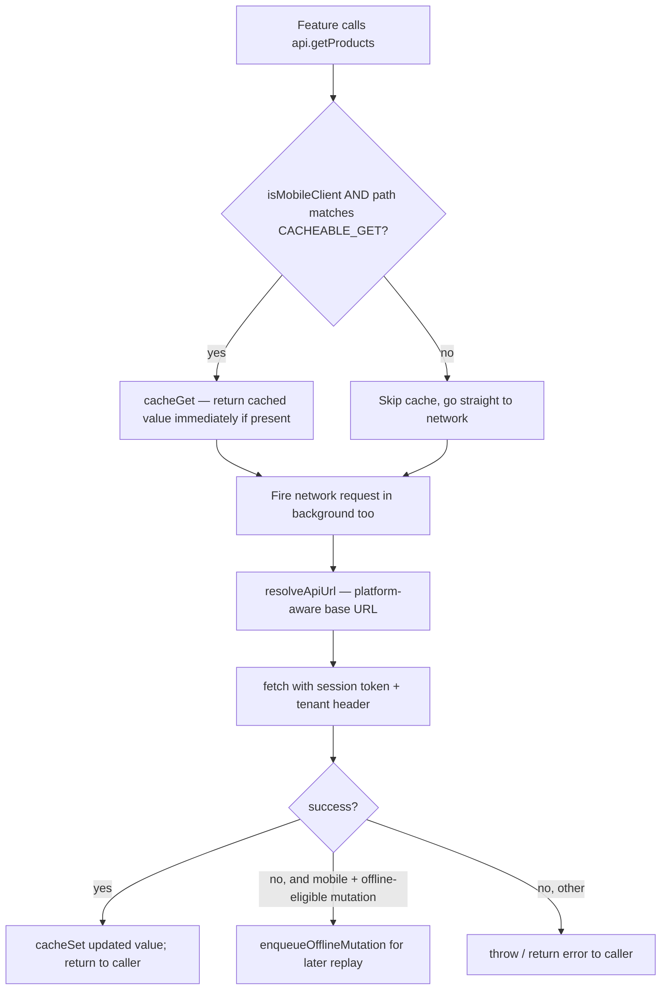

# File Walkthrough — `src/api.ts`

## Purpose & business value

At 1,241 lines, `api.ts` is the **only** file in the frontend that talks to the backend HTTP API — no feature component calls `fetch` directly. This single-seam design is what makes the frontend portable across four deployment surfaces: every platform difference in *how* a request gets made (mobile's cache-then-network + offline queue, Electron's different origin resolution, web's straightforward same-origin calls) is handled once, here, instead of duplicated across every feature.

## Imports/exports

**Imports:** `session` from `./lib/session`; `resolveApiUrl` from `./platforms/shared`; `isMobileClient` from `./platforms/mobile/online/isMobileClient`; `cacheGet`/`cacheSet`/`cacheInvalidateForApiPath`/`enqueueOfflineMutation`/`getConnectionState` from `./platforms/mobile/offline`.

**Exports:** dozens of TypeScript interfaces (`DistributionRecord`, `SaleRecord`, `ReplacementRecord`, `RewardRule`, `SaleBillData`, ...) that double as the frontend's shared type vocabulary for backend response shapes, plus the `api` object itself — a large object of methods like `api.getSales()`, `api.createSale(...)`, one per backend endpoint the frontend calls.

## Flow — a GET request on mobile vs. everywhere else

`CACHEABLE_GET` is a short, explicit regex allowlist (`/^\/products(?:\?|$)/`, `/^\/vendors(?:\?|$)/`, `/^\/tenant\//`) — **only these three GET shapes are cached client-side**. This is deliberately narrow: caching is for making the mobile UI feel instant/resilient on a handful of slow-changing, frequently-read lists, not a general-purpose offline datastore.

## Call hierarchy

- **Called by:** every feature component (`src/features/**`), `App.tsx` for session bootstrap, platform bootstrap code.
- **Calls into:** `resolveApiUrl` (platform-aware URL building — see [`platforms/*`](/files/frontend/platforms)), `session` (attaches the JWT + `X-Tenant-ID` to every request), the mobile offline cache/queue module, native `fetch`.

## Performance notes

- The cache-then-network pattern for `CACHEABLE_GET` paths means the UI can render instantly from a stale cache while a fresh network response updates it moments later — a deliberate perceived-performance win, at the cost of a component briefly rendering stale data on mobile after a real backend change (self-corrects on the next successful fetch).
- Every non-cacheable call is a plain network round-trip with no client-side memoization — for expensive report-style endpoints, any caching/memoization needs to happen in the *feature* component (e.g. `useMemo` around a computed view of already-fetched data), not in `api.ts` itself.

## Security notes

- **`session` (not `api.ts` itself) owns where the auth token lives and how it's attached** — `api.ts` calls into `session` to get headers, keeping token storage/rotation logic in one place. See [`lib.md`](/files/frontend/lib) for `session.ts` specifics.
- **The tenant header is derived from the current session, not passed by the caller** — a feature component cannot accidentally (or maliciously, from a compromised dependency) make a request "as" a different tenant by passing a different ID; it always reflects whichever tenant the user is actually logged into.
- **`sanitizeHeaders`-style stripping happens in the offline queue module, not here** — when `api.ts` hands a failed mutation off to `enqueueOfflineMutation`, be aware the queue module deliberately does not persist `Authorization`/`X-Tenant-ID` to storage (see [Runbook: Mobile Sync](/runbooks/mobile-sync)) — `api.ts`'s job ends at handing off the request; it doesn't need to reason about that storage decision itself.

## Refactoring notes

- **Safe:** adding a new `api.xyz()` method for a new backend endpoint, following the existing method-per-endpoint pattern with a matching TypeScript interface for the response shape.
- **Needs care:** changing `CACHEABLE_GET`'s regex list — adding a path here means that GET's response is now served stale-then-fresh; make sure that's actually desirable for the new path (most write-heavy or rapidly-changing data should NOT be added here).
- At 1,241 lines and growing with every new endpoint, this file is a natural candidate to split by domain (`api/sales.ts`, `api/distribution.ts`, ...) if it keeps growing — tracked in [Tech Debt Register](/scaling/tech-debt-register); not urgent today since it's still just "a very long list of similar methods," which is a low-complexity kind of long.

## Common mistakes

1. Calling `fetch` directly from a feature component instead of adding a method to `api.ts` — breaks the single-seam guarantee that makes cross-platform behavior consistent, and skips caching/offline-queue integration for mobile.
2. Adding a genuinely dynamic/frequently-changing GET to `CACHEABLE_GET` — users would see stale data with no visual indication (see [Runbook: Mobile Sync](/runbooks/mobile-sync) for how this surfaces as a support issue).
3. Assuming every `api.xyz()` call automatically queues on failure when offline — only mutations explicitly wired to `enqueueOfflineMutation` do; a new mutation method needs this wiring added deliberately, it's not automatic just by virtue of being a POST/PUT/DELETE.

## Alternatives considered

A generated API client (from an OpenAPI spec) or a data-fetching library (React Query, SWR) would give automatic caching, retries, and type generation for free. DG-ERP hand-writes `api.ts` because there's no OpenAPI spec to generate from (the backend routes aren't spec-first), and the specific caching/offline-queue behavior needed for mobile is custom enough that a generic data-fetching library would need heavy customization anyway — the team judged direct control over this one seam as simpler than adopting and configuring a library to do something bespoke.

## Related pages

- [`src/platforms/*`](/files/frontend/platforms)
- [`src/lib/*` (session.ts, offline/*)](/files/frontend/lib)
- [Runbook: Mobile Sync](/runbooks/mobile-sync)
- [Lab: Offline Queue](/labs/lab-offline-queue)
