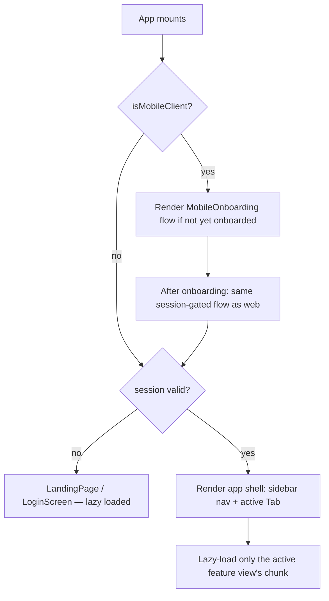

# File Walkthrough — `src/App.tsx`

## Purpose & business value

At 1,101 lines, `App.tsx` is the single largest frontend file and the control tower for the entire client: it decides what the user sees before they're logged in (landing page, login screen, mobile onboarding), gates access after login (session validity, role-based nav visibility), and lazily loads every feature view only when navigated to. Business value: this is the file that makes the "one codebase, four surfaces" promise real on the client side — it branches behavior by platform (`isMobileClient()`, Electron detection) without needing four separate app shells.

## Imports/exports

**Notable imports:** `OfflineBanner`/`MobileOnboarding`/`isMobileClient` from `./platforms/mobile/*`; `OnlineStatus` from `./platforms/desktop/offline`; `api` from `./api`; `session` from `./lib/session`; `ToastProvider`/`ErrorBoundary`/`CommandPalette` from `./components/ui`; every feature view via `React.lazy(() => import(...))`.

**Exports:** the default `App` component, consumed by `main.tsx` only.

## Flow — lazy loading and platform branching

Every feature view (`DashboardView`, `SalesEntryView`, `DistributionView`, ... ~17 of them) is wrapped in `lazy(() => import(...))`, meaning **each one is its own code-split chunk** — a user who only ever uses Sales never downloads the Distribution or Payroll bundle. This matters most on mobile, where bandwidth and device storage are tighter constraints.

## Call hierarchy

- **Called by:** `src/main.tsx` (the actual React root render call) — this is the only caller.
- **Calls into:** `api` (session/tenant bootstrap calls), `session` (reads/writes local auth state), every feature view module (via dynamic `import()`), platform detection helpers (`isMobileClient`, Electron-specific checks).

## Performance notes

- **Lazy loading is the single biggest perf lever in this file** — without it, the initial bundle would include all ~18 feature modules' code (much of it large: rich tables, charts, PDF/bill generation logic) whether or not the user ever visits them.
- The `Suspense` boundaries around lazy-loaded views need a lightweight fallback (`LoadingSpinner`) — a heavy fallback component would defeat some of the purpose of code-splitting.
- Platform detection (`isMobileClient()`) is called at render time, not memoized globally — cheap (reads a Capacitor global/UA check), so this is fine, but worth knowing it's not a one-time-computed constant if you're reasoning about re-render costs.

## Security notes

- **This file does not itself enforce access control** — it's UI-layer navigation convenience (hiding nav items a role can't use), not a security boundary. The actual enforcement is server-side in [`middleware/permissions.ts`](/files/server/middleware-permissions). A user could theoretically force-navigate to a hidden tab's route and would get a 403 from the API, not silently succeed — but don't rely on `App.tsx`'s nav-hiding logic as your only permission check when adding a new feature; always also add the server-side module gate.
- Session/token storage and validity checks are delegated to `session.ts` ([lib walkthrough](/files/frontend/lib)) — `App.tsx` reacts to session state, it doesn't own the storage mechanism.

## Refactoring notes

- **Safe:** adding a new lazy-loaded feature view + nav entry, following the exact existing pattern.
- **This file is a strong candidate for splitting** (tracked in [Tech Debt Register](/scaling/tech-debt-register)) — the shell/nav logic, the platform-branching logic, and the lazy-import declarations are three fairly separable concerns currently living in one file. Not urgent, but worth knowing if you're asked to reduce its size.
- Be careful with the ordering of platform-branching checks (`isMobileClient` before session checks) — mobile onboarding needs to happen before a session even exists, so reordering these checks could break first-run mobile UX.

## Common mistakes

1. Adding a new feature view without lazy-loading it — directly importing a large feature module at the top of `App.tsx` puts it in the initial bundle for every user regardless of platform or role.
2. Assuming hiding a nav item is sufficient access control — always pair with a server-side permission check.
3. Forgetting to test the mobile onboarding branch when changing top-level session logic — it's a separate code path from the web/Electron login flow and is easy to accidentally break without a mobile build to test against.

## Alternatives considered

A router library (React Router, TanStack Router) with route-based code splitting would be the "textbook" way to do this — declarative routes, automatic lazy boundaries, URL-driven state. DG-ERP uses a simpler `Tab`-state-driven approach (no URL routing for the main app shell) because the app is effectively a single-page dashboard where "which tab is active" is the only navigation concept that matters, and a full router's URL-sync machinery wasn't judged worth the added dependency and complexity for that use case. The trade-off: no deep-linkable URLs to a specific feature view within the authenticated app (deep links exist only for entry points like `/[tenant-slug]`).

## Related pages

- [`src/api.ts`](/files/frontend/api)
- [`src/features/*` pattern](/files/frontend/features)
- [`src/platforms/*`](/files/frontend/platforms)
- [Deployment: Mobile](/deployment/mobile)
- [Scaling: Tech Debt Register](/scaling/tech-debt-register)
