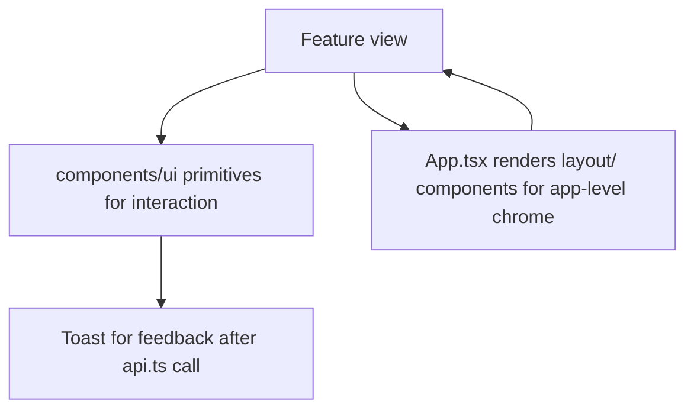

# File Walkthrough — `src/components/`

## Purpose & business value

Two subfolders, two different jobs: `layout/` holds full-page or app-shell-level components that appear once in the whole app (landing page, login screen, terms/privacy pages, the chat widget); `ui/` holds small reusable primitives that appear dozens of times across every feature (toasts, pagination, modals, barcode scanning). Business value: consistent look-and-feel and interaction patterns across ~18 feature modules without every feature reinventing its own button styles, dialogs, or table pagination.

## `layout/` — page-level chrome

| File | Purpose |
|---|---|
| `LandingPage.tsx` | Marketing/entry page shown to unauthenticated web visitors |
| `LoginScreen.tsx` | The login form, shared by tenant users and (via a different route) Super Admin |
| `PrivacyPolicy.tsx` / `TermsOfService.tsx` | Static legal pages |
| `DownloadPage.tsx` | Shown when `REQUIRE_ELECTRON=true` blocks browser access — see [`server/app.ts`](/files/server/app) for the server-side half of this gate |
| `ChatWidget.tsx` | The AI chatbot UI, talking to `server/routes/chatbot.ts` |
| `AppShutterIntro.tsx` / `ShutterIntro.tsx` | App-launch intro animation |
| `CustomCursor.tsx` / `DeskIllustration.tsx` | Landing page visual flourishes |

## `ui/` — reusable primitives

| File | Purpose |
|---|---|
| `Toast.tsx` (+ `ToastProvider`) | App-wide notification system — every feature's success/error feedback goes through this, not ad-hoc alerts |
| `ErrorBoundary.tsx` | Catches render errors in a subtree so one broken feature view doesn't white-screen the entire app |
| `LoadingSpinner.tsx` / `Skeleton.tsx` | Loading states — `Suspense` fallbacks and in-content loading placeholders |
| `Pagination.tsx` | Shared pagination controls, paired with the backend's `parsePagination` ([`utils.md`](/files/server/utils)) |
| `SearchSelect.tsx` | Searchable dropdown, used anywhere a feature needs to pick from a long list (products, vendors, customers) |
| `ColumnPicker.tsx` | Lets users show/hide table columns — used in data-heavy list views |
| `DateRangeFilter.tsx` | Shared date-range picker for report/list filtering |
| `CsvImport.tsx` | Bulk import UI, used by inventory/masters and similar bulk-data features |
| `BarcodeScanner.tsx` / `BarcodeLabelPrinter.tsx` | Camera-based barcode scanning and label printing — core to the sales/distribution/inventory workflow |
| `CommandPalette.tsx` | Cmd/Ctrl-K style quick navigation |
| `ConfirmDialog.tsx` | Shared "are you sure?" modal for destructive actions |
| `PasswordInput.tsx` | Password field with show/hide toggle, used in login/settings |
| `PaidBadge.tsx` | Small status badge, e.g. for finance/invoice paid status |
| `
## Flow — how a feature uses these two folders together

## Call hierarchy

- **`layout/`** is called almost exclusively from `App.tsx` (top-level routing decisions).
- **`ui/`** is called from nearly every feature view and from `layout/` components themselves (e.g. `LoginScreen` uses `PasswordInput`).

## Performance notes

- `BarcodeScanner.tsx` (camera access) and `CsvImport.tsx` (potentially large file parsing) are the two `ui/` components most likely to have real performance considerations — camera stream handling should clean up properly on unmount, and CSV parsing of large files should ideally be chunked/streamed rather than parsing an entire huge file synchronously on the main thread.
- Most `ui/` primitives are intentionally small and dependency-light — they're used too pervasively for any one of them to carry heavy logic without it being felt across the whole app's bundle size.

## Security notes

- `ChatWidget.tsx` talks to an AI chatbot backend — treat any user-supplied text rendered back from a chatbot response with the same XSS caution as any other user-generated content (verify the rendering path escapes HTML rather than using something like `dangerouslySetInnerHTML` on raw model output).
- `CsvImport.tsx` accepts user-uploaded files — the actual validation of imported data must happen server-side (this component's job is UX: parsing for preview, showing validation errors), never trust client-side CSV parsing as the security boundary for what actually gets written to the database.

## Refactoring notes

- **Safe:** adding new `ui/` primitives, extending existing ones with new optional props.
- **Needs care:** changing the `Toast`/`ToastProvider` API — it's used everywhere; a breaking change here has the widest blast radius of any component change in the app.
- If a feature-specific component starts being copy-pasted into a second feature folder, that's the signal to promote it into `components/ui` instead.

## Common mistakes

1. Building a new one-off modal/dialog instead of reusing `ConfirmDialog.tsx` or the app's existing dialog patterns — leads to inconsistent UX and duplicated escape-key/focus-trap logic (which `useEscapeKey.ts` in [`lib/`](/files/frontend/lib) already solves once).
2. Showing feedback via a raw `alert()`/inline text instead of `Toast` — inconsistent with the rest of the app's notification pattern.
3. Not testing `BarcodeScanner.tsx` changes on an actual mobile device/camera — desktop browser camera behavior doesn't always match mobile WebView camera behavior.

## Related pages

- [`src/features/*` pattern](/files/frontend/features)
- [`src/platforms/*`](/files/frontend/platforms)
- [Lab: Add an Endpoint](/labs/lab-add-endpoint) (for the matching frontend integration pattern)
