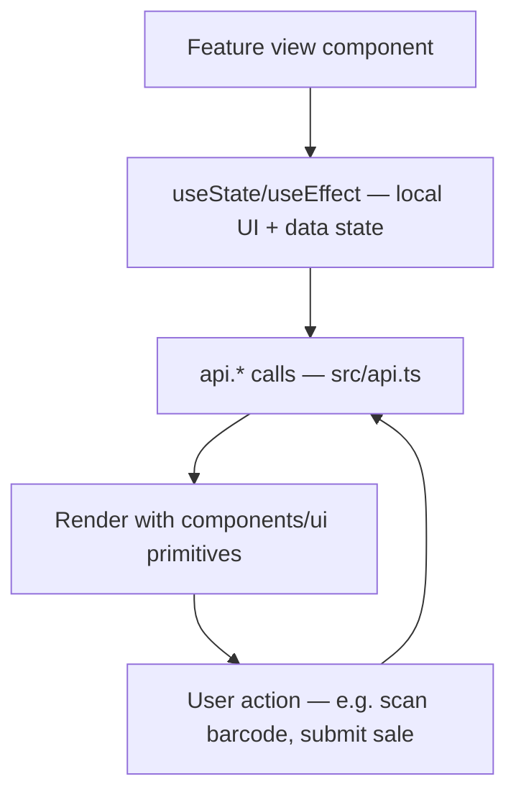

# File Walkthrough — `src/features/*` (the pattern)

## Purpose & business value

`src/features/` has ~18 folders (`sales`, `distribution`, `inventory`, `finance`, `payroll`, `warranty`, `replacements`, `rewards`, `purchases`, `quotations`, `orders`, `accounts`, `analytics`, `masters`, `settings`, `verification`, `invoices`, `super-admin`), one per business module. Business value of this organization: a feature's entire UI, view logic, and module-specific state lives in one place a developer can open, understand, and modify without needing to trace logic scattered across shared folders — the trade-off for some duplication (see Alternatives below) is that each feature folder is close to fully self-contained.

## The shared shape (using `features/sales` as the example)

`features/sales/SalesEntryView.tsx` is the single file for the Sales Entry feature — it owns:
1. **Local state** for the current form (barcode input, customer details) via `useState`.
2. **Data fetching** via `api.*` calls (from [`src/api.ts`](/files/frontend/api)) triggered by user actions (scan a barcode → `api.validateSale(barcode)`) or on mount (load recent sales list).
3. **View rendering** — the actual JSX, using shared primitives from [`src/components/ui`](/files/frontend/components) (e.g. `BarcodeScanner`, `Toast` for feedback, `Pagination` for the sales list).
4. **Business-type awareness** — reading `businessTypeConfig` (from [`src/lib`](/files/frontend/lib)) to adjust labels/behavior for the tenant's specific business type (e.g. "Sale" vs. a more domain-specific term, if the business type config defines one).

## Call hierarchy

- **Called by:** lazily imported and rendered by [`App.tsx`](/files/frontend/app) when its tab is active.
- **Calls into:** `api.ts` for all backend interaction, `components/ui/*` for shared widgets, `lib/*` for cross-cutting helpers (formatting, business-type config, session).

## Performance notes

- Each feature view is its own lazy-loaded chunk (see [`App.tsx`](/files/frontend/app)) — heavy features (e.g. anything with charting, PDF generation, or large tables) don't weigh down the initial page load for users who never visit them.
- Larger feature views (`distribution`, `accounts`, `reports`-adjacent analytics) tend to accumulate a lot of local state — watch for unnecessary re-renders on every keystroke in search/filter inputs; debounce where the feature does live filtering against a large in-memory list.

## Security notes

- Feature views should treat every permission/role check as **advisory UI polish, not enforcement** — e.g. hiding an "Edit" button for a `view`-level user is good UX, but the real enforcement is server-side ([`middleware/permissions.ts`](/files/server/middleware-permissions)). Never skip a corresponding backend check because "the UI already hides it."
- Vendor-role scoping (a Vendor user should only see their own vendor's data) is enforced server-side by `assertVendorAccess`/`vendorScopeId` — feature views can and should still filter/label the UI appropriately for a Vendor user's context, but must not assume the frontend filtering is what's actually protecting the data.

## Refactoring notes

- **Safe:** adding new sub-components within a feature folder as it grows (e.g. splitting a giant `SalesEntryView.tsx` into `SalesEntryView.tsx` + `SalesHistoryTable.tsx` in the same folder) — this is the natural relief valve when a single feature file gets too large, and several feature folders already do this.
- **Needs care:** sharing state *between* feature folders — there's no global state store (no Redux/Zustand — see [Mental Models](/tutorials/mental-models)), so cross-feature communication happens either via re-fetching from `api.ts` in both places, or via `App.tsx`-level state passed down as props. Don't reach into another feature folder's internal component state directly.

## Common mistakes

1. Duplicating a genuinely reusable widget inside a feature folder instead of promoting it to `components/ui` — check there first before writing a new date picker, modal, or table component.
2. Calling `fetch` or bypassing `api.ts` for a "quick" feature-specific request — breaks the offline-queue/caching guarantees for mobile.
3. Assuming another feature's data is fresh — since there's no shared cache/store, a feature view that needs another module's data (e.g. Sales needing current Product info) should fetch it itself via `api.ts`, not assume some other component already loaded it into a shared place.

## Alternatives considered

A shared domain/state layer (e.g. a `store/sales.ts` with selectors, consumed by multiple components) would reduce some duplication when multiple views need overlapping data. DG-ERP's simpler "each feature view fetches what it needs directly via `api.ts`" avoids the overhead of a state-management library and keeps each feature comprehensible in isolation, at the cost of occasionally re-fetching the same data from two different feature views in the same session — judged an acceptable trade-off given how infrequently users have two heavy features open "at once" in this dashboard-style app (no genuine multi-pane concurrent views).

## Related pages

- [`src/App.tsx`](/files/frontend/app)
- [`src/api.ts`](/files/frontend/api)
- [`src/components/*`](/files/frontend/components)
- [Tutorials: First Feature](/tutorials/first-feature)
