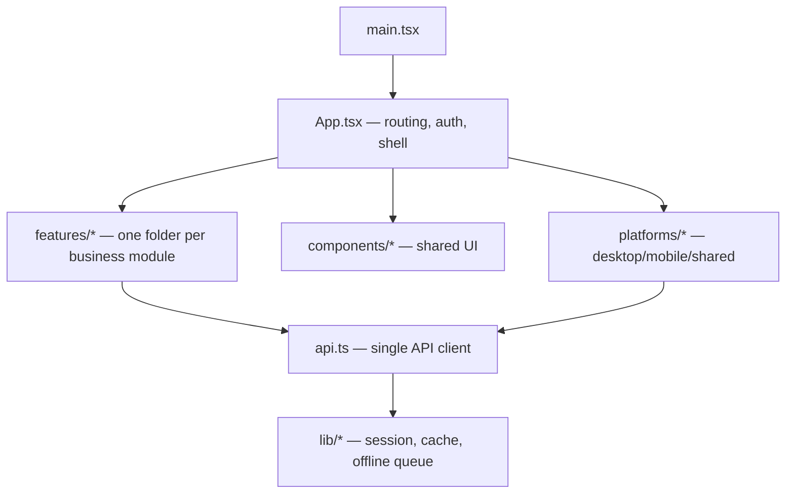

# File Walkthrough — `src/` (Frontend)

## Purpose & business value

The frontend is one React app (Vite-built) that serves **four deployment surfaces** (Cloud Web, Electron Cloud, Electron On-Prem, Capacitor Mobile) from the same source tree — see [Deployment Overview](/deployment/overview) for why. The organizing idea you need before reading any individual file: **feature folders own their domain UI**, `platforms/` isolates the parts that genuinely differ per-surface, and `api.ts` is the single seam between all of that and the backend.

## Directory map

| Path | What it is |
|---|---|
| `src/App.tsx` | Top-level routing, auth/session gating, lazy-loaded feature views, the app shell (sidebar/nav) |
| `src/api.ts` | The one API client every feature imports — request building, caching, offline queue hooks |
| `src/features/*` | ~18 folders, one per business module (sales, distribution, inventory, finance, etc.) |
| `src/platforms/*` | `desktop/`, `mobile/`, `shared/` — platform-specific bootstrapping, detection, and offline/online behavior |
| `src/lib/*` | `session.ts`, `businessTypeConfig.ts`, `billTemplates.ts`, `hsnRates.ts`, `utils.ts`, `capacitorApp.ts` |
| `src/components/*` | `layout/` (page-level chrome: landing, login, chat widget) and `ui/` (reusable primitives: toast, pagination, barcode scanner, CSV import) |

## Where to go next

- [`src/App.tsx`](/files/frontend/app)
- [`src/api.ts`](/files/frontend/api)
- [`src/features/*` pattern](/files/frontend/features)
- [`src/platforms/*`](/files/frontend/platforms)
- [`src/lib/*`](/files/frontend/lib)
- [`src/components/*`](/files/frontend/components)

Related: [Deployment Overview](/deployment/overview), [Mental Models](/tutorials/mental-models).
