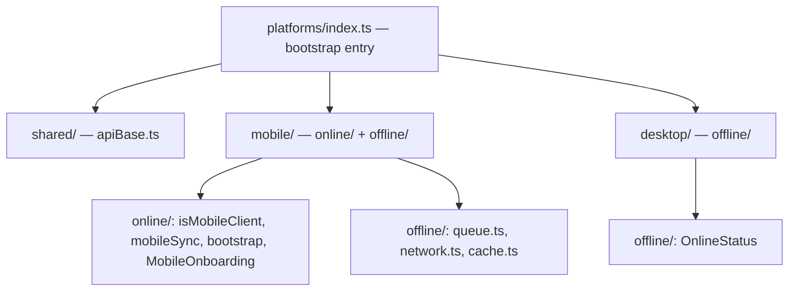
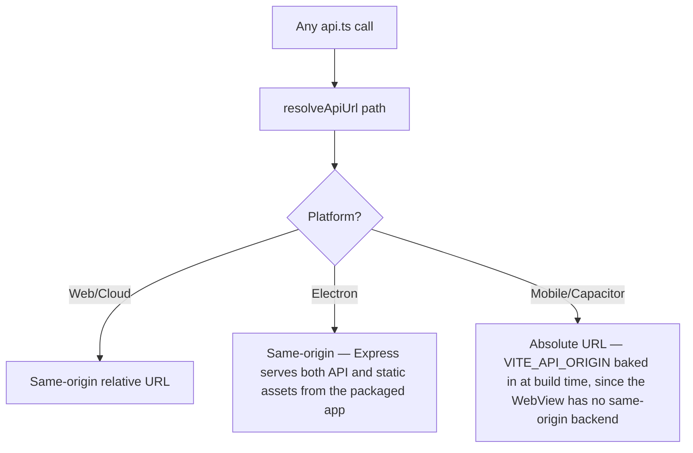

# File Walkthrough — `src/platforms/`

## Purpose & business value

This directory is the deliberate answer to "how do we support four deployment surfaces from one codebase without `if (isElectron)` scattered through every feature file?" Business value: it draws a hard boundary — platform-specific code lives here and *only* here, exposed through small, platform-agnostic functions (`isMobileClient()`, `resolveApiUrl()`, `initPlatform()`) that the rest of the app calls without needing to know which surface it's running on.

## Directory map

| Path | What it is |
|---|---|
| `platforms/index.ts` | The single bootstrap entry (`initPlatform`, re-exported as `initCapacitorApp`), called once from `main.tsx` |
| `platforms/shared/apiBase.ts` | `isNativeApp`, `getApiOrigin`, `getApiBase`, `resolveApiUrl`, `installNativeApiFetch` — platform-aware URL resolution used by *every* platform, including web |
| `platforms/mobile/online/*` | Capacitor-specific: `isMobileClient`, `mobileSync.ts` (heartbeat), `bootstrap.ts`, `MobileOnboarding` (invite redemption UI flow) |
| `platforms/mobile/offline/*` | `queue.ts` (offline mutation queue), `network.ts` (connectivity detection), `cache.ts` (the `CACHEABLE_GET` read cache), `OfflineBanner` |
| `platforms/desktop/offline/*` | `OnlineStatus` — Electron-specific connectivity UI (much simpler than mobile's, since Electron always has a normal internet connection, just needs to detect drops) |

## Flow — why `resolveApiUrl` exists

This one function is the entire reason `api.ts` can be platform-agnostic — every other platform difference (offline queueing, caching, onboarding UI) is opt-in behavior layered on top of a normal `fetch`, but URL resolution is a hard requirement that differs by surface and has to be right for anything to work at all.

## Call hierarchy

- **Called by:** `main.tsx` (`initPlatform()` once at startup), `src/api.ts` (`resolveApiUrl`, cache/queue functions), `App.tsx` (`isMobileClient`, `OfflineBanner`, `OnlineStatus`).
- **Calls into:** Capacitor's native plugin APIs (mobile only), browser `navigator.onLine`/network event listeners, `fetch`.

## Performance notes

- Platform detection (`isMobileClient`, `isNativeApp`) should be cheap, synchronous checks (reading a global/UA string) — none of this should involve async work on the hot path of every render or every API call.
- The mobile offline cache (`cache.ts`) is intentionally small in scope (`CACHEABLE_GET` allowlist) — this isn't a general local-database layer, so there's no meaningful storage/performance concern to manage beyond a handful of cached JSON blobs.

## Security notes

- **`VITE_API_ORIGIN` is baked into the mobile build at compile time and is inherently public** — anyone can extract it from the shipped app binary. This is fine because it's just a URL, not a secret — see [Deployment: env-vars](/deployment/env-vars) for the full reasoning on what's safe to expose via `VITE_`-prefixed variables.
- The offline queue's header-stripping behavior (not persisting `Authorization`/`X-Tenant-ID` to on-device storage) is a deliberate security choice — see [Runbook: Mobile Sync](/runbooks/mobile-sync) for the operational implications, and treat this as load-bearing if you ever touch `queue.ts`.
- Electron's `OnlineStatus` and mobile's connectivity detection are UX-only — neither is a security boundary; both are about giving users accurate feedback about whether their actions will actually reach the server.

## Refactoring notes

- **Safe:** adding new platform-detection helpers following the existing `isXClient()` naming pattern.
- **Risky:** changing `resolveApiUrl`'s branching logic — this is the single point where a subtle bug (e.g. mobile accidentally resolving to a relative URL) breaks the app completely for that entire platform, often only discoverable after a mobile build/release, not in web dev.
- If a fifth deployment surface is ever added, this is the directory that should grow a new subfolder (`platforms/watchos/`, whatever it might be) rather than scattering new `if` branches through `api.ts` or `App.tsx`.

## Common mistakes

1. Adding a new platform-specific behavior directly in `api.ts` or `App.tsx` with an inline `if (isMobileClient())` instead of extending the `platforms/` abstraction — reintroduces the scattering this directory exists to prevent.
2. Testing a mobile-specific change only in a browser with a mocked `isMobileClient()` — always verify against an actual Capacitor build before shipping (see [Mobile deployment](/deployment/mobile)) since WebView behavior can differ from browser dev tools in ways that are easy to miss.
3. Assuming `resolveApiUrl` behaves the same in Electron on-prem vs. Electron cloud — on-prem's backend is a *local* embedded server, not a remote one; verify the actual resolved origin for both Electron variants if touching this logic.

## Alternatives considered

A common alternative is separate build targets/repos per platform (a web app repo, a separate React Native app, a separate Electron wrapper repo) that each reimplement the UI. DG-ERP deliberately keeps one React codebase and isolates only the *genuinely differing* parts (URL resolution, offline behavior, native bootstrap) in `platforms/` — trading some added abstraction indirection for avoiding three-to-four times the UI maintenance burden. See [Deployment Overview](/deployment/overview) for the full cost/benefit discussion.

## Related pages

- [`src/api.ts`](/files/frontend/api)
- [Deployment: Mobile](/deployment/mobile)
- [Deployment: Electron](/deployment/electron)
- [Runbook: Mobile Sync](/runbooks/mobile-sync)
- [Lab: Offline Queue](/labs/lab-offline-queue)
