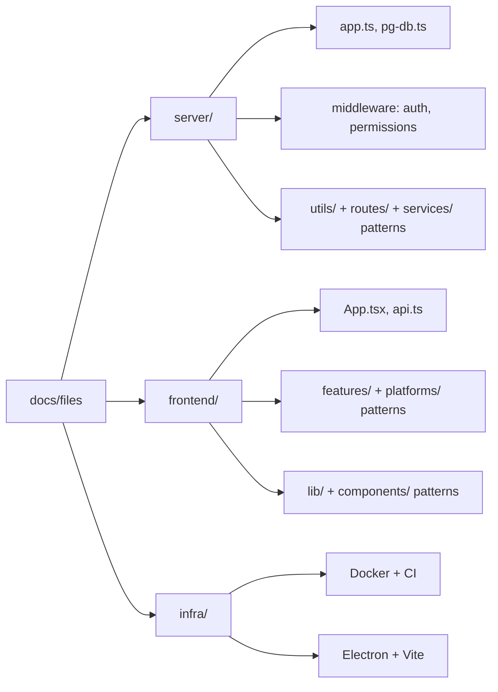

# File Walkthrough — Index

This section is the deepest layer of the academy. Where [Tutorials](/tutorials/day-1-onboarding) teach you to *use* the codebase and [SRE](/sre/overview)/[Deployment](/deployment/overview) teach you to *operate* it, File Walkthrough teaches you to **read and modify it like the person who wrote it** — for the specific files that carry the most architectural weight.

We don't walk through all ~140 source files (that would be a changelog, not mentoring). We walk through the files that:

1. Every feature touches (`server/app.ts`, `server/pg-db.ts`, `src/api.ts`)
2. Encode a security or correctness invariant that's easy to accidentally break (`server/middleware/auth.ts`, `server/middleware/permissions.ts`)
3. Represent a category with a strong repeated pattern, where understanding one member teaches you the other 30 (`server/routes/*`, `src/features/*`)

## Organization

## Server

- [`server/index.ts`](/files/server/index) — process entry point, what boots before `createApp()`
- [`server/app.ts`](/files/server/app) — the Express app factory: middleware order, CORS, rate limits, route mounting
- [`server/pg-db.ts`](/files/server/pg-db) — the schema, `initSchema()`, connection pool, RLS helpers
- [`server/middleware/auth.ts`](/files/server/middleware-auth) — JWT verification, role checks, vendor scoping
- [`server/middleware/permissions.ts`](/files/server/middleware-permissions) — module-level access control (`ROLE_PRESETS`, `enforceModulePermissions`)
- [`server/utils/*`](/files/server/utils) — logger, PII redaction, env validation, auth cache, pagination, secret crypto
- [`server/routes/*`](/files/server/routes) — the route file pattern, using `sales.ts`/`products.ts` as representatives
- [`server/services/*`](/files/server/services) — `nic-api.ts`, the GST NIC integration service

## Frontend

- [`src/App.tsx`](/files/frontend/app) — routing, tenant resolution, top-level providers
- [`src/api.ts`](/files/frontend/api) — the single API client, caching, offline queue hooks
- [`src/features/*`](/files/frontend/features) — the feature-folder pattern, using `sales`/`inventory` as representatives
- [`src/platforms/*`](/files/frontend/platforms) — desktop/mobile/shared platform abstraction
- [`src/lib/*`](/files/frontend/lib) — utilities: `session.ts`, `businessTypeConfig.ts`, `offline/*`
- [`src/components/*`](/files/frontend/components) — shared UI primitives and layout

## Infra

- [`Dockerfile` / `docker-compose.yml`](/files/infra/docker)
- [`.github/workflows/*`](/files/infra/ci)
- [`electron-*.config.cjs` / `electron/*`](/files/infra/electron)
- [`vite.config.ts`](/files/infra/vite)

## How to read these pages

Each page follows the same rubric so you can scan for what you need:

1. **Purpose & business value** — why this file exists, in one paragraph
2. **Flow** — what happens, in order, often as a Mermaid diagram
3. **Imports/exports** — the file's public surface
4. **Call hierarchy** — who calls this, what this calls
5. **Performance** — hot paths, N+1 risks, caching
6. **Security** — what this file is the last line of defense for
7. **Refactoring notes** — what's safe to change, what's load-bearing
8. **Common mistakes** — the specific bugs people actually introduce here
9. **Alternatives considered** — what a "textbook" version would do differently, and why DG-ERP doesn't

Related: [Mental Models](/tutorials/mental-models) for the cross-cutting patterns these files instantiate.
