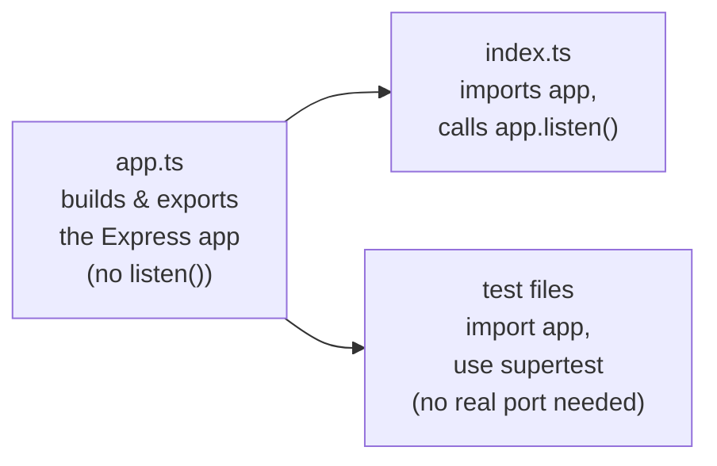

# File Deep Dive: `server/app.ts`

~428 lines. This is the single most important file to understand before touching backend routing, because it defines the *order* everything happens in — and in Express, middleware order is not cosmetic, it's the actual security and behavior model.

## Why this file exists separately from `index.ts`

Splitting construction from binding means tests can exercise the full middleware chain and every route via `supertest` without opening a real network port — see [Testing → API Integration](/testing/api-integration). `index.ts` itself is intentionally tiny (~32 lines): env loading, `initSchema()`, then `app.listen()`.

## What's inside, roughly top to bottom

1. **Imports** — every router under `server/routes/*` (34 of them), core middleware, `pg-db`.
2. **Global middleware, in this exact order**:
   - `helmet()` / CSP headers — security headers first, before anything else can run.
   - CORS configuration.
   - Body parsing (`express.json()`).
   - Correlation ID assignment — so every subsequent log line, including ones from middleware that runs *after* this, can be tied to a request. See [Error Flow](/architecture/error-flow).
   - Rate limiting (global, then route-specific overrides live in individual route files).
   - Auth middleware — decodes and verifies the JWT, attaches `req.tenantId`/`req.userId`/`req.role`, checks `password_changed_at`. See [Authorization](/security/authorization).
   - Permission enforcement (`enforceModulePermissions`) — looks up the module for the request path via `PATH_MODULE` and checks access level. See [Permissions](/backend/permissions).
3. **Public path exclusions** — `/login`, `/signup`, `/health`, and a few others are explicitly allow-listed *before* the auth middleware, not handled by a special case inside it.
4. **Router mounting** — every route file is `app.use()`'d here. Routers are mounted as siblings; **order among routers doesn't matter** (each has a distinct path prefix), but position *relative to* the middleware above absolutely does.
5. **Error handler** — a final `app.use((err, req, res, next) => ...)` catch-all that distinguishes expected 4xx business errors from unexpected 5xx crashes, stripping detail from the latter before sending to the client. See [Error Flow](/architecture/error-flow).

:::caution The order is the contract
Moving a router mount *above* the auth middleware would make every route in it publicly accessible with no login required. This isn't a hypothetical — it's exactly the kind of change that looks harmless in a diff (just moved a line) and is catastrophic in effect. Always mount new routers below the auth/permission middleware block, never above.
:::

## Why not split this 428-line file into smaller pieces?

It's a reasonable question — and a legitimate future refactor — but the current single-file structure has one specific benefit: the entire middleware order is visible in one linear read, top to bottom, with no need to trace imports across files to understand execution order. Splitting it (e.g. into `middleware/setup.ts` + `routes/mount.ts`) would improve file size at the cost of that linear readability. Not done, not urgent.

## Related

- [Backend → App Bootstrap](/backend/app-bootstrap)
- [Backend → Routes Catalog](/backend/routes-catalog)
- [Security → Authorization](/security/authorization)
- [Architecture → Error Flow](/architecture/error-flow)
