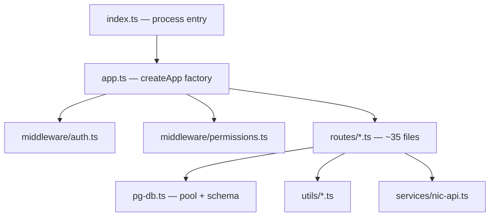
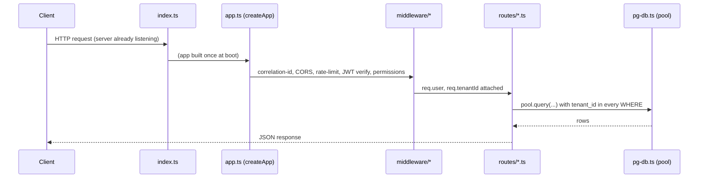

# File Walkthrough — `server/`

## Purpose & business value

`server/` is the entire backend: one Express app, one Postgres schema, ~35 route files, a handful of shared services and utilities. There's no microservices split, no separate auth server, no message queue — every request for every deployment surface (Cloud Web, Electron, Mobile) eventually lands in this one process (or an embedded copy of it, for on-prem). That's a deliberate simplicity choice for a team this size — see [Mental Models](/tutorials/mental-models) for the "why not microservices" reasoning.

## Directory map

| Path | What it is |
|---|---|
| `server/index.ts` | Tiny entry point — calls `initDatabase()`, then `createApp().listen()` |
| `server/app.ts` | The Express app factory (`createApp()`) — all middleware, all route mounting |
| `server/pg-db.ts` | Connection pool, `initSchema()` (the entire DB schema as idempotent SQL), RLS helpers |
| `server/middleware/auth.ts` | JWT verify, `requireRole`, vendor scoping helpers, `superAdminMiddleware` |
| `server/middleware/permissions.ts` | Module-level access control — `ROLE_PRESETS`, `enforceModulePermissions` |
| `server/routes/*.ts` | One file per resource area (sales, products, distribution, etc.) — see [routes pattern](/files/server/routes) |
| `server/services/nic-api.ts` | GST NIC (government e-invoice/e-way bill) API integration |
| `server/utils/*.ts` | Logger, PII redaction, env validation, auth cache, pagination, secret encryption |

## Request flow through this directory

## Why this file organization and not something else

- **One route file per resource, not per HTTP verb or per role** — `sales.ts` has GET/POST/PUT/DELETE for sales, not split into `getSales.ts`/`postSales.ts`. This keeps related logic (e.g. a sale's totals calculation used by both create and update) co-located.
- **No controller/service/repository layering** — routes call `pool.query()` directly. See [`pg-db.md`](/files/server/pg-db) for the reasoning; short version: the team judged the abstraction cost not worth it for a codebase where nearly every query is tenant-scoped SQL that's easier to audit for `tenant_id` correctness when it's inline in the route.
- **No dependency injection framework** — `pool` is a module-level singleton imported directly. Testable via `createApp()` returning a fresh app that still shares the pool (tests use a real Postgres instance, not mocks — see [API Integration Testing](/testing/api-integration)).

## Where to go next

- [`server/index.ts` walkthrough](/files/server/index) *(this page's sibling — see below)*
- [`server/app.ts`](/files/server/app)
- [`server/pg-db.ts`](/files/server/pg-db)
- [`server/middleware/auth.ts`](/files/server/middleware-auth)
- [`server/middleware/permissions.ts`](/files/server/middleware-permissions)
- [`server/utils/*`](/files/server/utils)
- [`server/routes/*` pattern](/files/server/routes)
- [`server/services/*`](/files/server/services)
