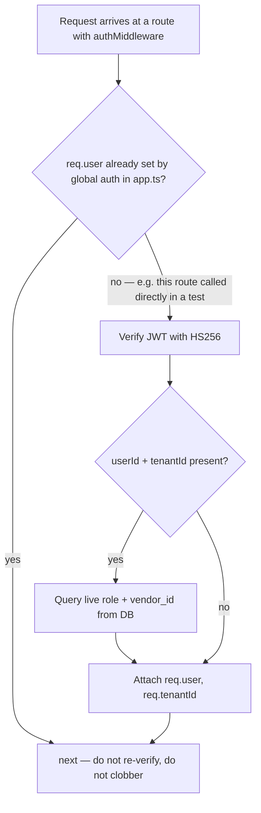

# File Walkthrough — `server/middleware/auth.ts`

## Purpose & business value

This file is the identity layer: it signs tokens (`generateToken`), verifies them (`authMiddleware`, `authMiddlewareStrict`, `superAdminMiddleware`), and provides small composable guards (`requireRole`, `blockVendors`, `vendorScopeId`, `assertVendorAccess`) that routes use to enforce who can do what. Business value: every "who can see/do this" decision in the app traces back to logic in this ~186-line file, which makes security review tractable — you don't need to audit 35 route files to understand the auth model, you need to understand this one.

## Imports/exports

**Exports:** `JwtPayload` (interface), `AuthRequest` (interface extending `Request`), `generateToken`, `generateSuperAdminToken` (alias), `authMiddleware`, `authMiddlewareStrict`, `requireRole`, `requireAdmin` (preset), `blockVendors`, `vendorScopeId`, `assertVendorLinked`, `assertVendorAccess`, `superAdminMiddleware`.

**Imports:** `jsonwebtoken`, `pool` from `../pg-db`.

## Flow

`authMiddlewareStrict` follows the same shape but additionally checks `password_changed_at` against the JWT's `iat`, synchronously, on every call — used for sensitive routes where a 24-hour-old token that predates a password change absolutely must not still work.

## Call hierarchy

- **Called by:** individual route files that need typed `AuthRequest` (`req.user`, `req.tenantId`) — even though `app.ts`'s global middleware already authenticates every request, routes still apply `authMiddleware` for the TypeScript typing and as defense-in-depth. `requireRole`/`requireAdmin`/`blockVendors` are used inline in route definitions, e.g. `router.delete('/api/products/all', authMiddleware, requireRole(['Admin']), handler)`.
- **Calls into:** `pool.query()` for the live role/vendor lookup; `jsonwebtoken`'s `verify`/`sign`.

## Performance notes

- The live role lookup (`SELECT role, vendor_id FROM users WHERE id=$1 AND tenant_id=$2`) runs **again** inside `authMiddleware` even though `app.ts`'s global middleware already did an equivalent (cached) lookup. The `if (req.user?.userId && req.tenantId) return next();` guard at the top of `authMiddleware` exists specifically to skip this duplicate work in production — it only actually re-verifies when called standalone (e.g. in a unit test that doesn't go through the full `app.ts` pipeline).
- `authMiddlewareStrict` does **not** have this short-circuit for the password-changed check — it re-queries even when `req.user` is already set, because that check needs to be synchronous and can't rely on the (longer-lived) auth cache from `app.ts`.

## Security notes — read this section twice

- **The `// H1` comment is not decorative.** It documents a previously-real bug class: if `authMiddleware` re-verified the raw JWT and overwrote `req.user` even when global auth had already attached a *fresher* role from the DB, a user demoted mid-session could keep their stale elevated role for the life of their token (up to 24h) on any route using this pattern. The guard clause exists purely to prevent this regression.
- **`superAdminMiddleware` checks three literal role strings** (`super_admin`, `owner`, `support`) — this is a flat allowlist, not a hierarchy. Adding a new platform-level role means editing this exact line; there's no `requireRole`-style parameterization for the super-admin surface (a deliberate simplicity choice given there are only ever a few platform-level roles).
- **`assertVendorAccess`** is the function every Vendor-facing route should call before returning another vendor's data — it returns a string error (not throwing, not a middleware) so the route can decide the exact response shape. Skipping this call on a new Vendor-accessible route is the single easiest way to introduce a cross-vendor data leak, structurally identical to a cross-tenant leak but scoped one level down.
- **Password-change invalidation is opt-in, not global** — only routes using `authMiddlewareStrict` (or the global `app.ts` middleware, which does check it for every request) actually reject a token issued before a password change. If you write a new sensitive route and only apply plain `authMiddleware`, you get JWT validity checking but rely on the global middleware already having done the strict check — verify this assumption holds rather than taking it for granted if the route bypasses the global pipeline somehow.

## Refactoring notes

- **Safe:** adding new small guard functions following the `assertX(req): string | null` pattern — it composes well with existing route code (`const err = assertVendorAccess(req, vendorId); if (err) return res.status(403).json({error: err});`).
- **Risky:** changing what `generateToken`'s default `expiresIn` (`'24h'`) is — this is a widely-relied-upon assumption (session length, "log out after 24h" expectations, mobile heartbeat/version-gating design). Changing it needs to be a deliberate, documented decision, not a drive-by tweak.
- **Do not remove the `// H1` guard** without understanding the regression it prevents (see Security notes above).

## Common mistakes

1. Writing a new Vendor-facing route and forgetting `assertVendorAccess`/`blockVendors` — Vendors get full read/write access to data scoped to a *different* vendor.
2. Assuming `authMiddleware` always hits the DB — in the common (already-authenticated-by-global-middleware) path, it doesn't; don't rely on it as a place to inject per-request side effects that need to run on every single call.
3. Confusing `requireRole(['Admin'])` (strict allowlist) with the module-permission system in [`permissions.ts`](/files/server/middleware-permissions) (graduated access levels) — they solve different problems and are often both needed on the same sensitive route.

## Alternatives considered

A larger org might use a dedicated auth service (Auth0, Keycloak) or session-based auth with server-side session storage (Redis). DG-ERP uses self-issued stateless JWTs because there's no separate auth provider to operate, and the "live role" re-check pattern gets most of the benefit of server-side sessions (instant demotion effect) without the infrastructure cost of a session store — at the cost of that extra DB lookup per request, mitigated by the auth cache in `app.ts`.

## Related pages

- [`server/middleware/permissions.ts`](/files/server/middleware-permissions)
- [`server/app.ts`](/files/server/app)
- [Runbook: Auth Failures](/runbooks/auth-failures)
- [Learning: Module — AuthZ](/learning/module-authz)
